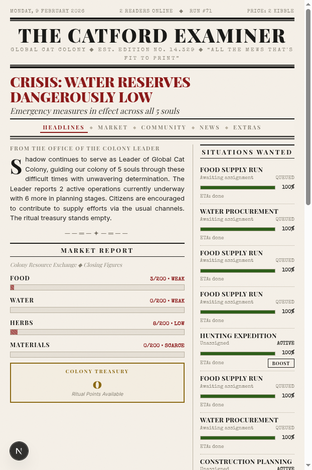
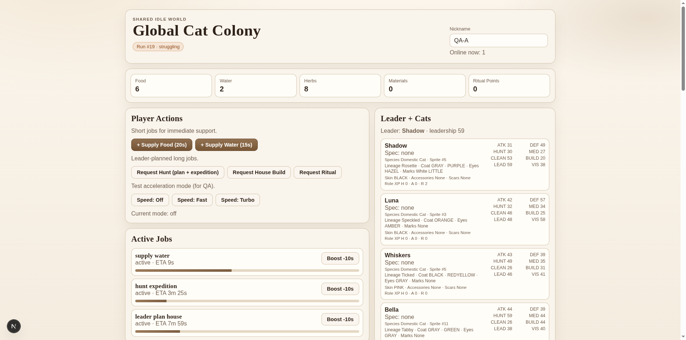
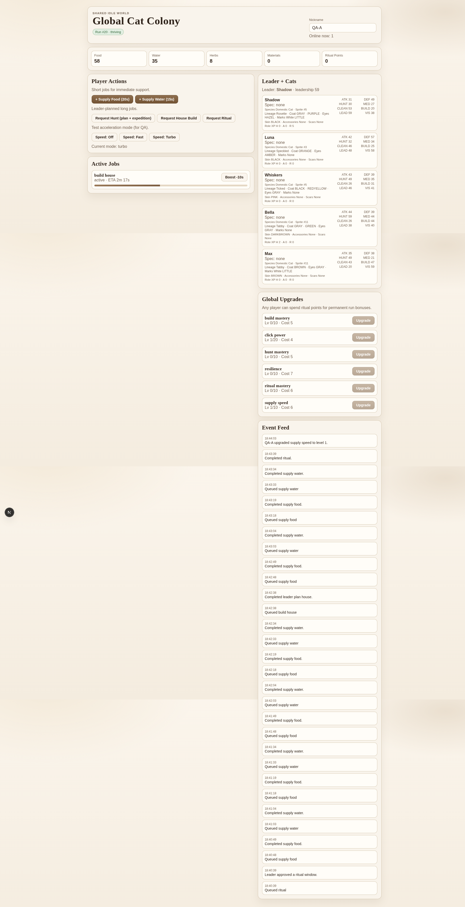

<div align="center">

# The Catford Examiner

### A shared cat colony idle game disguised as a Victorian broadsheet newspaper

_One colony. Everyone plays. The cats never sleep (even when you do)._


</div>

---

<div align="center">
  
  <br />
  <em>"All the Mews That's Fit to Print"</em>
</div>

---

## What is this?

A **real-time idle game** where everyone shares a single global cat colony. The simulation runs 24/7 on a dedicated backend worker — cats hunt, build, get hungry, fight off predators, and occasionally die, whether you're watching or not.

The entire game is presented as **The Catford Examiner**, a broadsheet newspaper. Headlines report colony crises. Market tickers track food and water. The classifieds list available jobs. You don't play a game — you read the paper.

### Key ideas

- **One shared colony** — every player sees and affects the same colony in real-time
- **Always running** — a background worker ticks the simulation every second, even with zero players online
- **Real consequences** — cats starve, dehydrate, and die. Neglected colonies collapse and auto-reset
- **Player jobs** — supply food, supply water, or click-boost long-running cat jobs
- **Cat autonomy** — a leader cat auto-assigns strategic work: hunts, builds, rituals
- **Specialization** — cats develop as hunters, architects, or ritualists over time
- **Global upgrades** — earn ritual points to unlock permanent buffs that persist across colony resets

## Screenshots

<table>
<tr>
  <td align="center"><br /><b>The Catford Examiner</b><br /><sub>Headlines, market report, and classifieds</sub></td>
  <td align="center"><br /><b>Colony Dashboard</b><br /><sub>Player actions, active jobs, and cat stat cards</sub></td>
</tr>
<tr>
  <td align="center"><br /><b>Subscribe to the Examiner</b><br /><sub>Anonymous identity via IP-hash</sub></td>
  <td align="center"><br /><b>Cat Cards & Global Upgrades</b><br /><sub>Specializations and permanent progression</sub></td>
</tr>
</table>

## Quick Start

```bash
# 1. Install dependencies
bun install

# 2. Start Convex backend (terminal 1)
bun run convex:dev

# 3. Start Next.js frontend (terminal 2)
bun run dev

# 4. Start the simulation worker (terminal 3)
bun run dev:worker
```

Open [localhost:3000/game/newspaper](http://localhost:3000/game/newspaper) to read the paper.

> **Heads up:** The worker drives the entire simulation. Without it, the colony freezes. Without Convex, the page shows "Preparing Global Colony..."

### Environment

Copy `.env.local` from an existing setup or create one:

```env
CONVEX_DEPLOYMENT=dev:<your-deployment>
NEXT_PUBLIC_CONVEX_URL=https://<your-deployment>.convex.cloud
```

## Architecture

```
Browser (Next.js + React 19)
  ↕  real-time subscriptions (useQuery) + mutations (useMutation)
Convex Backend (mutations, queries, schema)
  ↕  calls pure functions
lib/game/ (pure game logic — zero side effects)
  ↑  driven by
worker/index.ts (always-on tick loop, 1s interval)
```

**The worker drives the game, not Convex crons.** A lightweight Node process (`bun run dev:worker`) calls `game.workerTick` every second. `convex/crons.ts` is intentionally empty.

### Project structure

```
cat_idler/
├── app/                  # Next.js routes (/game/newspaper is the main UI)
├── components/           # React components
├── convex/               # Convex functions, schema (11 tables)
├── hooks/                # React hooks (useGameDashboard — shared game state)
├── lib/game/             # Pure game mechanics (heavily unit tested)
├── worker/               # Always-on simulation loop
├── tests/                # Unit tests + Selenium E2E
├── types/                # Shared TypeScript types & constants
├── public/images/        # Cat sprites, buildings, enemies, resources, tiles, UI icons
└── docs/                 # Design docs, tasks, testing guide
```

## Tech Stack

| Layer           | Technology                                             |
| --------------- | ------------------------------------------------------ |
| Frontend        | **Next.js 16**, React 19, Tailwind CSS 4, Radix UI     |
| Backend         | **Convex** (real-time serverless database + functions) |
| Simulation      | Dedicated **Node worker** via tsx watch                |
| Testing         | **Vitest** + Selenium E2E                              |
| Language        | TypeScript throughout                                  |
| Package Manager | Bun                                                    |
| Git Hooks       | Lefthook (gitleaks, eslint, typecheck, vitest)         |

## Game Systems

| System              | Description                                                                                                    |
| ------------------- | -------------------------------------------------------------------------------------------------------------- |
| **Jobs**            | Short player actions (supply food/water) and long cat jobs (8h hunts, house builds, 6h rituals)                |
| **Leader AI**       | Colony leader auto-plans strategic work based on resource levels and colony health                             |
| **Needs & Decay**   | Cats have hunger, thirst, energy, health — all decay over time. Unmet needs cause suffering and death          |
| **Specialization**  | Cats develop as hunters (50% faster hunts), architects (50% faster builds), or ritualists (40% faster rituals) |
| **Click Boosting**  | Players can click-boost active jobs to reduce completion time (diminishing returns above 30 clicks/min)        |
| **Global Upgrades** | Ritual points unlock permanent buffs (e.g., supply speed, hunt mastery, resilience) that survive colony resets |
| **Colony Reset**    | Colonies in extended critical state auto-collapse. A new run begins with upgrades intact                       |

## Testing

```bash
bun run test              # All unit tests
bun run test:watch        # Watch mode
bun run test:coverage     # Coverage report
bun run test:e2e          # Selenium E2E
```

All game logic is pure functions, tested with deterministic RNG seeds and time advancement for reproducible scenarios.

## Documentation

| Doc                                          | What it covers                                                        |
| -------------------------------------------- | --------------------------------------------------------------------- |
| [`docs/plan.md`](docs/plan.md)               | Full game design with architecture diagrams and data models           |
| [`docs/TASKS.md`](docs/TASKS.md)             | Development tasks with TDD instructions                               |
| [`docs/TESTING.md`](docs/TESTING.md)         | Testing guide, patterns, and mocking strategies                       |
| [`docs/UI_CONCEPTS.md`](docs/UI_CONCEPTS.md) | 13 UI concept variants (archived on `archive/ui-concepts-all` branch) |

---

<div align="center">
  <sub>Pre-release v0.3.0 — Built with human calories and mass GPU cycles.</sub>
</div>
