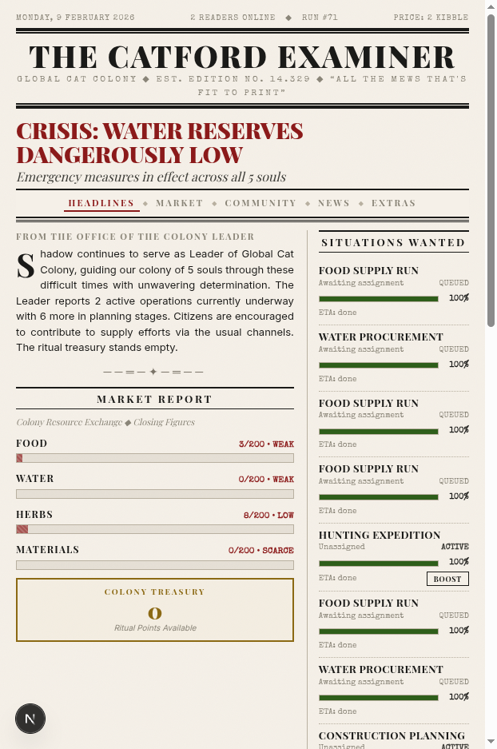
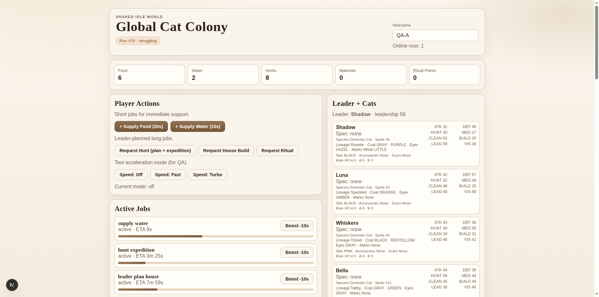
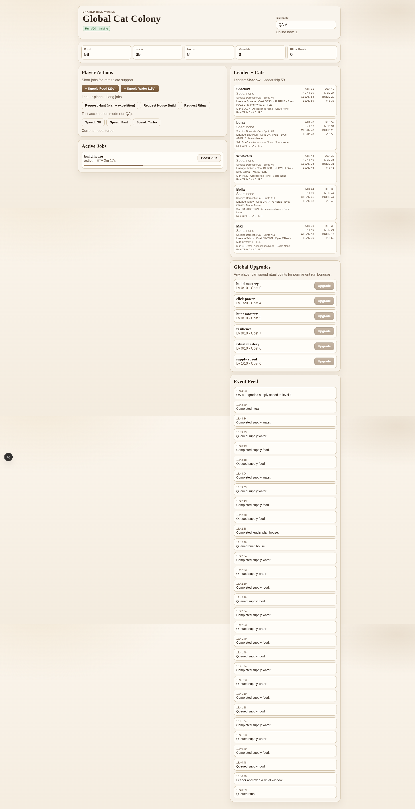

<div align="center">

# The Catford Examiner

### A shared cat colony idle game disguised as a Victorian broadsheet newspaper

_One colony. Everyone plays. The cats never sleep (even when you do)._


</div>

---

<div align="center">
  
  <br />
  <em>"All the Mews That's Fit to Print"</em>
</div>

---

## What is this?

A **real-time god-sim idle game** on a living 2.5D isometric map, shared by everyone. One global cat colony hunts, hauls, builds, ages, breeds, researches, and fights off raiders 24/7 on a dedicated backend worker — whether you're watching or not. You don't micromanage the cats; you're a **god who shapes the world**: paint zones, click-boost jobs, run elections, and unlock a slow tech tree while the colony lives its own life.

A leader cat runs the settlement through a utility AI that keeps almost every cat busy — balancing food, water, materials, research, and defense — so watching the village reads as intentional: cats walk every tile, lineages form, roads wear in, and the settlement physically grows through eras as threats scale with your success.

The colony also publishes **The Catford Examiner**, a broadsheet newspaper companion view (at `/game/newspaper`, linked from the map HUD): headlines report crises, market tickers track resources, the classifieds list open jobs.

### Key ideas

- **One shared colony** — every player sees and affects the same colony in real-time
- **Always running** — a background worker ticks the simulation every second, even with zero players online
- **A self-running world** — cats age through life stages, breed with inherited traits, and die of old age, starvation, or raids; population is a loop, not a fixed roster
- **Play as a god, not a manager** — a utility-AI leader auto-assigns strategic work (hunts, quarrying, water runs, builds, research, defense); you nudge with zones, boosts, votes, roads
- **Real consequences** — cats starve, dehydrate, and die; neglected colonies collapse and auto-reset (upgrades survive)
- **Tech tree & eras** — gods spend blessings for instant unlocks; cats research slowly in huts and schools, unlocking buildings, jobs, and eras Age-of-Empires style
- **Military & raids** — smithies forge weapons and armor, warriors muster to defend the gate, and raid pressure scales with wealth, population, and playtime
- **Specialization & lineage** — cats develop as hunters, architects, ritualists, or warriors; specialized parents beget gifted kittens
- **Terrain** — a deterministic generator lays down heightmaps, biomes, oriented cliffs with stairs, and rivers around the starter village

## Screenshots

<table>
<tr>
  <td align="center"><br /><b>The Catford Examiner</b><br /><sub>Headlines, market report, and classifieds</sub></td>
  <td align="center"><br /><b>Colony Dashboard</b><br /><sub>Player actions, active jobs, and cat stat cards</sub></td>
</tr>
<tr>
  <td align="center"><br /><b>Subscribe to the Examiner</b><br /><sub>Anonymous identity via IP-hash</sub></td>
  <td align="center"><br /><b>Cat Cards & Global Upgrades</b><br /><sub>Specializations and permanent progression</sub></td>
</tr>
</table>

## Quick Start

```bash
# 1. Install dependencies
bun install

# 2. Start the Portless-routed frontend (terminal 1)
bun run dev

# Optional: print the current worktree URL without starting the app
bun run dev:url

# 3. Start the simulation worker (terminal 2)
bun run dev:worker
```

Then open the printed `http://<name>.localhost:<port>/game` URL in your browser — that's the live isometric world map. The Catford Examiner newspaper is at `/game/newspaper` (also linked from the map HUD). The URL and port vary per worktree, so use `bun run dev:url` to print the current one.

If you need raw Next.js port-based dev for debugging, use `PORTLESS=skip bun run dev`.

> **Heads up:** The worker drives the entire simulation. Without it, the colony freezes — the page loads but nothing ticks.

### Environment

No environment variables are required — the SQLite database (`data/game.db`) is created and migrated automatically on first run. Optional overrides:

```env
GAME_DB_PATH=data/game.db     # SQLite file location (default shown)
WORKER_TICK_MS=1000           # Worker tick interval
```

## Architecture

```
Browser (Next.js + React 19)
  ↕  SSE stream (/api/game/stream) + POST actions (/api/game/actions)
Next.js route handlers → server/ (game orchestration over Drizzle + SQLite)
  ↕  calls pure functions
lib/game/ (pure game logic — zero side effects)
  ↑  driven by
worker/index.ts (always-on tick loop, 1s interval, writes SQLite directly)
```

**The worker drives the game.** A lightweight Node process (`bun run dev:worker`) calls `workerTick` every second. The web server and worker share one SQLite file (WAL mode).

### Project structure

```
cat_idler/
├── app/                  # Next.js routes (/game is the map UI, /game/newspaper the paper)
├── components/           # React components (components/map is the 2.5D world map)
├── db/                   # Drizzle schema, client, SQL migrations (13 tables)
├── server/               # Game orchestration (workerTick, jobs, upgrades)
├── hooks/                # React hooks (useGameDashboard — shared game state)
├── lib/game/             # Pure game mechanics (heavily unit tested)
├── worker/               # Always-on simulation loop
├── tests/                # Unit tests + Selenium E2E
├── types/                # Shared TypeScript types & constants
├── public/images/        # Cat sprites, buildings, enemies, resources, tiles, UI icons
└── docs/                 # Design docs, tasks, testing guide
```

## Tech Stack

| Layer           | Technology                                             |
| --------------- | ------------------------------------------------------ |
| Frontend        | **Next.js 16**, React 19, Tailwind CSS 4, Radix UI     |
| Backend         | **Drizzle ORM + SQLite** (better-sqlite3), SSE realtime |
| Simulation      | Dedicated **Node worker** via tsx watch                |
| Testing         | **Vitest** + Selenium E2E                              |
| Language        | TypeScript throughout                                  |
| Package Manager | Bun                                                    |
| Git Hooks       | Lefthook (gitleaks, eslint, typecheck, vitest)         |

## Game Systems

| System              | Description                                                                                                    |
| ------------------- | -------------------------------------------------------------------------------------------------------------- |
| **Jobs**            | Short player actions (supply food/water) and long cat jobs — hunts, quarrying, water runs, builds, rituals, warrior training |
| **Leader director** | A utility AI (IAUS-style) scores every colony goal on one scale and hands a labor budget to the most urgent — near-zero idle cats |
| **Movement & pathing** | Cats walk every tile via bounded A* around rivers and walls (through the gate); traffic wears paths, reveals fog, and paves roads |
| **Life simulation** | Aging through life stages, breeding with genetic inheritance and lineages, old-age and starvation mortality — a living population loop |
| **Research & eras** | One tech tree; gods buy nodes with blessings, cats research slowly in huts/schools, unlocking buildings, jobs, and eras |
| **Military & raids** | Smithies forge weapons/armor, warriors defend the gate, and raids scale with wealth, population, warriors, and playtime |
| **Production & hauling** | Workshops refine materials, fields grow food; yields are hauled to the shrine in trips (SC2-drone style) and credited on arrival |
| **Needs & Decay**   | Cats have hunger, thirst, energy, health — all decay over time. Unmet needs cause suffering and death          |
| **Specialization**  | Cats develop as hunters (50% faster hunts), architects (50% faster builds), ritualists (40% faster rituals), or warriors |
| **Player nudges**   | Paint avoid/gather zones, click-boost active jobs (diminishing returns above 30 clicks/min), vote in elections and vote-kick leaders |
| **Global upgrades** | Ritual points unlock permanent buffs (supply speed, hunt mastery, resilience) that survive colony resets      |
| **Colony reset**    | Colonies in extended critical state (or wiped by a raid) auto-collapse. A new run begins with upgrades and the tech tree intact |
| **Terrain**         | Deterministic seeded generator: heightmaps, biomes, oriented cliffs with stairs, and rivers around the village |

## Testing

```bash
bun run test              # All unit tests
bun run test:watch        # Watch mode
bun run test:coverage     # Coverage report
bun run test:e2e          # Selenium E2E
```

All game logic is pure functions, tested with deterministic RNG seeds and time advancement for reproducible scenarios.

## Documentation

| Doc                                          | What it covers                                                        |
| -------------------------------------------- | --------------------------------------------------------------------- |
| [`docs/plan.md`](docs/plan.md)               | Full game design with architecture diagrams and data models           |
| [`docs/TASKS.md`](docs/TASKS.md)             | Development tasks with TDD instructions                               |
| [`docs/TESTING.md`](docs/TESTING.md)         | Testing guide, patterns, and mocking strategies                       |
| [`docs/UI_CONCEPTS.md`](docs/UI_CONCEPTS.md) | 13 UI concept variants (archived on `archive/ui-concepts-all` branch) |

---

<div align="center">
  <sub>Pre-release v0.3.0 — Built with human calories and mass GPU cycles.</sub>
</div>
