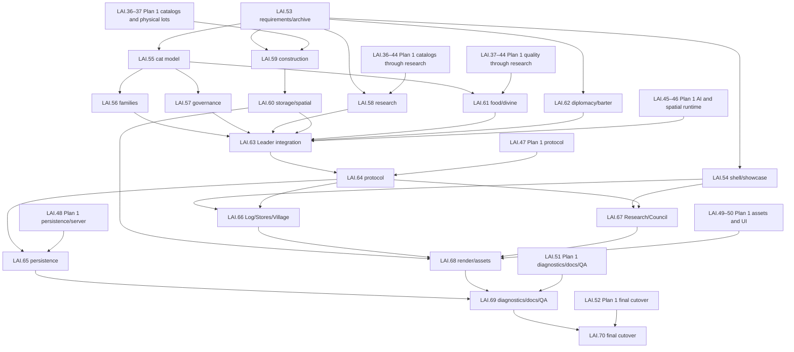

# `bug-gui-design` Semantic Integration Board

**Stored:** 2026-07-25

**Integration branch:** `feature-new-leader-ai`

**Source worktree:** `/home/beasty/orca/workspaces/cat_idler/bug-gui-design`

**Source head inspected:** `748db74`

**Plan authority:**
[final-integrated-overhaul-plan.md](../leader-ai-overhaul/final-integrated-overhaul-plan.md)

**First preserved plan:**
[final-hole-hunting-content-plan.md](../leader-ai-overhaul/final-hole-hunting-content-plan.md)

**Full thread intent:**
[thread-qa-audit.md](thread-qa-audit.md)

**Identified/protected source inputs and transfer receipts:**
[source-transfer-manifest.md](source-transfer-manifest.md)

This is the dedicated, append-only implementation board for the second branch integration. It
does not replace the main [Leader-AI board](../leader-ai-overhaul/BOARD.md). Card state may advance,
and evidence may be appended, but requirements and rationale are never deleted merely to make the
board shorter.

## Locked merge strategy

Do **not** merge or cherry-pick `bug-gui-design` into the integration branch.

Both worktrees contain uncommitted changes in `cat-client`, `cat-protocol`, `cat-server`,
`cat-sim::lib`, research, actions, and `world_tick`. The source branch also predates the approved
report-limited Leader/Hole architecture. Integration is a semantic import of bounded leaves,
content, tests, visuals, and ideas. Hot roots receive one structural reconciliation owner after
their dependencies are ready.

Semantic import requires reading and dispositioning the actual committed and dirty source paths.
It is not permission to reimplement from the final-plan summary while ignoring branch code,
source-derived tests, assets, or design notes.

## Status flow

`todo → spec → dev → focused-green → integrated → accepted`

## Source inventory

| Source | State | Integration use |
|---|---|---|
| `add6951` | committed | rebuilt client surfaces and research graph concepts |
| `640b769` | committed | playtest feedback implementation slices |
| `e230481` | committed merge | combined P21 work |
| `748db74` | inspected head | Orca workspace configuration only |
| committed source delta | four commits / 26 paths | full path list and committed tree/diff hashes in the source-transfer manifest |
| client dirty state | four paths | `lib.rs`, `research_ui.rs`, `start_screen.rs`, `landing_showcase.rs` |
| sim dirty state | ten paths | actions, research catalogs/junctions/tracks, upgrade tree, world tick, tests |
| wire/server dirty state | two paths | protocol root and server root |
| design docs | four paths | UI/research/visual polish and fix-log material |

No source file is modified during inventory. The dirty snapshot has 20 paths and digest
`73ac0c009ec517e49b143819e9f7a809f95f18442fa8bff5c6e86cfbdba7e436`.
Every committed and dirty path receives a per-file transfer receipt on the card that adapts or
rejects it.

## Card dependency map

The main board owns the canonical dependency fields. These cross-plan edges are mandatory: Plan 2
may extend Plan 1, but no Plan 2 integration card may treat a shifted or compressed Plan 1 card as
its prerequisite.

## Implementation cards

| ID | Status | Scope | Required acceptance |
|---|---|---|---|
| LAI.53 | accepted | Archive branch state, full explanations, decisions, conflict matrix, visuals, Q&A provenance, and exact semantic-merge boundary | Both plans stored; all 139 prompts/direct notes, branch commits and dirty paths, drift hashes, per-file receipt process, requirements, rationale, interfaces, visuals, cards, and one-heavy-process rule linked without shrinking the first plan. The documentation visual package contains ten source SVGs, ten 1600×1000 renders, a contact sheet, and an explicit design-only QA boundary. `scripts/check-leader-ai-plan-locks.sh` mechanically enforces both stored plan hashes and the complete P1.01–45, P1-C01–04, P2.01–36, GUI-R01–26, GUI-C01–12, and P2-G01–09 sequences. |
| LAI.54 | dev | Five-screen shell, Council tabs, Center Village, start showcase, 100/115/130 scales, 1024×768–4K, localization-ready copy | No Map/Help/Dispatches/ticker/letter openers; quiet non-spammy strategy workbench rather than generic dashboard; mature off-map 60-cat/5×5-Hole showcase never mutates saves or auto-enters; native/WASM layout checkpoints. The actual Bevy shell is wired to the root with centralized Escape, accessible live session/start states, all 30 layout contracts, and a static 730-day/60-cat/48-lot showcase; legacy parallel openers are dormant. The serialized focused and native/WASM visual evidence remain. |
| LAI.55 | dev | Charisma/Intelligence, data-owned skills, XP formula, post-100 legacy, job affinities, anatomy, ambient gains, officer cross-training | Exact 1/0.25/0.10 XP; `min(100,floor(sqrt(xp)))`; Refused never overridden; body requirements enforced; office rooms/tools add effective expertise while report access still requires held office; keyed ambient gains. Pure catalog/model leaves plus the strict stable-real-cat `cat_capability_authority` and focused harness now exist; it owns idempotent outcome/ambient receipts, exact matcher keys, office-duty clearance, `HaulLeg` provenance, and reads the real anatomy/prosthetic state without copying it. Its serialized target passes 4/4 in the shared authority batch; runtime integration and obsolete adapter deletion remain. |
| LAI.56 | dev | Birth skill seeds, partnerships, households, housing, teaching, mentorship, traditions, surnames, enterprises | Pure specialization/housing leaves plus the strict versioned `family_authority` cover exact seeds/transfers/caps, dual-parent linkage without acquired-trait or clearance inheritance, autonomous kin-safe partnership, completed-building Den/Home/Lodge/Nursery placement including unpartnered elders before Den fallback, persisted after-three-task teaching with defer/resume and exact sites, mature colony-owned enterprises, death cleanup, atomic receipts, restart, and bounded reports. Its serialized target passes 5/5; runtime/protocol/persistence/UI cutover remains. |
| LAI.57 | dev | Relational/Analytical axis, civic merit, cat voting, player +10 backing, appointments, vacancies, succession, expulsion | Exact top-five 25/20/15/15/10/10/5 merit, all Adult/Elder ballots, stable tie order, replaceable authenticated +10 backing, scheduled/snap occurrences, report-safe imperfect appointments, succession, guardian-safe expulsion, ten-domain cleanup acknowledgement, reachable physical departure, atomic rollback, and version-independent idempotent retries now compose in `governance_authority`. Its serialized target passes 11/11; runtime/auth/persistence/UI cutover remains. |
| LAI.58 | dev | Three-region research graph, manifest cleanup, two independent lanes, preparation, conflict avoidance/oopsies, overtake/refund | The canonical authority composes the one graph with real Notes/Void ledgers, a 64-entry topological/frozen God lane, exact free-Leader cadence and finite-first selection, physical preparation, collision/oopsie rules, refunds, labor loss, atomic receipts, and unbounded rolling-history retirement without shadow balances. Its serialized target passes 13/13; runtime/protocol/persistence/UI cutover and old adapter deletion remain. |
| LAI.59 | dev | Site reservation, tiered scaffold, physical material bills, 20/60/20 work, upgrade duration, complete footprints and stages | Wood vs Lumber/Planks scaffolds; distinct scaffold/structure/fit-out visuals; `8h*(level-1)^1.25`; all cargo/progress restart-safe; Workshop exactly 3×3. The pure state machine and immutable level 1–10 blueprint catalog now cover every building through catalog/delegation/retirement, exact permits/footprints/durations/stage bills/art labels, Logs versus Lumber/Planks, basic bedding/woodwork, and advanced fixture/tool/Metal/Gems progression. Coordinator-owned serialized focused evidence passes both seven-test targets (14/14). Quality-lot reservations, world/runtime/wire/render integration, and production art remain. |
| LAI.60 | dev | Four visible slots/tile, Basket/Barrel/Crate/Chest/Rack lots, adjacent workshop zones, farms/crops, roads/routes, walls/gates, site truth | Exact 4/4/8/8/16/8 capacities; compatible lots preserve identity/quality/age; no invisible workshop inputs. Pure storage/village-infrastructure leaves plus the strict `QualityLotLedger`-backed `storage_authority` cover zones, slots, containers, reservations, exact locations, command-only Workshop links, construction cargo, recovery, replay, and restart. Collision-free identity keys and ordered coordinate entries make canonical JSON valid. Its serialized target passes 8/8; live inventory/world-task cutover, shadow-path deletion, and rendering remain. |
| LAI.61 | dev | Allowed/Reserve/Forbidden, lethal starvation exception, contribution ratios/rate limit, bound cargo, Inspiration, specialized boosts, miracles, Divine food/water | Log=100 formula; 100ms batches and 20 clicks/s/player; no rare click items; +10%/15m/60m Inspiration; four one-hour-base research-scaled specialized boosts paid in Void; 1 VI construction miracle; ordinary and `2×residents` emergency outputs; physical Hole-apron stock. The canonical coordinator shares the external Void ledger with typed miracle/rescue debit purposes and stores no shadow Hole, inventory, bill, or currency state. Its serialized target passes 5/5; Plan 1 and runtime/wire/UI integration remain. |
| LAI.62 | dev | Personal Alliance/Neutral/Enemy, global Neutral, Enemy rejection, money deletion, physical barter, possible-now/better-later trade | The canonical authority owns directional stances and the one physical contract/escrow/route ledger with direct `StorageIdentity` bindings, mutual consent, pre-side-effect Enemy rejection, staged delivery/death salvage/cancellation, conservation, replay and report-safe possible-now/better-later scoring. Its serialized target passes 13/13; runtime adapters, production coin deletion, persistence/protocol/UI remain. |
| LAI.63 | dev | One Leader/officer/world-tick integration for all new and first-plan domains | The protected runtime is called by the real tick and has report-twin/atomic foundations, but retention and physical delivery remain incomplete: only four of fifteen spatial categories resolve, live Food/Hunting/Cookhouse/Fishing/material/event authorities are not all retained/advanced, and duplicate/retired paths are not deleted. Exact current gaps are in `../leader-ai-overhaul/evidence/lai46-static-integration-review.md` and `../leader-ai-overhaul/evidence/lai64-70-plan2-delivery-audit.md`; no static audit is acceptance evidence. |
| LAI.64 | dev | Strict versioned snapshots/actions/errors for all new types with report redaction | Canonical v3/schema-v2 foundation now byte-bounds and validates headers before DTO allocation, carries exactly one selected private colony plus ordered public summaries, supports real authority IDs, typed attributes/tasks/sites/cargo/food permissions/Hole geometry/non-exact officer regeneration, and deeply validates bounds/order/version lanes. It also carries the full P1 content-manifest, quality lot/item, food, Hunting, rare-material, augmentation, fixture, Cookhouse, Fishing Hut, and visual-state surface. Only the approved research, broad conservation/domain nudges, divine, election-backing, personal stance/expulsion, and signed test-reset actions exist; routine worker/tile/route/storage/food-list/officer/trade controls are absent. The focused serialized P1/P2 round-trip target passes 6/6; runtime/server/client adapters, legacy route deletion, and final matrix remain. |
| LAI.65 | dev | Clean-reset SQLite aggregates, markers, fixtures, receipts, restart and multi-colony isolation | Canonical action adapters and signed reset/boundary rows exist, but runtime domains remain in one blob beside the legacy schema, reset/fixture/version-lane gaps remain, and two persistence authorities are live. Exact non-acceptance inventory: `../leader-ai-overhaul/evidence/lai48-static-persistence-cutover-inventory.md`. |
| LAI.66 | dev | Log, Stores, Village screens and relevant overlays/inspectors | Screen/plugin/accessibility models exist, but the canonical event log is hard-coded empty, other content projections are missing, and the legacy client root remains live. Exact delivery audit: `../leader-ai-overhaul/evidence/lai64-70-plan2-delivery-audit.md`. |
| LAI.67 | dev | Research and Council screens (Plans/Tasks/Cats/Hole/Diplomacy/Trade) | Five routes and six Council tabs exist, but canonical Research supplies no prerequisite edges, junctions, tracks, repeatable state, or permit topology, so the fixed graph cannot be rendered truthfully. Exact delivery audit: `../leader-ai-overhaul/evidence/lai64-70-plan2-delivery-audit.md`. |
| LAI.68 | dev | World rendering, construction sheets, storage/container states, family/research/election assets | Canonical overlay/accessibility foundations and the delivered art registry exist, but the production base-world feed is absent and construction sheets, container fullness, quality badges, family/enterprise signs, residence art, full layout/WASM/screenshot/browser evidence remain. Exact delivery audit: `../leader-ai-overhaul/evidence/lai64-70-plan2-delivery-audit.md`. |
| LAI.69 | dev | Bounded debug logging, contributor recipes, maintained docs, Q&A coverage, quick focused and final integration/browser manifests | Current docs include the 21-recipe extension manual, Hole/Notes/Void/two-lane guide, LAI.35–70 map, consolidation audit, historical warnings, synchronized guidance, rendered ten-diagram package, and executable full-plan hash/row locks. The new `leader_ai_diagnostics` leaf adds bounded typed phase/domain/progress/block/recovery/terminal records, exact 120-tick heartbeat state, replay/restart, and report redaction without public spam; its serialized target passes 6/6. Runtime sinks, remaining docs, production visual evidence, final serialized campaign/browser manifests, and visible browser evidence remain open. |
| LAI.70 | todo | Delete legacy authorities and run final serialized acceptance | Not started: legacy sim/client/wire/persistence roots, Coin/generic resources, direct controls, retired browser scenarios, and 29 `#[cfg(any())]` staging blocks remain; one disabled server block hides the unit-test module. Required dependency/deletion order and final serialized gate: `../leader-ai-overhaul/evidence/lai64-70-plan2-delivery-audit.md`. |

### 2026-07-25 corrected Plan 2 simulation audit

LAI.55–LAI.62 are substantial pure leaves, but the Opus 5 source audit found
twelve zero- or near-zero-caller production capabilities across construction,
Hole/Void, both research lanes, governance, trade, storage, families, XP,
ambient work, food permissions, and village planning. LAI.63's protected
transaction is live but partly inert, runs from a game-minute cursor while
legacy phases run every tick, reads exact food/water truth, and has not retired
legacy direct-control actions. All P2-G01–P2-G09 rows remain open. Full additive
audit and dependency order:
`../leader-ai-overhaul/evidence/lai55-63-plan2-simulation-audit.md`. No
compiler/test/browser/validation ran.

### 2026-07-25 corrected LAI.49/50 art/runtime audit

Decoded original PNGs show that most delivered generated art is not in the
shipped limited-palette, binary-alpha pixel family. It is retained as restyle
input, not accepted production art. Six canonical content collections are
empty, seventeen of twenty-two world marker roles fall back to colored quads,
and the Food inspector has no art resolver path. The additive measured
inventory, style prompts, roughly 112 restyles, roughly 68 missing images, and
runtime dependency order are recorded at
`../leader-ai-overhaul/evidence/lai49-50-corrected-art-runtime-audit.md`.
No build, test, browser, image generation, or validation ran.

### Static canonical server retirement gate

Orca task `task_52f8187f7e5d` added one exhaustive legacy-action classifier
and rejects every superseded gameplay mutation after bounded decode and before
simulation. Only Presence, Ensure, FoundVillage, and JoinVillage remain legacy
bootstrap/lifecycle allowances. Canonical schema-v2 actions keep their strict
path. This does not delete the old client controls/types/tests and received no
compiler/test/build/browser validation, so LAI.65/70 remain open.

## Requirement register

| ID | Requirement and rationale | Destination |
|---|---|---|
| GUI-R01 | Autonomous strategy AI must decide when/how, preserve goals, expand dependencies, and make bounded report-based mistakes. | LAI.63 |
| GUI-R02 | The Hole is the endless progression pressure; good leaders choose affordable value, weak leaders may waste scarce food or omit an offering and then recover. | LAI.61, LAI.63 plus LAI.38/42 |
| GUI-R03 | God and Leader share report limits; exact regeneration is absent until effective officer level 4. | LAI.63–65 |
| GUI-R04 | Routine construction, placement, zones, roads, farms, storage, production, food, workers, and officer appointments belong to AI. | LAI.59–64 |
| GUI-R05 | God actions are research, boosts/miracles/aid, candidate backing, stance, expulsion, broad nudges, and test reset only. | LAI.57, 58, 61, 62, 64 |
| GUI-R06 | Add Charisma/Intelligence and extensible skills with exact XP, level, post-100, affinity, refusal, anatomy, ambient, and officer rules. | LAI.55 |
| GUI-R07 | Families specialize across generations through exact birth seeds, traditions, apprenticeship, enterprises, housing, and physical teaching. | LAI.56 |
| GUI-R08 | Elections use the ninth personality axis, exact merit weights, all adult/elder votes, +10 player backing, tie order, succession, and physical expulsion. | LAI.57 |
| GUI-R09 | Construction always has time, physical scaffold/structure/fit-out cargo, 20/60/20 work, exact upgrade duration, and complete footprints. | LAI.59 |
| GUI-R10 | Tasks appear only at real sites; Workshop tasks cover its full 3×3. | LAI.59, LAI.60, LAI.63 |
| GUI-R11 | Storage has four visible slots/tile and exact typed container/lot capacities; workshop input storage is adjacent. | LAI.60 |
| GUI-R12 | Farms/crops, roads/routes, walls/gates, zones, and containers are physical and AI placed. | LAI.60, LAI.63 |
| GUI-R13 | Research uses one visual graph but two independent lanes; Leader normally avoids God work and only duplicates for emergency or exact mistake bands. | LAI.58 |
| GUI-R14 | The first Hole/Hunting/food/quality/content plan remains mandatory. | LAI.35–52 and LAI.61/63/68/70 |
| GUI-R15 | Food permissions, contribution formula/rate, bound cargo, Inspiration, miracles, and emergency provisions use the exact constants. | LAI.61 |
| GUI-R16 | Diplomacy offers honest stance semantics and physical barter; money is removed everywhere. | LAI.62 |
| GUI-R17 | Five screens, six Council tabs, Center Village, mature start showcase, desktop scales, native/WASM, and no phone are the UI contract. | LAI.54, 66–68 |
| GUI-R18 | New domain types/actions are strict, stable, versioned, redacted, restart-safe, and clean-reset. | LAI.64, LAI.65 |
| GUI-R19 | Every explanation, rationale, visual, and add-new-stuff workflow is maintained documentation. | LAI.53, LAI.69 |
| GUI-R20 | Avoid parallel heavy tests; add diagnostics, use quick feature checks, and do one long final integration/browser ladder. | LAI.69, LAI.70 |
| GUI-R21 | Preserve the original month-away strategy-game feel: a fresh Leader-only colony can grow toward full progression, expertise reduces avoidable failure, and world/leadership risks remain understandable. | LAI.63, LAI.69, LAI.70 |
| GUI-R22 | Present useful work, reason, and blocker information without a generic dashboard or repetitive event spam; aggregate repeated events and permit drill-down. | LAI.54, LAI.66–69 |
| GUI-R23 | Officer rooms/tools add effective expertise; specialists unlock bounded keep-X standing orders and send typed dependency/workshop/space requests to the Leader. | LAI.55, LAI.63, LAI.67 |
| GUI-R24 | Retain the four specialized Divine Boost definitions with a one-hour base and researched duration/cost/economy progression, paid in Void; the 15-minute free Inspiration action is separate. | LAI.44, LAI.61, LAI.64, LAI.67 |
| GUI-R25 | Research Hut/scholar preparation remains physical later progression; the free instant Leader lane cannot erase its God-lane purpose. | LAI.44, LAI.58, LAI.63, LAI.67 |
| GUI-R26 | Every committed, modified, untracked, test, doc, and asset source path receives a semantic-transfer receipt; no functionality is discarded merely because wholesale merging is unsafe. | LAI.35, LAI.53, LAI.69, LAI.70 |

## Plan 2 exact note-traceability register

The GUI-R rows are an index, not sufficient acceptance by themselves. This register maps every
Plan 2 section and rationale to simulation behavior, player-visible evidence, wire/persistence
impact, cards, and acceptance. Exact constants and enumerations remain mandatory in the per-card
checklists below; neither register may narrow the other.

**Full-plan inclusion lock (2026-07-25):** the stored source is
[`final-integrated-overhaul-plan.md`](../leader-ai-overhaul/final-integrated-overhaul-plan.md),
SHA-256 `67c478a27498eb91a1aa22c87da077de33b991e0b1144dfb6c72fe8af550a658`. The complete
board projection is exactly 36 sequential `P2.01`–`P2.36` rows below, supplemented—not
replaced—by 26 `GUI-R01`–`GUI-R26` requirement rows and 12 `GUI-C01`–`GUI-C12` conflict
rows. The count and terminal IDs are acceptance invariants: a seven-point excerpt, a missing row,
or a changed source hash without a complete re-audit cannot close LAI.53 or LAI.70. The complete
Plan 1 projection remains independently locked in
[`BOARD.md`](../leader-ai-overhaul/BOARD.md#plan-1-exact-requirement-to-card-register); both
registers must be implemented and evidenced.

The complete numbered Plan 2 structure is projected below as an additional anti-truncation
invariant. Keeping P2.01–P2.36 is not enough if a future edit silently drops the later source
sections or their visual/public-interface consequences.

| Stored Plan 2 section | Full subject retained in this board | Exact register coverage |
|---|---|---|
| 1 | Authoritative two-plan package, source-branch/dirty-note preservation, semantic-import boundary, strategy-game AI intent, and implementation guardrails | P2.01–P2.03 |
| 2 | Unified world-truth/report/belief/command authority, report ladder, broad God influence, prohibited micromanagement, and secrecy | P2.02–P2.03 |
| 3 | Attributes, data-owned skills, XP/Mastery, affinities/refusal, anatomy, ambient learning, officer cross-training, family professions, partnerships, housing, mentoring, elections, appointments, succession, and expulsion | P2.04–P2.14 |
| 4 | Three-stage timed construction/upgrades, stage cargo, whole-footprint truthful tasks, storage zones/containers, farms, roads, walls, gates, and Leader village automation | P2.15–P2.18 |
| 5 | One canonical research graph, finite/repeatable topology, separate free Leader and physical God lanes, Notes/Void funding, queueing, preparation, permits, refunds, and collision behavior | P2.19–P2.21 |
| 6 | Entire Plan 1 carried forward, Leader food permissions, divine construction aid, Inspiration, Rations/Water, Void miracles, rescue gates, and physical provenance | P2.22–P2.25 |
| 7 | Personal diplomacy stance, honest present-scope Alliance semantics, physical material barter, belief valuation, escrow, routes, cargo, recovery, and complete money deletion | P2.26 |
| 8 | Exact five-screen/six-Council-tab navigation, mature non-authoritative start showcase, world/task visualization, responsive desktop/4K layouts, visual language, accessibility, and state sheets | P2.27–P2.29 |
| 9 | Every public type/action/redaction rule, forbidden direct action, strict concurrency/idempotency, fresh schema/fixtures/reset, persisted aggregates, and single-authority cutover | P2.30–P2.31 |
| 10 | Exact additive LAI.53–LAI.70 board identities, restored dependencies, DAG, and hot-root ownership | P2.32 |
| 11 | Detailed procedures for extending skills, families, governance, construction, storage, research lanes, divine systems, barter, navigation, UI/art, protocol, persistence, tests, and removal | P2.33 |
| 12 | Bounded diagnostics for every new subsystem, the complete serialized simulation acceptance matrix, real Portless client/server/SQLite, one-worker Playwright plus independent visible-browser proof, full traceability, and no partial-evidence closure | P2.34–P2.36 |

| ID | Complete intent and why | Simulation behavior | UI/world/visual evidence | Protocol/persistence consequence | Card and acceptance destination |
|---|---|---|---|---|---|
| P2.01 | Preserve both approved plans and branch intent so semantic integration cannot silently follow newer dirty code or lose an explanation. | Treat three source commits and dirty files as read-only inputs; no hot-root merge/cherry-pick. | Linked exact plans, branch/dirty inventory, diagrams, conflicts, and this register. | Public/persisted contracts change only through owned cards. | LAI.53; exact-file hashes, inventory, links, conflict and requirement audits. |
| P2.02 | Make the Leader feel like a strategy-game AI while preserving Hole pressure, meaningful God influence, institutional succession, truthful physical work, and explainable state. | Decisions use observations/reports/beliefs/memory/priorities/personality/skills/mistakes; weak decisions create real recovery. | World, screens, inspectors, diagrams, and report-safe rationale expose every important state. | Hidden executor truth never crosses protocol or normal logs. | LAI.53, LAI.63, LAI.68–LAI.70; campaign and browser evidence. |
| P2.03 | Keep one report-limited authority model so the God cannot bypass the colony AI. | Preserve ±40/25/12/5/2 ladder; Leader owns routine placement/work/upgrades/officers; God is limited to research/prep, Inspiration/boosts/miracles/aid, +10 backing, personal stance/expulsion, broad nudges, and dev reset. Nudges never identify exact tile/zone/route/worker/storage/site. | Report provenance, bounded reasons, broad-action controls only. | Protocol omits exact unavailable truth and exact micromanagement actions. | LAI.63–LAI.67, LAI.70; hidden-twin/action-rejection tests. |
| P2.04 | Add extensible competence rather than another fixed behavior switch. | Keep inherited Attack/Defense/Hunting/Medicine/Cleaning/Building/Leadership/Vision and add Charisma/Intelligence; use the complete data-owned gathering, logistics, food, industry, care, martial, civic, and seven-office skill registry. | Cat record shows attributes, learned influence, skills, office proficiency, and rationale. | Stable skill IDs/XP/Mastery/attribute fields persist and round-trip. | LAI.55, LAI.64, LAI.67; registry and projection tests. |
| P2.05 | Reward only real productive experience and prevent inherited security knowledge. | Declared successful work grants 1 primary, 25% secondary, 10% supervised XP; haul legs use smaller documented gain; blocked/waiting/invalid/failed work grants zero; level=`min(100,floor(sqrt(xp)))`; post-10,000 Mastery affects legacy/teaching/reputation only; only completed office duty grants report clearance. | Cat and office records distinguish level, Mastery, XP source, and report capability. | Persist XP/source/office duty without inheriting clearance. | LAI.55, LAI.64, LAI.70; declared/blocked/cap/clearance tests. |
| P2.06 | Cross-train successors so one expert death does not erase governance. | Preserve exact Leader and seven-officer cross-training, 25% Governance for officers, supervised professional knowledge without report clearance, and Captain-supervised Command learning. | Office/skill histories and succession candidates expose real experience. | Office-duty events and XP persist deterministically. | LAI.55, LAI.57, LAI.63; cross-training/succession tests. |
| P2.07 | Match cats by urgency and identity while respecting personality and bodily autonomy. | Exact lexicographic Emergency→Leader1–5→Background, then Enterprise→Loved→Preferred→Neutral→Disliked, then skill/attributes/continuity/route/ID; Refused is ineligible even in emergency; anatomy/prosthetics gate work; personal flee/eat/drink is not forced labor. | Visible affinities/refusals, anatomy, blocker, and match reason. | Affinity/anatomy/match fields and bounded rejection reasons persist/project. | LAI.55, LAI.63, LAI.67, LAI.70; ordering/refusal/anatomy tests. |
| P2.08 | Let idle cats improve imperceptibly without fabricating jobs or logs. | Ambient cleaning is invisible, yields to work, gives 0.01 Cleaning XP per ten game-minutes and keyed 5% chance of 0.05 compatible non-refused XP. | No task, marker, or event; Cat record may later show earned aptitude. | Persist keyed XP only; do not emit a public job/event. | LAI.55, LAI.63; cadence/order/no-marker tests. |
| P2.09 | Seed professions through family history without genetic office clearance. | Exact keyed 30/30/12.5/12.5/15 seed distribution; 5% single/both and 2.5% blend transfer; cap 625 XP; attributes inherit separately; only Relational↔Analytical personality inherits; acquired traits do not. | Family tree shows source traditions without implying clearance. | Persist ancestry, seed outcome, XP, and deterministic key. | LAI.56, LAI.64, LAI.67, LAI.70; distribution/cap/inheritance tests. |
| P2.10 | Turn repeated work into visible professional dynasties rather than decorative surnames. | +10% tradition learning, +25% apprenticeship, bounded formal teaching and teacher XP; maturity requires two linked level-50 generations plus 200 work units and station continuity; localized surname/branch rules; enterprises guide preference/mentoring/history/signage but never own colony goods. | Family/tradition/enterprise panels, signs, mentor and work history. | Persist both lineages, surname/tradition/branch, enterprise site, work counters. | LAI.56, LAI.60, LAI.66–LAI.70; maturity/ownership/restart tests. |
| P2.11 | Make partnerships and housing autonomous social systems. | Deterministic non-kin partnership scoring uses attributes/skills/personality/axis/traditions/housing; close kin excluded; God cannot arrange. Den=5, Family Home=2 adults+4 dependents, Elder Lodge=8, Nursery=no beds; exact unlock/priority/empty-nest/elder/work/longevity rules; upgrades never grant immortality. | Household, pressure, residence, partnership, Lodge benefit, and kin views. | Persist partnerships, household/residence moves, hazards, capacity, and ancestry. | LAI.56, LAI.64, LAI.66–LAI.70; kin/housing/longevity tests. |
| P2.12 | Make family teaching a real opportunity cost. | Parent obligation persists after every three completed real tasks; emergencies defer but do not erase; assigned mentors teach before ambient cleaning; work occurs at Home/Nursery/School/office/enterprise. | Visible Teach task at exact site with mentor/child and blocker. | Persist obligation/site/task/XP across restart. | LAI.56, LAI.60, LAI.63, LAI.70; cadence/defer/restart tests. |
| P2.13 | Elect Leaders through cat preferences while allowing bounded God advocacy. | Ninth axis; top-five exact 25/20/15/15/10/10/5 merit; every Adult/Elder ballot; fixed-point relational/analytical interpolation, keyed variation, tie merit→Governance→ID; one replaceable +10 per eligible global player and personal owner; scheduled/snap elections. | Five-candidate slate, ballots/tally/rationale, backing control, succession event. | Persist election/ballots/blocks with authentication/idempotency. | LAI.57, LAI.64, LAI.66–LAI.70; slate/vote/tie/snap tests. |
| P2.14 | Keep appointments imperfect and expulsion physically consistent. | Leader appoints/removes officers from report-safe believed merit and may err. Personal owner may expel adult or household; dependents need guardian; resolve job/office/election/residence/enterprise/cargo/reservation/equipment before departure. | Officer reasons and expulsion preview/result remain bounded and report-safe. | Versioned actions, durable cleanup, receipts, restart. | LAI.57, LAI.63–LAI.67, LAI.70; poor-appointment/cleanup tests. |
| P2.15 | Replace instant buildings with visible supply and labor stages. | Exact reserve→deliver scaffold→20%→deliver structure→60%→deliver fit-out→20%→operational for all buildings/upgrades/Hole upgrades; other world works retain explicit sequences; exact Wood/Lumber/Planks, catalog bills, upgrade formula, stage state, conservation, and Leader timing. | Full-footprint stage sprites/overlay and inspector fields including click aid/blocker. | Persist per-stage required/delivered/in-transit/consumed/progress and salvage. | LAI.59, LAI.63–LAI.65, LAI.68, LAI.70; stage/restart/cancel tests. |
| P2.16 | Prevent false world markers and center-point shortcuts. | Exact Lair, water bank, Apple footprint, shore/dock, quarry, farm, building, and 3×3 Workshop sites; open tasks only; Council selection focuses site/route/footprint. | Whole geometry highlights and routes, no generic fallback marker. | Snapshot carries typed objective/work/endpoint/route/footprint. | LAI.60, LAI.63, LAI.64, LAI.67–LAI.70; spatial/browser tests. |
| P2.17 | Make storage visible physical capacity rather than an aggregate number. | Four loose slots/tile; one container consumes one; exact Basket4/Barrel8 one-kind/Crate8 one-kind/Chest16/Rack8 rules; preserve lots/quality/provenance/reservations/IDs; adjacent non-overlapping workshop stockpile; exact hauling endpoints. | Fullness/contents/compatibility/zone links and physical hauling. | Persist zone, slots, container internals, identities, reservations, age/quality. | LAI.60, LAI.64–LAI.66, LAI.68–LAI.70; conservation/capacity tests. |
| P2.18 | Let the AI visibly shape and maintain the village while demand outranks the Hole. | Physical plots/crop stages; authored road previews/material/labor/tiles; impassable walls and gates; Leader chooses zones/crops/containers/routes/walls/queues/input zones/maintenance; broad God nudges only; free labor returns to useful Hole dependencies after survival/defense/active work. | World stages/routes/walls/gates and Council plans/reasons. | Persist authored works/reservations/priority and expose no exact control action. | LAI.60, LAI.63–LAI.68, LAI.70; automation/priority tests. |
| P2.19 | Preserve GUI-branch research richness under one canonical catalog. | Full-screen durable graph/queue/timed work/repeatables/building permits; preserve meaningful effects, remove obsolete authorities, add all integrated capabilities, derive totals, ≥24 AND junctions, eight curated junctions, fourteen tracks levels 1–10 plus infinite 11, doubled repeatable cost, fixed pan/no zoom. | Three-region graph, region scrolling, overview/focus, finite/repeatable states. | Canonical IDs/effects/completion ledger and graph totals round-trip. | LAI.58, LAI.64, LAI.67–LAI.70; graph/manifest/UI tests. |
| P2.20 | Give leadership predictable progress without consuming player resources. | Leader lane is free/instant/prerequisite-ready; no currency/scholar/building/queue/timer; rolling-seven-day 1 then Loremaster 1/2/2/3/4 total unlocks; global finite-first; report/need/Intelligence/personality/skill selection; normally excludes funded target and down-ranks queue; duplicates only urgent need or exact 25/12/5/1/0 error with distinct event. | Separate Leader lane, rationale, collision/override/oopsie event. | Persist cadence/decision/reason and shared ownership ledger. | LAI.58, LAI.63–LAI.67, LAI.70; cadence/finite/duplicate tests. |
| P2.21 | Keep God research physical, durable, and refundable without a third currency. | Topological path queue max64; only front cost freezes; Notes ordinary/Void axes; staffed elapsed work; progress survives reorder/disconnect/restart/offline; no reorder across prerequisites; removal cascades descendants/refunds funded currency/loses labor; Leader overtake refunds currency only; preparation=25% frozen duration, nonstacking/nonexpiring, player purchase only; building levels 1–10 and Leader initiates upgrades. | Queue/funding/progress/prep/reorder/remove/overtake/refund/permit views. | Persist queue/frozen cost/progress/prep/receipts and offline catch-up. | LAI.58, LAI.64, LAI.65, LAI.67, LAI.70; queue/restart/refund tests. |
| P2.22 | Carry the complete first Hole/Hunting/Food/Quality plan forward and let imperfect leadership govern edibles. | Preserve every P1 row. Each edible is Allowed/Reserve/Forbidden; God only broad conservation nudge; reports may cause wrong/late state; Divine Rations default Reserve; lethal starvation may eat Forbidden only when no permitted physical alternative remains. | Food permission/report/mistake/recovery UI without direct per-item God edits. | Persist permissions and project report-safe evidence/actions only. | LAI.37–LAI.52, LAI.61, LAI.63–LAI.70; P1 register plus permission tests. |
| P2.23 | Let many Gods help construction without free rare-item arbitrage. | Log=100 clicks; other eligible unit=`ceil(100×value/Log value)`; rare materials/completed equipment/fixtures/augmentations ineligible; physical provenance-tagged purpose-bound cargo; each click removes one labor second and advances meter; mouse/touch/keyboard, 100ms batches, 20/s/player bounded burst, one global meter. | Shared meter, bound target/cargo, rate/batch/error feedback. | Authenticated batched action, rate/idempotency/provenance/purpose binding. | LAI.61, LAI.64, LAI.65, LAI.67, LAI.70; ratio/rate/conservation tests. |
| P2.24 | Give each player useful temporary influence without permanent cat mutation. | Inspiration is +10% effective stats for 15 real minutes, 60-minute per-player cooldown, no same-player stacking, different players add with no shared cap, and no gene/age/trait/XP/expertise/report mutation. | Timer/source stacks/cooldown and bounded effect explanation. | Persist/validate per-player activation and expiry without altering permanent fields. | LAI.61, LAI.64–LAI.67, LAI.70; stacking/expiry tests. |
| P2.25 | Make Void miracles powerful, physical, and bounded. | Construction press costs 1 Void, repeats, creates exact missing bound input worth 2× one-Void Hole feed, removes 10% original duration earliest-stage-first, no overfill/return/trade/feed. Ordinary meter makes one nonexpiring 100%-need Ration/Water at Hole apron; high-priority hauling; uncapped. One Void makes `2×living residents`; repeatable; rescue controls require report-safe dying evidence. | Miracle/rescue controls, apron stock, task, provenance, stage/time change, report gate. | Idempotent debit/generation/provenance/binding/population snapshot and receipts. | LAI.61, LAI.64–LAI.68, LAI.70; debit/bundle/priority/restart tests. |
| P2.26 | Replace money with honest physical barter and avoid fake alliance promises. | Personal Alliance/Neutral/Enemy; Alliance=Neutral now, Enemy excludes outbound and destination Enemy rejects before dispatch with no caravan/escrow; global village Neutral; no defense/migration. Delete coins/purses/prices/settlement. AI scores possible-now versus better-trade using all report-safe need/offering/quality/utility/value/distance/time/risk/carry/opportunity terms; conserve contract/escrow/route/cargo/recovery/restart. | Honest radio labels, proposal/posture/escrow/route/caravan/cargo/stage/recovery views. | Persist stance/contracts/escrow/routes; remove money fields/actions; pre-dispatch rejection. | LAI.62–LAI.70; barter/rejection/posture/restart tests. |
| P2.27 | Give the game one predictable information architecture. | Exactly one primary Log/Stores/Village/Research/Council route, Center Village+session top bar, exactly six Council tabs, no Map/Help/Dispatches/ticker/letter openers, centralized Escape. | Every listed screen/tab responsibility and exact fields/actions from section 8. | Route/action state is presentation-only and consumes report-safe snapshots. | LAI.54, LAI.66–LAI.68, LAI.70; route/keyboard/accessibility/browser tests. |
| P2.28 | Use a rich start showcase without forging or mutating a real colony. | Off-map presentation-only ~two-year state with one 5×5 Hole, 42+ lots, 18+ building types, all listed features, and 60 phased cats; no snapshot/action/tick/save/selection mutation; explicit global/personal cards and no auto-entry. | Wide/compact charter, focus/scroll/disabled/connection/error states, localization keys. | No authoritative IDs/actions/persistence are created or read. | LAI.54, LAI.68, LAI.70; nonmutation and viewport browser tests. |
| P2.29 | Preserve the authored game-specific visual language and make every system inspectable. | Visuals reflect authoritative/report-safe state only. | All exact diagrams, wireframes, matrices, sheets, markers, footprints, sprite/icon/portrait/badge/fullness/crop/construction/enterprise states; 1024×768,1280×800,1920×1080,2560×1440,3840×2160 at 100/115/130, native+WASM, no phones; parchment/wood/dark-forest/solid/pixel style and no glass/dashboard/pill/glow/gradient drift. | Art/state keys and accessible text map deterministically to snapshots. | LAI.54, LAI.66–LAI.70; named visual matrix and screenshots. |
| P2.30 | Expose only the canonical types/actions required for broad God influence and full inspection. | Implement every section-9 public type and authenticated action; reject direct construction/site/road/crop/storage/production/worker/food-list/officer controls; strict bounds, expected versions, idempotency, typed errors. | Controls exist only for allowed actions; unavailable actions are absent and direct calls reject. | Regenerate protocol/schema; deterministic strict round trips and header-first rejection. | LAI.64, LAI.66, LAI.67, LAI.70; type/action/rejection tests. |
| P2.31 | Finish on a clean, single pre-production authority rather than compatibility layers. | Fresh schema/fixtures, test-only signed two-step reset, production hidden+server rejected; remove every listed obsolete system; exactly one planner/currency/research completion ledger/inventory/food/trade/construction/task/protocol/UI authority. | No obsolete routes or controls; reset UX only in test builds. | Persist all new aggregates/receipts; known reset/future fail-closed; restart/isolation. | LAI.65, LAI.70; reset/legacy/single-path audits. |
| P2.32 | Keep the second wave additive and ownership-safe. | Preserve exact LAI.53–LAI.70 identities and restored LAI.35–52 dependencies; one owner per hot root. | Boards show canonical DAG/status/evidence. | No interface root changes outside its owner/card. | LAI.53–LAI.70; unique-ID/dependency/hot-root audit. |
| P2.33 | Make future extension copyable across every new system. | Procedures cover every section-11 topic and stable IDs/order/RNG/authority/secrecy/identity/conservation/persistence/diagnostics/tests/restart/campaign/browser/accessibility/removal. | Maintained guides, examples, links, visual and board recipes. | Version/persistence/action implications included in each guide. | LAI.69, LAI.70; documentation inventory/link checks. |
| P2.34 | Diagnose long runs before spending the final test budget. | Add every bounded diagnostic named in section 12, including phase, planner, matcher, skill/family, election, research, construction, divine accounting, trade, UI envelope/rejection, counts, blockers, and terminal cause; run all exact simulation acceptance scenarios serially and never call timeout a pass. | Debug output is opt-in/bounded and normal player reports stay redacted. | Diagnostics do not leak through normal protocol/log surfaces. | LAI.69, LAI.70; liveness and complete simulation manifest. |
| P2.35 | Prove the shipped game, not hidden DOM state. | Real client/server/fresh SQLite through Portless; one Playwright worker then independent visible browser. | Cover start/world/five screens/six tabs, research, construction, Stores, Village, Cats, Hole, diplomacy/trade, all viewports/scales, native/WASM, keyboard/mouse/trackpad/scroll/Escape/accessibility/console/network. | Use shipped authenticated actions and real snapshots only. | LAI.69, LAI.70; named browser evidence matrix. |
| P2.36 | Do not close from plausible partial evidence. | Every P1/P2 register row must map to implemented behavior and exact tests; one type or unit test is insufficient. | Every requirement has maintained docs and a visual artifact/equivalent. | Every public/persisted requirement has authoritative evidence and legacy absence proof. | LAI.70 final traceability audit and serialized acceptance ladder. |

## Conflict decisions

| ID | Topic | Older/source behavior | Integrated decision | Cards |
|---|---|---|---|---|
| GUI-C01 | Branch mechanics | direct merge/cherry-pick would be easiest mechanically | semantic import only because both branches are dirty and hot-root authority differs | LAI.53, LAI.70 |
| GUI-C02 | Leader AI | older reactive/omniscient assumptions | report-limited persistent planner is sole authority | LAI.63 |
| GUI-C03 | research | older single physical tree and currencies | keep its graph/physical God work, add free instant Leader lane, remove Shrine/Favor/duplicates | LAI.58 |
| GUI-C04 | player control | older direct actions | broad God actions only; Leader owns routine village decisions | LAI.63, LAI.64 |
| GUI-C05 | Shrine | source/old docs may name Shrine/Favor | The Hole/Void Insight and first stored plan supersede them | LAI.61, LAI.70 |
| GUI-C06 | construction | instant cost-to-building paths | physical three-stage timed construction | LAI.59 |
| GUI-C07 | money | older coin/economy fields | physical barter only, no money | LAI.62, LAI.70 |
| GUI-C08 | migration | compatibility migrations | pre-production clean reset and regenerated fixtures | LAI.65 |
| GUI-C09 | testing | frequent parallel full checks | one quick focused check per completed feature, one serialized final ladder | LAI.69, LAI.70 |
| GUI-C10 | Plan 1 station boundary | Cookhouse and Fishing Hut are the only new stations in the first integration | Plan 2 explicitly adds Family Home, Elder Lodge, and Nursery as family institutions; this is an additive, user-approved supersession, while Cookhouse/Fishing Hut remain the only new Plan 1 production stations | LAI.43, LAI.56, LAI.60, LAI.70 |
| GUI-C11 | reset identity scope | Plan 1 permits recreating the whole local application database and fixture identities | Plan 2 keeps the clean gameplay reset but preserves only unrelated authentication/identity metadata required by the reset contract; known gameplay state resets and unknown/future state fails closed | LAI.48, LAI.65, LAI.70 |
| GUI-C12 | client integration root | Plan 1 keeps the report-safe Leader-AI UI root and forbids restoring the deleted legacy research screen | Plan 2 replaces outer navigation with the five-screen shell and a new unified Research surface while preserving Plan 1 report-safe panels/contracts; it does not restore obsolete research authority | LAI.50, LAI.54, LAI.58, LAI.66–LAI.70 |

## Visual inventory

| ID | View/state | Source of truth | Required checkpoint |
|---|---|---|---|
| GUI-V01 | five-screen shell at 1024×768, desktop, and 4K × three UI scales | client layout state | navigation usable, no clipping |
| GUI-V02 | mature off-map showcase, global/personal cards | presentation-only catalog | 60 cats, central 5×5 Hole, no state mutation |
| GUI-V03 | research three-region graph and queue states | report-safe research snapshot | select/fund/prepare/reorder/remove/overtake |
| GUI-V04 | Council six tabs | report-safe Leader snapshot | all tabs, reasons, blockers, broad actions |
| GUI-V05 | 3×3 Workshop task and adjacent zone | authoritative site/footprint/zone | nine tiles highlighted; inputs outside |
| GUI-V06 | construction reserve/scaffold/structure/fit-out/operational | construction project snapshot | every stage visible across restart |
| GUI-V07 | four storage slots and typed containers/lots | storage snapshot | capacities, compatibility, quality/age |
| GUI-V08 | family/household/tradition/enterprise/teaching | family snapshot | distinct lineages and colony ownership |
| GUI-V09 | five-candidate election and +10 backing | election snapshot | tally, reasons, stable result |
| GUI-V10 | Hole permissions/divine contributions | Hole/divine snapshot | bound cargo, meters, cooldowns, apron items |
| GUI-V11 | diplomacy stance and barter caravan | diplomacy/trade snapshot | honest labels, no coin/defense/migration |
| GUI-V12 | exact Hunt/Water/Farm/source markers and routes | spatial resolver | no arbitrary/fallback tile |

## Work and verification policy

- Use at most three independent editing workers plus the coordinator.
- Give each worker a bounded file/module/card ownership contract.
- One worker owns any hot root at a time.
- Only the coordinator grants the single heavy test/build/browser slot.
- Workers may perform one quick focused check after a complete feature; avoid repeated compile loops.
- Add bounded diagnostic output before long campaign probes.
- Final verification is serialized: focused integration, format/lint, smoke, long campaign, one
  Playwright worker, then visible browser.
- Automated tests never contact a live AI provider.

## Exhaustive per-card acceptance checklists

These checklists carry the **full** plan into the implementation board. A summary row or a unit
type does not close a card. Checkboxes may be marked only with code, documentation, visual, and
focused evidence appropriate to the item.

### LAI.53 — planning package, source boundary, and intent

- [x] Preserve `final-hole-hunting-content-plan.md` unchanged as the first historical authority.
- [x] Store the complete second plan in `final-integrated-overhaul-plan.md`, rather than only links
  or selected decisions.
- [x] Verify both files byte-for-byte against their approved thread `<proposed_plan>` payloads
  after removing only the transport tags; Plan 1 SHA-256 is
  `a21de967d2b500a76cea961f905ae90be210e2e3f455302b35eaeabc616ab0d2`, and Plan 2 SHA-256 is
  `67c478a27498eb91a1aa22c87da077de33b991e0b1144dfb6c72fe8af550a658`.
- [x] Record source worktree, `748db74`, `add6951`, `640b769`, `e230481`, and the dirty/untracked
  client, sim, protocol, server, research, test, and document roots.
- [x] Audit all 59 question rounds, all 139 prompts, 138 answers, the immediate unanswered retry,
  attached notes, direct design messages, and later supersessions in `thread-qa-audit.md`.
- [x] Freeze the exact source-only/dirty inputs, path inventories, counts, and drift hashes for
  both branches in `source-transfer-manifest.md`.
- [x] Lock semantic integration: no branch merge, hot-root cherry-pick, or wholesale root copy.
- [x] Preserve every explanation with intent, reason, simulation impact, UI/world visualization,
  protocol/persistence impact, card, and evidence destination.
- [x] Classify conflicts as keep, combine, replace, or supersede-with-reason.
- [x] Preserve the strategy-game-AI goal: many possible actions, correct timing/reason/site/
  dependencies, memory, priorities, and bounded mistakes.
- [x] Preserve The Hole as the endless strategic pressure/score engine after survival and growth.
- [x] Preserve the experiential purpose of weak Leaders: forgetting The Hole, reserving the wrong
  food, selecting a bad trade, accidentally duplicating God research, and creating real recovery
  work.
- [x] Preserve God influence without routine village micromanagement.
- [x] Preserve multigenerational institutions so one expert death does not erase competence.
- [x] Require every physical task to have truthful geometry and every important state to have a
  world, screen, inspector, diagram, or report-safe explanation.

### LAI.54 — client shell, navigation, responsive behavior, and showcase

- [ ] Route exactly one visible primary screen: Log, Stores, Village, Research, or Council.
- [ ] Put Center Village and connection/session state in the top bar.
- [ ] Council owns exactly Plans, Tasks, Cats, Hole, Diplomacy, and Trade tabs.
- [ ] Remove Map, Help, Dispatches, moving ticker, and letter-key screen openers.
- [ ] Centralize Escape priority so it returns through nested surfaces to the world predictably.
- [ ] Support 1024×768, 1280×800, 1920×1080, 2560×1440, and 3840×2160.
- [ ] Support 100%, 115%, and 130% UI scales on native and WASM.
- [ ] Keep phones explicitly out of scope.
- [ ] Adapt the aspirational showcase as off-map presentation state, approximately two game years
  mature.
- [ ] Showcase exactly one central 5×5 Hole and no Shrine.
- [ ] Showcase 42+ lots, 18+ building types, farms, storage yards, roads, walls, Family Homes,
  Elder Lodge, Cookhouse, Fishing Hut, enterprises, defenses, and 60 independently phased cats.
- [ ] Showcase must not create/read/mutate a live snapshot, server action, sim tick, save,
  selection, or authoritative entity.
- [ ] Provide distinct global/personal destination cards and never auto-enter a colony.
- [ ] Use English localization keys rather than hard-coded unlocalizable copy.
- [ ] Provide wide-charter-beside-showcase and compact-centered-charter layouts.
- [ ] Cover focus, scroll, disabled, connection, loading, and error states.
- [ ] Use the parchment, wood, dark-forest worktable, solid-panel, semantic pixel-icon language.
- [ ] Do not introduce glassmorphism, generic dashboard tiles, excessive pills, glow, or decorative
  gradients.
- [ ] Keep the surface informative but quiet: aggregate repeated events, avoid attention-grabbing
  dashboard churn, and expose detail through selection/drill-down rather than permanent clutter.

Implementation evidence (parent remains open pending integration and visual checkpoints):

- 2026-07-25: added pure focused LAI.54 shell, layout, start-charter, and off-map showcase models
  under `crates/cat-client/src/leader_ai_ui/lai54/`, with the focused contract harness
  `crates/cat-client/tests/lai54_shell_showcase.rs`. The harness covers the five/six route
  cardinalities, Center Village/session top bar, centralized Escape order, 15 native and 15 WASM
  viewport/scale checkpoints, explicit phone exclusion, static 730-day/48-lot/60-cat showcase
  invariants, one centered 5×5 Hole and no Shrine, required village features, explicit entry,
  localization keys, charter layouts, focus/scroll/disabled/loading/connection/error states, and
  the authored solid-material semantic-icon language. Per dispatch constraint, no build or test
  command was run; integration into the client root and visible native/WASM evidence remain for the
  parent card.
- Coordinator review removed the source-era Shrine lot and replaced it with the required physical
  Workshop showcase lot. The stopped duplicate worker's unused `integrated_ui/` alternative was
  deleted so only the `leader_ai_ui::lai54` leaf remains for root wiring.

### LAI.55 — cat capability, skills, office learning, matching, refusal, and anatomy

- [ ] Preserve Attack, Defense, Hunting, Medicine, Cleaning, Building, Leadership, and Vision as
  inherited 1–20 attributes.
- [ ] Add inherited 1–20 Charisma and Intelligence.
- [ ] New/missing-parent attribute contribution is centered on the species baseline of 10 before
  inheritance/mutation; traits and temporary effects do not silently rewrite that base.
- [ ] Charisma also has learned social influence; Intelligence affects learning, technical
  judgment, research selection, appointments, and planning.
- [ ] Implement a data-owned stable skill registry, not another ever-growing behavior enum.
- [ ] Gathering catalog covers Hunting, Fishing, Foraging, Farming, Waterwork, Woodcutting,
  Quarrying, and Scouting.
- [ ] Construction/logistics covers Construction, Roadwork, and Hauling.
- [ ] Food covers Milling, Cooking, Preservation, and Brewing.
- [ ] Industry covers Woodworking, Crafting, Textiles, Tanning, Metalworking, and Gemwork.
- [ ] Care/service covers Medicine, Cleaning, Teaching, and Influence.
- [ ] Martial/spiritual covers Fighting, Training, and Ritual.
- [ ] Civic covers Research, Trade, Diplomacy, and Governance.
- [ ] Include seven office-associated proficiencies: Steward, Accountant, Forester, Farmer,
  Captain, Loremaster, and Cloth Leader.
- [ ] Office rooms and manifest-owned tools add a bounded effective-level bonus to the current
  holder's individual proficiency; they never create inherited XP or grant report clearance to a
  cat who does not hold the office.
- [ ] Every successful activity declares primary, secondary, office, and supervised XP in catalog
  data.
- [ ] Blocked work, waiting, invalid routes, and failed fabrication grant zero XP.
- [ ] One normalized productive hour or equivalent atomic completion grants 1 primary XP.
- [ ] Secondary cross-training grants 25%; supervised subordinate cross-training grants 10%.
- [ ] Physical haul legs retain a smaller documented trip-based gain.
- [ ] Skill level is `min(100, floor(sqrt(total_xp)))`.
- [ ] XP continues beyond 10,000; direct output/speed effects cap at level 100.
- [ ] Post-100 Mastery affects legacy, teaching, and civic reputation only.
- [ ] Only actual completed office duty grants report level/clearance; it is never inherited.
- [ ] Leader duty primarily grants Governance and secondarily grants relevant Diplomacy, Trade,
  Research, Command, or Influence.
- [ ] Every officer gains its office proficiency plus 25% Governance XP.
- [ ] Steward cross-trains Construction, Roadwork, and Hauling.
- [ ] Accountant cross-trains Trade and administration.
- [ ] Forester cross-trains Woodcutting, Quarrying, and Foraging.
- [ ] Farmer cross-trains Farming, Cooking, and Preservation.
- [ ] Captain cross-trains Fighting and Training; supervised fighters gain some Command.
- [ ] Loremaster cross-trains Research, Teaching, and Ritual.
- [ ] Cloth Leader cross-trains Textiles, Tanning, and Crafting.
- [ ] Supervised workers gain knowledge, never report clearance.
- [ ] Matching is lexicographic:
  Emergency → Leader priority 1–5 → Background, then Family Enterprise → Loved → Preferred →
  Neutral → Disliked, then skill/attributes/continuity/route/stable ID.
- [ ] Every cat exposes Loved, Preferred, Neutral, Disliked, and Refused affinities derived from
  personality with tradition, experience, injury, and acquired-trait modifiers.
- [ ] Refused labor is ineligible even in emergencies.
- [ ] Missing/unusable body parts independently block work; prosthetics may restore sufficient
  eligibility.
- [ ] Personal flee/eat/drink self-preservation never authorizes forced village labor.
- [ ] Ambient cleaning is invisible, never a task/marker/log entry, and yields to real work.
- [ ] Each completed ten game-minutes grants 0.01 Cleaning XP.
- [ ] Each interval has a keyed 5% chance for 0.05 XP in one compatible non-refused skill,
  including rare discovery of civic/professional aptitude.

Evidence 2026-07-25: added inert LAI.55 leaf modules
`crates/cat-sim/src/skill_catalog.rs` and `crates/cat-sim/src/cat_capabilities.rs`, with focused
coverage in `crates/cat-sim/tests/lai55_cat_capability_catalog.rs`; not wired into hot roots and
not marked complete pending coordinator-approved focused test execution.

Coordinator review exported the leaves, added the plan's explicit Administration skill, and kept
Accountant cross-training as Trade plus Administration while the universal officer rule grants
Governance separately. The parallel capability anatomy remains an integration adapter, not a second
authority: LAI.63 must consolidate it with `anatomy` and `prosthetics`. No build or test has run.

### LAI.56 — families, partnerships, homes, teaching, traditions, and enterprises

- [ ] Keyed birth outcome is exactly 30% first-parent seed, 30% second-parent seed, 12.5% blend,
  12.5% both, and 15% none.
- [ ] Single-parent seed transfers 5% of relevant XP; blend transfers 2.5% from each; both-seed
  children receive applicable 5% from each.
- [ ] Starting XP is capped at 625 per skill (level 25).
- [ ] Attribute aptitude inherits separately; only the explicit Relational↔Analytical personality
  axis is inherited; acquired life traits are not genetic.
- [ ] Family tradition grants +10% profession learning.
- [ ] Apprentice work beside a parent/mentor adds +25% to ordinary XP.
- [ ] Formal teaching uses mentor level and bounded Mastery, never removes teacher XP, and grants
  Teaching XP to the teacher.
- [ ] Mature tradition requires two genetically linked generations each at level 50 in the same
  profession plus 200 joint successful domain units.
- [ ] A station profession also requires sustained work at one physical enterprise.
- [ ] Mature traditions can create localized occupational surnames/keys including Miller/Müller,
  Smith, Baker, Weaver, Fisher, Hunter, Carpenter, Scholar, and catalog extensions.
- [ ] English displays now, but all surname/enterprise names are localization-keyed.
- [ ] Partnered lineages remain distinct, adults retain surname/tradition, and ancestry records
  both.
- [ ] Child surname is independent of profession; trade leavers remain family and may later found a
  new branch.
- [ ] Named enterprises provide preference, mentoring, history, signage, and UI identity only;
  colony goods stay communal.
- [ ] Autonomous partnerships use non-kin eligibility, attributes, skills/profession, personality,
  Relational↔Analytical, traditions, housing, and deterministic preference.
- [ ] Close ancestors/descendants and close siblings are excluded; God cannot arrange partnerships.
- [ ] Den has five flexible/single beds.
- [ ] Family Home has two partnered-adult plus four dependent Kitten/Young capacity and unlocks near
  the end of early game.
- [ ] Elder Lodge has eight elder beds, unlocks later, improves social recovery/mentoring, and
  reduces rather than removes old-age hazard.
- [ ] Nursery provides childcare and early teaching, not permanent beds.
- [ ] Parenting households receive Family Home priority; empty nests may return to Dens under
  pressure; elders move to Lodge when capacity exists and continue working until death.
- [ ] Building level/research improves protection without immortality.
- [ ] A parent with a living dependent receives one persisted teaching obligation after three real
  completed work tasks.
- [ ] Emergencies defer but never erase the obligation.
- [ ] Assigned non-parent mentors teach before falling back to ambient cleaning.
- [ ] Teaching is a visible physical task at a Family Home, Nursery, School, office, or enterprise.

Evidence 2026-07-25: exported pure `family_specialization` and `family_housing` leaves with staged
`lai56_family_specialization` coverage. They encode the exact birth distribution, XP transfer and
cap, tradition/apprenticeship/formal-teaching rules, direct genetic generation links, separately
authoritative attribute inheritance, acquired-trait exclusion, mature traditions, localized
surnames and enterprises, deterministic non-kin partnerships, exact building capacities, elder
hazard reduction, and persisted teaching obligations with emergency deferral and explicit
emergency work. No test/build ran yet; lifecycle, physical task/economy, protocol, persistence, and
UI integration remain.

### LAI.57 — elections, appointments, succession, and expulsion

- [ ] Add inherited Relational↔Analytical as the ninth personality axis.
- [ ] Candidate slate is the top five eligible Adults/Elders by civic merit.
- [ ] Merit weights are exactly 25% Governance, 20% Leadership, 15% effective Charisma,
  15% Intelligence, 10% office breadth, 10% leadership/service record, and 5% relevant traits.
- [ ] Every Adult/Elder resident casts one cat ballot.
- [ ] Relational voters strongly weight Charisma, care, trust, social conduct, and compatible
  traits.
- [ ] Analytical voters strongly weight Governance, Intelligence, office experience, skill, and
  results.
- [ ] Intermediate values interpolate in fixed-point arithmetic.
- [ ] Keyed deterministic variation avoids identical rankings.
- [ ] Ties use civic merit, then Governance, then stable cat ID.
- [ ] Each eligible authenticated global player can add exactly +10 votes to one candidate.
- [ ] A personal-village owner has one +10 block in that village.
- [ ] Latest choice replaces the same player's prior choice; the God never appoints the winner.
- [ ] Keep scheduled elections and snap elections; Leader death or expulsion opens a snap election.
- [ ] Leader appoints/removes officers using report-safe Intelligence, profession, office skill,
  traits, experience, and believed merit, with possible poor appointments.
- [ ] Personal village supports selected-adult-only or whole-household expulsion.
- [ ] Dependent kittens leave only with a guardian.
- [ ] Physical departure resolves jobs, office, election consequences, residence, enterprise role,
  carried cargo, reservations, and owned/equipped items.

Evidence 2026-07-25: exported pure `cat_governance` contracts and staged
`lai57_cat_governance` coverage. The leaf implements the inherited fixed-point axis, exact
25/20/15/15/10/10/5 merit, top-five slate, one ballot per eligible cat, relational/analytical
interpolation with keyed variation, merit→Governance→ID ties, authenticated replaceable +10
backing, scheduled/death/expulsion triggers, and ordered cargo/reservation/role/residence/item
cleanup before physical departure. Existing `officer_expertise` remains the imperfect report-safe
appointment/succession authority. No test/build ran; world/auth/protocol/persistence/UI integration
remains.

### LAI.58 — canonical graph and independent research lanes

- [ ] Adapt the source full-screen graph, durable queue, timed study, repeatables, and physical
  building permits into current authority.
- [ ] Preserve every meaningful technology/effect.
- [ ] Remove Shrine/Favor/generic-food/coin/duplicate-authority technologies.
- [ ] Add typed food, Hunting Lairs, quality, materials, family institutions, housing,
  construction stages, containers, barter, and Hole capabilities.
- [ ] Derive raw-node, track, projected-node, and junction totals from canonical catalogs; retain
  historical 495/88/228 and 531 only as evidence.
- [ ] Maintain at least 24 visible multi-input AND junctions and the eight curated convergence
  junctions.
- [ ] All fourteen global modifier tracks have explicit finite levels 1–10 and a separate infinite
  level-11 terminal.
- [ ] Repeatable cost doubles from the final finite cost.
- [ ] Graph has no zoom; it is fixed-scale with drag panning and region-owned scrolling.
- [ ] Leader lane is free, instant, prerequisite-ready, and consumes no Notes, Void, scholar,
  building, queue slot, or timer.
- [ ] Without Loremaster, Leader gets one guaranteed unlock per rolling seven game-days.
- [ ] Effective Loremaster levels 1–5 allow exactly 1/2/2/3/4 total free unlocks per rolling seven
  game-days.
- [ ] Leader completes all finite research globally before selecting repeatables.
- [ ] Selection uses reports, need, Intelligence, personality, and skill.
- [ ] Leader excludes the God lane's funded/in-progress target and down-ranks queued targets by
  estimated queue time.
- [ ] Duplicate allowed only for urgent report-based need before God completion or keyed
  expertise/Intelligence error.
- [ ] Duplicate-oopsie bands are exactly 25/12/5/1/0%.
- [ ] Intentional override and accidental duplicate have distinct events and UI explanations.
- [ ] God path selection topologically queues all missing prerequisites, maximum 64.
- [ ] God cost is spent/frozen only at the front; ordinary uses Notes, Hole-axis uses Void Insight.
- [ ] God research needs physical staffed infrastructure and elapsed work.
- [ ] Research Hut/scholar infrastructure is later progression rather than a founding shortcut;
  the free Leader lane never substitutes for its preparation, Notes production, or God-lane work.
- [ ] Funded progress survives reorder, disconnect, restart, and offline catch-up.
- [ ] Reordering cannot cross prerequisites.
- [ ] Removing a node also removes dependent queued descendants and refunds funded removed
  currency; partial labor is lost.
- [ ] Leader overtake of funded target refunds frozen currency only; research/preparation time is
  lost.
- [ ] Preparation is physical scholar work equal to 25% frozen duration.
- [ ] Preparation is no third currency, does not stack or expire, and only a player-started purchase
  consumes its 25% discount.
- [ ] Free Leader research never consumes preparation.
- [ ] Building levels remain 1–10; research is only a permit and the Leader initiates physical
  upgrades.

**Research-leaf evidence (2026-07-25, LAI.58, coordinator-reviewed pending focused execution):**
`research_manifest.rs` now exposes derived graph-total/AND-junction/curated-junction validation
hooks and explicit 14-track finite-terminal metadata; `research_purchase.rs` owns the bounded
two-lane God/Leader state (front-only frozen Notes/Void, topological queue/reorder/removal/refund,
free Leader cadence, finite-first selection, and exact oopsie bands); `scholar_research.rs` adds
durable staffed 25%-duration physical preparation. Focused contract coverage is staged in
`crates/cat-sim/tests/lai58_research_lanes.rs`; no validation command was run by this worker per
the one-heavy-process rule, and the card remains open pending catalog/hot-root reconciliation and
coordinator-approved focused test evidence. The coordinator reviewed and formatted the leaf; the
historical 531 assertion remains intentionally isolated until canonical LAI.36–44 reconciliation.

### LAI.59 — staged physical construction and upgrades

- [ ] Pipeline is site reserve → scaffold timber delivery → 20% timed scaffold → structural
  delivery → 60% timed structure → fit-out delivery → 20% timed fit-out → operational.
- [ ] Apply to every building, physical building upgrade, and Hole upgrade.
- [ ] Roads, walls, farms, zones, and containers use their own explicit physical sequences.
- [ ] Basic scaffolds accept raw Wood; developed buildings/upgrades require Lumber or Planks.
- [ ] Each stage persists required/delivered/in-transit/consumed state and blocks until its own
  cargo arrives.
- [ ] Every building catalog defines structural and fit-out material bills.
- [ ] Basic homes still require bedding/cloth/woodwork.
- [ ] Advanced construction uses tools, fixtures, refined materials, metal, and gems where defined.
- [ ] Upgrade total duration is exactly `8 game-hours × (target_level - 1)^1.25`, split 20/60/20.
- [ ] Death, refusal, route loss, cancellation, restart, and replacement builders conserve cargo
  and progress according to explicit salvage rules.
- [ ] Scaffold and partial structure use dedicated custom sprites; fit-out has a visible overlay.
- [ ] Inspector shows stage, complete footprint, workers, original/current duration,
  delivered/in-transit/missing inputs, accepted-click aid, and bounded blocker.
- [ ] Research grants permission only; Leader selects exact building/site/timing.

### LAI.60 — exact spatial work, storage, containers, farms, roads, and walls

- [ ] Hunt uses its specific Hunting Lair.
- [ ] Water uses a valid source and reachable bank.
- [ ] Apple work uses the full Apple-tree footprint.
- [ ] Fishing uses valid shoreline/water habitat and dock orientation.
- [ ] Quarrying uses its quarry/cave source and farm work uses its plot.
- [ ] Construction highlights its complete building footprint.
- [ ] Workshop work/inspection covers the entire 3×3/nine-tile area.
- [ ] No generic/fallback marker exists; only open physical tasks have markers.
- [ ] Selecting a Council task focuses/highlights exact site, route, and complete footprint.
- [ ] Storage is a world zone; each ordinary tile has four visible loose-stack slots.
- [ ] A container occupies one visible slot and preserves internal lots, quality, provenance,
  reservations, and stable item IDs.
- [ ] Basket accepts food/herbs/fibre and has four internal lots.
- [ ] Barrel accepts one compatible liquid/food kind and has eight internal lots.
- [ ] Crate accepts one compatible bulk-material kind and has eight internal lots.
- [ ] Chest holds up to sixteen compatible unique/small items.
- [ ] Rack holds up to eight tools, weapons, or long items.
- [ ] Fullness has visible states and truthful inspection; no aggregate invisible capacity.
- [ ] Leader/Steward places an adjacent workshop-input stockpile, never an invisible station buffer
  or a zone inside the Workshop footprint.
- [ ] Haulers/production use exact linked zones/containers and missing inputs create physical haul
  work with exact endpoints.
- [ ] Farms are world plots with visible stages and Leader-assigned crops.
- [ ] Roads have authored route previews, reserved materials, physical labor, and completed tiles.
- [ ] Walls occupy/impassably block tiles; gates are the only crossing.
- [ ] Leader autonomously chooses zones, crops, containers, routes, walls, queues, input zones, and
  maintenance; God only nudges broadly.
- [ ] Village demand outranks Hole work; once survival, defense, and active village plans are
  adequately staffed, free labor returns to useful Hole dependencies rather than generic ritual.

Evidence 2026-07-25: exported pure versioned `physical_storage` and
`village_infrastructure` foundations with staged `lai60_village_infrastructure` coverage. The
leaves encode four visible tile slots, exact typed-container capacity and compatibility, preserved
lots/quality/provenance/reservations, an adjacent non-overlapping input zone for the full 3×3
Workshop, visible farm/crop stages, authored road previews with cargo and labor, impassable walls
with gate-only crossings, AI-only infrastructure commands, and village demand outranking Hole
work. Exact live task geometry, reservations, hauling, protocol, persistence, rendering, and the
serialized focused check remain.

### LAI.61 — Hole, food policy, divine contribution, Inspiration, and rescue

- [ ] Preserve every first-plan Hole/Hunting/Food/Quality requirement: 5×5 landmark, central 3×3,
  Width/Depth/Darkness 0–10, forty-game-minute intake, one physical feed pipeline,
  replacement-cost good/bad choices, twenty creatures, typed food/Apples/Fish/Meat/Cookhouse,
  quality/materials/fixtures/augmentations, and report-gated regeneration.
- [ ] Treat every P1.01–P1.45 row in the main board as direct acceptance, not as satisfied by the
  preceding summary bullet; Plan 2 may supersede a Plan 1 item only through GUI-C03/C10/C11/C12.
- [ ] Every edible catalog entry has Leader-controlled Allowed, Reserve, or Forbidden state.
- [ ] Allowed is routine; Reserve is used only when ordinary nutrition is inadequate; Forbidden is
  protected while any permitted physical alternative remains.
- [ ] God can nudge overall conservation but cannot directly edit individual food entries.
- [ ] Leader can reserve the wrong item or update late from imperfect reports.
- [ ] Divine Rations default to Reserve.
- [ ] Lethal starvation can consume physically available Forbidden food rather than die beside it.
- [ ] Base Log contribution unit requires 100 accepted clicks.
- [ ] Other eligible unit requirement is
  `ceil(100 × canonical_value(unit) / canonical_value(Log))`.
- [ ] Rare creature materials, completed equipment, fixtures, and augmentations are ineligible.
- [ ] Generated cargo is physical, provenance-tagged, purpose-bound, and cannot trade or feed The
  Hole.
- [ ] Ordinary clicks create the intended small sense of divine influence without replacing
  physical colony labor, exact AI ownership, or report limits.
- [ ] Each accepted construction click removes one second from active labor and advances the chosen
  bound-resource meter without overfill.
- [ ] Discrete mouse/touch/keyboard presses batch every 100ms.
- [ ] Server accepts 20 clicks/second/player with bounded short burst.
- [ ] Global players contribute to one shared target meter.
- [ ] Each player has free Inspiration: +10% effective stats, 15 real minutes, 60 real-minute
  per-player cooldown, no same-player stacking.
- [ ] Different global-player Inspiration stacks add together without a shared cap.
- [ ] Inspiration never mutates genes, age, traits, skill XP, office expertise, or report access.
- [ ] Preserve four specialized Divine Boost types separately from Inspiration: one-hour base
  duration, manifest-owned research-unlocked duration/cost choices and economy reductions, exact
  frozen purchase terms, player-only activation, and Void Insight payment.
- [ ] Construction miracle costs exactly 1 Void Insight and can repeat.
- [ ] It creates exact missing purpose-bound input equal to twice the canonical Hole feed value for
  one Void Insight.
- [ ] It removes 10% of original total construction duration, fills earliest incomplete stage
  first, and cannot overfill/return/trade/feed.
- [ ] Ordinary emergency meter makes one Divine Ration or Divine Water.
- [ ] Each fills one cat's relevant need to 100; neither expires; both physically appear on the Hole
  delivery apron; hauling is very high priority; stock is uncapped.
- [ ] One-Void food rescue makes `2 × current living resident count` Rations; water makes the same
  count; repeated presses are allowed.
- [ ] The population bundle supersedes general double-feed-value math only for food/water rescue.
- [ ] Rescue controls appear only from report-safe evidence of residents dying from hunger/thirst.

Evidence 2026-07-25: exported pure `food_divine_policy` contracts and staged
`lai61_food_divine_policy` coverage. The leaf implements Leader-only individual food permissions,
broad God conservation nudges, default-Reserve Divine Rations, lethal forbidden-food override,
exact value-ratio click targets, eligible-category checks, 100ms batches, per-player 20/s bounded
burst against one shared target, one-second labor/meter progress, physical purpose-bound cargo,
per-player additive +10% Inspiration windows, exact one-Void construction transactions with
earliest-stage labor reduction, and report-gated `2×living` apron rescue cargo. It does not claim
the inherited Plan 1 checklist complete. Runtime input modes, server authentication/rate receipts,
the one Void ledger, world hauling, persistence/protocol/UI, and serialized evidence remain.

### LAI.62 — diplomacy and moneyless physical barter

- [ ] Personal-village list exposes Alliance, Neutral, and Enemy radio states.
- [ ] Alliance and Neutral are currently behaviorally identical and labeled honestly.
- [ ] Enemy excludes a destination from outbound selection.
- [ ] A destination that marks the sender Enemy rejects before dispatch; no caravan, escrow, or
  exchange is created.
- [ ] Alliance state remains stored for future features without implying current defense/migration.
- [ ] Global village is locked Neutral toward everyone.
- [ ] Delete money from player, village, NPC, and caravan trade: no coins, purses, prices, or
  monetary settlement.
- [ ] Trade is physical material/resource/typed-food/item barter.
- [ ] Canonical value is comparison/scoring/Hole/contribution math, never spendable money.
- [ ] Leader distinguishes possible-trade-now (near/fast/safe) from better-trade
  (distance/time tolerated for value/unique goods).
- [ ] Scoring uses report-safe source need, destination offerings, quality/utility, exchange value,
  distance premium, travel time, risk, carrying cost, and opportunity cost.
- [ ] Contracts conserve physical reservation, escrow, haulers, routes, delivery, return,
  stranding, death/refusal recovery, and restart.
- [ ] This release adds trade only: no alliance defense and no migration.

Evidence 2026-07-25: exported pure versioned `moneyless_barter` contracts with staged
`lai62_moneyless_barter` coverage. The leaf encodes honest Alliance/Neutral semantics, global
Neutral, two-sided Enemy rejection before escrow, no monetary fields or settlement, report-safe
possible-now versus better-later route scoring, stable physical content and lot identities, exact
source/destination consent, atomic world escrow, matched-hauler cargo stages, return/recovery, and
strict restart/conservation validation. LAI.22 adapter reconciliation, live world routing,
protocol/server/persistence/UI wiring, production coin deletion, and the serialized focused check
remain.

### LAI.63 — one integrated strategy-game Leader/officer runtime

- [ ] Planner uses observations, authorized reports, persisted beliefs, memory, priorities,
  personality, attributes, skill, continuity, and bounded keyed mistakes.
- [ ] Report ladder remains approximately ±40/25/12/5/2% stock precision with flow by level.
- [ ] Exact regeneration/ecology remains absent from God/Leader protocol until effective report
  level 4.
- [ ] Gods consume the exact same authorized report projection as leadership; client-only hiding is
  forbidden.
- [ ] Leader/officers own routine construction, placement, roads, zones, crops, storage,
  production, food permissions, worker assignment, officer appointments, and upgrades.
- [ ] Direct God exceptions remain research/preparation, Inspiration/boosts/miracles/emergency aid,
  +10 election backing, personal stance/expulsion, broad nudges, and dev reset.
- [ ] God nudges can name domain/building type but never exact tile, rectangle, route, worker,
  storage pile, or construction site.
- [ ] Goals persist across reviews, expand explicit dependencies, reserve atomically, and yield
  truthful physical work.
- [ ] Specialist officers emit typed, persisted, report-safe dependency requests such as “need
  workshop,” “need space,” or “keep X in stock”; the Leader adopts/expands them through the same
  goal graph, while unlocked Administration capacity bounds persistent standing orders.
- [ ] Good Leaders protect scarce resources and choose efficient Hole/trade/research plans.
- [ ] Weak Leaders can omit Hole work, choose scarce food, recover from the shortage, choose a poor
  trade/officer, or duplicate God research under exact bounded rules.
- [ ] No hidden safety veto erases a legal mistake merely because authoritative truth knows better.
- [ ] Survival, defense, and active village work are staffed before excess labor returns to
  productive Hole dependencies.
- [ ] One deterministic colony-wide matcher uses urgency, Leader priority, enterprise/affinity,
  eligibility, skill/attributes, continuity, route, and stable IDs.
- [ ] One world-tick path advances ecology/needs, observations/reports, governance, review
  boundaries, research, planning, spatial resolution, reservations, matching, physical work,
  outcomes/XP/recovery, and report-safe publication exactly once.
- [ ] No second production planner, duplicate mutation path, false task marker, or arbitrary site
  survives.
- [ ] Month-away behavior continues useful expansion/research/institutional growth when possible;
  it is not accepted merely because cats remain alive while the village is inert.

### LAI.64 — public types, authenticated actions, versioning, and redaction

- [ ] Add canonical types for expanded attributes, skill XP/Mastery, affinities/refusal, anatomy
  eligibility, office duty, and report expertise.
- [ ] Add partnership, household, residence, mentor, tradition, surname, enterprise, and housing
  types.
- [ ] Add construction stage, per-stage cargo/progress, exact footprint, container, and internal-lot
  types.
- [ ] Add dual research lanes, queue/funding/preparation/progress, Leader decision, duplicate reason,
  overtake/refund, and building-permit types.
- [ ] Add food permission, Divine Ration/Water provenance, contribution batch, Inspiration,
  boost/miracle, election cat ballot/God block, stance, barter posture/contract/cargo types.
- [ ] Stable IDs, strict decoding, deterministic ordering, and round-trip twins cover each type.
- [ ] Add authenticated/versioned actions for God research queue/reorder/removal/preparation,
  Inspiration/special boosts, batched clicks, construction/emergency miracles, candidate backing,
  personal stance, individual/household expulsion, broad nudges, and test reset.
- [ ] Do not expose actions for exact construction/site, placement, road route, crop plot, storage
  zone, production queue, worker, exact food list, or officer appointment.
- [ ] Bump protocol/action lanes and reject incompatible headers before payload decoding.
- [ ] Snapshot, event, accessibility, normal log, and action error all obey report redaction.
- [ ] Exact regeneration and other unavailable truth are not serialized at report levels 1–3.
- [ ] Remove obsolete wire routes for Shrine, Favor, Blessings, generic Food/Fish/Preserves,
  scholar Insight, coins, direct upgrades/ballots, and old UI actions.

### LAI.65 — clean authoritative persistence, reset, and fixtures

- [ ] Build a fresh pre-production schema rather than semantic migrations from obsolete gameplay
  data.
- [ ] Persist every new aggregate, ledger, frozen cost, preparation, progress, lot, reservation,
  family/governance state, action receipt, and version marker needed by the plan.
- [ ] Preserve only unrelated auth/identity metadata required by the reset contract.
- [ ] Known prior game marker resets atomically; partial/unknown/future states fail closed.
- [ ] Test builds expose signed reset with two-step confirmation.
- [ ] Production hides/disables reset and rejects it server-side even if called directly.
- [ ] Duplicate action replay is idempotent and cannot double-credit/refund/vote/contribute.
- [ ] Restart, disconnect, offline catch-up, and multi-colony isolation preserve authoritative
  state.
- [ ] Regenerate clean browser/server fixture, schema/protocol metadata, and checksums.

### LAI.66 — Log, Stores, and Village screens

- [ ] Log shows complete authorized event history with usable filters.
- [ ] Repeated low-value events aggregate into bounded summaries; selection/drill-down reveals
  details without a constantly scrolling spam stream or generic dashboard churn.
- [ ] Stores shows report-safe zones, filters, linked workshop input zones, containers, internal
  lots, capacity/fullness, food permissions, hauling, and blockers.
- [ ] Village shows demographics, employment, households, housing pressure, partnerships,
  traditions, enterprises, elections, officers, and succession.
- [ ] Each screen handles empty, loading, stale, reconnect, disabled, bounded-error, keyboard,
  pointer, scroll ownership, and accessibility-label states.
- [ ] No screen reconstructs hidden stock/regeneration from client-side arithmetic.

### LAI.67 — Research and Council surfaces

- [ ] Research layout has left catalog/queue, central fixed-scale graph, and right inspector.
- [ ] God and Leader lanes are separately visible and clearly share one completion ledger.
- [ ] Research shows physical scholar/Research Hut preparation and Notes work as later progression,
  not as an invisible shortcut.
- [ ] Graph supports overview/focus, drag pan, region-owned scrolling, selection, queue, preparation,
  funding, progress, reorder/remove, conflicts, overtake/refund, finite/repeatable state.
- [ ] Council/Plans shows goals, dependencies, priority, beliefs, omissions, requests, and rationale.
- [ ] Council/Plans distinguishes officer dependency requests, temporary nudges, and bounded
  persistent standing orders, including the office/tool capability that enables each policy.
- [ ] Council/Tasks shows open/assigned physical tasks and selecting one focuses exact
  site/route/footprint.
- [ ] Council/Cats is a DF-style record: attributes, skills, Mastery, affinities/refusals, anatomy,
  equipment, stress, office history, family tree, mentors, tradition, enterprise, residence,
  elections, and personal history.
- [ ] Council/Hole shows feed pipeline, axes, Void Insight, Inspiration, boosts, rescue, miracles,
  food policy, and report-safe reasons.
- [ ] Council/Hole distinguishes free 15-minute Inspiration from the four specialized one-hour-base
  researched Divine Boost types and shows their report-safe cost, duration, research, and expiry.
- [ ] Council/Diplomacy shows the village radio list and bounded rejection state.
- [ ] Council/Trade shows physical proposals/offerings, posture, escrow, route, caravan, cargo,
  stages, and recovery.
- [ ] Only broad authorized player controls exist.

### LAI.68 — complete world/UI visual package

- [ ] Store and implement diagrams for authority/report flow, AI planning/tasks, family/mentorship,
  priority matching, housing transitions, elections, dual research lanes, construction, storage,
  food/rescue, Hole/miracles, and diplomacy/trade.
- [ ] Store annotated wide/compact wireframes for all five primary screens and six Council tabs.
- [ ] Store research overview/focus and three-region graph state sheets.
- [ ] Store world-footprint sheets for Lair, water bank, Apple tree, shoreline/dock, quarry, farm,
  building construction, and 3×3 Workshop.
- [ ] Store/implement every required sprite state: scaffold, partial structure, fit-out,
  operational, container fullness, crop stage, Hole layer, Lair/creature, quality, and enterprise
  sign.
- [ ] Store/implement semantic icons, portraits, quality badges, item/lot imagery, and accessible
  text alternatives.
- [ ] Adapt useful source assets but do not blindly restore obsolete Shrine/research/UI assumptions.
- [ ] Verify cumulative/despawn/restart/zoom/pan/selection behavior and transparent bounds.
- [ ] Capture named checkpoints at every required viewport and UI scale on native and WASM.

### LAI.69 — diagnostics, extension documentation, and serialized QA preparation

- [ ] Add opt-in bounded phase entry/exit and elapsed-time diagnostics before long campaigns.
- [ ] Log planner candidates, scores, omissions, priorities, matching/rejections, exact task/blocker,
  and reservation counts without leaking truth to normal reports.
- [ ] Log skill/teaching/family transitions, election scores/ballots, research selection/collision/
  refund, construction stage/cargo, storage pressure, Hole/feed, trade/caravan, persistence/action,
  and last deterministic transition.
- [ ] Log divine click batches, contribution ratios/rate rejection, Inspiration/boost/miracle
  debit and generated bound cargo, rescue population snapshot, UI action envelopes, and bounded
  rejection reasons in opt-in diagnostics without leaking them through normal reports.
- [ ] Heartbeats make a 120-tick liveness stall diagnosable; timed-out runs are never called passes.
- [ ] Normal player Log output remains quiet and aggregated even when opt-in diagnostics are
  detailed; diagnostics never become the default player experience.
- [ ] The final 30-game-day matrix retains at least 85% fresh Leader-only and 97% established
  success targets and requires useful progression/growth, not survival-only inactivity.
- [ ] Maintain a receipt ledger for every source-transfer path with source hash, extracted
  behavior/visual/test knowledge, disposition, target, authority IDs, and evidence.
- [ ] Document adding a skill, XP source, cross-training rule, refusal map, inherited attribute, or
  personality axis.
- [ ] Document adding an office/authority domain and report capability.
- [ ] Document adding tradition, surname, enterprise, housing, partnership, or mentorship site.
- [ ] Document adding a building/workshop with exact footprint, stages/bills, work slots, adjacent
  storage, production, research permit, UI, and sprites.
- [ ] Document adding a container/compatibility class and lot visualization.
- [ ] Document adding food, permissions, recipe, spoilage, click/divine eligibility.
- [ ] Document adding research family/junction/repeatable/effect and Leader/God-lane behavior.
- [ ] Document adding Hole feed/gate, creature/Lair/drop/portrait/injury, and typed content.
- [ ] Document adding a report-safe field/expertise gate and task with exact site/footprint/route/
  cargo/marker/inspector.
- [ ] Document adding protocol action, persistence/reset state, panel/icon/sprite, diagnostic, test,
  browser checkpoint, and board card.
- [ ] Each recipe covers stable ID, validation, deterministic ordering/RNG, authority/redaction,
  reservations, versioning, restart/reset, failure/rollback, tests, visuals, and maintained docs.
- [ ] Synchronize README, vision, architecture, handoff, audit, fix log, testing, historical Leader
  docs, and board links without deleting useful history.
- [ ] Workers run at most one quick focused check after a complete bounded feature.
- [ ] Coordinator owns the one heavy build/test/browser slot; no parallel workspace commands or
  browsers and no live AI provider tests.
- [ ] Prepare one-worker Playwright manifest against real client/server/fresh SQLite through
  Portless, followed by an independently visible browser checklist.

### LAI.70 — full traceability, legacy deletion, and final serialized acceptance

- [ ] Prove every requirement row maps to implemented behavior, maintained documentation, a visual
  artifact, and evidence; no card closes from a type or unit test alone.
- [ ] Prove every grouped question ID and direct-input row in `thread-qa-audit.md` has the same
  behavior/documentation/visual/evidence mapping or a recorded later supersession.
- [ ] Prove all 82 Shrine working files, all 26 committed Bug paths, and all 20 dirty Bug paths in
  `source-transfer-manifest.md` have justified transfer receipts; overlapping committed/dirty
  knowledge is audited independently.
- [ ] Delete Shrine, Favor, Blessings, generic Food/Fish/Preserves, scholar Insight, coins/purses/
  monetary settlement, player ballots/direct appointments, direct upgrades/micromanagement,
  exact-regeneration snapshots, obsolete UI routes, temporary adapters, and duplicate authority.
- [ ] Prove exactly one planner, research catalog/completion ledger, currency pair, typed-food
  ledger, content catalog, protocol, persistence schema, UI route set, and world-tick mutation path.
- [ ] Focused simulation evidence covers declared/blocked XP, level-100/Mastery, office/report
  clearance, family distribution, teaching cadence, matching/refusal/anatomy, housing/longevity,
  partnerships/kin, election/vote/succession/appointments, staged construction and conservation,
  footprints, containers, hauling, farms/roads/walls, both research lanes, food/click/divine rules,
  barter/routes/escrow/restart, secrecy, and legacy absence.
- [ ] Browser evidence uses shipped controls, real server, and fresh SQLite with one Playwright
  worker, then one independent visible-browser audit.
- [ ] Browser covers start/world/five screens/six tabs, research overview/focus/queue/lanes,
  construction sprites/footprints, Stores/containers/zones, Village families/housing/elections,
  Cat tree/Mastery/refusal/anatomy, Hole clicks/Inspiration/miracles/rescue, diplomacy/barter,
  every viewport/scale, native/WASM, keyboard/mouse/trackpad/scroll/Escape/accessibility, console,
  and network.
- [ ] Run final gates serially, not concurrently: focused integration, format/whitespace, touched
  Clippy, workspace smoke, long campaign/liveness, Playwright, visible browser.
- [ ] Never infer success from a timeout, killed command, external shard not run, or browser surface
  that was not actually inspected.

## LAI.55–LAI.63 authority-consolidation gap register

This append-only register records the 2026-07-25 full-plan audit of the existing pure foundations.
It prevents a leaf contract from being mistaken for the one live game authority. Each row remains
open until the named leaf is stored on authoritative runtime entities, consumes physical world
state, emits report-safe explanations, survives restart, and replaces its shadow/legacy mutation
path in the same owned cutover.

| ID | Required consolidation work that may not be dropped | Owning cards |
|---|---|---|
| P2-G01 | Make `cat_capabilities`/`skill_catalog` the real cat capability state without duplicating anatomy/prosthetics; declare task→XP sources; apply productive/supervised/haul XP only from completed receipts; use the exact affinity/refusal/skill/anatomy matcher order; derive held-office room/tool expertise; run invisible bounded ambient cleaning with no marker or log spam. | LAI.55, LAI.63, LAI.64–LAI.70 |
| P2-G02 | Connect partnerships, dual-parent lineage, inherited traits, traditions, surnames, enterprises, housing, mentoring, and after-three-work teaching to actual birth/death/residence/task phases and real Home/Nursery/School/office/enterprise sites. Reconcile profession-to-surname IDs and make enterprise continuity a real matcher preference and visible sign/state. | LAI.56, LAI.59–LAI.60, LAI.63–LAI.70 |
| P2-G03 | Build election slates and voters from real Adult/Elder residents; run scheduled and snap elections in the one lifecycle phase; reconcile imperfect appointments with the existing officer-expertise authority; route expulsion through exact item/cargo/task/reservation cleanup and a physical departure task; expose only authenticated, report-safe backing/expulsion actions. | LAI.57, LAI.63–LAI.70 |
| P2-G04 | Add one canonical construction blueprint catalog keyed by target and level. Every non-retired building has exact scaffold/structure/fit-out bills, footprint, permit, duration, stage art, and inspector labels; basic homes include bedding/cloth/woodwork; advanced buildings use defined tools/fixtures/refined material/metal/gems. Convert recipes into exact quality-lot reservations and projects; Hole bills remain delegated to the Hole authority. | LAI.36–LAI.37, LAI.41, LAI.59, LAI.63–LAI.70 |
| P2-G05 | Merge `physical_storage` and `quality_lots` into one colony storage-zone/location ledger with atomic move/reserve/unreserve/consume/salvage operations. Gathering, production, spoilage, construction, divine cargo, barter, route loss, restart, Stores UI, fullness, and linked Workshop zones must all conserve the same lot IDs, quality, provenance, reservations, and capacity. | LAI.37–LAI.43, LAI.60–LAI.70 |
| P2-G06 | Cut the live Shrine/Favor/automatic-research path. Use one Notes/Void completion and purchase authority: physical scholar work/preparation feeds the God queue, the Leader lane follows exact report-safe cadence/duplicate rules, construction consumes permits only, and no 531/556 fixed count or Insight/Favor compatibility API remains authoritative. | LAI.44, LAI.58, LAI.63–LAI.70 |
| P2-G07 | Reconcile Leader food permissions, physical edible lots, starvation exceptions, bounded contribution clicks, Inspiration, the four specialized boosts, construction miracles, and rescue cargo against one shared Void ledger and the one storage/construction/task authority. Add authenticated rate/idempotency receipts and report-safe reason/control surfaces. | LAI.38–LAI.44, LAI.61, LAI.63–LAI.70 |
| P2-G08 | Reconcile `moneyless_barter`, `autonomous_trade`, and diplomacy into one directional personal Alliance/Neutral/Enemy model and one physical escrow/caravan/recovery ledger. Enemy rejects before escrow or dispatch; Alliance and Neutral remain honestly identical; remove coin/NPC settlement roots; drive possible-now versus better-trade planning only from beliefs. | LAI.22, LAI.45–LAI.48, LAI.62–LAI.70 |
| P2-G09 | In the sole LAI.63 hot-root cutover, invoke all above domains once in the protected phase order, translate their intents into exact spatial tasks/reservations/outcomes, persist bounded reasons/events, and delete or retire every replaced parallel adapter in the same scope. Protocol, persistence, UI, art, diagnostics, and final browser evidence must consume that one authority rather than reconstructing leaf or hidden state. | LAI.46, LAI.63–LAI.70 |
