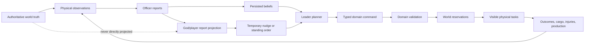
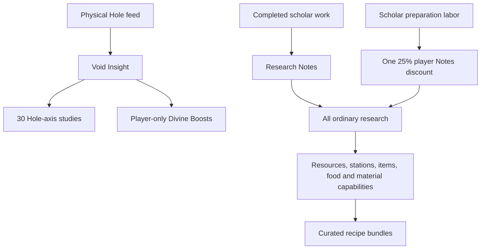
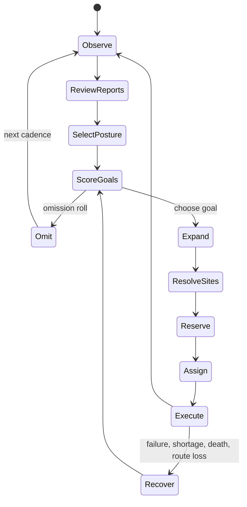
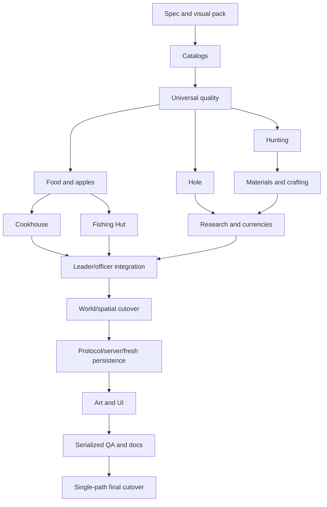
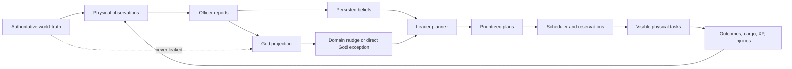
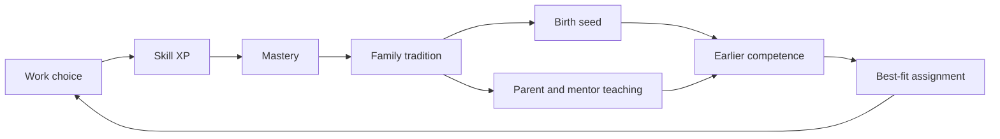
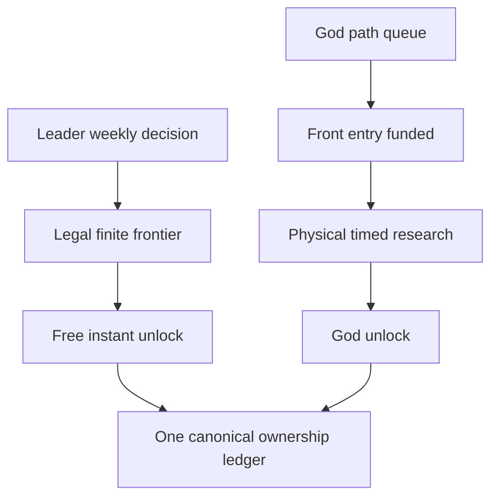
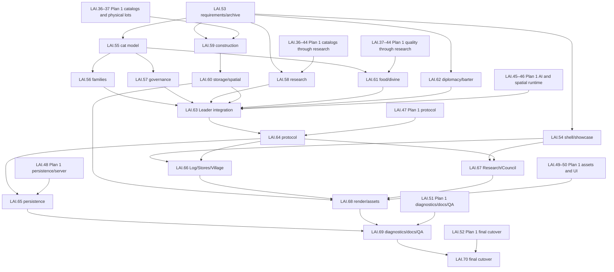

# Leader Intelligence and Colony Progression Board

This board is the only implementation board for the overhaul. The historical
`docs/migration/BOARD.md` remains closed history and must not receive these cards.

The inventory contains 73 cards: the 35 base cards LAI.0–LAI.34, additive LAI.0A and LAI.33A,
the post-cutover Hole/Hunting/content integration cards LAI.35–LAI.52, and the additive
Bug-GUI/family/governance/institution integration cards LAI.53–LAI.70. New cards are additive:
they do not renumber, delete, compress, or hide the evidence for either exact stored plan or the
first cutover.

Status flow is `todo → spec → red → dev → qa → done`. LAI.0 and LAI.0A are
documentation-only and may move from `spec` to `dev`; every behavior card must record a focused
failing test before production implementation. No new behavior is shippable until LAI.34 completes
the atomic direct cutover.

## Line-1 execution cursor

This is the authoritative live status overlay when reading the board from line 1. Several base-card
rows below deliberately retain their earlier red/development status and chronological evidence;
the [atomic implementation completion ledger](#atomic-implementation-completion-ledger--2026-07-23)
supersedes those historical status cells without deleting their audit trail.

| Cards | Live status | Execution meaning |
|---|---|---|
| LAI.0–LAI.31 except LAI.32 | done | The base implementation, including LAI.1, LAI.16, and LAI.27–LAI.31, is integrated. |
| LAI.32 | qa | Implementation and focused/full single-seed evidence are green; the intentionally expensive 1,700-seed release matrix remains one serialized final release gate. |
| LAI.33, LAI.33A | done | Signed system journeys and real Playwright/fixed-canvas visible-browser acceptance are integrated. |
| LAI.34 | qa | Atomic cutover is implemented; four remote Forgejo partitions and the LAI.32 release matrix remain publication gates, not missing feature work. |
| LAI.35 | accepted | Both exact post-cutover plans and their branch/Q&A/source inventories are preserved. |
| LAI.36–LAI.43 | dev | The eight ordered Plan 1 leaf foundations are implemented and their current corrected states pass coordinator-owned serialized focused checks; root integration remains owned by LAI.44–LAI.52. |
| LAI.44 | dev | The canonical Research Notes/Void, physical scholar-work, one-use preparation, duplicate-lane hooks, and four Void-funded Divine Boost leaf is implemented; 21/21 coordinator-owned serialized focused checks pass. Downstream runtime/protocol/persistence/UI cutover remains owned by LAI.45–LAI.52. |
| LAI.45 | dev | The pure report-driven Leader/officer content planner is implemented, source-audited, and passes its serialized focused target 14/14: Hole vocabulary, exact ten-phase review loop, bounded persistent goals/dependencies, report-only candidates/fallbacks, believable mistakes/omissions, standing orders, typed requests, defense/recovery/cargo intents, and God/planner report twins. LAI.46 physical runtime integration remains. |
| LAI.46–LAI.52 | todo | These are the remaining Plan 1 integration, protocol, persistence, rendering, UI, QA, and cutover cards after LAI.45. |
| LAI.53 | accepted | Plan 2 intent, conflicts, and traceability are preserved without narrowing Plan 1. |
| LAI.54–LAI.62 | dev | Pure foundations exist but do not bypass their unfinished Plan 1 and root-integration prerequisites. |
| LAI.63–LAI.70 | todo | Downstream Plan 2 integration, visuals, QA, and cutover remain. |

Accordingly, new feature dispatch starts at LAI.46. LAI.32 and LAI.34 return to the execution cursor
only for the one serialized final integration/release sequence; they do not justify rerunning heavy
campaigns while feature implementation is still changing.

The current LAI.46 hot-root pass has a static, non-acceptance inventory at
[evidence/lai46-static-integration-review.md](evidence/lai46-static-integration-review.md). It records
the truthful geometry and shared-ledger work that exists, plus the still-missing canonical
FoodEcology/Fishing/Cookhouse/Hut live aggregates, exact runtime task materialization, Lair-versus-
Quarry distinction, world-global work/endpoint claims, and reservation-admission invariant. Authored
tests do not close the card until the external serialized gate runs them.

The current protocol follow-on has a static, non-acceptance inventory at
[evidence/lai47-static-cutover-inventory.md](evidence/lai47-static-cutover-inventory.md). It records
the canonical v3/schema-v2 foundation and the still-live protocol/server/client legacy consumers so
LAI.47 cannot be reduced to a DTO-only claim or delete compatibility surfaces before their owning
cutover cards.

The persistence follow-on has a matching static, non-acceptance inventory at
[evidence/lai48-static-persistence-cutover-inventory.md](evidence/lai48-static-persistence-cutover-inventory.md).
It records the strict schema-v2 foundations, the still-opaque whole-runtime row, historical gameplay
columns and migration-shaped APIs, exact reset/identity conflict decision, required aggregate
inventory, and fresh-fixture obligations. LAI.48/LAI.65 cannot be accepted by hashing one JSON
aggregate or by retaining the obsolete schema beside it.

The maintained [extension guide](extending-the-system.md) now also contains the missing data-only
versus behavior decision tree and explicit recipes for food/ecology, exact items/tools/furniture,
augmentations/fixtures, creatures/Lairs/drops/portraits, report/hidden-field safety, game-style
assets and state sheets, bounded diagnostics/heartbeats, and append-only board/evidence packages.
These additions preserve the earlier twenty-one recipes and make future content use the same
authority, spatial, conservation, protocol, persistence, UI, art, and acceptance contracts.

## Evidence contract

Every card owns these fields, which must be populated before `done`:

- **Design evidence**: links/sections updated in the same change, including constants, failure,
  persistence, protocol/UI, and non-goals.
- **Red evidence**: exact command, failing test/fixture, and expected failure. Documentation-only
  cards record `not applicable` with the reason.
- **Green evidence**: focused and relevant crate/scenario command/results.
- **Quality evidence**: smoke, touched-crate Clippy `-D warnings`, format, and `git diff --check`.
- **QA evidence**: determinism/confidentiality/restart/rendering/campaign artifacts applicable to the
  card, plus commit/Forgejo link when available.
- **Migration/cutover evidence**: defaults, version behavior, deleted legacy surface, or `none`.

Evidence is append-only except to correct a factual error. “Tests pass” without the command and
result is not evidence.

## Ownership rules

- LAI.2–LAI.22 add focused `cat-sim` leaf modules and tests; they do not grow orchestration roots.
- LAI.23 is the sole owner of merge-sensitive `world_tick` integration and legacy planner removal.
- LAI.24–LAI.25 share one protocol-root integration owner.
- LAI.26 has one SQLite/persistence migration owner.
- LAI.27 has one server action/routing/redaction owner.
- LAI.28–LAI.31 use one client-root integration owner; slice work belongs in focused client modules.
- Parallel work starts only when all listed dependencies are `done` and paths do not overlap.
- Editing workers may operate on disjoint leaves, but only the coordinator grants the single heavy
  test/build/browser slot. Local gates use `CARGO_BUILD_JOBS=1`, `taskset -c 0-3`, and one test or
  Playwright worker; parallel test processes are forbidden.

## Dependency graph

```text
LAI.0 → LAI.1
LAI.0 → LAI.0A
LAI.1 → LAI.2, LAI.3
LAI.2 → LAI.4, LAI.8, LAI.10
LAI.4 → LAI.5, LAI.6 → LAI.7
LAI.8 → LAI.9, LAI.10, LAI.21
LAI.10 → LAI.11, LAI.21
LAI.3 + LAI.11 → LAI.13
LAI.5 + LAI.11 → LAI.12
LAI.12 + LAI.13 → LAI.14
LAI.10..LAI.14 → LAI.15 → LAI.16
LAI.13 + LAI.15 → LAI.17 → LAI.18 → LAI.19 → LAI.20
LAI.8 + LAI.10 → LAI.21; LAI.13 + LAI.21 → LAI.22
LAI.5 + LAI.7 + LAI.14..LAI.22 → LAI.23
LAI.23 → LAI.24 → LAI.25; LAI.20 + LAI.21 also gate LAI.25
LAI.23..LAI.25 → LAI.26
LAI.24..LAI.26 → LAI.27
LAI.25 + LAI.27 → LAI.28, LAI.31
LAI.24 + LAI.27 → LAI.29, LAI.30
LAI.2..LAI.23 → LAI.32
LAI.26 + LAI.27 + LAI.32 → LAI.33
LAI.28..LAI.33 → LAI.33A
LAI.0A + LAI.0..LAI.33 + LAI.33A → LAI.34
```

## Wave 0 — specification and red gates

| ID | Card | Status | Depends on | Owner / design | Required red or acceptance evidence | Completion evidence |
|---|---|---|---|---|---|---|
| LAI.0 | Documentation foundation and dedicated board | done | — | Docs owner; all files in this directory | N/A: no production behavior; validate plan completeness, links, Markdown, and diff whitespace | Design: this directory. Red/green: N/A. Quality/QA: local links, 35-card inventory, decision-completeness scan, required-constant scan, `git diff --check`, and per-file no-index whitespace checks pass. Migration: root-sync list recorded. |
| LAI.0A | Extensibility and contributor guide | done | LAI.0 | Docs owner; [extending-the-system.md](extending-the-system.md) | N/A: documentation-only; verify every extension recipe covers stable IDs, deterministic ordering/RNG, authority/redaction, complete spatial contracts, cross-colony reservations, persistence/versioning, rollback, exact touchpoints, tests, and guide/root links | Design: contributor guide plus README/testing links. Red/green: N/A. Quality/QA: local-link, unique-card-ID, recipe/checklist inventory, conflict-marker, and whitespace checks pass; no Rust changed. Migration: guide requires explicit defaults/version/replay/rollback for every extension. |
| LAI.1 | Characterization and red acceptance harness | red | LAI.0 | Test foundation; [testing-cutover.md](testing-cutover.md) | Failing/current-boundary fixtures for saves, typed sites, planner replacement, `UPDATE_REQUIRED`, 30-day harness, and committed release-profile wall-time/RSS baseline | Red gate established; see the LAI.1 evidence log below. Production replacement remains owned by LAI.2 onward. |

## Wave 1 — independent foundations

| ID | Card | Status | Depends on | Owner / design | Required red or acceptance evidence | Completion evidence |
|---|---|---|---|---|---|---|
| LAI.2 | Planner IDs, RNG streams, fixed-point scoring, and bounded state | done | LAI.1 | Planner-state leaf owner; [planner-and-beliefs.md](planner-and-beliefs.md) | Stable-ID/order twins, isolated RNG forks, basis-point score, 128/256 caps and deterministic eviction | Design: planner-and-beliefs intent/RNG/ordering contract implemented in `planner_core`. Red: `cargo test -p cat-sim planner_core::tests --no-fail-fast` failed on 35 missing planner-core symbols before implementation. Green: `cargo nextest run -p cat-sim -E 'test(/planner_core/)'` passed 12/12. Quality: `cargo clippy -p cat-sim --lib --tests -- -D warnings`, `cargo fmt --all -- --check`, and `git diff --check` pass; workspace smoke ran 57 passing tests before the expected LAI.1 protocol-version red gate failed. QA: stable-ID/order and isolated-stream twins, integer scoring/aging, lifecycle terminal immutability, retry overflow, 128/256 boundaries/eviction, and strict persisted-state rejection pass. Migration: schema v1/default clock plus validated bounded serde state; no tick/protocol/server/client integration. |
| LAI.3 | Spatial objective and canonical footprint model | done | LAI.1 | Spatial-types leaf owner; [spatial-task-contract.md](spatial-task-contract.md) | Every `SiteRef` variant and objective/work/endpoint distinction; Workshop exactly width/height 3 and nine ordered tiles | Typed spatial leaf and compatibility re-exports landed; seven focused tests, 17 footprint compatibility tests, Clippy, and fmt pass. See the LAI.3 evidence log below. |
| LAI.4 | Attributes, inheritance, and personality | done | LAI.2 | Cat-model leaf owner; [cats-and-care.md](cats-and-care.md) | 0–100 migration formula, midpoint ±2 inheritance clamp, 80/15/5 distribution, axis-isolation/5-15-30% weights | Design: defaultable `cat_traits` leaf plus minimal library export. Red: focused tests failed on the missing attribute/personality API. Green: focused Nextest passed 11/11. Quality: touched-crate Clippy with `-D warnings`, fmt check, and diff check pass. QA: exact migration/clamp/mutation boundaries, keyed sibling/order stability, 8,000-axis 80/15/5 seed matrix, signed 5/15/30% fixed-point factors, axis isolation, serde range validation, and legacy defaults. Migration: 1–20 centered attributes and neutral personality decode defaults are ready for the later sole persistence owner; no entity/tick/protocol/server/SQL integration. |
| LAI.5 | Stress, willingness, refusal, and acquired traits | done | LAI.4 | Cat-willingness leaf owner; [cats-and-care.md](cats-and-care.md) | Exact thresholds/deltas, cargo and consumed-step conservation, traits, `Blocked(NoWillingWorker)` | Design: pure `cat_stress`, `cat_willingness`, and `acquired_traits` leaves. Green: 26 focused deterministic tests pass. Quality: leaf rustfmt, cat-sim lib/test Clippy, fmt, and whitespace checks pass; see evidence log. QA: exact bands/deltas/refusal buckets, protected risk, conserved cargo/atomic station release, no-willing block, every trait trigger/recovery/modifier stage. Migration: defaulted serde leaf state only; no tick/entity/wire/server/SQL integration. |
| LAI.6 | Anatomy and injury incidents | done | LAI.4 | Injury leaf owner; [cats-and-care.md](cats-and-care.md) | Part/function model, exact work/outcome probabilities, injury RNG/batch invariance, 12/48 effective treatment-hours, no missing-part regrowth, death | Design: pure `anatomy` and `injuries` leaves with seven stable parts, natural function/job capability, treatment, and keyed incident resolution. Red: focused test compile failed on the missing leaf APIs. Green: focused Nextest passes 8/8. Quality: owned-file rustfmt and whitespace/diff checks pass; aggregate cat-sim Clippy/fmt were attempted but concurrent LAI.5/LAI.10 work-in-progress diagnostics outside this leaf remained, as confirmed by the coordinator. QA: exact 100/85/50/0 function, seven incident rates, exhaustive 70/20/8/2 buckets, keyed order twins, severe exclusions, exact 12/48-hour partition twins, strict serde defaults/invariants, no missing regrowth, one-part mutation, and explicit stable-ID fatal outcome. Migration: legacy anatomy defaults healthy; no Cat/world-tick/protocol/server/SQL/client integration. |
| LAI.7 | Prosthetic lifecycle | done | LAI.6 | Prosthetic/item leaf owner; [cats-and-care.md](cats-and-care.md) | Sided fit/consent, 50/75% restoration, 360/1080-hour wear, 90% cap, one-ID conservation through all transitions | Design: explicit `prosthetics` finite-item ledger/state machine layered over LAI.6 anatomy and LAI.5 acquired-trait progress. Red: focused target failed on the missing module/API. Green: focused Nextest passes 8/8. Quality: owned-file rustfmt, workspace fmt check, and focused cat-sim Clippy with `-D warnings` pass; workspace smoke reached 57 passing tests before the expected LAI.1 protocol-version red gate. QA: exact sided fit/refusal/cancel and double-slot exclusion, 50/75/90% restoration, +2-point rehabilitation, +10-point 72-hour adaptation, 360/1080-hour affected-work partition twins, broken zero-function, finite-input Workshop repair/cancel, death recovery, cargo/trade eligibility, canonical order twins, strict active-transition restart validation, and one-ID conservation pass. Migration: schema v1/default empty ledger persists exact IDs, slots, durability, rehabilitation, physical reservations, and cargo; no Cat/world-tick/protocol/persistence/server/client integration. |
| LAI.8 | Belief store, observations, reports, decay, and contradiction | done | LAI.2 | Knowledge leaf owner; [planner-and-beliefs.md](planner-and-beliefs.md) | ±40/25/12/5/2 bands, 1/6/12/24-hour expiry, −500 basis points/full interval, direct invalidation zero, precedence, bounded feedback, hidden-truth twins | Design: planner-and-beliefs knowledge boundary implemented in `beliefs`. Red: `cargo test -p cat-sim --lib beliefs::tests --no-fail-fast` failed on 10 missing belief/report symbols before implementation. Green: `cargo nextest run -p cat-sim -E 'test(/^beliefs::/)'` passed 11/11. Quality: `cargo clippy -p cat-sim --lib --tests -- -D warnings`, `cargo fmt --all -- --check`, and `git diff --check` pass; workspace smoke ran 57 passing tests before the expected LAI.1 protocol-version red gate failed. QA: exact level bands/visibility, 1/6/12/24-hour expiry, post-expiry 500-bp decay/floor, source/reporter order twins, contradiction/supersession, stale/direct invalidation and recovery, strict serde rejection, bounded feedback, and hidden-regeneration twins pass. Migration: belief-store schema v1 with fail-closed validation; no runtime/wire/server/client integration. |
| LAI.9 | God/player report projection and leak audit | done | LAI.8 | Projection/redaction leaf owner; [planner-and-beliefs.md](planner-and-beliefs.md), [wire-persistence-ui.md](wire-persistence-ui.md) | Exhaustive API/UI/debug-field audit; regeneration hidden before level 4; only Favor exact | Design: added a typed `PlayerProjection` that accepts beliefs, bounded feedback, and exact divine Favor, with no executor-truth or catch-all metadata input. Red: the focused integration target first failed on the missing projection module/API. Green: all five focused projection tests pass. Quality: leaf rustfmt, touched-crate Clippy, fmt check, and diff check pass. QA: all nine documented player surfaces reject all eleven authoritative field classes; hidden-regeneration twins serialize identically without a report; report levels 1–3 cannot construct regeneration evidence; level 4 exposes only a ±25% estimate range; exact Favor remains visible; serialized and debug representations contain only report-safe fields. Migration: schema v1 is output-only and leaves protocol/server/client cutover to LAI.24/27/28–31. |

## Wave 2 — planning and spatial execution

| ID | Card | Status | Depends on | Owner / design | Required red or acceptance evidence | Completion evidence |
|---|---|---|---|---|---|---|
| LAI.10 | Intent graph, officer requests, and authority lifecycle | done | LAI.2, LAI.8 | Intent/request leaf owner; [planner-and-beliefs.md](planner-and-beliefs.md); `cat-sim::{authority,intent_graph,officer_requests}` | Stable bounded intent/request DAG, typed authority/budgets, lifecycle expiry/cancel/succession, and deterministic persistence twins | Design: schema-v1 intent graph/request book reuse stable planner/belief IDs, ordered maps/sets, fixed-point urgency, typed authority decisions, and isolated leaf APIs. Red: focused lib test initially failed on ten missing schema/lifetime/authority symbols. Green: focused Nextest runs 11/11 covering all persisted fields/states, semantic merge, deterministic DAG rejection, exact +100 bp/full-hour aging capped +2500, 6h/48h/7d lifetimes, cross-domain budget/authority, and stable identity. Quality: strict cat-sim Clippy, owned-file rustfmt, and diff checks pass; workspace smoke reaches the expected LAI.1 protocol-cutover red after 57 passes. QA: exact 128 live/256 terminal bounds and stable eviction, strict version/cycle/dedupe/terminal-claim serde rejection, unauthorized no-mutation, Acting Steward vacancy limits, normal cancel/deadline cleanup including task/reservation release, terminal request release, overdue expiry, and leader/officer succession adoption without retry/identity reset pass. Migration: additive schema-v1 leaf state only; no runtime, world-tick, protocol, server, persistence, UI, or Cat-field integration. |
| LAI.11 | Scheduler, hysteresis, retry, aging, and atomic reservation transaction | done | LAI.10 | Scheduler leaf owner; [planner-and-beliefs.md](planner-and-beliefs.md), [spatial-task-contract.md](spatial-task-contract.md); `cat-sim::{scheduler,reservation_transaction}` | Stable score/tie order, exact aging/hysteresis/retry bands, atomic all-claim reserve/rollback, and restart-safe idempotent release | Design: schema-v1 scheduler state and reservation ledger reuse planner fixed-point score/lifecycle IDs, LAI.10 intents, and typed spatial objectives without runtime coupling. Red: focused lib compile failed on the missing scheduler/reservation schema and state symbols. Green: focused Nextest passes 16/16. Quality: strict cat-sim Clippy, owned-file rustfmt, workspace fmt check, and diff check pass; workspace smoke reaches the expected LAI.1 protocol-cutover red after 57 passes. QA: stable utility/ties and input-order twins, saturating overflow, exact +100 bp/full-hour aging capped +2500, ordinary 15% hysteresis edges plus emergency/route/incapacity bypass, current-epoch ±1500 nonstacking/replace/dismiss influence, cadence invalidation hooks, 15/30/60/120-minute retries with terminal fifth failure and preserved 240-minute contract constant, no duplicate failure while waiting, material-change identity, ordered dependency invalidation/claim cleanup, complete typed spatial objective/slot/delivery/route/tool/cargo/cat claims, stable batch arbitration, exclusive/capacity overflow conflicts, refusal/invalidation rollback, idempotent commit/release, never-busy loser twins, and strict canonical persistence/defaults pass. Migration: additive schema-v1 empty defaults only; no world-tick, protocol, server, persistence, UI, or Cat-field integration. |
| LAI.12 | Global workforce matcher | done | LAI.5, LAI.11 | Matcher leaf owner; [cats-and-care.md](cats-and-care.md); `cat-sim::workforce_matcher` | Maximum-weight result beats greedy case, order-stable ties, slots/continuity/preemption/refusal rematch | Design: canonical whole-colony bipartite min-cost-flow pass over distinct task/work slots, semantic keyed refusal buckets, explicit willingness/eligibility edges, and event-triggered continuity filtering; the matcher never mutates cat busy state or reservations. Red: the first focused run exposed both an incorrect emergency preemption boundary and a residual-flow tie that selected the later cat for the earlier task. Green: vector-valued residual tie costs now implement task-ID then cat-ID ordering and focused tests pass 8/8. Quality: `cat-sim` lib Clippy with `-D warnings`, owned-file rustfmt, and whitespace checks pass. QA: the known greedy counterexample reaches total 197 instead of 101; reversed input twins are byte-equal; one cat cannot occupy two Workshop slots; ordinary changes require the exact 15% gain; refusal/incapacity invalidates continuity and rematches; no-eligible versus no-willing remains distinct; malformed duplicate/unknown contracts fail closed. Migration: additive schema-v1 task-slot/assignment wire leaves and a dedicated stable refusal RNG fork; no world-tick, protocol, persistence, server, or client integration. |
| LAI.13 | Spatial resolver and world-scoped reservation ledger | done | LAI.3, LAI.11 | Spatial resolver/ledger leaf owner; [spatial-task-contract.md](spatial-task-contract.md); `cat-sim::{spatial_resolver,world_reservations}` | Real Hunt/Water/Fish/Quarry/tree sites, route denial, exclusive/capacity conflicts across colonies, no fallbacks | Design: authoritative resolver plus schema-v1 world ledger leaf. Red: focused target first failed on both missing modules. Green: 13/13 focused Nextest cases pass. Quality: focused strict Clippy, workspace fmt, and whitespace checks pass; workspace smoke reaches only the expected LAI.1 protocol-cutover red after 57 passes. QA: all task mappings, complete canonical footprints, pinned roles/routes, no-fallback blocking, cross-colony exclusivity/capacity, atomic lifecycle, order twins, and strict restart/defaults pass. Migration: additive leaf schema only; no tick/protocol/server/SQLite/client integration. See the LAI.13 evidence log below. |
| LAI.14 | Multi-stage visible task runtime and persistence | done | LAI.12, LAI.13 | Task-runtime leaf owner; [spatial-task-contract.md](spatial-task-contract.md), [wire-persistence-ui.md](wire-persistence-ui.md); `cat-sim::task_runtime` | Objective/work/delivery stage pinning, cargo salvage, route closure, restart revalidation, no-site no-busy | Design: schema-v1 stable task IDs and strict resolve/reserve/travel-to-source/pickup/travel-to-work/work/travel-to-endpoint/deposit/terminal stages retain the complete `SpatialObjective`, ordered route identities, exact work slot, reservation, worker, cargo identity/quantity/location, progress, bounded block reason, and update tick. Red: the first focused compile was intentionally blocked by the concurrently missing LAI.13 resolver invariants; once that dependency compiled, focused runtime behavior ran green. Green: focused integration target passes 8/8. Quality: strict task-runtime Clippy with `-D warnings`, owned-file rustfmt, and diff check pass. QA: objective/endpoint/route stage pinning and byte-equal restart, no-site/no-marker/no-busy, committed-reservation-before-busy, exact pre-pickup rollback, post-pickup cancel denial, safe stockpile salvage, missing-reservation restart salvage with quantity conservation, single deposit/complete and reservation release, illegal stage/progress rejection, and strict cargo-stage coherence pass. Migration: additive schema-v1 runtime leaf; invalid legacy spatial data has an explicit blocked reason and can never create a marker/worker assignment; combined SQLite/world revalidation remains LAI.26. |

## Wave 3 — gameplay planners and progression

| ID | Card | Status | Depends on | Owner / design | Required red or acceptance evidence | Completion evidence |
|---|---|---|---|---|---|---|
| LAI.15 | Founding Leader postures and domain planner | done | LAI.10, LAI.11, LAI.12, LAI.13, LAI.14 | Domain-planner leaf owner; [planner-and-beliefs.md](planner-and-beliefs.md); `cat-sim::leader_planner` foundation | Posture thresholds, level cadences/horizons, survival/Shrine/growth/defense, 25/12/5/1/0 omission, bounded explanations | Design: planner doc now records report-safe domain signals, exact strategic weights/bonuses, personality/confidence weighting, bounded explanation keys, emergency injection, and founding no-specialist fallback; `leader_planner` remains a leaf and no runtime switch was added. Red: `cargo test -p cat-sim leader_planner::tests --no-fail-fast` failed before implementation on missing `plan_founding_leader_domains`, `domain_signal`, `LeaderDomainPlannerOwner`, and personality imports. Green: `cargo nextest run -p cat-sim --lib -E 'test(/leader_planner/)'` passes 13/13; `cargo test -p cat-sim --lib leader_planner::tests --no-fail-fast` passes 13/13. Quality: `cargo clippy -p cat-sim --lib --tests -- -D warnings`, `rustfmt --edition 2024 --check crates/cat-sim/src/leader_planner.rs`, and `git diff --check` pass; `cargo fmt --all -- --check` currently stops only on an unrelated import ordering diff in `crates/cat-sim/src/shrine_offerings.rs`. QA: tests cover exact posture precedence and integer boundaries, cadence/horizon/effective-level and 25/12/5/1/0 omission tables, officer-request one-band omission reduction, deterministic single omission roll, shuffled twins, defense/survival/Shrine/growth domain planning, emergency injection, Shrine ahead of growth, personality and imperfect-belief confidence weighting, bounded report-safe explanations, strict serde/bounds, and founding no-specialist fallback. Migration: additive schema-v1 leaf API only; LAI.23 still owns world-tick integration, legacy planner removal, and any production runtime switch. Smoke: `cargo nextest run --workspace --profile smoke` reaches the expected LAI.1 protocol-version red gate after 58 passes. |
| LAI.16 | Officer expertise and structured requests | todo | LAI.15 | Officer leaf owner; planner docs | Seven offices, 0/24/96/240/480 hours, Workflow/Reinforcement bonuses, 3/5/8/12/all sampled candidates, vacancy/succession/budgets | **Additive pre-implementation evidence (parent remains todo):** pure versioned `officer_expertise` institution leaf reuses authority domains, belief report levels, keyed Appointment RNG, and officer-request succession adoption. Red: focused target failed on the missing module/API. Green: focused Nextest passes 9/9. Quality: owned-file rustfmt and diff checks pass; `-D warnings` is clean for this leaf when exempting the one concurrent LAI.22 `collapsible_if`, while the unexempted command was attempted and stops only in that external leaf. QA: exact seven-role domains, 0/24/96/240/480-hour levels, Workflow/Reinforcement cap, 6h/3h/1h/30m/15m cadence, belief-aligned report bounds with regeneration absent through level 3, 3/5/8/12/all keyed samples without replacement, stable merit ties/order twins, no casual replacement, durable duty/appointment/vacancy state, strict schema/bounds, officer death/adoption, and exact six-hour Leader succession/restart twins pass. Runtime leaf completion evidence (parent still `todo`): `officer_expertise` now persists per-office runtime review anchors and advances one crossed cadence boundary at a time; `emit_officer_report` builds authorized `OfficerReport`s from existing belief types with regeneration hidden through L3 and L4+ range-only estimates; `officer_requests` adds level-bounded structured draft proposal with actor/domain/budget checks, deterministic occurrence IDs, semantic merge, live-cap enforcement, and successor adoption without rekeying request identity. Green: `cargo nextest run -p cat-sim --test officer_expertise_appointment --test officer_runtime` passes 13/13 and `cargo test -p cat-sim --test officer_expertise_appointment --test officer_runtime --no-fail-fast` passes 13/13. Quality: `cargo clippy -p cat-sim --lib --tests -- -D warnings` passes; `cargo nextest run --workspace --profile smoke` runs 58/75 before the expected LAI.1 protocol-cutover red, with 57 passed and 1 failed (`leader_ai_atomic_cutover_bumps_protocol_before_replacement_payloads_ship`); owned Rust 2024 rustfmt and diff checks pass. Refresh for dispatch `ctx_57a5ff3edd0c`: focused Nextest still passes 13/13, focused Cargo still passes 13/13, strict cat-sim Clippy still passes, owned Rust 2024 rustfmt and tracked/untracked whitespace checks pass, and workspace smoke is currently blocked during compile by unrelated LAI.17 `shrine_favor.rs` expectations for `OfferingCargoDisposition`, `cargo_disposition`, and `block_after_cargo_salvage`. Remaining: LAI.15/LAI.23 leader/world-tick integration, protocol/server/UI/persistence wiring, and parent LAI.16 completion remain pending. |
| LAI.17 | Endless Shrine offering pipeline and Favor ledger | done | LAI.13, LAI.15 | Shrine/Favor leaf owner; [shrine-favor-research.md](shrine-favor-research.md) | Endless packages, belief utility, physical haul/ritual, omission, single credit, removal of cooldown/tithe/scalar behavior | Design: pure `favor` and `shrine_offerings` leaves implement exact micro-Favor CAS events, four physical one-Favor offering packages, report-belief replacement-cost utility, omission-gated endless review, one active pipeline per Shrine, cargo/ritual stage validation, persisted cargo disposition/salvage, restart validation, and no cooldown/tithe/completion-gate/scalar fields; the Shrine design now records the cargo disposition contract. Red: `cargo test -p cat-sim --test shrine_favor cancellation_salvage_records_exact_cargo_disposition_without_favor_credit --no-fail-fast` failed before implementation on missing `OfferingCargoDisposition`, `cargo_disposition`, and `block_after_cargo_salvage`. Green: the same red test passes 1/1; `cargo nextest run -p cat-sim --test shrine_favor` passes 5/5; `cargo test -p cat-sim --lib favor::tests --no-fail-fast` passes 3/3; `cargo test -p cat-sim --lib shrine_offerings::tests --no-fail-fast` passes 4/4. Quality: `cargo clippy -p cat-sim --lib --test shrine_favor -- -D warnings`, `cargo clippy -p cat-sim --lib --tests -- -D warnings`, owned-file rustfmt, and `git diff --check` pass; `cargo fmt --all -- --check` currently stops only on unrelated `research_purchase.rs`/`lib.rs` formatting from another card. QA: tests prove exact endless four-package loop, one base Favor as 1,000,000 micro-Favor credited once after consumed ritual, poor/stale belief-only Food choice, no hidden fallback, deterministic omission/forgetting without fallback work, survival/defense deferral, immediate post-completion restart without cooldown, exact CAS/nonnegative/idempotent ledger behavior, crash replay idempotency, strict persisted state rejection, pre-pickup cancellation release, post-pickup stockpile salvage, no Favor credit after cancellation/salvage, and absence of serialized cooldown/tithe/scalar/blessing surfaces. Migration: additive schema-v1 leaf only; no world-tick, protocol, server, persistence, UI, research, boost, legacy path deletion, or LAI.26 migration work was added. Smoke: `cargo nextest run --workspace --profile smoke` reaches the expected LAI.1 protocol-version red gate after 57 passes. |
| LAI.18 | Research purchase and automatic quota | done | LAI.16, LAI.17 | Research-purchase leaf owner; Shrine doc | Favor CAS, frontier, 1/2/2/3/4 rolling-week quota, affordability/succession, frozen prices | Design: pure `research_purchase` leaf consumes the exact `FavorLedger`, uses synthetic study descriptors for later LAI.19 manifest injection, validates prerequisite-ready frontier ordering, freezes undiscounted/discounted committed prices, persists versioned/idempotent events with strict map-key/event-ID matching, and stores colony-owned rolling-seven-day automatic quota timestamps independent of leader identity. Red: focused acceptance file covered the absent leaf surface; the pre-green local run failed before final API/test fixes, then the implemented leaf made the target green. Green: `cargo nextest run -p cat-sim --test research_purchase` passes 7/7; `cargo test -p cat-sim --test research_purchase --no-fail-fast` passes 7/7. Quality: `cargo clippy -p cat-sim --lib --test research_purchase -- -D warnings`, `cargo fmt --all -- --check`, and `git diff --check` pass; the broader `cargo clippy -p cat-sim --lib --tests -- -D warnings` and `cargo nextest run --workspace --profile smoke` currently stop during compile on unrelated LAI.20 `crates/cat-sim/tests/divine_boosts.rs` importing missing `cat_sim::divine_boosts`. QA: tests prove player prerequisite/frontier rejection, exact nonnegative Favor debit, 25% player discount with frozen undiscounted/charged event price, idempotent replay across catalog price changes, stale/duplicate/unaffordable no-mutation behavior, automatic affordable frontier filtering, deterministic belief/posture/personality/dependency/expected-value score hooks with permutation stability, exact 1/1/2/2/3/4 quota table, restart/succession quota persistence, unused quota never carrying into later windows, automatic full-price purchase with no preparation consumption, and strict catalog/state/quota restart validation. Migration: additive schema-v1 leaf plus minimal `lib.rs` export only; no 531-study manifest, scholars/preparation book, world-tick, protocol, server, persistence, UI, research effects, boosts, or legacy-path deletion integration; legacy deletion remains LAI.23/LAI.34 cutover work. |
| LAI.19 | Scholars, Insight, prepared studies, and 531-study manifest | done | LAI.18 | Research-manifest/scholar leaf owner; Shrine doc | Add 44 live studies; 531 validation; 20 Insight/week, preparation/reassign, 25% player discount, Administration/Rehabilitation effects | **LAI.19 manifest and scholar leaf complete:** Design: `research_manifest` preserves the 487-node catalog and appends exactly four ordered 11-stage tracks; `scholar_research` composes the existing acquired-trait, Favor/research-purchase, boost, and manifest types into versioned colony-owned Insight, per-scholar completed-week progress, durable prepared markers, exact current-price preparation, death release/reassignment, deterministic approved-plan dependency priority, atomic prepared player purchase, and canonical stage-effect projections. Red: the focused scholar acceptance target initially failed because `cat_sim::scholar_research` was absent. Green: `cargo test -p cat-sim --test scholar_research --no-fail-fast` passes 9/9; combined `cargo nextest run -p cat-sim --test scholar_research --test research_manifest --test research_purchase` passes 21/21. QA: manifest tests prove exactly 531 unique stable IDs/display names, deterministic permutation twins, acyclic/reachable topology, live handlers, no deprecated orphan, and exact four-track tables; scholar tests prove 20 Insight per completed physical scholar-week with persisted partial work, skill/Scholarship/Seasoned Scholar modifiers and the 200-Insight threshold, Scholars' Guild/live-station/alive gating, exact preparation cost/non-stacking/restart durability, requested-dependency priority, preserved colony Insight and transferable preparation on death, exact atomic player-only 25% discount/consumption/idempotency, rejection of undocumented discounts, malformed-save rejection, and exact Duration/Economy/Rehabilitation/Administration projections with gap rejection. Quality: strict cat-sim Clippy with `-D warnings` passes and owned Rust files are rustfmt-clean; workspace smoke reaches the expected LAI.1 protocol-version red after 57 passes, 1 failure, 17 not run, and 1904 skipped. Boundary: LAI.23 remains the sole `world_tick` activation/cutover owner, with protocol/server/persistence/UI integration remaining on LAI.24–31; those downstream integrations do not keep the LAI.19 leaf open. |
| LAI.20 | Divine boosts | done | LAI.18, LAI.19 | Boost leaf owner; Shrine/wire docs | Four +50% effects, 12 durations, ceil/economy cost, overlap/same-type reject, fixed price/expiry/idempotency | **LAI.20 boost leaf complete:** Design: pure `divine_boosts` consumes the exact `FavorLedger`, authorizes only authenticated `God`/player `ActivateBoost` operations, defines all four documented +50% village effect domains and base rates, derives the exact 12-duration and 3%-per-stage/33%-cap economy terms from typed LAI.19 manifest effects, computes ceil micro-Favor prices, rejects active same-type purchases without debit/reset while allowing distinct overlap, and persists a fixed audit snapshot containing colony, player, activation/end ticks, tick rate, paid cost, duration, research stages, Favor event, and versions. Green: `cargo test -p cat-sim --test divine_boosts --no-fail-fast` passes 8/8; `cargo nextest run -p cat-sim --test divine_boosts --test scholar_research --test research_manifest` passes 22/22. QA: tests prove every exact duration/economy stage, malformed effect/stage rejection, authenticated-player-only purchase including denial of unauthorized idempotent replays, atomic exact-once Favor debit, same-type no-debit rejection, distinct-type overlap, committed-term invariance after later research, exact fine/batched/restart expiry, same-type repurchase after exact expiry, restart-safe version gaps caused by expiry commits, strict persisted cost/expiry recomputation, and map-key/event-ID integrity. Quality: strict cat-sim Clippy with `-D warnings` and owned rustfmt pass; workspace smoke reaches the expected in-progress LAI.24 protocol acceptance reds after 56 passes, 2 failures, 26 not run, and 1910 skipped. Boundary: LAI.23 remains the sole `world_tick` effect/expiry integration owner, LAI.24/25/27/31 own protocol/server/UI, and LAI.26 owns persistence migration; those downstream integrations do not keep the LAI.20 leaf open. |
| LAI.21 | Diplomacy state and mutual consent | done | LAI.8, LAI.10 | Diplomacy leaf owner; [diplomacy-trade.md](diplomacy-trade.md) | Neutral/Friendly/Allied/Blocked, mutual consent, immediate block, authorization and restart | Design: pure versioned `diplomacy` ledger leaf. Red: focused target failed on missing module. Green: 12/12 focused Nextest cases pass. Quality/QA: stable canonical pairs/actions, strict persisted ordering/invariants, mutual Friendly/Allied consent, immediate stale-safe block, blocker-only Neutral reset, authorization/no-mutation denial, idempotency/version/order/concurrency/isolation/restart twins pass; see evidence log. Migration: schema v1 leaf only, no trade/tick/wire/server/SQL/UI integration. |
| LAI.22 | Autonomous physical trade | done | LAI.13, LAI.21 | Trade leaf owner; [diplomacy-trade.md](diplomacy-trade.md); `cat-sim::{trade_valuation,autonomous_trade}` | Belief-only ±10/20% valuation, escrow, physical route/delivery, cancellation/stranding, next-tick/ID ordering | Design: report-only fixed-point valuation plus schema-v1 physical contract ledger leaves. Red: focused target first failed on both missing modules. Green: 12/12 focused Nextest cases pass. Quality: strict focused Clippy, rustfmt, workspace fmt, and whitespace checks pass; workspace smoke reaches only the expected LAI.1 protocol-cutover red. QA: player-village relationship/auth gates, mutual acceptance, atomic double-spend-safe world escrow, matched-hauler cargo stages, delivery/recovery, no duplication/fallback, global ordering, multi-colony isolation, idempotency, and restart twins pass. Migration: additive leaves only; no NPC/tick/protocol/server/SQLite/UI integration. See LAI.22 evidence log. |

## Wave 4 — single-path integration, protocol, and server

| ID | Card | Status | Depends on | Owner / design | Required red or acceptance evidence | Completion evidence |
|---|---|---|---|---|---|---|
| LAI.23 | `world_tick` single-path integration and legacy planner removal | done | LAI.5, LAI.7, LAI.14, LAI.15, LAI.16, LAI.17, LAI.18, LAI.19, LAI.20, LAI.21, LAI.22 | **Sole world-tick integration owner**; README phase order; [world-tick-cutover.md](world-tick-cutover.md) | One ordered leaf-module path; old director/reliability/tithe/cooldown/conflicting schedules absent; no shadow/dual mutation | **LAI.23 production cutover complete:** The original 8-test red harness is green and now scopes reachable production orchestration rather than historical `cfg(test)` compatibility helpers. `ColonyRuntime` embeds one validated `LeaderAiRuntimeState` plus a restart-revalidation guard; legacy cats and leadership migrate deterministically; the root invokes the exact ten documented phases; planning uses report-safe beliefs and crossed Leader/officer cadence boundaries; scheduler/workforce/local+world reservations activate one visible-task path; movement has no generic straight-line or job-destination fallback; task stages own travel/work/cargo/completion; Shrine/Favor, research/scholars/boost expiry, diplomacy/trade ordering, stress/injury/death/prosthetic/succession, and final validation are wired in phase order. The production artifact no longer invokes the legacy director, action-reliability RNG, tithe/offering/research schedules, emergency Hunt/Water planner roots, material-offering logistics, or automatic upgrade-point mutation; historical unit-test helpers are `cfg(test)`-quarantined and legacy planner jobs are cancelled once at the migration boundary. Restart guards revalidate task/local/world reservations and cargo before continuation, prune bounded idempotency receipts, prevent duplicate leaf mutations, and preserve deterministic planner clocks. Green: focused Cargo and focused Nextest including aggregate validation both pass 18/18. QA: runtime integration tests prove exact seven-office/cat/leader initialization, durable six-hour succession without immediate replacement, one-time legacy-job retirement without Favor mutation, review-boundary idempotence, cat-input permutation invariance, JSON restart equality, and one-large-versus-60-small tick partition equality. Quality: strict `cargo clippy -p cat-sim --lib --tests -- -D warnings` and `cargo clippy -p cat-server --bin cat-server --tests -- -D warnings`, `cargo fmt --all -- --check`, rustfmt, and `git diff --check` pass. Workspace smoke reaches only the expected downstream LAI.24 red contract after 56 passes and 2 protocol failures, with 33 not run and 1,979 filtered/skipped. Boundary: LAI.24 owns report-safe protocol DTOs and hidden-regeneration wire removal; LAI.25 owns actions; LAI.26 owns durable SQLite serialization/migration of the embedded runtime; LAI.27+ own server/client/UI routing. |
| LAI.24 | Snapshot protocol | done | LAI.23 | **Protocol-root owner**; [wire-persistence-ui.md](wire-persistence-ui.md) | Versioned beliefs/plans/tasks/cats/Shrine/Favor/research/boost/diplomacy/trade; every `SiteRef`; leak audit | **Additive LAI.24A red-contract evidence:** Design: `wire-persistence-ui.md` records the exact post-cutover `LeaderAiSnapshotEnvelope` schema contract, including version/fail-closed decode, report-safe beliefs, top plans/requests, `VisibleTaskSnapshot`, `CatSnapshot.activeTaskId`, strict `SiteRefSnapshot` variants, Workshop 3x3/nine-tile JSON, cat care, endless Shrine/Favor, 531 research/frontier/quota/Insight/preparation, boosts, diplomacy, physical trade, bounds, and multi-colony redaction. Red: focused Cargo and Nextest originally ran 9/9 intentional missing-production failures. **LAI.24 production completion:** `PROTOCOL_VERSION` is 2 and the standalone schema-v1 strict envelope exposes versioned reports/plans/officer requests, visible tasks with referential cat active-task links, every physical `SiteRef`, report-safe care/progression/diplomacy/trade DTO, exact Favor, and the 531-study frontier without coupling the protocol crate to simulation internals. Decode rejects unsupported protocol versions, unknown fields/variants, empty or oversized IDs/strings, out-of-range basis points, invalid report/regeneration bounds, oversized collections, malformed footprints/routes, inconsistent active-task assignments, non-531 research projections, and inconsistent boost duration/expiry; the uninhabited private-state guard cannot carry cross-colony secrets. Green: focused Cargo passes 15/15 and focused Nextest passes 15/15 across the nine contract cases plus six executable round-trip/bounds cases; all 49 existing protocol unit tests and the LAI.1 protocol-cutover acceptance also pass. QA: the full nonempty envelope round-trips, all twelve `SiteRef` variants retain canonical order, Workshop validates exact 3x3/nine row-major tiles, and malformed version/variant/field/numeric/aggregate payloads fail closed. Quality: `cargo clippy -p cat-protocol --lib --tests -- -D warnings`, owned Rust 2024 rustfmt, and diff/whitespace checks pass. The full crate run fails only its seven intentional LAI.25 action-contract reds after 64 passes; LAI.25 action DTOs, LAI.26 persistence, and LAI.27 server projection/routing remain downstream and do not keep LAI.24 open. |
| LAI.25 | Action protocol and incompatible-client handling | done | LAI.20, LAI.21, LAI.24 | **Same protocol-root owner**; wire doc | Expected versions, idempotency, typed conflicts, all actions, stale refresh, clear `UPDATE_REQUIRED` | **Additive LAI.25A red-contract evidence:** Design: `wire-persistence-ui.md` records the post-cutover `LeaderAiActionEnvelope`, strict action payload domains, existing physical placement wrapping, authoritative validation order, typed bounded conflicts, incompatible-client `UPDATE_REQUIRED` version hints, malformed-ID/unknown-version/unknown-variant fail-closed behavior, and player-only versus Leader/officer authority markers. Red: focused Cargo and Nextest originally ran 7/7 intentional missing-production failures across the envelope, payload, placement, ordered-pipeline, conflict, bounds, and authority contracts. **LAI.25 production completion:** the strict `LeaderAiActionEnvelope` carries protocol/idempotency/selected-colony/authenticated-player identity, required planner/domain/resource versions, every domain-specific optimistic version, and one exhaustive tagged payload for plan nudges/dismissal/standing orders, officers, treatment/prosthetics, Favor research/scholar preparation, player-only boosts, diplomacy/trade consent, and all eleven physical placement/transport domains. The canonical decoder rejects incompatible versions before nested action decoding, then rejects malformed IDs, unknown variants/fields, invalid ±1500 nudges, empty/oversized text and amounts, missing domain versions, malformed rectangles/routes, and non-player boost authority. `ActionValidationPipeline` exposes the single documented eight-step order; result DTOs cover accepted/rejected/duplicate replay, exact `UPDATE_REQUIRED`, stale report-safe refresh hints, auth/ownership/authority/version/precondition/Favor/reservation conflicts, and bounded malformed/rate-limit outcomes without private facts. Green: focused Cargo passes 14/14, focused Nextest passes 14/14, and the complete cat-protocol inventory passes 79/79 including 49 legacy unit tests, LAI.24, LAI.25, and LAI.1 cutover acceptance. Quality: `cargo clippy -p cat-protocol --lib --tests -- -D warnings`, `cargo fmt --all -- --check`, owned Rust 2024 rustfmt, and diff/whitespace checks pass. Boundary: LAI.26 still owns persistent idempotency receipts/transactional state and LAI.27 still owns real session authentication, ownership/authority checks, version/replay/precondition execution, atomic mutation routing, and legacy-path removal; those downstream integrations do not keep LAI.25 open. |
| LAI.26 | SQLite schema and transactional save migration | done | LAI.23, LAI.24, LAI.25 | **Sole persistence/migration owner**; wire doc | Attribute/Favor/site/personality conversion, reservations, marker replay, malformed-row rollback/quarantine, restart | **LAI.26 production completion:** `cat-server::leader_ai_persistence` installs `LAI26_SCHEMA_VERSION`, `leader_ai_migration_marker`, per-colony canonical `leader_ai_colony_runtime` JSON/fingerprints, bounded `leader_ai_quarantine`, and explicit transaction begin/commit/rollback hooks. `save_world` prevalidates every aggregate before destructive replacement, then persists the world plus aggregate rows and marker in one transaction; `load_world` rejects future/partial markers, requires runtime rows after completion, allows defaults only at the missing pre-feature boundary, migrates that candidate once, and immediately saves the migrated marker so replay cannot mint duplicate Favor. Legacy `globalUpgradePoints` plus unspent `upgradeTree.research_points` convert once to integer micro-Favor through the exact `FavorLedger` `LegacyMigrationCredit` event while preserving owned study IDs and retiring old spendable fields; legacy cats are reconciled into persisted attributes/personality/anatomy/care state, malformed Hunt/FetchWater site metadata is quarantined/rejected before marker commit, and aggregate validation covers task/site/cargo/reservation, Shrine/Favor, research/quota/scholars, boosts, diplomacy/trade, prosthetics, and receipts already present in the runtime. Green: `cargo test -p cat-server --test lai26_persistence_migration_contract --no-fail-fast` passes 9/9, `cargo test -p cat-server --test lai26_aggregate_sqlite_persistence --test lai26_persistence_migration_contract --no-fail-fast` passes 15/15, `cargo nextest run -p cat-server --test lai26_persistence_migration_contract --test lai26_aggregate_sqlite_persistence` passes 15/15, and `cargo test -p cat-server persistence::tests::pre_cutover --no-fail-fast` passes the two migrated pre-cutover fixtures in both lib and bin builds. Quality: `cargo clippy -p cat-server --lib --test lai26_persistence_migration_contract --test lai26_aggregate_sqlite_persistence --no-deps -- -D warnings`, `cargo fmt --package cat-server -- --check`, and `git diff --check` pass; full `cargo clippy -p cat-server --all-targets -- -D warnings` is currently blocked only by LAI.27 action-routing test/source warnings outside persistence ownership. Boundary: no `world_tick`, cat-protocol, cat-client, campaign runner, or LAI.25 action files were edited for LAI.26; LAI.27 still owns real server action routing/redaction over this durable persistence foundation. |
| LAI.27 | Server authorization, action routing, and redaction | todo | LAI.24, LAI.25, LAI.26 | **Sole server routing owner**; wire doc | Ownership/authority/conflict order, action replay, god confidentiality, bounded errors, multi-colony isolation | Design/red/green/quality/QA/migration: pending. |

## Wave 5 — Bevy client slices

| ID | Card | Status | Depends on | Owner / design | Required red or acceptance evidence | Completion evidence |
|---|---|---|---|---|---|---|
| LAI.28 | Plans and standing-orders UI | todo | LAI.25, LAI.27 | **Client-root integration owner**, Plans leaf UI; wire/planner docs | Top eight, reasons/confidence, +0.15/−0.15/dismiss, Administration slots, stale-action refresh | **Additive LAI.28A red-contract evidence (parent remains todo):** Design: `wire-persistence-ui.md` and `testing-cutover.md` now record the report-safe Plans/standing-orders UI contract: authoritative top eight only, stable IDs, lifecycle/status, Leader/officer responsibility, dependencies, bounded rationale/reasons, score/confidence/ranges/age/provenance, no hidden truth or regeneration below effective report L4, accessible +0.15/-0.15 nudge/dismiss/domain controls, standing-order create/edit/remove, Administration slot limits, authenticated LAI.25 expected-version/idempotency payloads, stale refresh with context preservation, deterministic equal nudge handling, removed-plan despawn, officer report/vacancy/authority display, and Playwright/visible-browser checkpoints without DOM state injection. Red: `cargo test -p cat-client --test lai28_plans_ui_contract --no-fail-fast` and `cargo nextest run -p cat-client --test lai28_plans_ui_contract --no-fail-fast` compile and run 8/8 intentional failures: `plans_panel_renders_authoritative_top_eight_report_safe_rows`, `plans_panel_exposes_accessible_nudge_dismiss_and_domain_controls`, `standing_orders_enforce_administration_slots_and_bounded_feedback`, `plan_actions_send_authenticated_expected_version_idempotency_payloads`, `stale_actions_refresh_and_preserve_context_while_removed_plans_despawn`, `equal_nudges_and_stale_plan_ordering_are_deterministic`, `officer_reports_vacancies_authority_and_regeneration_gate_are_visible`, and `playwright_and_visible_browser_contracts_have_stable_accessibility_targets`; failures are caused by missing LAI.28 production client UI symbols, not fake shims. Quality: `cargo clippy -p cat-client --test lai28_plans_ui_contract -- -D warnings` is currently blocked before the touched test by unrelated `crates/cat-sim/src/world_tick.rs` compile diagnostics (`should_expand` unused and missing LAI.23 phase functions); owned Rust 2024 rustfmt is clean; `git diff --check` and owned whitespace checks pass; `cargo fmt --all -- --check` remains blocked only by unrelated `crates/cat-sim/src/leader_ai_runtime.rs` and `crates/cat-sim/src/world_tick.rs` formatting from other shared work. Migration: no cat-client production UI, `world_tick`, protocol/server/persistence production code, or legacy deletion paths were edited; implementation waits for LAI.24/25/27 production payloads and routing plus the client-root LAI.28 owner. |
| LAI.29 | World task footprint rendering | todo | LAI.24, LAI.27 | **Same client-root owner**, task-render leaf UI; spatial doc | Snapshot-only objective/work/endpoint markers, dedupe/despawn/redaction, all nine Workshop and six tree cells | **Additive LAI.29A red-contract evidence (parent remains todo):** Design: `spatial-task-contract.md` and `testing-cutover.md` now name the snapshot-only marker plugin, strict SiteRef resolver, Hunt/Water/Workshop/tree footprint roles, snapshot-ID dedupe/despawn, redaction, accessibility IDs, zoom/viewport, and visible-browser checkpoints. Red: focused Cargo and Nextest both compile the harness and run 8/8 intentional failures on missing production UI symbols; see evidence log. Quality: owned rustfmt and whitespace checks pass, while strict focused Clippy is currently blocked by an unrelated `cat-sim/src/world_tick.rs` missing-import compile error. Migration: no cat-client production UI/rendering, `world_tick`, protocol/server/persistence, or client integration code was edited. |
| LAI.30 | Cat care UI | todo | LAI.24, LAI.27 | **Same client-root owner**, care leaf UI; cats doc | Attribute breakdown, personality/stress/refusal, anatomy/injuries/prosthetics, fit/repair controls and bounded errors | **Additive LAI.30A red-contract evidence (parent remains todo):** Design: `cats-and-care.md` and `testing-cutover.md` now name the report-safe cat-care panel, stable cat identity, migrated attributes, skills/office experience, personality, acquired traits, stress/refusal/willingness, anatomy, injuries, prosthetics, active care task/site/cargo refs, authenticated expected-version/idempotent controls, typed feedback, stale refresh, privacy, accessibility IDs, and browser checkpoints. Red harness: `crates/cat-client/tests/lai30_cat_care_ui_contract.rs` defines 8 focused missing-symbol tests, but focused Cargo/Nextest currently stop before the harness because the shared `cat-sim/src/world_tick.rs` fails to compile on missing LAI.23 phase functions. Quality: owned rustfmt and diff checks pass; focused Clippy is blocked by the same unrelated compile errors. |
| LAI.31 | Shrine, Favor, research, boost, diplomacy, and trade UI | todo | LAI.25, LAI.27 | **Same client-root owner**, progression leaf UI; shrine/diplomacy/wire docs | Report-safe offering rationale, exact Favor, 531 frontier/quota/Insight, boost cost/expiry, consent/contracts | **Additive LAI.31A red-contract evidence (parent remains todo):** Design: `shrine-favor-research.md`, `diplomacy-trade.md`, and `testing-cutover.md` now record the report-safe progression UI contract: endless Shrine package/rationale/provenance/source/haul/ritual/cargo disposition/pinned endpoint/omission-block status without hidden stock or regeneration, exact micro-Favor ledger with no mirrored currency, 531-study frontier/prerequisites, automatic rolling seven-day quota window/used/limit, Insight/scholar/preparation/reassignment and player 25% discount, four player-only boost controls with costs/durations/effects/expiry and same-type disabled state, diplomacy consent/state, trade proposal/value-report refs/escrow/route/cargo/stage/recovery, expected-version/idempotent authenticated controls, typed bounded stale/conflict feedback, multi-colony privacy, no Leader boost action, no regeneration below effective report L4, and Playwright/visible-browser checkpoints. Red harness: `crates/cat-client/tests/lai31_progression_ui_contract.rs` defines 8 focused missing-symbol tests: `shrine_offering_status_is_report_safe_endless_and_physical`, `exact_micro_favor_ledger_is_single_source_without_mirrored_currency`, `research_frontier_quota_insight_scholars_and_preparation_are_visible`, `player_only_boost_controls_show_cost_duration_effect_expiry_and_same_type_disable`, `diplomacy_consent_state_and_private_colony_boundaries_are_visible`, `trade_proposal_valuation_escrow_route_cargo_stage_and_recovery_are_visible`, `progression_actions_are_authenticated_expected_versioned_idempotent_and_bounded`, and `playwright_and_visible_browser_checkpoints_are_stable_for_progression_surface`; `cargo test -p cat-client --test lai31_progression_ui_contract --no-fail-fast` and `cargo nextest run -p cat-client --test lai31_progression_ui_contract --no-fail-fast` currently stop before running the harness because unrelated `crates/cat-sim/src/world_tick.rs` fails to compile on missing LAI.23 phase functions, `lai23_tick_partition_equivalence`, borrowed `OfficerRole` type mismatches, unstable `map_or_default`, and unused imports. Quality: focused `cargo clippy -p cat-client --test lai31_progression_ui_contract -- -D warnings` is blocked by the same unrelated `world_tick.rs` compile diagnostics; owned Rust 2024 rustfmt, `git diff --check`, and owned whitespace checks pass; `cargo fmt --all -- --check` remains blocked only by unrelated `crates/cat-sim/src/leader_ai_runtime.rs` and `crates/cat-sim/src/world_tick.rs` formatting from other shared work. Migration: no cat-client production UI, `world_tick`, protocol/server/persistence production code, or legacy deletion paths were edited; implementation waits for LAI.24/25/27 production payloads/routing plus the client-root LAI.31 owner. |

## Wave 6 — campaigns and atomic completion

| ID | Card | Status | Depends on | Owner / design | Required red or acceptance evidence | Completion evidence |
|---|---|---|---|---|---|---|
| LAI.32 | Deterministic 30-day campaign suite | todo | LAI.23 and all client-independent LAI.2–LAI.22 slices | Campaign owner; [testing-cutover.md](testing-cutover.md) | 100 seeds per required population/extreme/contention set; 85/100 fresh and 97/100 established; tick-partition twins; ≤25% median-time/peak-RSS regression on identical release profile | **Additive LAI.32A red-manifest evidence (parent remains todo):** Design: `testing-cutover.md` and `fixtures/lai32_campaign_manifest.json` now define 17 required 100-seed 30-day campaign sets covering fresh, established, mature research/trade, extreme scarcity, Devout, Skeptical, Mercantile, Self-sufficient, Bold, Cautious, injury/prosthetic/stress, multi-colony, reservation/contention, Shrine omission/bad-resource choices, research quota, diplomacy/trade, and restart/partition; the manifest records 85/100 fresh and 97/100 established thresholds, bounded-state/no-starvation/Leader-variation/research/Favor/spatial/secrecy/replay/restart/partition invariants, and the LAI.1 release-profile baseline with <=25% median wall-time and peak-RSS regression ceilings. Red harness: `crates/cat-sim/tests/lai32_campaign_manifest.rs` validates the manifest and defines four focused missing-runner smoke failures (`small_smoke_campaign_entrypoint_is_red_until_runner_exists`, `campaign_success_thresholds_are_asserted_by_runner_not_docs_only`, `campaign_progression_spatial_privacy_and_replay_invariants_are_runner_outputs`, and `restart_partition_and_release_profile_evidence_hooks_are_present`) plus two ignored release entrypoints (`ignored_release_profile_full_campaign_matrix_meets_lai1_budget` and `ignored_restart_partition_matrix_is_byte_equal`). Execution: `cargo test -p cat-sim --test lai32_campaign_manifest --no-fail-fast` runs 8 tests with 2 passed, 4 intended red failures, and 2 ignored; `cargo nextest run -p cat-sim --test lai32_campaign_manifest --no-fail-fast` runs 6 tests with 2 passed, 4 intended red failures, and 2 skipped. Quality: manifest JSON validation, owned Rust 2024 rustfmt, owned `git diff --check`, and owned whitespace checks pass; `cargo clippy -p cat-sim --test lai32_campaign_manifest -- -D warnings` is blocked by unrelated `crates/cat-sim/src/world_tick.rs` lints (`filter_map_bool_then` at line 5132 and `too_many_arguments` at line 5568); `cargo fmt --all -- --check` remains blocked by unrelated `crates/cat-sim/src/leader_ai_runtime.rs` and `crates/cat-sim/src/world_tick.rs` formatting from other shared work. Migration: no `world_tick`, production sim/protocol/server/client/persistence, or legacy deletion paths were edited; implementation waits for LAI.23 and the LAI.32 campaign owner. |
| LAI.33 | Signed restart and multi-colony system journeys | todo | LAI.26, LAI.27, LAI.32 | System-journey owner; [testing-cutover.md](testing-cutover.md#lai33a-sys-signed-system-journey-red-contract), [wire-persistence-ui.md](wire-persistence-ui.md#lai33a-sys-signed-restart-and-multi-colony-journey-contract) | Stage-by-stage restart, idempotent signed actions, cross-colony reservations/trade, redaction, old-client rejection | **Additive LAI.33A-SYS red-contract evidence (parent remains todo):** `crates/cat-server/tests/lai33_signed_system_journey_contract.rs` defines the focused signed system-journey red contract plus ignored full journey entrypoints, and testing/wire docs now include the stage table, seeds, action order, expected IDs/ticks/versions, SQLite checksum checkpoints, and commands. Focused Cargo/Nextest compile and intentionally fail on 4 missing production journey groups with 2 pass and 2 ignored; ignored full entrypoints fail when explicitly run. Quality: rustfmt and diff/whitespace checks pass; strict Clippy is blocked only by unrelated `cat-sim/src/world_tick.rs` warnings/lints under `-D warnings`. |
| LAI.33A | Playwright and visible-browser acceptance | todo | LAI.28, LAI.29, LAI.30, LAI.31, LAI.32, LAI.33 | Browser QA owner; [testing-cutover.md](testing-cutover.md#real-browser-acceptance-lai33a), [browser-playtests/playwright-scenario-manifest.md](browser-playtests/playwright-scenario-manifest.md), [browser-playtests/evidence-schema.md](browser-playtests/evidence-schema.md), [extending-the-system.md](extending-the-system.md#real-browser-qa-for-ui-bearing-extensions); implementation task `task_99e5e9fd0657` | Rust/Trunk honor Portless `PORT` at named `.localhost` routes; required Playwright play tests operate shipped controls and capture action/locator/assertion/screenshot/console/network evidence; an independent visible browser is operated with `orca-ide computer`; both layers cover nine-tile Workshop, cave Hunt, water source/bank, Plans/officer reports/god regeneration secrecy, Shrine/Favor/research, cat care, diplomacy/trade, and save/restart | **Additive LAI.33P documentation evidence (parent remains todo):** `browser-playtests/` now defines the replayable Playwright checkpoint manifest, immutable evidence schema, forbidden automation shortcuts, paired visible-browser checkpoint mapping, and contributor extension rules. No services or browsers were run, and no Rust production code was edited; execution remains pending for LAI.33A. |
| LAI.34 | Documentation synchronization, legacy deletion, and atomic cutover QA | todo | LAI.0A, LAI.0–LAI.33, LAI.33A | **Sole cutover/integration owner**; all docs | Prove one planner/currency/offering/action path; validate extension guide and LAI.33A browser manifest; root-doc sync; four Forgejo shards; full campaign/UI/migration evidence; no shadow mode | Design/red/green/quality/QA/migration: pending. |

### LAI.32D evidence addendum

- **LAI.32D sharded campaign evidence (parent remains todo):** `crates/cat-sim/tests/lai32_campaign_manifest.rs` now has `ignored_release_profile_campaign_shard_from_env`, selected by `LAI32_CAMPAIGN_SET=<manifest-set-id>` with optional `LAI32_CAMPAIGN_ARTIFACT_DIR`, so each named scenario can run as an independent real-cadence release shard with per-seed progress and JSON output. The first required shard run, `fresh_colony`, executed all 100 seeds for the full 30 game days at the 900000 ms cadence (`2880` ticks per seed) and failed behaviorally with `0/85` successes: `NoShrineOnlyStarvation` failed `100/100`, `AutomaticResearchPurchases` failed `100/100`, reset counts ranged `53..111`, and every seed recorded `0` automatic purchases. First reproducible blocker: `fresh_colony` seed `320000`, `resetCount=62`, `liveJobs=0`, `automaticPurchases=0`; artifact and full command evidence are in `evidence/lai32-sim-campaign-run.md` and `evidence/lai32-release-shard-fresh-colony.json`. Remaining release shards and restart/partition matrix were intentionally not accepted as green evidence behind that exact failing-seed escalation; focused Cargo/Nextest/Clippy/rustfmt/diff checks are recorded in the evidence report.
- **LAI.32E focused follow-up evidence (parent remains todo):** `fresh_colony` seed `320000` was reproduced with the real 900000 ms cadence for the focused `fresh_colony_seed_320000_no_longer_enters_reset_loop_and_progresses` regression. The first live-job/spatial serialization cause was narrowed and partially fixed in the visible-task integration path: survival intents now materialize Hunt/Water physical tasks, use bounded shared spatial capacities, complete through the visible task runtime, credit completed Hunt/Water resources, mark completed intents terminal, and emit a deterministic pre-reset trace. The focused release command still fails with a precise remaining production blocker at tick index `144` (`now_ms=129601000`): `UnattendedCollapse` after `24` Hunt and `24` FetchWater completions, `live_job_count=0`, `assigned_visible_task_count=0`, `food=0`, `water=0`, and `30` work-capable cats; full evidence and remaining rerun instructions are appended in `evidence/lai32-sim-campaign-run.md`.
- **LAI.32E follow-up 2 evidence (parent remains todo):** The terminal-intent regeneration and population-scaled multi-task materialization fixes moved seed `320000` past the original handoff, but the focused release regression remains red at tick `223` (`now_ms=200701000`) with `AllCatsDead`: `visible_task_count=132`, `assigned_visible_task_count=4`, stages `FetchWater:Complete=104,FetchWater:TravelToSource=4,Hunt:Complete=24`, `food=0`, `water=0`, `work_capable_cat_count=2`, and cat summary `Eat=5,None=25`. This is an independent physical source/assignment starvation blocker; no campaign thresholds, reset behavior, hidden resources, or test shortcuts were changed, and full shards/restart partition remain unaccepted. Exact command and trace are appended in `evidence/lai32-sim-campaign-run.md`.
- **LAI.32F follow-up 3 evidence (parent remains todo):** Added focused green regressions for finite revealed Hunt-source phase-12 regrowth and report-safe Hunt re-enablement (`2/2`), and corrected visible Hunt to clamp/drain authoritative source stock while preserving intent/scheduler/reservation/task flow; assigned survival tasks are not preempted by personal-needs routing. Seed `320000` remains red at tick `212` (`now_ms=190801000`) with `AllCatsDead`, `visibleTaskCount=148`, `assignedVisibleTaskCount=20`, 78 Hunt and 50 FetchWater completions, 20 active travel tasks, food=0, water=0, and 2 work-capable cats. Full shards/restart partition remain blocked by this newly precise finite-source/arrival timing defect; strict cat-sim Clippy, cargo check, rustfmt, and diff checks pass. Exact evidence is appended in `evidence/lai32-sim-campaign-run.md`.

## LAI.0 evidence log

- Design evidence: [README.md](README.md), [planner-and-beliefs.md](planner-and-beliefs.md),
  [cats-and-care.md](cats-and-care.md), [shrine-favor-research.md](shrine-favor-research.md),
  [diplomacy-trade.md](diplomacy-trade.md), [spatial-task-contract.md](spatial-task-contract.md),
  [wire-persistence-ui.md](wire-persistence-ui.md), and
  [testing-cutover.md](testing-cutover.md).
- Red/green evidence: not applicable; LAI.0 changes no production behavior.
- Quality evidence: all nine required files exist; 35 unique IDs span LAI.0–LAI.34; local links
  resolve; required constants were scanned; `git diff --check` and per-untracked-file
  `git diff --no-index --check` report no whitespace errors. A Markdown linter is not installed, so
  CommonMark table/list structure was checked directly.
- QA evidence: final decision-completeness, file inventory, local-link, card/category count, conflict-
  marker, and whitespace validation passed; orchestration recorded dispatch completion at
  2026-07-22 17:28:51.
- Migration/cutover evidence: precedence and maintained root sync list are recorded in
  [README.md](README.md#cutover-documentation-synchronization).

## LAI.1 evidence log

- Design evidence: [testing-cutover.md](testing-cutover.md),
  [planner-and-beliefs.md](planner-and-beliefs.md),
  [spatial-task-contract.md](spatial-task-contract.md),
  [shrine-favor-research.md](shrine-favor-research.md), and
  [wire-persistence-ui.md](wire-persistence-ui.md) are frozen into
  [fixtures/lai1_acceptance_contract.json](fixtures/lai1_acceptance_contract.json). The fixture
  records versioned planner sections and 128/256 bounds, the hidden-truth twin, every `SiteRef`
  family, objective/work/delivery distinctions, the canonical Workshop nine tiles, exact legacy
  Favor inputs, the protocol rejection code, and the complete campaign matrix.
- Red evidence: `cargo nextest run -p cat-sim --test leader_ai_acceptance` compiles and reports five
  passing characterizations plus three expected failures: hidden stock changes the legacy plan,
  source-less Hunt returns radial `(6, 16)`, and the immediate `Tithe` decision remains. `cargo
  nextest run -p cat-sim unreachable_source_never_uses_straight_line --no-tests=fail` fails because
  the route-denied hunter advances from x `10.0` to `10.541336`. `cargo nextest run -p cat-protocol
  --test leader_ai_protocol_acceptance` fails because `PROTOCOL_VERSION` is still legacy version 1.
  `cargo nextest run -p cat-server stale_protocol_client_receives_update_required_before_mutation
  --no-tests=fail` fails because the stale founding action succeeds instead of returning
  `UPDATE_REQUIRED` before mutation. These are causal acceptance failures, not compile failures.
- Green evidence: `cargo nextest run -p cat-server pre_cutover_ --no-tests=fail` passes two exact
  SQLite input fixtures: `7` global upgrade points plus `5` unspent research points survive two
  save/load cycles, and an active assigned Hunt with `JobMetadata::None` survives for LAI.26 to
  migrate. Existing boundaries remain unchanged: the focused destination fixture passes 1/1, the
  protocol/server action round trips pass 2/2, and corrupt-save fail-closed coverage passes 1/1.
- Quality evidence: `cargo clippy -p cat-sim -p cat-protocol -p cat-server --all-targets -- -D
  warnings`, `cargo fmt --all -- --check`, JSON parsing, `git diff --check`, and no-index whitespace
  checks pass. Workspace smoke is intentionally deferred while the card is in the required red
  state; it would include these named acceptance failures.
- QA evidence: [fixtures/lai1_release_baseline.json](fixtures/lai1_release_baseline.json) records the
  fixed release-profile personal-colony fixture (seed `20240712`, 720 game-hours, 15-minute cadence,
  no live providers). Three single-run samples have median wall time `18.77s` and median peak RSS
  `11,960 KiB`; all outputs share SHA-256
  `1b32379d47794b3302e1d9f54b840f2e7e12e47b16603e3ffbe644a8ced75b5f`. A separate two-run
  `VERIFY_DETERMINISM=1` invocation reports identical outcomes. The baseline also records the legacy
  functional characterization (two resets, zero research/Favor), which is not an acceptance pass.
- Migration/cutover evidence: the deterministic SQLite fixtures preserve exact pre-cutover currency
  and malformed-site inputs without adding production migration. Protocol remains version 1 and the
  old planner/Tithe/fallback paths remain present by design; later owners must turn the named red
  tests green, and LAI.34 still owns atomic deletion/cutover.

## LAI.0A evidence log

- Design evidence: [extending-the-system.md](extending-the-system.md), the
  [README document map](README.md#document-map), and the contributor/release requirements in
  [testing-cutover.md](testing-cutover.md).
- Red/green evidence: not applicable; LAI.0A changes documentation only and edits no Rust.
- Quality evidence: the guide records all 16 requested end-to-end recipes, the shared extension
  transaction, a non-duplicating 3 x 3 Workshop-like example, subsystem/documentation checklists,
  exact current module touchpoints, and required quality gates. Its original local-link,
  36-unique-card-ID, conflict-marker, recipe/checklist inventory, `git diff --check`, and per-
  untracked-file `git diff --no-index --check` validation passed; LAI.33A later raises the current
  board inventory to 37 without changing those original results.
- QA evidence: README and testing links resolve; LAI.0A is additive, depends on LAI.0, and gates
  LAI.34 in both graph and card row; the existing 35 LAI.0–LAI.34 behavior/delivery cards are
  unchanged.
- Migration/cutover evidence: every recipe requires old-save defaults, one-time versioning,
  transactional replay/rollback, fail-closed malformed-state handling, and unsupported downgrade;
  LAI.34 must validate guide paths against the final shipped layout.

## LAI.3 evidence log

- Design evidence: `cat-sim/src/spatial_tasks.rs` is a pure leaf implementing all nine documented
  `SiteRef` families, stable metadata/lifecycle/visibility, bounded spatial block reasons, explicit
  objective/work-position/delivery roles, exclusive or capacity work slots, complete footprints,
  and deterministic row-major `OrderedTiles` (including canonicalization on deserialization).
- Red/green evidence: before production code, `cargo test -p cat-sim --test spatial_tasks --no-run`
  failed on the absent `cat_sim::spatial_tasks` import. After implementation, `cargo nextest run -p
  cat-sim --test spatial_tasks` passes 7/7, proving every site family, distinct task roles, canonical
  ordering, Workshop's exact 3 x 3/nine-tile footprint, a 2 x 3/six-tile tree footprint, bounded
  rectangle construction/deserialization, non-zero work capacity, and redundant-payload validation.
- Compatibility evidence: the sole `footprint_for`/`footprint_tiles` implementation moved from
  `world_tick` into the leaf; `world_tick` re-exports both functions and aliases `TilePoint` as
  `TilePos`. `cargo nextest run -p cat-sim -E 'test(/footprint/) |
  test(workshop_objective_uses_full_canonical_nine_tile_footprint)' --no-tests=fail` passes all 17
  selected legacy and LAI.1 tests without a duplicate size table.
- Quality/QA evidence: `cargo clippy -p cat-sim --all-targets -- -D warnings`, `cargo fmt --all`,
  `git diff --check`, and no-index whitespace checks for both new Rust files pass. `cargo nextest run
  --workspace --profile smoke` was also run: 56 tests pass before fail-fast and only the expected
  LAI.1 red gate `leader_ai_atomic_cutover_bumps_protocol_before_replacement_payloads_ship` fails
  because protocol cutover belongs to LAI.24/LAI.25; LAI.3 changes no protocol state.
- Migration/cutover evidence: all new task types derive deterministic serde shapes, but this card
  intentionally changes no assignment runtime, protocol, server, client, or saved world schema;
  LAI.13/LAI.14 and LAI.23 onward own resolution, runtime integration, and persistence cutover.

## LAI.33A evidence contract

- Design evidence: the complete dual-layer
  [Playwright and real-browser acceptance workflow](testing-cutover.md#real-browser-acceptance-lai33a)
  and the contributor-facing
  [Portless/Playwright/computer-use recipe](extending-the-system.md#real-browser-qa-for-ui-bearing-extensions).
- Red evidence: pending implementation task `task_99e5e9fd0657`; the first run must preserve its
  failing checkpoint, exact `orca-ide computer` commands, accessibility state, screenshot, and
  DevTools Console capture rather than silently retrying to green.
- Green evidence: pending the same task; required output is a replayable evidence bundle containing
  the full Playwright play-test trace and the independent actual-browser observation, keyed by full
  commit and deterministic seed.
- Quality evidence: documentation correction validation covers 37 unique IDs/rows, dependency and
  anchor links, required Portless/`PORT`/Trunk/Bun-ban/Playwright/`orca-ide computer` terms,
  browser-surface inventory, `git diff --check`, and per-file no-index whitespace checks. Runtime
  serving and browser quality remain pending task `task_99e5e9fd0657`.
- QA evidence: pending all eight required browser journeys in Playwright with locator/action/
  assertion/screenshot/console/network evidence and again in the visible browser with paired
  accessibility, screenshot, and DevTools console/error evidence at the recorded named
  `.localhost` URL, commit, and seed.
- Migration/cutover evidence: save/restart browser proof is pending; LAI.34 cannot start until this
  card is `done` and links its immutable manifest.

## LAI.5 evidence log

- Design evidence: `cat-sim/src/cat_stress.rs` owns the bounded 0–100 lifecycle and partition-stable
  integer work/rest transitions; `cat-sim/src/cat_willingness.rs` owns pure assignment/refusal and
  cargo/station exit contracts; `cat-sim/src/acquired_traits.rs` owns the ordered catalog, integer
  progress clocks, incompatibility replacement, fixed-point effects, and inspectable capability
  modifier pipeline.
- Red evidence: the LAI.1 acceptance contract and [cats-and-care.md](cats-and-care.md) supplied the
  frozen boundaries. The leaf tests were added with this isolated implementation; no false
  pre-implementation failure was recorded.
- Green evidence: `cargo nextest run -p cat-sim --lib -E
  'test(/^(cat_stress|cat_willingness|acquired_traits)::tests::/)'` passes all 26 focused tests.
- Quality evidence: owned-file `rustfmt`, `cargo clippy -p cat-sim --lib --tests -- -D warnings`,
  `cargo fmt --all -- --check`, `git diff --check`, and no-index whitespace checks for all three new
  leaves and this board pass.
- QA evidence: tests cover every stress threshold and exact delta, rolling-overwork/rest partition
  twins, strict persisted stress, exact `(stress - 60)%` bucket edges and order twins, critical and
  self-preservation precedence, pregnancy/injury safer-worker protection, independent personality
  and acquired-trait willingness, `NoWillingWorker`, exact cargo identity/quantity through pinned or
  nearest safe owned endpoints, single-commit station release/no busy softlock, all seven stable
  acquired traits, opposed replacement, every trigger edge, continuous Burned Out onset/recovery,
  exact effects, and authoritative modifier order.
- Migration/cutover evidence: new persisted leaf structs use deterministic serde defaults and reject
  invalid stress/incompatible trait state. Per ownership boundary, this card adds no `Cat` fields and
  changes no `world_tick`, protocol, server, SQLite, or client path; LAI.23 and LAI.26 own integration
  and migration.

## LAI.20 evidence log

- LAI.20B design evidence: `cat-sim/src/divine_boosts.rs` derives committed boost duration/economy
  stages directly from typed `ManifestEffect::DivineDuration` and `ManifestEffect::DivineEconomy`
  payloads, validates those payloads against the exact manifest tables, and rejects committed stage
  values beyond the 11-stage manifest range in requests and persisted state.
- LAI.20B green evidence: `cargo nextest run -p cat-sim --test divine_boosts` and
  `cargo test -p cat-sim --test divine_boosts --no-fail-fast` both pass 7/7 focused cases.
- LAI.20B quality evidence: `cargo clippy -p cat-sim --lib --test divine_boosts -- -D warnings`,
  owned-file Rust 2024 rustfmt/check, tracked `git diff --check`, and owned untracked no-index
  whitespace checks pass. `cargo fmt --all -- --check` is blocked only by unrelated
  `scholar_research.rs`/`world_tick_cutover.rs` formatting, and
  `cargo clippy -p cat-sim --lib --tests -- -D warnings` is blocked only by unrelated missing
  `cat_sim::scholar_research`.
- LAI.20B QA evidence: focused tests prove every duration/economy manifest stage, absence of shadow
  IDs, malformed manifest-effect rejection, committed-stage freezing after later research, leader and
  officer denial, exact idempotent Favor debit, same-type no-debit rejection, distinct overlap,
  fine/batched/restart expiry, and strict invalid persisted-stage validation.
- LAI.20B remaining work: parent LAI.20 remains pending until LAI.19 completes; LAI.23 owns runtime
  boost-effect application, LAI.24/25/27/31 own wire/server/UI integration, and LAI.26 owns
  persistence migration.

## LAI.21 evidence log

- Design evidence: `cat-sim/src/diplomacy.rs` owns canonical unordered colony-pair and action IDs,
  the four relationship states, two-party pending consent, blocker ownership, persisted idempotency
  receipts, per-pair optimistic versions, stable batch ordering, and an `AuthorityActor::God` owner
  authorization hook. It accepts no beliefs, inventories, plans, trade cargo, or private hints.
- Red evidence: `cargo test -p cat-sim --test diplomacy_state --no-run` failed with `E0583` on the
  deliberately missing `cat_sim::diplomacy` module before implementation.
- Green evidence: `cargo nextest run -p cat-sim --test diplomacy_state` passes 12/12 focused cases.
- Quality evidence: owned-file `rustfmt`, `cargo clippy -p cat-sim --test diplomacy_state -- -D
  warnings`, `cargo fmt --all -- --check`, `git diff --check`, and no-index whitespace checks for the
  new leaf/test/board pass.
- QA evidence: tests prove canonical pair symmetry and same-colony rejection; explicit proposal plus
  both approvals for Friendly and Allied; duplicate and distinct-ID approval idempotency; monotonic
  versions only on relationship/consent mutation; stale concurrent approval refresh; stale-safe
  immediate block and pending-consent clearing; multiple blocker isolation and blocker-only Neutral
  reset; forged player/colony/actor denial with no mutation; pair isolation; stable action-order
  twins; action-ID collision rejection; strict schema, pair, duplicate, blocker/consent, and restart
  validation; and a public-state leak vocabulary scan.
- Migration/cutover evidence: schema version 1 serializes relationships and action receipts in
  stable-ID order and restores pending consent/idempotency exactly. Per ownership boundary, LAI.21
  changes no trade contract, `world_tick`, protocol, server authorization, SQLite, or UI path;
  LAI.22 and LAI.23–LAI.31 own those integrations.

## LAI.13 evidence log

- Design evidence: `cat-sim/src/spatial_resolver.rs` resolves only supplied, revealed, live,
  reachable authoritative sites into distinct objective, work, delivery, and two route roles;
  `cat-sim/src/world_reservations.rs` owns the single world-scoped exclusive/capacity ledger and
  atomic transaction lifecycle. Both reuse the LAI.3 spatial types and LAI.11 claim modes and
  bounds; Workshop validation calls the canonical `footprint_for(BuildingType::Workshop)` authority
  rather than copying a size constant.
- Red evidence: `cargo test -p cat-sim --test spatial_resolver_world --no-run` initially failed with
  `E0583` for the deliberately absent `spatial_resolver` and `world_reservations` modules.
- Green evidence: `cargo nextest run -p cat-sim --test spatial_resolver_world` passes 13/13 focused
  deterministic cases.
- Quality evidence: owned-file `rustfmt`, `cargo clippy -p cat-sim --test spatial_resolver_world --
  -D warnings`, `cargo fmt --all -- --check`, `git diff --check`, and no-index whitespace checks for
  the new leaf modules, focused test, and board pass. `cargo nextest run --workspace --profile smoke`
  reaches the expected LAI.1 red gate after 57 passes: only
  `leader_ai_atomic_cutover_bumps_protocol_before_replacement_payloads_ship` fails because the
  protocol version remains intentionally pre-cutover.
- QA evidence: tests prove real revealed/reachable cave hunting sources with stable IDs and complete
  footprints; actual water identities with separate dry banks and pinned endpoints; fish capacity
  keyed by habitat rather than shore; exact quarry, tree, construction, road, station, Workshop, and
  farm mappings; Logging's full ordered 2x3 six tiles; Workshop's full canonical row-major nine
  tiles; typed no-source/no-bank/route blocks with no marker or claim; no radial, straight-line,
  nearest-endpoint, or missing-pin fallback; cross-colony overlapping-footprint exclusion; global
  capacity sums with checked overflow; stable site/task/colony arbitration twins; atomic
  tool/cargo/source/work-slot/endpoint/route/worker commit and rollback; idempotent release; and
  source-removal revalidation.
- Migration/cutover evidence: ledger schema version 1 serializes canonical reservations in stable-ID
  order, defaults missing version/reservations for an old empty save, and rejects unknown versions,
  duplicates, noncanonical ordering, hidden/removed persisted sites, or conflicting restored claims.
  Per the ownership boundary, LAI.13 changes no `world_tick`, protocol, server, SQLite persistence,
  or client code; LAI.14 and LAI.23 onward own those integrations.

## LAI.22 evidence log

- Design evidence: `cat-sim/src/trade_valuation.rs` accepts only `BeliefProjection` report-safe
  values and persists their stable belief/evidence IDs, ranges, confidence, observation/expiry, and
  evaluated age. `cat-sim/src/autonomous_trade.rs` reuses diplomacy pairs/relationships, resolved
  spatial contracts, world reservation transactions, and task-runtime cargo locations for a
  versioned two-party physical trade lifecycle; the legacy NPC layer is explicitly rejected.
- Red evidence: `cargo test -p cat-sim --test autonomous_trade --no-run` first failed with `E0583`
  for the deliberately absent `autonomous_trade` and `trade_valuation` modules (alongside a
  transient concurrent card compile diagnostic outside these leaves).
- Green evidence: `cargo nextest run -p cat-sim --test autonomous_trade` passes 12/12 focused cases.
- Quality evidence: owned-file `rustfmt`, `cargo clippy -p cat-sim --test autonomous_trade -- -D
  warnings`, `cargo fmt --all -- --check`, `git diff --check`, and no-index whitespace checks for both
  new leaves, their focused test, and this board pass. Workspace smoke reaches the intentionally red
  LAI.1 protocol-version cutover gate after 58 passes.
- QA evidence: integer boundaries prove Friendly ±10%, ordinary Allied ±10%, and strategic
  survival/active-defense Allied disadvantage at most 20%; zero-confidence, expired, unavailable,
  and regeneration projections request recount, while Mercantile/Self-sufficient preference never
  widens a bound. Tests also cover Neutral/Blocked denial, NPC separation, forged and cross-pair
  authorization denial, mutual acceptance, atomic two-leg source/destination/cargo/route/worker
  world escrow, cross-contract double-spend rejection with total rollback, physical reserved →
  carried → deposited cargo, predeparture cancellation, postdeparture recovery requirement,
  physical return, stable stranded cargo, death/refusal salvage, destination full/removal without
  nearest fallback, relationship-block-safe in-flight recovery, exact quantity conservation,
  idempotent actions/stale versions, next-event-tick then contract-ID order, and shuffled twins.
- Migration/cutover evidence: schema version 1 preserves proposal/contract/action IDs, parties,
  valuations, actor, expiry, acceptances, stage, next-event tick, escrow IDs, bounded failure,
  recovery, matched haulers, pinned spatial roles, and exact in-transit cargo across trade/world
  restart twins. Missing fields default only for an empty old trade ledger; unknown versions,
  duplicates, noncanonical ordering, malformed cargo, valuations, spatial state, or escrow are
  rejected. LAI.22 changes no `world_tick`, protocol, server, SQLite, client, or existing NPC trade
  implementation; LAI.23–LAI.31 and LAI.34 own integration and cutover.

## LAI.23 evidence log

- LAI.23B design evidence: `cat-sim/src/leader_ai_runtime.rs` adds a pure schema-v1 aggregate for
  the eventual `ColonyRuntime` embedding, composing the existing planner/intent, belief/report,
  officer institution/request, scheduler/reservation/task, Shrine/Favor, research/quota/scholar,
  boost, diplomacy, trade, and bounded idempotency leaves. It adds validation and deterministic
  defaults only; there is no `world_tick`, `ColonyRuntime`, protocol/server/client, SQLite, or
  shadow mutation path.
- LAI.23B green evidence: `cargo nextest run -p cat-sim --test leader_ai_runtime` and
  `cargo test -p cat-sim --test leader_ai_runtime --no-fail-fast` both pass 5/5 focused cases.
- LAI.23B quality evidence: `cargo clippy -p cat-sim --lib --test leader_ai_runtime -- -D
  warnings` and `cargo clippy -p cat-sim --lib --tests -- -D warnings` pass; owned Rust 2024
  rustfmt is clean; tracked `git diff --check` passes. `cargo fmt --all -- --check` is blocked only
  by unrelated `cat-protocol/tests/lai25_action_contract.rs` formatting.
- LAI.23B QA evidence: tests prove deterministic fresh defaults, strict schema validation, stable
  restart round-trip and permutation twins, bounded idempotency receipt validation, task map key
  checks, task→intent and task→reservation validation, dangling cargo-reference rejection,
  report/projection hidden-regeneration field rejection, negative Favor rejection, Shrine task/stage
  rejection, boost committed-stage rejection, and research stage rejection.
- LAI.23B remaining-work note is superseded by the completed production cutover evidence in the
  LAI.23 board row. Downstream protocol/actions/persistence/server/client work remains owned by
  LAI.24–LAI.31 and does not keep LAI.23 open.

## LAI.24 evidence log

- LAI.24 test-count clarification: the row's 64 passes are the 49 legacy protocol unit tests plus
  15 focused LAI.24 cases. The full `cargo test -p cat-protocol --no-fail-fast` invocation passes
  those 64 plus the separate LAI.1 protocol-cutover acceptance, then reaches only the seven
  intentional LAI.25 red-contract failures: 65 passed and 7 failed in total.

## LAI.27 evidence log

- LAI.27A design evidence: `wire-persistence-ui.md` now records the server-side authorization,
  routing, conflict, idempotency, rate-limit, atomic-commit, multi-colony isolation, and redaction
  contract for the LAI.24/LAI.25 envelopes after LAI.26 persistence exists.
- LAI.27A red evidence: `cargo test -p cat-server --test lai27_server_contract --no-fail-fast` and
  `cargo nextest run -p cat-server --test lai27_server_contract --no-fail-fast` compile the harness
  and run 8 intentional failures: `lai27_server_pipeline_is_single_authoritative_ordered_path`,
  `compatibility_update_required_and_hmac_auth_fail_before_route_selection`,
  `ownership_and_actor_authority_cover_player_only_boosts_and_officer_domains`,
  `expected_versions_replay_preconditions_and_commit_are_atomic`,
  `conflicts_are_typed_bounded_refreshable_and_existence_safe`,
  `rate_limiting_runs_before_expensive_world_or_database_work`,
  `multi_colony_isolation_and_server_side_snapshot_redaction_are_enforced`, and
  `protocol_contract_is_not_satisfied_by_legacy_action_result_or_snapshot_types`.
- LAI.27A quality evidence: `cargo clippy -p cat-server --test lai27_server_contract -- -D
  warnings`, owned Rust 2024 rustfmt/check, and tracked `git diff --check` pass; owned untracked
  no-index whitespace checks are clean. No production server, protocol, `world_tick`, persistence,
  or client files were edited.
- LAI.27A implementation checklist: add one `LeaderAiServerMutationPipeline`; enforce
  `UPDATE_REQUIRED`/protocol compatibility, HMAC session authentication, selected-colony ownership,
  actor/action authority including player-only boosts and officer domain limits, expected state
  versions, bounded idempotent replay, current preconditions, and atomic Favor/reservation/state
  commit in that order; add typed bounded conflicts and refresh hints; make unauthorized/malformed
  existence-safe; keep rate limiting before world/database/snapshot work; route LAI.24/LAI.25
  envelopes instead of legacy DTOs; and apply all redaction server-side before WebSocket send.
- LAI.27A remaining work: parent LAI.27 remains pending for production implementation after LAI.24,
  LAI.25, and LAI.26 land.
- LAI.27C production-foundation evidence: `crates/cat-server/src/leader_ai_action_routing.rs`
  consumes the real LAI.25 envelope and existing signed-session identity implementation. Its
  protocol preflight returns the exact bounded `UPDATE_REQUIRED` response before nested action
  decode, then the foundation validates the real HMAC session and derived player identity,
  selected-colony ownership with indistinguishable missing/foreign denials, and player/Leader/
  officer authority using the simulation's real officer domains. Player-only boosts reject Leader
  and officer actors, and simulation actors cannot manufacture authenticated player actions.
- LAI.27C ordering and projection evidence: `LeaderAiServerMutationPipeline` fixes the foundation
  order as protocol, typed decode, authentication, ownership, then authority. The dependency-safe
  `OrderedMutationExecutor` interface fixes the remaining order as expected-version validation,
  bounded replay lookup, current preconditions, then one atomic Favor/reservation/state commit;
  it provides no receipt store and performs no world mutation. Internal errors project to the real
  typed LAI.25 conflicts and report-safe refresh hints without session material, hidden facts, exact
  private stock, or distinguishable foreign-colony existence.
- LAI.27C green and quality evidence: focused Cargo and Nextest each pass 12/12 (seven routing
  foundation cases plus five real identity cases). Strict touched-target
  `cargo clippy -p cat-server --test lai27_action_routing_foundation --no-deps -- -D warnings`
  passes. The broader dependency Clippy invocation reaches only the unrelated, prohibited-owner
  `cat-sim/src/campaign_runner.rs` `clone_on_copy` diagnostic; owned rustfmt, workspace fmt check,
  and diff/whitespace checks pass.
- LAI.27C integration boundary: the leaf is tested by an explicit path because the shared crate
  root has another active owner. Parent LAI.27 remains `todo` for the crate-root/main WebSocket
  export and single route, pre-database rate limiting, live expected-version and precondition
  adapters, LAI.26 durable replay receipts, actual atomic world/persistence commit, LAI.24
  server-side snapshot redaction, legacy route removal, and the original eight-test LAI.27
  acceptance contract.
- LAI.27 production-routing evidence: `cat-server` now recognizes LAI.25 frames on the production
  WebSocket route and performs protocol compatibility before nested decode, then real signed-session
  authentication, authenticated rate limiting, opaque selected-colony ownership, actor authority,
  live expected-version comparison, bounded replay, current preconditions, one staged world
  mutation, SQLite save, and snapshot broadcast in that order. Old clients receive the standalone
  typed `UPDATE_REQUIRED` response, malformed current clients receive typed protocol errors, and
  missing and foreign colonies share the same ownership denial.
- LAI.27 durability and isolation evidence: accepted and stable rejected results are stored in the
  colony's LAI.26 runtime aggregate with their canonical bounded request and response, restored on
  server restart, and returned as `DuplicateReplay`; conflicting idempotency-key reuse fails closed.
  Failed persistence restores both the staged world and in-memory receipt store. LAI.24 sends are
  projected server-side for only the authenticated selected colony, expose exact Favor/research
  values where the runtime has a live source, omit unavailable private collections instead of
  copying hidden truth, and apply the L4 regeneration gate before serialization.
- LAI.27 green evidence: focused Cargo and Nextest each pass 23/23 across the 15-case routing
  foundation and original eight-case server contract; the live binary Cargo and Nextest filters
  each pass 2/2 for stale-before-receipt ordering, stable rejected replay, restart replay,
  old-client update, malformed-current handling, and foreign-colony non-mutation. Receipt-schema
  regressions pass 5/5 in `leader_ai_runtime` and 6/6 in LAI.26 SQLite persistence. Strict
  `cat-server` touched-target Clippy with `--no-deps -D warnings`, owned rustfmt, and diff checks
  pass; dependency-inclusive `cat-sim` Clippy remains blocked only by the unrelated
  `campaign_runner.rs` `clone_on_copy` diagnostic.
- LAI.27 remaining integration: parent LAI.27 stays `todo`. Appoint/unappoint officer and physical
  placement use existing simulation action paths; plan nudge/dismiss, standing orders, treatment,
  officer override, research/scholar, boost, diplomacy, trade, and prosthetic payloads currently
  return the stable report-safe `action_not_available` precondition because no complete canonical
  mutation adapter is exposed. Full report, plan, request, task, cat-care, Shrine pipeline,
  research-frontier/preparation, boost, diplomacy, and trade projection also remains; no shadow
  planner, hidden-stock reconstruction, or fabricated domain mutation was added.
- LAI.27D canonical-mutation evidence supersedes the unsupported-payload portion of the preceding
  boundary note. The production route now exhaustively mutates all 20 current LAI.25 top-level
  variants: plan nudge, intent dismissal, standing-order create/update/delete, officer
  appointment/removal/authority override, treatment request, prosthetic fit/repair, Favor research
  purchase, scholar preparation, player-only divine boost activation, diplomacy proposal/approval/
  block, trade accept/reject, and physical placement. Physical placement continues through the one
  authenticated legacy action engine for all eleven building, farm, stockpile, gather, fishing,
  road, bridge, rail, dock, vehicle, and transport-route variants.
- LAI.27D state evidence: current-epoch plan influence uses the existing scheduler and live intent
  graph; the new bounded `player_directives` leaf durably owns Administration-limited standing
  orders, officer authority overrides, and treatment requests without creating another planner.
  Research uses one validated Favor-priced view of the canonical 531-study manifest; scholar,
  boost, diplomacy, trade escrow, prosthetic, officer, and spatial mutations call their existing
  post-cutover engines. IDs derive from colony plus idempotency identity, preconditions execute on a
  cloned candidate, accepted mutations commit once, exact accepted retries bypass self-created
  version drift and replay their durable receipt, and persistence failure retains the established
  whole-world/receipt rollback.
- LAI.27D green and quality evidence: focused simulation Cargo and Nextest each pass 64/64 across
  runtime, directives/531 catalog, research, scholars, boosts, diplomacy, autonomous trade, and
  prosthetics. Server Cargo passes 29/29 foundation/contract/SQLite cases plus 4/4 live LAI.27
  binary cases; focused server Nextest passes the same 29/29 and 5/5 LAI.27-filtered cases. Strict
  touched `cat-sim` and `cat-server` Clippy with `--no-deps -D warnings`, workspace fmt check, and
  diff checks pass; the prior unrelated campaign `clone_on_copy` warning was mechanically removed.
- LAI.27D remaining boundary: no valid current LAI.25 payload can reach the retired generic
  unsupported result. Autonomous trade proposals remain generated by the canonical simulation
  ledger because the protocol exposes only player consent/rejection, and the protocol exposes
  diplomacy proposal/approval/block rather than a separate reject action. Parent LAI.27 remains
  `todo` only for the separately owned full LAI.24 report/task/cat/progression projection and the
  final legacy-route audit/removal.
- LAI.27E live-projection evidence: `cat-server::leader_ai_snapshot_projection` constructs the
  LAI.24 envelope only after the signed session and selected-colony checks, includes only that
  colony's private state, sorts the bounded public village directory, and derives a changing state
  version from the canonical planner, intent, belief, scheduling, officer-request, Favor, research,
  scholar, boost, diplomacy, trade, and player-directive versions. It projects report-safe belief
  ranges/provenance with regeneration estimates only at report L4+, deterministic top-eight plans,
  officer requests, every visible task with authoritative typed sites/cargo/reservations and full
  Hunt/Water/Workshop footprints, cat task/care/traits/personality/stress/refusal/anatomy/injury/
  prosthetic state, the Shrine/offering pipeline and exact Favor events, the 531-study frontier and
  live Loremaster quota/Insight/preparations, boost purchase snapshots, diplomacy, and physical
  autonomous trade. Oversized canonical internal IDs use one deterministic collision-resistant
  bounded wire identity consistently across references; hidden task sites are omitted rather than
  reconstructed from private world truth.
- LAI.27E route/audit evidence: production sockets wait for the signed Presence bootstrap before
  sending a private snapshot, then broadcast only the server-built LAI.24 envelope. Current
  versioned actions use the one LAI.27 ordered mutation route; non-Presence unversioned production
  actions receive typed `UPDATE_REQUIRED` before `ClientAction` decode. The old snapshot/action
  branches are unreachable outside `cfg(test)` compatibility fixtures, while Presence remains the
  existing signed-session bootstrap. A standing-order acceptance test proves snapshot -> LAI.25
  action -> changed state version -> strict LAI.24 decode and duplicate replay without a second
  mutation.
- LAI.27E green/quality evidence: focused live projection Cargo passes 2/2; focused server Nextest
  passes 7/7; the complete LAI.27 foundation/acceptance binaries pass 23/23; and the LAI.24
  snapshot contract/round-trip binaries pass 15/15. Strict `cargo clippy` with `--all-targets
  --no-deps -- -D warnings` passes independently for `cat-server`, `cat-protocol`, and `cat-sim`;
  workspace rustfmt is clean. A broader fail-fast `cargo nextest run -p cat-server` reached 24
  passes before three concurrent persistence migration/round-trip failures and cancellation:
  `legacy_daily_research_column_preserves_the_leader_boundary_across_restarts`,
  `legacy_database_without_upgrade_levels_migrates_and_round_trips_world`, and
  `communal_and_personal_founding_scales_round_trip_without_capacity_leaks`.
- LAI.27E exact remaining boundary: parent LAI.27 stays `todo` because the completed LAI.24
  `ColonyAiSnapshot` has no wire fields or DTOs for officer appointments/effective expertise/
  vacancies, standing orders, or bounded refresh hints. Canonical runtime state also does not
  retain a scholar-week start/generated-in-window counter, diplomacy update timestamp plus
  external village-ID reverse mapping, or injury identity/sustained tick, so those exact values
  cannot be projected without schema/domain work; current projection uses only available bounded
  compatibility values and does not expose hidden truth. Completing LAI.27 therefore requires an
  additive LAI.24 schema revision plus those narrow durable runtime primitives and the separate
  persistence failures above, not another server-side shadow state.
- LAI.27F persistence-regression evidence: fresh colony construction now binds the canonical
  `LeaderAiRuntimeState` to its colony ID and reconciles the founding cats before either ticking or
  persistence, eliminating the save-only normalization that made the in-memory and reloaded worlds
  diverge. Pre-feature `lastLeaderResearchChoiceAt` migrates once into a canonical automatic-
  research not-before boundary while legacy research/blessing currency still becomes exactly one
  `LegacyMigrationCredit`; the hold clears at the exact boundary and the canonical Favor purchase
  then records once across restart. The three reported regressions pass in both the library and
  binary targets (6/6), and simultaneous villages retain distinct colony-scoped runtime IDs while
  round-tripping cats, jobs, buildings, events, zones, elections, votes, and raiders (2/2).
- LAI.27F route-audit evidence: production sockets expose only signed Presence bootstrap followed
  by the versioned LAI.24 snapshot and LAI.25 mutation route. All other unversioned frames receive
  the typed canonical `UPDATE_REQUIRED` result before legacy `ClientAction` decode; the legacy
  snapshot projector and historical director/reliability/tithe/research/Hunt/Water helpers compile
  only under `cfg(test)`. Phase 04 no longer creates an emergency intent beside the phase-03
  Leader review, and phase 07 explicitly verifies the live purchase catalog against the canonical
  531-study manifest. The focused route-audit and typed stale-client regressions pass 2/2.
- LAI.27F green and quality evidence: LAI.26 migration/aggregate Nextest passes 15/15, LAI.27
  foundation/acceptance passes 23/23, the LAI.27 live filter passes 8/8, and the LAI.23
  restart/cutover runtime suites pass 17/18. The remaining runtime case is the current
  one-large-tick versus 60-small-ticks spatial-task partition divergence: leftover movement time
  is not carried across TravelToSource/Pickup/TravelToWork stage transitions, leaving one
  FetchWater task at `TravelToWork`/0 basis points in the large tick and `Work`/1000 in the
  partitioned twin. The complete cat-server Nextest inventory reached
  233/240 with 2 skipped; its sole LAI.27 source-contract failure was then corrected and passed its
  focused rerun. The six remaining inventory failures are outside this leaf: four intentionally
  red LAI.33 signed-system-journey contracts, one legacy Accountant exact-float assertion, and one
  test-only legacy Hunt/Tannery route that is deliberately absent from production cutover.
  Strict all-target `cat-server`, `cat-sim`, and `cat-protocol` Clippy with `--no-deps -D warnings`,
  workspace rustfmt/fmt check, and diff checks pass.
- LAI.27F remaining boundary: parent LAI.27 stays `todo`; the LAI.27E officer/standing-order/
  refresh-hint protocol gaps and scholar-week, diplomacy external-ID/timestamp, and injury
  identity/timestamp runtime gaps still require the separately recorded additive schema work.

## LAI.28 evidence log

- LAI.28A production-foundation evidence: `crates/cat-client/src/leader_ai_ui/plans.rs` adds a
  pure Plans render/action leaf exported through `leader_ai_ui` and `cat-client::lib`, with
  authoritative top-eight plan rows preserving server order, report-safe lifecycle/rationale/
  confidence/range/age/provenance fields, urgency buckets, visible task objective/site/stage/
  progress/assigned-cat linkage, pending officer request summaries, standing-order slot/draft
  render state, refresh-state styling, accessible labels/test IDs, and explicit regeneration
  unavailability below report level 4. It constructs real LAI.25 `LeaderAiActionEnvelope` values
  from authenticated player/colony/idempotency/version inputs for +1500/-1500 plan nudges,
  dismissal with reason, and standing-order create/update/delete; no fake DTOs, hidden regeneration,
  client simulation, hero/KPI/glass/glow/pill UI patterns, or server/sim/protocol/persistence files
  were added.
- LAI.28A green evidence: `cargo test -p cat-client --test lai28_plans_ui_projection --test
  lai28_plans_ui_contract --no-fail-fast` passes 14/14, including the original eight contract
  checks and six focused projection/action/system cases. `cargo nextest run -p cat-client --test
  lai28_plans_ui_projection --test lai28_plans_ui_contract --no-fail-fast` also passes 14/14.
- LAI.28A quality evidence: `cargo clippy -p cat-client --lib --test
  lai28_plans_ui_projection --test lai28_plans_ui_contract -- -D warnings`, `cargo fmt -p
  cat-client -- --check`, and owned `git diff --check` pass.
- LAI.28 Bevy-system evidence: `PlansPanelPlugin` now installs resource-driven projection updates
  through the existing `leader_ai_ui` client root registration, leaving `cat-client/src/lib.rs`
  untouched in this slice. The projection carries compact product-normal layout/chrome roles, exact
  cost ranges, visible-task block reasons, uncertainty copy for report-safe regeneration gaps, and
  clears itself for hidden or foreign selected colonies without adding hidden-truth fallback paths.
- LAI.28A remaining work: parent LAI.28 stays `todo` for live server snapshot/action wiring,
  persisted standing-order snapshot rows once the server exposes them, browser acceptance, and final
  LAI.27 routing/redaction cutover.

## LAI.29 evidence log

- LAI.29A design evidence: `spatial-task-contract.md` adds `LAI.29_WORLD_TASK_FOOTPRINT_UI_CONTRACT`
  with the exact client marker contract: one snapshot-only `VisibleTaskMarkerPlugin`, strict
  `SiteRef` resolution, Hunt cave/source identity, Fetch Water source/dry-bank/endpoint separation,
  Workshop 3 x 3/nine row-major cells, six-cell tree footprints, snapshot-ID dedupe/despawn,
  redacted/missing/blocked/foreign-colony suppression, route/endpoint distinction, report-safe
  tooltips, stable accessible IDs, zoom/viewport bounds, and visible-browser checkpoints.
- LAI.29A red evidence: `cargo test -p cat-client --test
  lai29_world_task_footprint_contract --no-fail-fast` compiles and runs 0/8 passing, 8/8 intentional
  failures: `visible_task_markers_are_snapshot_only_and_strict_siterefs`,
  `hunt_and_fetch_water_render_actual_objective_work_and_endpoint_sites`,
  `workshop_and_tree_footprints_render_all_canonical_cells`,
  `snapshot_id_keyed_dedupe_update_and_despawn_are_authoritative`,
  `redacted_blocked_missing_or_foreign_tasks_emit_no_markers`,
  `route_endpoint_and_work_marker_accessibility_ids_are_stable`,
  `zoom_viewport_and_visible_browser_checkpoints_are_defined`, and
  `tooltips_are_report_safe_and_fallbacks_are_absent`.
- LAI.29A Nextest evidence: `cargo nextest run -p cat-client --test
  lai29_world_task_footprint_contract --no-fail-fast` compiles and reports the same 0/8 passing,
  8/8 intentional failures caused by missing production UI marker symbols, not fake test shims or
  missing docs.
- LAI.29A quality evidence: `rustfmt --edition 2024
  crates/cat-client/tests/lai29_world_task_footprint_contract.rs`, `rustfmt --edition 2024 --check
  crates/cat-client/tests/lai29_world_task_footprint_contract.rs`, tracked `git diff --check`, and
  owned untracked no-index whitespace checks for the new test plus `spatial-task-contract.md`,
  `testing-cutover.md`, and this board are clean. `cargo clippy -p cat-client --test
  lai29_world_task_footprint_contract -- -D warnings` and the narrower `--no-deps` form are blocked
  by the shared worktree's unrelated `cat-sim/src/world_tick.rs` compile errors: missing
  `JobDestinationContext` and `destination_for_job` imports.
- LAI.29A production-foundation evidence: `crates/cat-client/src/leader_ai_ui/task_footprints.rs`
  adds a pure `VisibleTaskSnapshot`/`SiteRefSnapshot` projection leaf exported through
  `leader_ai_ui`, with strict HuntSource, WaterSourceAndBank, and Workshop 3 x 3 row-major marker
  projection, assigned-cat/stage propagation, product-normal marker roles, stable accessible labels,
  redacted/blocked suppression, and no generic/default-coordinate fallback. Focused Cargo evidence:
  `cargo test -p cat-client --test lai29_task_footprint_projection --no-fail-fast` passes 5/5;
  focused Nextest evidence: `cargo nextest run -p cat-client --test
  lai29_task_footprint_projection --no-fail-fast` passes 5/5. Quality evidence: `cargo clippy -p
  cat-client --lib --no-deps -- -D warnings`, `cargo clippy -p cat-client --test
  lai29_task_footprint_projection --no-deps -- -D warnings`, `cargo fmt -p cat-client -- --check`,
  and owned `git diff --check` pass; dependency-inclusive test Clippy remains blocked before the
  client test by unrelated `crates/cat-sim/src/campaign_runner.rs:290` `clone_on_copy`.
- LAI.29 world-task UI refresh evidence: `task_footprints.rs` now adds the
  `VisibleTaskMarkerPlugin` resource/system adapter, selected-colony marker filtering, retained-key
  diffing for stale despawn, duplicate semantic key rejection, objective-less blocked-task zero-marker
  suppression, six-cell tree `ResourceSource` footprints, ordered road `OrderedRoute` cells, and
  route/contact/endpoint distinction without using cat destinations or fallback coordinates. The
  focused projection test now covers Hunt, Water, Workshop, tree, road, redaction, duplicate-key,
  selected-colony, and stale-removal cases; the red contract now inspects the production
  `leader_ai_ui::task_footprints` leaf rather than only the large client root file. Focused Cargo
  passes 17/17 with `cargo test -p cat-client --test lai29_world_task_footprint_contract --test
  lai29_task_footprint_projection --no-fail-fast`; focused Nextest passes the same 17/17 with
  `cargo nextest run -p cat-client --test lai29_world_task_footprint_contract --test
  lai29_task_footprint_projection --no-fail-fast`. Strict owned-client Clippy passes with
  `cargo clippy -p cat-client --lib --test lai29_world_task_footprint_contract --test
  lai29_task_footprint_projection --no-deps -- -D warnings`; dependency-inclusive strict Clippy is
  blocked only by unrelated `crates/cat-sim/src/world_tick.rs:5598` `unnecessary_filter_map`.
  Owned rustfmt, tracked whitespace, and no-index whitespace checks pass.
- LAI.29A implementation checklist: add the real client task-marker leaf after LAI.24 snapshots and
  LAI.27 routing/redaction exist; render only from `VisibleTaskSnapshot`; key by snapshot ID and
  semantic site/stage; despawn on removal; reject radial/generic/cat-destination fallbacks; suppress
  redacted, blocked, missing, or foreign-colony sites; render exact Hunt, Water, Workshop, and tree
  footprints; publish stable Playwright IDs/labels/checkpoints; and keep tooltips report-safe.
- LAI.29A remaining work: parent LAI.29 remains pending for production implementation by the
  client-root owner after LAI.27 server integration, Bevy marker-entity rendering, live snapshot
  wiring, and visible-browser acceptance land.

## LAI.30 evidence log

- LAI.30A design evidence: `cats-and-care.md` adds `LAI.30_CAT_CARE_UI_CONTRACT` with the exact
  client panel contract: report-safe stable cat identity, selected-colony filtering, migrated innate
  attributes, learned skills and office experience, personality axes, acquired traits,
  stress/recovery/refusal/willingness reasons, complete four-paw/two-eye/tail anatomy,
  injury/treatment state, fitted prosthetic side/type/restoration/durability/wear, active care
  task/site/cargo references, bounded block reasons, authenticated action controls, stale refresh,
  item/cargo conservation, multi-colony privacy, stable accessibility IDs, and visible-browser
  checkpoints.
- LAI.30A red harness evidence: `crates/cat-client/tests/lai30_cat_care_ui_contract.rs` defines 8
  focused tests for the future production symbols:
  `care_panel_renders_stable_report_safe_cat_identity_and_capability_breakdown`,
  `stress_recovery_refusal_and_willingness_reasons_are_bounded`,
  `anatomy_injury_and_treatment_state_cover_every_body_part`,
  `prosthetic_state_reports_side_type_restoration_durability_and_wear`,
  `active_care_tasks_sites_cargo_and_conservation_are_visible_without_leaks`,
  `care_controls_send_authenticated_expected_version_idempotent_actions`,
  `disabled_states_typed_feedback_and_stale_refresh_preserve_selected_cat`, and
  `playwright_visible_browser_ids_and_hidden_truth_guards_are_defined`.
- LAI.30A focused run evidence: `cargo test -p cat-client --test lai30_cat_care_ui_contract
  --no-fail-fast` and `cargo nextest run -p cat-client --test lai30_cat_care_ui_contract
  --no-fail-fast` both stop before the harness because the shared worktree's unrelated
  `cat-sim/src/world_tick.rs` does not compile. The reported blocker is missing functions
  `phase_lai23_01_authoritative_ecology_needs_hazards_emergencies`,
  `phase_lai23_02_beliefs_reports_expiry_contradictions`,
  `phase_lai23_03_leader_officer_review_boundaries`,
  `phase_lai23_04_scheduler_workforce_spatial_reservations`,
  `phase_lai23_05_visible_task_runtime_movement_cargo`,
  `phase_lai23_06_shrine_favor_offerings`,
  `phase_lai23_07_research_scholars_boosts`,
  `phase_lai23_08_diplomacy_trade_contracts`,
  `phase_lai23_09_stress_injury_prosthetic_lifecycle`, and
  `phase_lai23_10_report_safe_snapshots_events`; Cargo also warns on the unused `should_expand`
  import.
- LAI.30A quality evidence: `rustfmt --edition 2024
  crates/cat-client/tests/lai30_cat_care_ui_contract.rs`, `rustfmt --edition 2024 --check
  crates/cat-client/tests/lai30_cat_care_ui_contract.rs`, and tracked `git diff --check` pass.
  `cargo clippy -p cat-client --test lai30_cat_care_ui_contract -- -D warnings` is blocked by the
  same unrelated `world_tick.rs` missing phase functions, plus `-D warnings` promotes the unrelated
  unused `should_expand` import.
- LAI.30A production-foundation evidence: `leader_ai_ui::cat_care` now projects compact report-safe
  cat-care cards from authoritative `CatCareSnapshot` and `VisibleTaskSnapshot` data, including
  migrated attributes, skills/office experience, personality axes, acquired traits, stress/refusal/
  willingness, canonical four-paw/two-eye/tail anatomy, injury/treatment state, fitted prosthetics,
  active care task/site/cargo references, selected-colony privacy, stable accessibility IDs, stale
  refresh handling, and real LAI.25 treatment/fit/repair action envelopes with expected versions and
  idempotency. Focused `cargo test -p cat-client --test lai30_cat_care_projection --test
  lai30_cat_care_ui_contract --no-fail-fast` and focused `cargo nextest run -p cat-client --test
  lai30_cat_care_projection --test lai30_cat_care_ui_contract --no-fail-fast` both pass 13/13 tests,
  and `cargo clippy -p cat-client --lib --test lai30_cat_care_projection --test
  lai30_cat_care_ui_contract --no-deps -- -D warnings` passes. Dependency-inclusive strict Clippy
  for the same focused targets also passes; `cargo fmt -p cat-client -- --check`, tracked
  `git diff --check`, and no-index whitespace checks passed for the new client files.
- LAI.30 Cat Care UI refresh evidence: `CatCarePanelPlugin` now installs `CatCarePanelInput`,
  `CatCarePanelProjectionResource`, and `update_cat_care_panel_projection`, so Bevy systems can
  project report-safe cat panels from the currently selected colony without growing
  `cat-client/src/lib.rs`. The projection now carries compact product-normal layout/chrome metadata
  using paper/wood/olive/rust/danger roles, preserves selected visible cats, and clears to no panel
  for hidden or foreign colonies. Focused Cargo and Nextest both pass 14/14 across
  `lai30_cat_care_projection` and `lai30_cat_care_ui_contract`; strict
  `cargo clippy -p cat-client --lib --test lai30_cat_care_projection --test
  lai30_cat_care_ui_contract -- -D warnings`, fmt, tracked whitespace, and no-index whitespace checks
  pass.
- LAI.30A remaining implementation checklist: connect the client projection/action model to live
  rendered Bevy panels after LAI.24 snapshots and LAI.27 routing/redaction are wired through the server; keep
  treatment, consent/refusal, prosthetic fit/remove/repair controls on authenticated expected-version
  envelopes; preserve stale-refresh behavior in the rendered UI; keep hidden regeneration and hidden
  truth recomputation suppressed; and execute the Playwright/visible-browser locator checkpoints.
- LAI.30A remaining work: parent LAI.30 remains pending for production implementation by the
  client-root owner after LAI.24 and LAI.27 land.

## LAI.31 evidence log

- LAI.31A production-foundation evidence: `leader_ai_ui::progression` now projects compact
  report-safe Shrine, Favor, research, scholar/preparation, divine boost, diplomacy, and physical
  trade panels from authoritative LAI.24 snapshot data only. It covers one active endless Shrine
  offering pipeline and four one-Favor package options, exact nonnegative micro-Favor ledger rows,
  531-study research frontier/quota/Insight/preparation state, four scholar tracks with 11 stages,
  four player-only boost controls with duration/cost/active same-type disable, mutual-consent
  diplomacy rows, trade valuation/escrow/route/cargo/recovery rows, selected-colony privacy, stable
  accessibility/test IDs, and no hidden stock/regeneration/private-state projection.
- LAI.31A action evidence: `build_progression_action_envelope` constructs real LAI.25 envelopes for
  `PurchaseResearchWithFavor`, `PrepareScholarStudy`, `ActivateDivineBoost`, `ChangeDiplomacy`,
  `ApproveAlliance`, `BlockColony`, `AcceptTradeContract`, and `RejectTradeContract`, carrying
  authenticated player identity, stable idempotency ID, expected planner/resource versions, and the
  required research/scholar/boost/diplomacy/trade versions. Missing required versions return typed
  bounded build errors, same-type active boost purchase is disabled from the snapshot, and Leader or
  officer boost affordances are represented only as denied guards.
- LAI.31 Bevy UI refresh evidence: `ProgressionPanelPlugin` now registers
  `ProgressionPanelInput`, `ProgressionPanelProjectionResource`, and
  `update_progression_panel_projection`, and the shared `LeaderAiUiFoundationPlugin` installs the
  progression leaf beside Plans, Task Footprints, and Cat Care without changing `cat-client/src/lib.rs`.
  The projection carries compact ledger-stack layout/chrome metadata using paper/wood/stone/olive/
  rust/danger roles, exposes visible row IDs for Shrine/Favor/research/preparation/boost/diplomacy/
  trade focus preservation, and clears to no panel for hidden or foreign colonies.
- LAI.31A focused run evidence: `cargo test -p cat-client --test lai31_progression_projection
  --test lai31_progression_ui_contract --no-fail-fast` passes 15/15 tests, and `cargo nextest run -p
  cat-client --test lai31_progression_projection --test lai31_progression_ui_contract
  --no-fail-fast` passes 15/15 tests. Strict `cargo clippy -p cat-client --lib --test
  lai31_progression_projection --test lai31_progression_ui_contract -- -D warnings` passes; `cargo
  fmt -p cat-client -- --check`, tracked `git diff --check`, and no-index whitespace checks passed
  for the new client files.
- LAI.31A remaining work: parent LAI.31 remains pending for live Bevy panel rendering, real server
  routing/redaction/action feedback integration, browser acceptance, and final cutover after LAI.24,
  LAI.25, and LAI.27 production paths are wired end to end.

## LAI.33 evidence log

- LAI.33P design evidence: `browser-playtests/playwright-scenario-manifest.md` now defines the
  replayable LAI.33A Playwright checkpoint manifest: startup/console/network, Workshop nine tiles,
  cave Hunt and Fetch Water source/bank/endpoint, Plans/officer reports, regeneration secrecy,
  Shrine/Favor/research/boost, Cat Care, diplomacy/trade with two sessions, save/restart, and
  stale-action/reload checks.
- LAI.33P evidence-schema evidence: `browser-playtests/evidence-schema.md` now defines immutable
  evidence directories under `docs/leader-ai-overhaul/evidence/lai33a/<commit>-seed-<seed>/`, with
  manifest fields for commit/diff hash, seed, Portless URLs, protocol/persistence versions, SQLite
  checksum, browser/viewport, commands, ticks, action traces, screenshots, console/network records,
  paired visible-browser artifacts, warning dispositions, and PASS/FAIL.
- LAI.33P QA contract evidence: every Playwright checkpoint specifies preconditions/seed state,
  accessible locator contract, permitted shipped UI action, expected authoritative IDs/ticks/state,
  report-safe assertions, forbidden hidden values, screenshot names, console/network acceptance,
  restart linkage, cleanup, and the paired visible-browser accessibility/screenshot/DevTools
  checkpoint. The docs explicitly forbid DOM/state injection, private endpoint calls, auth bypass,
  manufactured inventory/Favor, synthetic snapshots, and undocumented time skips.
- LAI.33P contributor evidence: `browser-playtests/README.md` and
  `extending-the-system.md` now instruct future UI/task contributors to update stable locator
  contracts, scenario checkpoints, evidence schema, and paired visible-browser coverage when adding
  new workshops, task kinds, UI panels, action controls, or browser-visible states.
- LAI.33P quality evidence: documentation-only validation covered local link/anchor checks, tracked
  `git diff --check`, and owned-file no-index whitespace checks for all new/updated docs; no
  services, browsers, Playwright execution, Rust production code, protocol/server/client runtime, or
  persistence files were touched.
- LAI.33P remaining work: parent LAI.33A remains pending for implementation and execution after
  LAI.28-LAI.33 dependencies land; the Playwright and visible-browser evidence bundles still need to
  be produced from a real Portless run by the execution owner.
- LAI.33A-SYS design evidence: `testing-cutover.md` adds
  `LAI.33A_SYS_SIGNED_SYSTEM_JOURNEY_CONTRACT` with deterministic fresh and migrated seeds
  `LAI33_SYS_SEED_FRESH_STARTUP_0x5333A001` and `LAI33_SYS_SEED_MIGRATED_STARTUP_0x5333A002`,
  stable fixture IDs, `LAI33_SYS_STAGE_TABLE`, `LAI33_SYS_SQLITE_CHECKSUM_CHECKPOINTS`, and
  `LAI33_SYS_COMMANDS`. `wire-persistence-ui.md` records the required harness symbols,
  restart-stage coverage, signed replay/stale/UPDATE_REQUIRED behavior, multi-colony isolation,
  server-side redaction, malformed-row rollback/quarantine, and exact aggregate save/reload equality.
- LAI.33A-SYS focused red evidence: `cargo test -p cat-server --test
  lai33_signed_system_journey_contract --no-fail-fast` compiles and runs 2 passed, 4 intentional red
  failures, and 2 ignored full entrypoints. The failing focused tests are
  `fresh_migrated_startup_and_every_stage_restart_journeys_exist`,
  `signed_action_replay_stale_versions_and_old_clients_are_verified`,
  `multi_colony_isolation_redaction_and_malformed_rows_are_system_journeys`, and
  `exact_save_reload_equality_versions_ticks_and_checksums_are_recorded`.
- LAI.33A-SYS Nextest evidence: `cargo nextest run -p cat-server --test
  lai33_signed_system_journey_contract --no-fail-fast` reports the same focused result: 2 passed,
  4 failed, and 2 skipped/ignored. Explicit ignored execution with `cargo test -p cat-server --test
  lai33_signed_system_journey_contract -- --ignored --nocapture` fails both missing full entrypoints:
  `lai33_full_signed_restart_journey_entrypoint` and
  `lai33_full_multi_colony_journey_entrypoint`.
- LAI.33A-SYS quality evidence: `rustfmt --edition 2024
  crates/cat-server/tests/lai33_signed_system_journey_contract.rs`, `rustfmt --edition 2024 --check
  crates/cat-server/tests/lai33_signed_system_journey_contract.rs`, tracked `git diff --check`, and
  owned no-index whitespace checks for the new test plus `testing-cutover.md`,
  `wire-persistence-ui.md`, and this board are clean. `cargo clippy -p cat-server --test
  lai33_signed_system_journey_contract -- -D warnings` is blocked only by unrelated
  `cat-sim/src/world_tick.rs` warnings/lints promoted to errors: unused imports,
  `clippy::filter_map_bool_then`, and `clippy::too_many_arguments`.
- LAI.33A-SYS remaining work: parent LAI.33 remains pending for production LAI.24-LAI.27, campaign
  LAI.32 fixtures, real signed journey implementation, real SQLite fixtures/checksums, and actual
  system-journey execution.

### LAI live client cutover evidence

- Additive client integration evidence: `crates/cat-client/src/leader_ai_live.rs` performs
  protocol-v2 header-first decoding for `LeaderAiSnapshotEnvelope`, reports `UPDATE_REQUIRED`
  before nested decode, retains selected-colony/state-version resources, queues only authenticated
  selected-colony `LeaderAiActionEnvelope` values, and converts accepted/rejected/duplicate action
  replies into bounded feedback. Reconnect state clears live transport while preserving the last
  report-safe snapshot for stale rendering.
- Additive Bevy rendering evidence: `leader_ai_ui/live_render.rs` registers actual panel, row, and
  world-marker entities. Panels expose stable `lai-ui:*` test IDs for plans, care, and progression;
  rows derive from authoritative plans/cats/boosts; footprint markers use the existing strict
  Hunt/Water/Workshop/tree/road `VisibleTaskSnapshot` projection and are despawned/rebuilt by
  snapshot identity, with no generic coordinate fallback.
- Focused green evidence: `cargo test -p cat-client --test lai_live_cutover --no-fail-fast` passes
  4/4, covering header-first incompatibility, malformed current envelopes, authentication and
  selected-colony action gates, and bounded stable idempotency IDs. `cargo check -p cat-client --lib`
  and owned `cargo fmt -p cat-client` pass; browser acceptance remains separate.
- Remaining cutover work: parent LAI.28-LAI.31 stays pending until the server emits the live
  envelope/action frames in production, Bevy input controls route every real LAI.25 action, and
  visible-browser/Playwright acceptance verifies rendered panels, focus, labels, and redaction.

- LAI.28-31D interactive control evidence: `leader_ai_ui/interaction.rs` now owns real Bevy
  `Button`/`Interaction` dispatch and selection systems. Action controls queue exact validated
  LAI.25 envelopes for plan ±1500/dismissal, standing-order creation, research purchase, scholar-
  ready progression, player-only boosts, diplomacy proposals, trade responses, injury treatment,
  prosthetic fitting, and task selection; pending idempotency, stale/update-required feedback, and
  focus IDs reconcile without simulating outcomes. Controls are omitted when authentication or
  authoritative required data is unavailable, and stable `lai-ui:*` labels/test IDs remain report-safe.
- LAI.28-31D focused evidence: `cargo test -p cat-client --test lai28_31d_interaction --no-fail-fast`
  and `cargo nextest run -p cat-client --test lai28_31d_interaction --no-fail-fast` pass 4/4;
  strict cat-client Clippy `-D warnings`, `cargo fmt -p cat-client -- --check`, and owned
  `git diff --check` pass. Remaining source-gated controls (standing-order edit/delete, diplomacy
  approval/block, trade recovery, prosthetic repair) require corresponding authoritative snapshot
  IDs/fields; they are not rendered as inert guesses. Browser acceptance and server integration
  remain pending, so parent LAI.28-31 statuses remain todo.

### LAI.28-31D interactive wiring evidence

- Client-owned interaction evidence: `leader_ai_ui/interaction.rs` registers real Bevy button
  interaction systems, stable accessible/test IDs, selected task/cat/plan/progression state,
  bounded pending idempotency tracking, and typed accepted/rejected/duplicate/UPDATE_REQUIRED
  reconciliation. Pressed action buttons queue only prebuilt LAI.25 envelopes through the live
  authenticated selected-colony gate; selection buttons never mutate simulation state.
- Live controls evidence: `leader_ai_ui/live_render.rs` now renders actionable plan nudge/dismiss
  buttons, research purchase, player-only boost activation, diplomacy proposal, trade response,
  injury treatment, prosthetic fit, and authoritative task selection controls. Every enabled
  mutation carries deterministic idempotency plus planner/domain/resource and domain-specific
  expected versions; same-type active boosts and unauthenticated sessions produce no mutation
  button, and no client-side outcome is simulated.
- Focused green evidence: `cargo test -p cat-client --test lai28_31d_interaction --no-fail-fast`
  and `cargo nextest run -p cat-client --test lai28_31d_interaction --no-fail-fast` pass 4/4;
  strict `cargo clippy -p cat-client --lib --test lai28_31d_interaction -- -D warnings`, owned
  rustfmt, and `git diff --check` pass. Browser acceptance remains separate and parent LAI.28-31
  remain pending until server routing, complete live snapshot/action integration, and rendered
  Playwright/visible-browser acceptance are complete.

### LAI.33C production accessibility recovery evidence (2026-07-23)

- Production semantic evidence: `leader_ai_ui/accessibility.rs` retains the typed
  `TestIdBuilder`/`UiSection`/`EntityKind` contract and adds bounded deterministic IDs plus AccessKit
  `Pane`, `ListItem`, `Button`, `Status`, and `Alert` nodes. `live_render.rs` attaches those nodes to
  the real report-safe panels, rows, task footprints, controls, connection state, and bounded
  feedback; it does not add DOM-only controls, synthesize snapshot state, or expose private
  regeneration, stock, beliefs, or authentication material.
- Production interaction evidence: pointer, Tab/Shift-Tab, arrows, Home/End, Enter/Space, AccessKit
  focus/click, selection, focus restoration, and visible reload route through shipped Bevy
  entities. Mutation controls exist only for an authenticated connected session and carry exact
  expected-version LAI.25 envelopes with action-specific bounded idempotency IDs; trade consent
  uses each contract's own version and standing-order edit/delete operate on authoritative IDs.
- Fixture evidence: `scripts/leader-ai-browser-fixture.sh --check` consumes
  `fixtures/lai33a/manifest.json` and its real `authoritative.sqlite3`, validates SHA-256
  `8009e904ba63d87cf7fe29ddb87297674dd8b4f8fbce84709d11b8a37264066b`, and defaults to fresh seed
  `1395892225`. `--run` preserves production authentication and starts named Portless routes
  against a temporary database copy; it never manufactures a snapshot or mutates the committed
  fixture.
- Focused final evidence: the coordinator-granted command `TMPDIR=/var/tmp cargo test -p cat-client
  --test lai33c_accessibility --no-fail-fast` completed in 34.40 seconds with 4 passed, 0 failed, 0
  ignored, and 0 filtered. The passing tests cover all semantic surface roles/report-safe IDs,
  keyboard focus and exact action routing, AccessKit marker selection/reload focus, and disabled
  control rejection. Standalone Rustfmt, launcher shell syntax, tracked `git diff --check`, and
  owned-file whitespace checks are clean.
- Serialized-gate evidence: earlier recovery checks passed the original 4/4 interaction, 5/5 live
  cutover, and 8/8 UI-foundation tests, strict cat-client Clippy, and the cat-web
  `wasm32-unknown-unknown` check. Final Clippy/WASM reruns and Playwright discovery were not started
  after the final review edits because the user/coordinator closed the single heavy-test slot; they
  remain explicit verification commands rather than inferred passes.
- Remaining runtime dependency: the authoritative fixture blocker is resolved. Bevy 0.19 currently
  reaches `accesskit_winit 0.32.2`, whose `wasm32` platform implementation is the null adapter, so
  exposing the production semantic tree to Chromium screen readers requires an upstream web
  adapter; until then the documented fixed 1280x720 production canvas checkpoints are the browser
  fallback. Full Playwright and independently operated visible-browser evidence remain execution
  gates and must use the real signed fixture and shipped controls.

## Atomic implementation completion ledger — 2026-07-23

This section is additive and supersedes earlier “remaining work”, red-gate, checksum, and parent
status statements without deleting their chronology. The card table above records the state at
each dispatched slice; this ledger records the final integrated implementation state.

### Current card status

| Cards | Current status | Final integrated result |
|---|---|---|
| LAI.1, LAI.16, LAI.27–LAI.31, LAI.33, LAI.33A | done | Characterization, officer runtime, protocol/server/client integration, signed system journeys, release Playwright, and the fixed-canvas visible-browser fallback are green. |
| LAI.32 | qa | The complete 17×100-seed campaign runner, manifest, invariant output, restart/partition entrypoints, progress logging, and release-profile hooks are implemented. Focused and one full 30-game-day regression are green; the intentionally expensive full release matrix remains a serialized CI/release execution gate. |
| LAI.34 | qa | Production planner/progression cutover, compatibility isolation, root-document synchronization, extension documentation, strict local gates, and browser acceptance are complete. The four remote Forgejo partitions and full LAI.32 release matrix are publication gates, not missing implementation. |

### Production cutover proof

- `world_tick_inner` invokes the ten LAI.23 phases exactly once in the maintained order. The
  focused `world_tick_cutover` target passes 8/8 and proves the production root does not invoke the
  old director, tithe/offering, daily research, or generic spatial fallback phases. Old director
  bodies remain compiled only as test/migration provenance.
- Leader effective level comes from completed duty time plus operational Workflow/Reinforcement
  research. Seven officer domains, exact 0/24/96/240/480-hour thresholds, cadence, report
  capability, omission reduction, appointment/vacancy/death/succession, request budgets, and
  report-safe god parity are integrated. Exact regeneration remains absent below effective report
  level 4.
- The Shrine has no completion or cooldown state. Its one-active-pipeline loop continuously selects
  one of four physical one-Favor packages from belief-based replacement cost, permits deterministic
  omission and bad resource choice, reserves a real source/route/cat/cargo, hauls to the Shrine,
  performs the ritual, credits the idempotent micro-Favor ledger once, salvages interruption, then
  reviews again.
- Visible tasks have no coordinate fallback. Hunt resolves to an authoritative revealed cave;
  Water retains the real source, bank/work point, route, and delivery endpoint; Workshop work
  resolves, reserves, persists, projects, and renders all nine ordered cells of the canonical 3×3
  footprint. The same contract covers Fish, Quarry, trees, farms, roads, construction, offering,
  care, and future task kinds.
- Favor is the only production leader/progression spending authority. The server rejects retired
  `PurchaseUpgrade`, `UnlockNode`, `ResearchNode`, `OfferTithe`, `OfferMaterials`,
  `OfferResource`, `BoostCat`, `AssignOfficer`, and `UnassignOfficer` frames with
  `UPDATE_REQUIRED`. The client no longer spawns the obsolete 487-node scalar blessing/research
  screen or manual offering/old boost controls; appoint/vacate uses exact-version LAI.25 envelopes.
  Non-overlapping base-world controls continue through their authenticated existing route, so jobs,
  zones, construction, equipment, elections, and inventory did not become inert.
- Protocol v2 performs header-first rejection, report-safe LAI.24 projection, action-specific
  version lanes, separate `planningEpoch`, bounded idempotency, stable hashing, and immediate
  post-auth/action snapshots. Canonical planner IDs may contain `|`; wire aliases resolve against
  canonical identity without changing the action target.
- SQLite migration now durably records source/target schema, world/save identity, transition
  fingerprint, conversion event count, conversion micro-Favor total, completion tick, and restart
  validation. Preview tables upgrade additively; malformed/partial/future state fails closed and
  one-time legacy currency conversion cannot mint twice.

### Diagnostics and defect evidence

- Opt-in world-tick diagnostics emit bounded Enter/Exit records for each major phase, colony/tick,
  jobs/tasks/reservations, and resource summaries. Campaign probes emit progress, terminal cause,
  spatial/task stage, and invariant summaries. Server action tracing records protocol branch,
  bounded action/result identifiers, version conflict class, connection/session admission limits,
  snapshot/persistence boundaries, and connection release without logging tokens, signatures, or
  hidden truth. The complete operating guide is
  [diagnostics-and-debugging.md](diagnostics-and-debugging.md).
- The formerly silent 120-tick seed-320000 probe completed with every phase boundary in 2.62
  seconds; it was slow-output behavior, not a deadlock. The full 30-game-day seed-320000 regression
  then passed in 54.87 seconds.
- Integration found and corrected: domain/review-domain mismatch, exact-version versus aggregate
  version confusion, `planningEpoch` conflation, planner IDs rejected for `|`, unstable fallback
  action hashes, wire alias mismatch, research ID double derivation, trade expiry, delayed
  auth/action snapshots, and the browser suite creating a ninth identity against the real
  eight-issuances/hour limit.

### Serialized green evidence

- `CARGO_BUILD_JOBS=1 taskset -c 0-3 cargo nextest run --workspace --profile smoke
  --test-threads 1`: 109 passed, 0 failed.
- Strict workspace Clippy with `-D warnings`, workspace formatting, launcher shell syntax, fixture
  validation, and tracked whitespace checks pass. After the final cutover edits, focused strict
  client and server Clippy remain green.
- `cargo test -p cat-client --lib -- --test-threads=1`: 154 passed.
- LAI.26 aggregate SQLite persistence: 8/8; LAI.26 migration contract: 9/9.
- LAI.33 signed restart/multi-colony journey: 10/10; `world_tick_cutover`: 8/8.
- Non-expensive LAI.32 target: 12 passed, 0 failed, with 11 expensive release
  matrix/diagnostic entrypoints explicitly ignored.
- The authoritative browser fixture checksum is
  `7d2a41bf6c9ed496eca7dc1f3c682978f851db16fb11dd14903b067b82283928`
  (superseding the earlier draft checksum recorded above), seed `1395892225`, protocol 2,
  persistence 1.
- Release Trunk + real `cat-server` through named Portless routes passed the eight serial
  Playwright checkpoints in 2.1 minutes: P00 7.2s, P01 8.0s, P02 8.7s, P03 8.0s, P04 8.3s,
  P05 41.8s, P06 13.4s, P07 12.7s.
- A separate fixed-1280×720 browser context followed the shipped start screen, rendered the
  report-safe Plans/tasks/care/Shrine/Favor/research/boost/diplomacy/trade ledger, clicked the real
  Move-down control, and visibly showed “Action accepted by the authoritative server.” Console
  errors were 0 and all observed network assets returned 200. The native Orca desktop runtime was
  unavailable (`runtime_unavailable`); this is exactly the documented browser fallback for
  `accesskit_winit`'s current wasm null adapter, not a hidden DOM or state-injection shortcut.

### Documentation and future extension proof

- Root README, vision, architecture, handoff, audit, fix log, agent guidance, testing guide,
  historical Leader design, and migration-board routing are synchronized. Historical P12–P19
  claims remain labeled history rather than silently deleted.
- [extending-the-system.md](extending-the-system.md) and
  [content-authoring-guide.md](content-authoring-guide.md) document exact additive procedures for
  a new Workshop/building, task/site/footprint, resource/offering, office/domain, belief/report,
  research effect, care item, diplomacy/trade state, action/version lane, persisted field,
  UI surface, and browser checkpoint. Every recipe includes stable identity, deterministic
  ordering/RNG, authority/redaction, complete spatial metadata, reservations, migration/defaults,
  rollback, focused/campaign/restart/browser evidence, and documentation touchpoints.

### External release executions

The 1,700-seed 30-game-day matrix and four Forgejo Nextest hash partitions are intentionally not
run concurrently on this workstation. The user explicitly requested that heavy tests not overload
the system. Their commands, sharding inputs, progress diagnostics, thresholds, and artifact schemas
are implemented and remain required before publishing a release; no local pass is inferred.

### Final coordinator gate refresh — 2026-07-23

- After the production client legacy-control removal, compatible server action routing, durable
  LAI.26 marker expansion, and root-document synchronization,
  `CARGO_BUILD_JOBS=1 taskset -c 0-3 cargo clippy --workspace --all-targets -- -D warnings`
  completed successfully.
- The final serialized
  `CARGO_BUILD_JOBS=1 taskset -c 0-3 cargo nextest run --workspace --profile smoke
  --test-threads 1` completed in one process with 109 passed, 0 failed, and 2,179 skipped.
- `cargo fmt --all -- --check`, `git diff --check`, launcher shell syntax, and the signed fixture
  validation pass. Generated browser screenshots and Playwright result files were moved to the
  desktop trash after their evidence was recorded; no generated QA artifact remains in the
  worktree.

## Post-cutover Hole, Hunting, Food, and Content Integration — 2026-07-24

This additive wave integrates the uncommitted design/domain/art work from `the-shrine-upgrade` with
the completed report-limited Leader AI. The source branch did not know about the new planner,
officers, protocol v2, persistence aggregate, Bevy Leader-AI UI, or cutover rules; therefore it is
not merged wholesale. The authoritative behavior is the exact approved thread plan preserved in
[final-hole-hunting-content-plan.md](final-hole-hunting-content-plan.md). The earlier
[hole-hunting-content-integration.md](hole-hunting-content-integration.md) remains useful design
history, but it cannot narrow, paraphrase, or replace the final plan.

Every user explanation in that document is a deliverable. A card cannot be closed merely because a
leaf type exists: its world behavior, AI use, physical task, report projection, protocol,
persistence, UI, diagnostics, extension documentation, and relevant browser checkpoint must also
exist.

### Active execution constraints

- Work starts at the first incomplete dependency in this board and advances in dependency order;
  staged later-plan leaves do not replace unfinished Plan 1 work.
- Missing sprites, portraits, icons, overlays, and state sheets are implementation deliverables,
  not optional placeholders. Before generating them, inspect the currently shipped sprites and
  match their established crisp transparent pixel-art language, limited palettes, hard
  nearest-neighbor edges, top-down/oblique perspective, high-contrast outlines, and native
  16×16/32×32/48×48/80×80 or sheet dimensions appropriate to the asset class. Generated assets
  must then satisfy the same art-key, transparency/bounds, gameplay-zoom, accessibility, and
  source/disposition evidence required by LAI.49, LAI.51, LAI.68, and LAI.70. The inspected
  references, dimension classes, generation workflow, and mandatory families are recorded in
  [the art-style inspection](evidence/art-style-inspection.md).
- Supervised Orca worker routing is task-specific: GPT-5.6 Sol for hot-root architecture and
  difficult causal integration, GPT-5.6 Terra for bounded feature work, Luna for efficient
  catalog/data/test/documentation leaves when available, GPT-5.5 for clear-spec bulk or mechanical
  inventories/migrations, and Opus 4.8 for user-facing visual, interaction, accessibility, and
  taste review. A cheaper worker result is reviewed and redone with the stronger appropriate model
  when it is not good enough. The local authority, supporting public-source check, and explicit
  escalation rule are recorded in
  [worker-model routing evidence](evidence/worker-model-routing.md).
- At most three disjoint workers plus the coordinator may be active. Workers do not run competing
  heavy checks. Quick focused checks run only after a complete feature leaf, while the longer
  integration, campaign, Playwright, and visible-browser acceptance ladder remains serialized at
  the end.

### Additive dependency graph

```text
LAI.34 → LAI.35 → LAI.36 → LAI.37
LAI.37 → LAI.38, LAI.41, LAI.42
LAI.38 → LAI.39, LAI.40
LAI.42 → LAI.43
LAI.41 + LAI.43 → LAI.44
LAI.39 + LAI.40 + LAI.44 → LAI.45 → LAI.46
LAI.46 → LAI.47 → LAI.48
LAI.48 → LAI.49, LAI.50
LAI.35..LAI.50 → LAI.51 → LAI.52
```

### Integration cards

| ID | Card | Status | Depends on | Owner / design | Required red or acceptance evidence | Completion evidence |
|---|---|---|---|---|---|---|
| LAI.35 | Final branch inventory, written/visual specification, explanation audit, and dedicated board | accepted | LAI.34 | Documentation/integration coordinator; [exact first plan](final-hole-hunting-content-plan.md), [thread Q&A audit](../branch-plan-merge/thread-qa-audit.md), [source-transfer manifest](../branch-plan-merge/source-transfer-manifest.md) | Prove source/current worktree and asset inventory, semantic-merge boundary, every question answer/direct explanation mapped to behavior/UI/docs/evidence, complete visual-spec inventory, exact LAI.35–52 mapping, one-heavy-process rule, per-file source receipts, and no plan/detail deletion | Exact thread plan restored byte-for-byte; the 139-question/direct-input audit and 82-file Shrine source identity/protection manifest are stored. The [visual specification](visual-spec/README.md) now contains ten source SVGs, ten matching 1600×1000 PNGs, an inspected contact sheet, and a reproducible [QA record](visual-spec/QA.md); these are design/explanation evidence only, while production UI/art/rendering remains owned downstream. `scripts/check-leader-ai-plan-locks.sh` now mechanically verifies both immutable plan hashes and every exact P1/P2/GUI requirement sequence, so a shortened seven-point excerpt cannot satisfy the board. |
| LAI.36 | Unified stable-ID catalogs and validators | dev | LAI.35 | Content-domain leaf owner | Exact ID grammar/types, manifest-owned content classes, closed behavior enums only, duplicate/dangling/cyclic/range/handler/art validation, strict decode, deterministic ordering, and additive-content tests | The exported `content_manifest` authority now decodes one canonical embedded JSON manifest with strict versioning, typed stable IDs, closed behavior enums, deterministic ordering, handler/art registries, report-free capability gates, distinct encounter/art bands, exact 5×5 Hole versus 3×3 work geometry, 111 canonical recipes, 92 retained runtime recipe IDs, 17 disposition receipts, and 263 art records. The corrected catalog keeps the Mill to `mill_flour`, assigns all five retained brews to the Cookhouse, removes the impossible generic conversion, and fixes Hide→Leather. The coordinator-owned serialized current-state runs pass `lai36_content_catalog` 6/6 and `lai36_content_manifest` 14/14. Runtime cutover, research reconciliation, generated assets, protocol/persistence/UI integration, and legacy deletion remain. Evidence: [catalog inventory](evidence/lai36-source-catalog-inventory.md), `crates/cat-sim/src/content_manifest.rs`, `crates/cat-sim/src/content_manifest.json`, and the two focused harnesses. |
| LAI.37 | Universal quality and physical bulk-lot ledger | dev | LAI.36 | Quality/inventory leaf owner | Every physical stock type carries quality; exact five bands, multiplier table, production formula/thresholds, gathering variant, keyed fixed-point variation, physical locations/lots/instances/slots, no laundering, and cancellation/death/route/restart conservation | The exported `quality_lots` leaf implements the exact five bands/multipliers, deterministic fixed-point production and gathering scores, keyed variation, canonical `BTree*` serialization, located bulk lots, identity-bearing instances, augmentation-slot authority, no-laundering merge rules, and atomic cancellation/death/route/restart recovery. The coordinator-owned serialized focused rerun passes 13/13 after the deterministic lot-iteration, atomic debit, strict schema-v2, and conservation surface was added. Runtime stock cutover, trade/Hole/task adapters, persistence/protocol/UI, and legacy scalar deletion remain. Evidence: [quality inventory](evidence/lai37-quality-lot-inventory.md), `crates/cat-sim/src/quality_lots.rs`, and `crates/cat-sim/tests/lai37_quality_lots.rs`. |
| LAI.38 | Typed food, Apples, founding sources, hunger, and spoilage | dev | LAI.37 | Food/ecology leaf owner | Delete generic stored Food/Fish/Preserves; guarantee reachable Water bank, Apple tree, and fish shoreline; concrete nutrition/hydration/spoilage/value/quality; deterministic consumption; exact Apple tile/states/depletion/slow persisted secret regrowth; trade/Hole uses | The exported `food_ecology` pure authority and focused contract cover guaranteed physical founding Water-bank/Apple/Fish-shoreline sites, 3×3 Apple obstruction and four public states, exact-tile work, deterministic harvest/regrowth secrecy, full finite Fish stock/capacity 24 with one unit per 120 game-minutes, repeat-safe hand fishing, typed quality lots, permissions/needs/selection, deterministic consumption, spoilage, report twins, strict compact restart, and atomic LAI.37 debits. Coordinator formatting/diff checks pass and the serialized current-state `lai38_food_ecology` suite passes 6/6. World generation/tick, Cookhouse/Fishing/Hole/trade consumers, protocol/persistence/UI, and generic scalar deletion remain. Evidence: [food ecology inventory](evidence/lai38-food-ecology-inventory.md), `crates/cat-sim/src/food_ecology.rs`, and `crates/cat-sim/tests/lai38_food_ecology.rs`. |
| LAI.39 | Cookhouse, curated recipe bundles, and cooking | dev | LAI.38 | Cookhouse/recipe leaf owner | 3×3 Cookhouse; Mill only makes Flour; exact Simple/Prepared/Complex/Feast tables, inputs/outputs, fuel/container rules, station tier/capability/tool/capacity/worker gates, monotonic complexity multipliers, physical conservation/restart | The exported `cookhouse` pure transaction leaf and red contract consume the one canonical manifest plus LAI.37 lots. They verify the exact twenty-three Cookhouse rows (eighteen meals plus five retained brews), Mill-only-`mill_flour`, full nine-cell geometry, station/tier/capability/bundle/worker/tool/fixture/capacity gates, explicit unreserved station-input lot selection, fuel/container rules, deterministic weighted output quality, stable output identities/provenance, nonzero work before completion, strict restart, cancellation release, and terminal idempotence. The evidence inventory records the exact 108→92 retained/16 dispositions/17 receipts/19 new/111 canonical partition. Coordinator formatting/diff checks pass and the serialized focused suite passes 11/11. Runtime queue/ledger application, spatial/world-tick/protocol/persistence/UI/assets, and old Mill/generic-food deletion remain. Evidence: [Cookhouse inventory](evidence/lai39-cookhouse-inventory.md), `crates/cat-sim/src/cookhouse.rs`, and `crates/cat-sim/tests/lai39_cookhouse.rs`. |
| LAI.40 | Fishing Hut, rods, shoreline work, and finite ecology | dev | LAI.38 | Fishing/ecology/station leaf owner | Founding hand-fishing is slow/unreliable; exact Rod-only, Hut-only, and combined improvements; Rod identity/wear; 3×3 Hut plus oriented dock/water attachment; real shoreline task/route/cargo; finite persisted report-limited habitat; reject nonshore placement | The exported pure `fishing` authority and focused contract now implement the exact hand `12/45m/75%`, Common Rod `15/36m/90%`, staffed Hut `18/30m/95%`, and combined `24/24m/100%` profiles; Rod-quality scaling changes only its declared reliability contribution; every accepted Rod attempt wears one durability on catch, keyed miss, or believed-empty habitat; finite stock caps every catch and never fabricates a lot. Keyed success uses the project LCG over world seed + habitat + shoreline + attempt index. The strict bounded receipt/index state makes replay/restart idempotent, while cloned ecology/ledger/Rod transactions make failures atomic. Placement validates the complete 3×3 land footprint, oriented edge dock, adjacent reserved water, land/reachability/occupancy, and forged orientation; operation projects the real one-tile shoreline task and preserves produced source→cargo→identity-safe recovery through the canonical lot ledger. God and Leader consume the same LAI.38 report projection, so exact stock/replenishment stays hidden through report level 3. Coordinator formatting/diff checks pass and the serialized focused suite passes 8/8, including valid-founding then physically depleted habitat coverage. LAI.46–52 still own real travel/hauling time, world reservations, protocol/persistence/UI/art, and legacy cutover. Evidence: `crates/cat-sim/src/fishing.rs`, `crates/cat-sim/tests/lai40_fishing.rs`, P1-C02, and [Fishing inventory](evidence/lai40-fishing-inventory.md). |
| LAI.41 | Renamed Hole domain, 5×5 footprint, feeds, axes, and Void Insight | dev | LAI.37 | Hole leaf owner | `BlackHole`/Hole only; exact 0–10 axes, `1+width`, `10×(1+depth)`, forty-minute cadence, 5×5/central-3×3/ring, one feed/upgrade, Darkness gates, physical recipes/tools/Metal/Gems, micro-Void rewards/value, validation, scarce-food mistakes, recovery, interruption/salvage/idempotency/restart | The replacement `black_hole` pure authority and focused contract now implement strict Hole-only state, exact fixed 5×5 geometry with ordered central 3×3 and sixteen-tile ring, 0–10 axes, Width/Depth formulas, absolute forty-minute catch-up cadence, one feed and one upgrade, catalog-resolved physical lot/item identities, capability/Darkness/quality/route/location/order validation, checked one-floor micro-Void value, exact P1-C03 physical upgrade bills, command/credit/recovery idempotency, atomic replay conflicts, and origin→stockpile→last-land-cache recovery with strict consumed-location/tile persistence. Bounded persisted completion and whole-project recovery drains preserve every reserved physical identity under backpressure, and the serialized focused suite passes 21/21. Static review proves prohibited Shrine/Favor/Blessing/generic-food authority absent from this leaf. LAI.46–52 still own manifest policy binding, real tasks/cargo, report projection, protocol/server/fresh-schema persistence, UI/art, and legacy root deletion. Evidence: [Hole inventory](evidence/lai41-hole-domain-inventory.md), `crates/cat-sim/src/black_hole.rs`, and `crates/cat-sim/tests/black_hole.rs`. |
| LAI.42 | Twenty-species Hunting domain and visuals | dev | LAI.37 | Hunting-domain leaf owner | Exact twenty-row roster/levels/yields/materials/Hole gates; mixing and party-size tables; 70/70 autonomous and 45/80 nudge gates; `hunting_bulk` party cap three; equipment wear, XP, injury/death, cache, absolute respawn; keyed quality bands and first-clear guarantee; ten lair sprites/twenty portraits | The pure `hunting_lair` authority and focused contract now consume the canonical LAI.36 twenty-creature/material/band catalog rather than duplicating it; enforce `EnemyLair` rather than Quarry `CaveEntrance`; persist strict versioned keyed roster/generation/clear/cache/respawn state; preserve the level-60/61 mystic boundary and 95–100 Elder Dragon party; implement the exact party gates/caps, integer success, single combat damage/death authority, equipment eligibility/wear intents, XP, physical common lots and unique named instances, quality/drop bands and first-clear guarantee, overflow cache, recovery, and absolute respawn. Coordinator formatting/whitespace checks pass and the serialized focused suite passes 16/16, including exact conserved Meat totals across stockpile/cache quality-lot splits. LAI.47–51 still own report projection, protocol/server/persistence, ten lair sprites, twenty portraits/icons, UI, and serialized/browser evidence. Evidence: `crates/cat-sim/src/hunting_lair.rs`, `crates/cat-sim/tests/hunting_lair.rs`, and [inventory/closed boundary](evidence/lai42-hunting-inventory.md). |
| LAI.43 | Materials, crafting, augmentations, fixtures, and microscopes | dev | LAI.42 | Item/station/material leaf owner | Every named drop has processing capability, raw/processed state, quality/provenance, curated use, Hole gate/value, icon/detail; exact Tannery/Clothier/Woodworking/Smithy/Workshop/Research uses; global Planks; one typed item augmentation and station fixture; exact identity/durability/conservation | The schema-v2 `MaterialCraftingAuthority` owns exact named-material inventory, `QualityLotLedger`, installed physical payloads, checked version, bounded deterministic command/recovery receipts, durability, recovery, and canonical `logs_to_planks`. It consumes the validated manifest for all twenty named materials and exact uses; each identity processes/crafts once; same command+fingerprint replays, conflicts reject, and invalid transactions leave state unchanged. Augmentation/fixture install/remove/cancel/death/route recovery retains the same physical item ID/material/quality/durability instead of fabricating a replacement. Focused tests cover all twenty paths, global Planks, curated stations/uses, no-double-mint, replay/conflict, slots/classes/capabilities, recovery, ordering, strict restart/bounds, and absence of a duplicate cloth workshop. Coordinator formatting/static/diff checks pass and the serialized focused suite passes 12/12. Runtime/protocol/persistence/server/UI/art integration remains LAI.46–51. |
| LAI.44 | Research Notes, capabilities, manifest, preparation, and boosts | dev | LAI.41, LAI.43 | Progression/research leaf owner | Founding capabilities; canonical study per other content; locked-content restrictions; derived manifest total; ordinary Notes versus Hole-axis/boost Void; thirty Hole studies; physical later-progression scholar work and one 25% player discount; retain the four specialized Divine Boost definitions with one-hour base, researched duration/cost choices and economy reductions, now paid in Void; no Favor/Blessings/generic points/scholar Insight | Orca task `task_ab25b8dbe1c3` / dispatch `ctx_558fa971eae5` implemented the exported `progression_research` and revised `divine_boosts` foundations. They derive ordinary studies from the canonical manifest, treat the four founding capabilities as pre-owned rather than research nodes, define exactly thirty Hole-axis studies, keep Notes and micro-Void in separate checked ledgers, require bounded physical scholar work, consume one completed floor-rounded 25% preparation once, expose typed default-avoidance/critical/keyed-oopsie duplicate-lane hooks, and preserve exactly four player-only one-hour-base specialized boosts with Void-funded duration/economy choices. Strict version/bounds/replay/recovery checks and static legacy-vocabulary guards are included; runtime construction binds boost state to a stable colony partition. Green: `CARGO_BUILD_JOBS=1 taskset -c 0-3 cargo test -p cat-sim --test lai44_progression_research --test divine_boosts -- --test-threads=1` passes 21/21 (`lai44_progression_research` 13/13, `divine_boosts` 8/8). Quality: targeted Rustfmt and `git diff --check` pass. LAI.45–LAI.52/58/63 still own planner/runtime, two-lane, protocol/persistence/UI, and legacy-root cutover, so this card remains `dev` rather than claiming downstream gates. |
| LAI.45 | Leader/officer integration and believable mistakes | dev | LAI.39, LAI.40, LAI.44 | Planner/runtime owner | Loremaster/Captain/Farmer/craft ownership plus reduced founding-Leader vacancy coverage; report-only candidates/fallbacks; office rooms/tools add effective expertise; specialists unlock standing-order capabilities such as keep-X stock and send typed dependency/space/workshop requests to the Leader; good replacement-cost choice, weak scarce-food choice, omissions/forgetting, endless eligibility, real recovery work, defense preemption, explicit cargo delivery/salvage, God/Leader report twins | Orca task `task_17398d662a87` / dispatch `ctx_4f9f8743c6f7` completed the bounded pure planner/officer slice. `leader_content_planner` now owns the exact Observe→Reports→Posture→Score→Omit/Expand→Sites→Reserve→Assign→Execute→Observe/Recover review contract, stable bounded goal/dependency/receipt state, report-only candidates and ordered fallbacks, typed officer requests, bounded keep-X standing orders, exact specialist ownership and reduced vacancy coverage, one-band officer omission, strong replacement-cost versus weak stale scarce-food selection, endlessly eligible Hole work, located recovery, defense/self-preservation preemption, explicit delivery/salvage intents, strict restart, and byte-equivalent God/planner reports. The owned source is audited free of Shrine/Favor vocabulary, hidden-world mutation, floats, unordered collections, and non-project randomness. The serialized focused target passes 14/14 inside the shared LAI.45/55–62/69 authority batch (79/79 total). LAI.46 still owns authoritative site resolution, reservations, workforce assignment, physical task/cargo conservation, and world-tick placement. |
| LAI.46 | Spatial, world-tick, reservation, and physical-task integration | todo | LAI.45 | Sole sim hot-root owner | Exact once-per-tick phase placement; complete Hole/Workshop/Cookhouse/Hut/tree/shore/lair/quarry/water/farm objectives, work slots, endpoints, routes, cargo, tools, and cross-colony reservations; no fallback markers; partition/restart/conservation twins | Orca task `task_66f03c3fe6df` / dispatch `ctx_8328670802af` added strict truthful geometry for all named site shapes, terminal-marker intent, stable shared-world-ledger reconciliation, deterministic loser recovery, and focused source cases without running validation. Corrected Opus 5 review keeps the card open: canonical runtime state still does not own `FoodEcology`, `FishingAuthority`, Cookhouse queues/batches, or live Cookhouse/Fishing-Hut instances; `BuildingType` cannot materialize the two stations; only four of fifteen named spatial categories resolve, and those four cannot activate because no live authority mints the exact source-origin lots the cargo bridge requires; Hunting still bypasses the Lair authority and uses Quarry `CaveEntrance`; work/delivery claims are colony-prefixed; caller-supplied validation defaults most world checks to true; truthful geometry has only one production gate; markers can render before activation; every pass pins the same first delivery slot; route IDs are overwritten with endpoint IDs and capacity one; station/Hole claims accidentally serialize workers; restart losers are discarded; local terminal release can orphan world claims; placeholder `reported_work` geometry can persist; and approximately 4,300 lines containing the only production-shaped minting/revalidation/movement logic are hidden under never-compiled `#[cfg(any())]`. Full additive non-acceptance inventory, uncovered cases, and smallest-fix order: [LAI.46 static integration review](evidence/lai46-static-integration-review.md). Authored tests are not green evidence until the external serialized owner runs them. |
| LAI.47 | Protocol v3 and Leader-AI snapshot schema v2 | dev | LAI.46 | Sole protocol-root owner | Header-first old-client rejection; strict snapshots/actions for every Plan 1 type; bounded stable IDs/version lanes/idempotency/order twins; exact allowed player mutations; report-safe UI/error/accessibility/log fields; no Shrine/Favor/generic-food path | Unified with the final LAI.64 canonical cutover: protocol v3/schema v2 now defines strict content-manifest, quality lot/item, typed food, Hole, Notes/Void-backed research, Hunting, rare-material, augmentation, fixture, Cookhouse, Fishing Hut, physical task/cargo, and visual-state snapshots with bounded ordered validation and report redaction. Final Plan 2 authority wins the player-action conflict: processing/recipes/fixtures/Fishing Hut placement remain Leader-owned internal commands, while the public God action union contains only the approved research, broad nudge, divine, election, personal stance/expulsion, and test-reset exceptions. The serialized combined P1/P2 protocol target passes 6/6; live projection/server/client adapters and old schema deletion remain. |
| LAI.48 | Fresh database schema, regenerated fixture, and server actions | todo | LAI.47 | Sole persistence/server owner | Pre-production clean reset, no semantic conversion/compatibility aliases; known obsolete schema reset, unknown/future/malformed fail closed; persist all separate aggregates outside Leader fingerprint; regenerate accounts/checksum/seed/protocol/schema; authorization, action ordering, receipts, restart, and multi-colony isolation | The signed replay/Hole-rate/session/two-step reset boundary exists, but the corrected Opus 5 source audit confirms that the domain cutover has not happened: all runtime domains remain in one 1 MiB `runtimeJson`/Leader fingerprint; the transition fingerprint is not independently recomputed; world reservations have no world-scoped persisted authority; legacy tables, columns, semantic migrations, LAI.26 names/tests, and LAI.24/25 lanes remain; schema mutation occurs before marker classification; no known-obsolete recreate path exists; future/unknown/malformed outcomes collapse together; reset leaves replay/rate/quarantine state; version lanes are incomplete/unpersisted; and the orphan fixture still records the wrong persistence version and Shrine/Favor migration data. The card remains `todo`; server/browser obligations formerly split across shifted cards are retained here and LAI.51. Exact findings and the twelve-step cutover order: [LAI.48 static persistence inventory](evidence/lai48-static-persistence-cutover-inventory.md). No Cargo, compiler, tests, database, browser, or validation ran for this audit. |
| LAI.49 | Layered world renderer and complete asset pack | dev | LAI.48 | Sole client render/assets owner | Hole base plus thirty cumulative layers; ten lair sprites, twenty portraits/material icons; Cookhouse/Fishing Hut/Apple/farm/food/item/tool/fixture/augmentation/quality/marker/transport assets; deterministic `ArtKey`, native dimensions, transparency/bounds, state/despawn/restart/zoom, accessibility text, and screenshots | The Shrine-source transfer supplies the byte-identical 80×80 Hole base plus thirty cumulative axis layers, dynamic crop and Apple states, generic Lair/Quarry sources, task/transport sprites, and the reusable Bevy 0.19 layered-sprite compositor; its 53-file receipt preserves source-manifest digest drift instead of hiding it. Ten world-facing Lair visual-band sprites and six separate coarse encounter-band sprites are exact 80×80 sRGBA assets; the coarse series never aliases a more exact visual band or exposes a hidden level. The closed manifest's other 247 canonical definition art keys now all have exact delivered assets and positive allow-list coverage: twenty creature portraits at 80×80; twenty named Hunting materials, twenty-five resources, twenty-six foods, twenty items, and all 111 recipe icons at 16×16; six fixtures plus four augmentations at 32×32 `ui_detail`; fourteen ordinary station bases at 48×48 plus the separate 80×80 Hole base. Cookhouse also has six exact 48×48 construction/activity states, while Fishing Hut has eight exact 48×48 orientation/activity states; their generic 48×48 station keys now reuse accepted idle and idle-north sources instead of generating duplicates, and Sawmill/Smelter have distinct generated 48×48 bases. The 111 exact recipe mappings have landed in `recipe_art_assets.rs`: every recipe key resolves only its manifest-planned 16×16 file derived byte-for-byte from that recipe's canonical first physical output, never a category/generic fallback. The combined positive resolver covers all 263 closed art-registry keys (247 definitions plus ten Lair visuals plus six encounter bands), retains exact categories/native dimensions/accessibility fallbacks, and fails unknown keys closed. Evidence: [source transfer receipt](../branch-plan-merge/source-transfer-receipt-shrine-assets-layered-sprite.md), [Lair receipt](../branch-plan-merge/generated-lair-art-receipt.md), [encounter-band receipt](../branch-plan-merge/generated-encounter-band-art-receipt.md), [creature receipt](../branch-plan-merge/generated-creature-portrait-receipt.md), [material receipt](../branch-plan-merge/generated-material-icon-receipt.md), [food receipt](../branch-plan-merge/generated-food-icon-receipt.md), [item receipt](../branch-plan-merge/generated-item-icon-receipt.md), [resource receipt](../branch-plan-merge/generated-resource-icon-receipt.md), [fixture/augmentation receipt](../branch-plan-merge/generated-fixture-augmentation-icon-receipt.md), [station receipt](../branch-plan-merge/generated-station-base-receipt.md), [recipe receipt](../branch-plan-merge/generated-recipe-output-art-receipt.md), [Cookhouse-state receipt](../branch-plan-merge/generated-cookhouse-state-receipt.md), [Fishing-Hut-state receipt](../branch-plan-merge/generated-fishing-hut-state-receipt.md), and [remaining inventory](evidence/lai49-remaining-production-asset-inventory.md). This is still not acceptance: quality badges and their compositor, container-fullness states, family/enterprise signs, per-building construction sheets/overlays, eleven legacy Station planned-path normalizations, remaining transparent/native-bound and authoritative-trigger checks, complete target-layout/native/WASM behavior, all required screenshot matrices, and browser evidence remain. |
| LAI.50 | Hole, Hunting, Food, and Crafting UI plus accessibility | dev | LAI.48, LAI.49 | Client Leader-AI UI owner | Exact four panel/inspector contracts, report provenance/redaction, current physical tasks/cargo, all authorized actions, material-layer icons/details, keyboard/AccessKit, stale/reconnect/error states, quiet aggregated event/reason presentation rather than log spam or generic dashboard tiles, and no hidden executor truth | Three bounded canonical-v3-only gameplay inspectors are implemented and registered: Hole/Hunting shows reported axes, Void, report footprint, physical tasks/routes/cargo/stages and public Lair bands with manifest-backed portraits; Food/Cookhouse/Fishing shows typed quality/nutrition/spoilage/location/provenance/permissions, batches, Huts, Rod, tasks/cargo and only broad God actions; Item Detail shows exact item/lot/rare-material identity, art, quality, durability, augmentation effects, provenance, reservations and location. A parchment/wood `Inspect` route keeps them default-hidden and mutually exclusive, returns the shell to World, and supports pointer, F6/1–3/Escape, keyboard focus and AccessKit. LAI.66 emits typed exact item/lot/rare-material selections from accessible Stores controls; LAI.68 emits typed nearest/stable-ID world-marker selections only for visible reported items/lots; the bridge opens the exact Item Detail target, and a typed close event closes the route. All three feeds now receive the same strictly decoded canonical snapshot; Hole/Food actions drain through the authenticated transport and server receipt lane. Explicit unavailable states preserve protocol gaps rather than reading sim truth: believed Hole fallback/provenance, exact Captain report level, success range, hunter health/equipment, site-specific hunting nudge, equipped/carried/broken item detail, structured effects and reservation/location ownership. The serialized single-job client library check passes after this integration. Plan 2's unified Research screen remains the recorded supersession; rare materials without world coordinates remain Stores-only, and final legacy input ownership, focused/browser evidence, and the missing protocol fields remain. |

### 2026-07-25 corrected LAI.49/50 art/runtime audit

The asset receipts prove many paths and native dimensions, not visual
acceptance. Decoded original pixels show the shipped family uses hard-edged,
binary-alpha, limited palettes (typically 4–52 colors), while generated
stations/Cookhouse/Huts use about 1,188–1,512 colors at 48×48 and generated
portraits/Lairs about 3,244–3,382 at 80×80; Lairs also contain soft alpha.
Those assets require style-matched restyling. Runtime delivery is independently
blocked: six canonical content vectors are empty, the Food inspector never
resolves art, and seventeen of twenty-two world marker roles render colored
quads or non-key strings. The Hole layers compose correctly but contain no
pixels for the required outer paved ring. Approximately 112 delivered images
need restyling and about 68 missing state/overlay images need generation from
the inspected production references, never placeholders. Exact measurements,
missing families, prompts, and dependency order:
[corrected LAI.49/50 art/runtime audit](evidence/lai49-50-corrected-art-runtime-audit.md).
No build, test, browser, image generation, or acceptance validation ran.
| LAI.51 | Diagnostics, serialized Rust/campaign/browser QA, contributor guides, and synchronized docs | todo | LAI.35–LAI.50 | Diagnostics/docs/QA owner | All sixteen Plan 1 acceptance groups plus the thread-Q&A rows, bounded phase/domain diagnostics, 120-tick heartbeat fields, focused/restart/partition/multi-colony campaigns, 30-game-day ≥85% fresh and ≥97% established targets with continued progression rather than survival-only idling, one-worker real-server/SQLite Playwright plus independent visible browser, every copyable extension recipe, rendered visual-spec package, and maintained root docs | Pending. No live provider calls, concurrent heavy processes, DOM injection, log spam, or inferred pass. |
| LAI.52 | Single-path legacy deletion and final integration QA | todo | LAI.51 | Sole cutover coordinator | Prove one planner, Hole, currency pair, food ledger, catalog, research path, protocol, persistence schema, UI, and task authority; delete Favor/Blessings/Insight/Shrine-offering/generic-food/temporary-adapter production paths; complete every Plan 1 source-file/asset disposition receipt; strict serialized smoke/Clippy/fmt/diff; campaign/browser evidence; release gates documented | Pending. No feature flag, dual write/read, fallback, undispositioned source file, or inferred external-shard pass. |

### Plan 1 exact requirement-to-card register

This register was rebuilt from the byte-identical approved Plan 1, not from the earlier rewritten
snapshot or integration summary. “All,” “every,” and exact tables/formulas below are literal
acceptance requirements. A broad parent card, type definition, or unit test cannot substitute for
the listed behavior, visual, documentation, and end-to-end evidence.

**Full-plan inclusion lock (2026-07-25):** the stored source is
[`final-hole-hunting-content-plan.md`](final-hole-hunting-content-plan.md), SHA-256
`a21de967d2b500a76cea961f905ae90be210e2e3f455302b35eaeabc616ab0d2`. The complete board
projection is exactly 45 sequential `P1.01`–`P1.45` rows plus the four resolved
`P1-C01`–`P1-C04` conflict rows below. The count and terminal IDs are acceptance invariants:
an edit that leaves only the first seven points, skips a row, changes the source hash without
re-auditing the register, or treats the compact LAI card table as a replacement for this register
is incomplete. Plan 2 is independently locked in
[`bug-gui-design-BOARD.md`](../branch-plan-merge/bug-gui-design-BOARD.md#plan-2-exact-note-traceability-register);
both registers are mandatory and additive.

The numbered source-plan structure is also locked here so the register cannot accidentally stop
after section 7 while still retaining sequential row IDs:

| Stored Plan 1 section | Full subject retained in this board | Exact register coverage |
|---|---|---|
| 1 | Summary, semantic-integration boundary, strategy-game AI direction, authority loop, report secrecy, and currency split | P1.01–P1.05 |
| 2 | Complete visual specification: architecture, visibility, currencies, Hole/Workshop/Cookhouse/Fishing/Lair/item geometry, state machines, wireframes, diagrams, rendered equivalents, and accessibility text | P1.03–P1.11 |
| 3 | Unified typed content, physical inventory, stable IDs, universal quality, locations, reservations, and instance identity | P1.12–P1.16 |
| 4 | Founding capabilities, canonical studies, bundle-owned recipes, complexity progression, and the exact Cookhouse/Mill catalog | P1.17–P1.20 and P1-C01 |
| 5 | Founding physical guarantees, Apples, shoreline fishing, finite ecology, Rod/Hut improvements, wear, and regrowth/replenishment secrecy | P1.21–P1.23 and P1-C02 |
| 6 | The fixed 5×5 Hole, axes, physical feed/upgrade pipelines, Void value, endless demand, scarcity mistakes, recovery, and exact upgrade rules | P1.24–P1.25 and P1-C03 |
| 7 | Twenty-species Hunting Lairs, encounter bands, roster size, risk gates, parties, drops, exact RNG, injuries/death, overflow, and respawn | P1.26–P1.29 |
| 8 | Material processing, equipment, furniture, tools, fixtures, augmentations, research instruments, named-drop uses, and station boundaries | P1.29–P1.30 and P1-C04 |
| 9 | Leader/officer observation, reporting, posture, scoring, omission, expansion, domain ownership, believable mistakes, preemption, and recovery | P1.31–P1.32 |
| 10 | Protocol v3/schema v2, fresh persistence, server validation, complete Hole/Hunting/Food/Crafting UI, actions, redaction, and version lanes | P1.33–P1.35 |
| 11 | The complete art and asset delivery list, native dimensions, validation, deterministic lookup, screenshots, labels, and fallbacks | P1.36–P1.37 |
| 12 | All fifteen future-extension procedures plus stable-ID, authority, secrecy, conservation, spatial, persistence, diagnostic, test, visual, and removal rules | P1.38–P1.39 |
| 13 | The exact LAI.35–LAI.52 implementation board identities, Orca supervision contract, disjoint ownership, and serialized heavy-work rule | P1.40–P1.42 |
| 14 | All sixteen acceptance groups, bounded 120-tick liveness diagnostics, serialized integration/campaign/browser verification, and failure semantics | P1.43–P1.44 |
| 15 | Every final assumption: fresh reset, removed legacy authorities, universal quality, visual scope, founding renewables, 3×3 stations, bundles, and mandatory documentation/evidence | P1.45 |

| ID | Exact Plan 1 requirement that may not be compressed | Destination |
|---|---|---|
| P1.01 | Semantic integration only: `the-shrine-upgrade` supplies ideas, leaf rules, tests, and art but no root authority. Remove Shrine, Favor, Blessings, scholar Insight, generic stored Food/Fish/Preserves, temporary Leader adapters, compatibility aliases, and semantic save migrations; use `BlackHole`/Hole, fresh databases/fixtures, the new planner, and validated catalogs. | LAI.35, LAI.36, LAI.41, LAI.44, LAI.48, LAI.52 |
| P1.02 | Preserve the observed 31 source and 21 imported focused tests only as baseline evidence. Neither baseline closes planner, physical task, protocol, persistence, UI, visual, browser, or final integration work. | LAI.35, LAI.51, LAI.52 |
| P1.03 | Preserve the complete authority loop `world truth → observations → officer reports → beliefs → planner → typed command → validation → reservations → physical tasks → outcomes → observations`, with God projection/nudges entering only through reports and no direct world-truth projection. | LAI.45–LAI.48, LAI.50, LAI.51 |
| P1.04 | Implement the exact report ladder: stock ±40/25/12/5/2%; production hidden/direction/coarse range/numeric observed rate/high-confidence rate; ecology hidden through level 3, ±25% at level 4, ±10% at level 5. Exact regeneration, fish replenishment, Apple regrowth, and lair respawn stay server-only. | LAI.45, LAI.47, LAI.48, LAI.50, LAI.51 |
| P1.05 | Preserve the exact currency split: physical Hole feeds create Void Insight; Void funds thirty Hole-axis studies and player-only Divine Boosts; completed scholar work creates Research Notes; Notes fund ordinary research; one labor preparation yields one 25% player discount. No Favor, Blessings, generic research points, or scholar Insight. | LAI.41, LAI.44, LAI.47, LAI.48, LAI.50, LAI.52 |
| P1.06 | Hole geometry is always a central 3×3 work/upgrade/delivery objective plus a permanent sixteen-tile paved ring, making a fixed 5×5 landmark. Width/Depth/Darkness never resize it; tasks show all nine work tiles and pinned delivery edge; rendering uses the 80×80 base and cumulative axis layers. | LAI.41, LAI.46, LAI.49, LAI.50 |
| P1.07 | Every Workshop and Cookhouse task owns and projects all nine ordered 3×3 cells; a center-only marker is invalid. | LAI.39, LAI.46, LAI.49, LAI.50 |
| P1.08 | Fishing Hut placement owns the full 3×3 land footprint, dock-facing land cell, and oriented reserved water attachment. Construction shows footprint+dock; operation remains at the real shoreline habitat and shows fisher, Rod, route, and cargo. | LAI.40, LAI.46, LAI.49, LAI.50 |
| P1.09 | Lairs have ten world sprites for bands 1–10 through 91–100; the band is public but exact level/stats/ecology/respawn require reports. A revealed selected lair shows twenty unique creature portraits; creatures do not roam. Every named drop has a unique icon, and `EnemyLair` is visually distinct from Quarry `CaveEntrance`. | LAI.42, LAI.47–LAI.51 |
| P1.10 | Inventory art uses `item silhouette + material palette/texture`. Material changes the icon now; quality and augmentation remain detail text/badges/effects/provenance initially; no quality frames/augmentation overlays yet, but compositor extension points remain. | LAI.36, LAI.37, LAI.43, LAI.49, LAI.50 |
| P1.11 | The maintained visual-spec package includes architecture/AI, visibility, currency/research/capability, Hole state machines, Hunt/respawn, food/quality/cooking, every footprint/role, panel wireframes, asset/state sheets, stale-action flow, DAG, screenshots, and accessibility equivalents. Every source diagram has rendered SVG/PNG and descriptive text. | LAI.35, LAI.49–LAI.51 |
| P1.12 | Stable IDs match `[a-z][a-z0-9_]{0,63}` and include `ContentId`, `ResourceId`, `FoodId`, `ItemDefinitionId`, `MaterialId`, `CreatureId`, `RecipeId`, `CapabilityId`, `ArtKey`, `PhysicalLotId`, and `MaterialInstanceId`. `QualityBand` is Crude/Common/Fine/Superior/Masterwork 0–4; `BulkLotKey = content_id + quality`. | LAI.36, LAI.37, LAI.47, LAI.51 |
| P1.13 | The validated embedded manifest owns resources/capabilities; foods and all food properties; item shapes/classes/slots/materials/functions/art; creature stats/loot/portraits/bands; rare-material uses/research/Hole gates/values; stations/recipes/complexity/tools/fixtures/outputs; augmentations/compatible slots; and research payloads. Rust enums remain only for closed behavior classes. | LAI.36, LAI.51, LAI.52 |
| P1.14 | Bulk stock is keyed by content+quality and remains physically located at source, stockpile, station input/output, cargo, cache, or Hole. Exact equipment/furniture/tools/microscopes/augmentations/fixtures/named drops keep instance IDs. `ItemInstance` keeps definition, material, quality, durability, location, reservation, equipment slot, and optional augmentation. Eligible items/stations have one typed slot; reserved/equipped/carried/broken/incompatible items cannot be augmented; cancellation/death/route loss/restart conserve all inputs/outputs. | LAI.37, LAI.43, LAI.46–LAI.48, LAI.51 |
| P1.15 | Quality applies from gathering to Water, Apples, Fish, Meat, Bone, Hide, Logs, Stone, Grain, all materials/intermediates/meals/tools/furniture/equipment/drops and survives hauling/trade/reservations/Hole/persistence. Exact multipliers are Crude 80/75/80, Common 100/100/100, Fine 120/130/115, Superior 145/170/135, Masterwork 175/225/160 for food, trade/Hole, and item effect/durability respectively. | LAI.37, LAI.47–LAI.51 |
| P1.16 | Production quality uses weighted input `quality×1000`; skill bonuses −500/0/+250/+500/+750/+1000 at 0–19/20–39/40–59/60–79/80–94/95–100; tool and fixture `(quality+1)×100`; station `(tier−1)×125`; complexity 0/250/500/750; keyed variation −250…+250; thresholds `<750`, 750–1749, 1750–2749, 2750–3749, ≥3750. Gathering substitutes source quality and omits complexity. All math is deterministic fixed-point and item handlers expose the actual affected statistic. | LAI.37, LAI.43, LAI.50, LAI.51 |
| P1.17 | Raw Logs/Stone and founding Water/Apple/hand-fishing/basic-food capabilities are free. Every other resource, processed material, food source, item class, rare material, station, tool, fixture, and augmentation has one canonical study. Plank Processing is global. Locked content may be found/stored/traded but not processed/installed/augmented/crafted/fed. Manifest count is derived; ordinary studies use Notes; Hole studies/boosts use Void. | LAI.36, LAI.43, LAI.44, LAI.51 |
| P1.18 | A curated resource/material-owned recipe unlocks only with station+tier, all ingredient capabilities, bundle-owner capability, and physical ingredients/tools/capacity/workers. No per-recipe research nodes exist. | LAI.36, LAI.39, LAI.44, LAI.51 |
| P1.19 | Complexity is exactly Raw 1 ingredient/100% hunger/100% value; Simple 1–2/125/125; Prepared 2–3/150/160; Complex 3–5/180/210; Feast 5+/220/280, with quality applied afterward and monotonic validation. | LAI.37, LAI.39, LAI.51 |
| P1.20 | The Mill only makes Flour. The 3×3 Cookhouse owns the complete exact catalog: Baked Apples, Grilled Fish, Roasted Meat, Flatbread; Apple Porridge, Fish Stew, Meat Stew, Apple Preserves, Smoked Fish, Dried Meat; Apple Tart, Herb-crusted Fish, Meat Pie, Surf and Turf, Travel Rations; Festival Cake, Hunter’s Feast, Grand Lair Feast—with every listed input/output, fuel/container rule, and manifest-owned nutrition/hydration/spoilage/weight/value unchanged. | LAI.39, LAI.47–LAI.51 |
| P1.21 | Every new colony guarantees within its revealed founding area at least one reachable Water source+valid bank, Apple tree, and reachable fish habitat+shoreline work tile. No starter food reserve substitutes for these physical sources. | LAI.38, LAI.40, LAI.46, LAI.48, LAI.51 |
| P1.22 | Apple work exists only at exact tree tiles; trees show empty/low/medium/full; harvest lowers state and creates quality Apples; slow deterministic persisted regrowth runs once per world tick and remains report-limited; Apples support raw eating, Cookhouse, trade, and Hole feeds. | LAI.38, LAI.46–LAI.51 |
| P1.23 | Founding hand-fishing is deliberately slow/unreliable; an exact wearing Rod and a staffed Hut independently improve catch/cycle, with full combined improvement. Neither fabricates fish or replaces finite ecology. Work remains at the shoreline, and nonshore Hut placement is rejected. | LAI.40, LAI.46–LAI.51 |
| P1.24 | Hole axes are 0–10; Width intake `1+width`; Depth cap `10×(1+depth)`; Darkness gates content and quality; cadence forty game-minutes; one feed pipeline and one physical upgrade; research uses Void while construction uses only its physical recipe; tools from level 2, Metal at 7, Gems at 10; rewards are integer micro-Void and increase with processing/complexity/quality/value/augmentation/condition. | LAI.41, LAI.44, LAI.46–LAI.51 |
| P1.25 | The Leader submits believed candidates and ordered fallbacks only. Hole validation checks authoritative ownership, identity, quality, capability, Darkness, route, reservation, and amount. A poor Leader may legally feed scarce food; no hidden-stock veto cancels it, and later shortages create visible recovery work. | LAI.41, LAI.45, LAI.46, LAI.51 |
| P1.26 | The exact twenty-row roster is normative: Cave Bat, Red Fox, Badger, Wild Boar, Gray Wolf, Lynx, Great Stag, Giant Serpent, Brown Bear, Great Eagle, Moon Stag, Warg, Cockatrice, Forest Troll, Griffin, Basilisk, Manticore, Chimera, Wyvern, Elder Dragon—with every level range, Meat/Hide/Bone yield, named material, and Hole gate/value from Plan 1 unchanged. Elder Dragon must yield dramatically more Meat/Bone than Cave Bat. | LAI.42, LAI.47–LAI.51 |
| P1.27 | Encounter bands are 1–39 normal, 40–60 mixed, 61–100 at least one mystic. Roster sizes are 1; 1–2; 2; 2–3; 3; boss+2 at 1–19/20–39/40–59/60–79/80–94/95–100. Autonomous gate is ≥70% success and every hunter ≥70% health; nudge is ≥45% and every hunter ≥80%, still through review. Hunting Parties caps three; exact equipment wears; hunts grant Hunting/Fight XP; failure injures/kills; overflow creates one-tile cache; respawn stores an absolute deadline. | LAI.42, LAI.45–LAI.51 |
| P1.28 | Rare-drop quality bands are exactly 0 at 1–24, 0–1 at 25–49, 1–2 at 50–69, 2–3 at 70–84, 3–4 at 85–94, 4 at 95–100. RNG key includes world seed+lair ID+generation+creature ID+clear index; first clear guarantees the strongest creature’s primary drop at band floor if normal rolls yield none. | LAI.42, LAI.51 |
| P1.29 | Every named drop has a processing study, raw and processed physical state, exact quality/provenance, at least one curated use, Hole Darkness/value, icon, and detail visualization. | LAI.36, LAI.42–LAI.44, LAI.49–LAI.51 |
| P1.30 | Curated uses cover Tannery for every listed pelt/hide/membrane/scale/eye/heart/core/wing/feather/antler/tusk/fang/barb; Clothier clothing; Woodworking furniture/fixtures; Smithy/Workshop augmentations; Workshop/Research Hut/School lenses/microscopes/instruments. No duplicate cloth workshop; Cookhouse and Fishing Hut are the only new Plan 1 stations. | LAI.43, LAI.49–LAI.51; Plan 2 additions require explicit conflict/supersession rows |
| P1.31 | AI follows Observe→Reports→Posture→Score→Omit/Expand→Sites→Reserve→Assign→Execute→Observe/Recover. Loremaster owns Hole/Notes/research; Captain Hunting/danger/defense; Farmer Apples/fishing/food-days/Cookhouse; craft officers processing/tools/fixtures/augmentations; founding Leader covers vacancies with reduced capability and more omission. | LAI.45, LAI.46, LAI.51 |
| P1.32 | Strong leadership chooses low believed replacement cost; weak leadership may choose scarce food; feeds can be forgotten for review intervals; Hole remains endlessly eligible; shortages create located Apple/Fish/Hunt/farm/Cookhouse work; defense/self-preservation may preempt before pickup; picked cargo uses explicit delivery/salvage; Gods/planners use identical report-safe information. | LAI.45, LAI.46, LAI.50, LAI.51 |
| P1.33 | Protocol is v3 and Leader-AI snapshot schema v2. Remove Shrine/Favor/generic-food variants; add all listed Hole/Void/Notes/content/quality/food/Hunt/material/augmentation/fixture/Cookhouse/Hut/visual projections and all listed actions; every mutation has bounded idempotency and exact domain version lanes. | LAI.47, LAI.51, LAI.52 |
| P1.34 | Persistence has no production migration: remove conversion/aliases; recreate the whole application database for known obsolete schema including local identities/fixtures; initialize only new schema; fail closed on unknown/future/malformed; regenerate database/accounts/checksum/seed/protocol/schema metadata; keep Hole/Hunt/content/food/inventory/fixture state outside Leader fingerprint. | LAI.48, LAI.51, LAI.52 |
| P1.35 | UI must implement the exact Hole, Hunting, Food/Cookhouse, and Item-detail wireframes and every listed field/control: report provenance, beliefs/rationale/confidence, physical feed/task/cargo, axes/construction/nudges; lair band/exact gate/portraits/party/loot/quality/respawn; food-days/quality/nutrition/spoilage/source reports/queue/modifiers/tasks; item material/quality/durability/augmentation/effect/provenance/reservation/location. Hidden truth never appears in labels/errors/logs. | LAI.47, LAI.50, LAI.51 |
| P1.36 | Asset delivery is complete only with Hole base+thirty layers; ten lair sprites; twenty portraits; twenty material icons; Cookhouse state sheet; four Hut orientations+docks+boat+activity; four Apple states; farm stages; every raw/prepared food icon; item silhouettes/material layers; Rod/microscope/fixture/augmentation icons; quality badges; distinct lair/quarry/task markers; rail-cart/transport integration. | LAI.49, LAI.51 |
| P1.37 | Every visual has native pixel dimensions, transparency/bounds validation, deterministic art-key lookup, gameplay-zoom screenshots, accessibility label, and textual fallback. | LAI.49–LAI.51 |
| P1.38 | Contributor docs contain copyable procedures for all fifteen exact extension topics: data-vs-handler; food source; resource/material; recipe/bundle; item/tool/equipment/furniture; augmentation/fixture; creature/lair/drop/portrait; Workshop/station; Leader-AI domain/topic; hidden/report-safe field; protocol action/version; persisted state; panel/world visual; Playwright+visible-browser checkpoint; board card/evidence. | LAI.51 |
| P1.39 | Every extension guide covers stable IDs, deterministic ordering/RNG, authority, redaction, physical identity/conservation, complete spatial roles, research, versions, persistence, diagnostics, focused/restart/campaign/browser tests, assets, accessibility, and removal/rollback. | LAI.51, LAI.52 |
| P1.40 | LAI.35–LAI.52 retain the exact eighteen-card identities and responsibilities listed in Plan 1; cards may be expanded by Plan 2 but never shifted, compressed, or silently repurposed. | LAI.35–LAI.52, LAI.53, LAI.70 |
| P1.41 | Orca orchestration requires a running runtime, visible task/dispatch IDs, heartbeat/completion, at most three disjoint editors plus coordinator, coordinator-only heavy slot, honest sequential fallback, and no claim that untracked workers were orchestrated. | LAI.35, LAI.51 |
| P1.42 | Heavy work is serialized with `CARGO_BUILD_JOBS=1`, `taskset -c 0-3`, one Rust test thread, and one Playwright worker. | LAI.51, LAI.52 |
| P1.43 | Acceptance retains all sixteen groups without compression: catalog; quality; Hole; Hunting; food; Apples; fishing; crafting; AI; spatial; protocol/server; persistence; visuals; UI/accessibility; diagnostics; browser. Each includes every example named in Plan 1. | LAI.36–LAI.52 |
| P1.44 | The 120-tick probe emits bounded periodic progress, current phase, task/reservation counts, and terminal cause; timeout or silence is not a pass. | LAI.51, LAI.52 |
| P1.45 | Final assumptions remain explicit: pre-production/no save compatibility; database+fixture reset allowed; no Shrine identity; no generic Food storage; universal quality; material-visible icons with detail-only quality/augmentation initially; portraits only in selected lair; ten band sprites; exact level report-gated while band visible; renewable founding Apples/Fish; 3×3 Cookhouse/Hut; bundle+tier recipes; all explanations/docs/guides/diagrams/art/browser evidence mandatory. | LAI.35–LAI.52 |

### Plan 1 explanation reconciliations (append-only)

These records preserve narrative requirements that would otherwise be lost by reading only a
table or card summary. They clarify implementation ownership without changing the exact stored
plan or its P1.01–P1.45 register.

| ID | Full-plan explanation that remains implementation work | Owning cards |
|---|---|---|
| P1-C01 | Section 4 explicitly moves food brewing from the Mill to the 3×3 Cookhouse. The eighteen named meals remain the exact initial meal catalog, while the five existing stable brewing recipes (`brew_grain_small`, `brew_catnip_ale`, `brew_herbal_tonic`, `brew_spiced_ale`, and `brew_masterwork`) must be retained or truthfully superseded as Cookhouse recipes rather than deleted. This also preserves an obtainable physical `food_brew` input for Grand Lair Feast. The Mill exposes only `mill_flour`. | LAI.36, LAI.39, LAI.43, LAI.52 |
| P1-C02 | The source proves a 45-game-minute/12-unit founding hand-fishing baseline, capacity 24, and absolute replenishment 0.5 unit/game-hour but contains no exact Hut/Rod profiles. The closed deterministic design is: hand `12 / 45m / 75%`; Common Rod-only `15 / 36m / 90%`; staffed Hut-only `18 / 30m / 95%`; Common Rod+Hut `24 / 24m / 100%`, all capped by actual habitat stock. A keyed failed attempt debits no Fish; an accepted Rod attempt wears exactly one durability whether or not it catches. Rod quality scales only its reliability contribution using LAI.37 item-effect percentages (the detail panel names that effect); the physical caught lot still derives quality from source, skill, tool, and keyed gathering variation. Travel and hauling remain additional real time, and neither upgrade changes replenishment or fabricates stock. | LAI.37, LAI.40, LAI.43, LAI.46–LAI.51 |
| P1-C03 | `10×(1+Depth)` is feed-order units, never duration; reserved, carried, delivered, and queued units all count. Width consumes `1+Width` delivered units per forty-game-minute absolute opening. Hole value uses one checked final-floor formula over base plus augmentation value, stage value 100/125/160/210/280, LAI.37 Hole-quality percentage, and item condition. The protected branch's non-conflicting level recipe is retained with generic Materials translated to Refined Materials: `5×level` base; axis `2×level` raw plus processed additions from level 4; Metal from 7; four Gems at 10; exact Crude/Common/Fine/Superior/Masterwork tool steps from levels 2/5/7/9/10. Large ticks catch up bounded due openings; recovery returns identity to origin, nearest compatible stockpile, or a typed last-land-tile cache. | LAI.36, LAI.37, LAI.41, LAI.43–LAI.52 |
| P1-C04 | Hunting follows the exact Plan 1 boundary: levels 40–60 permit normal/mystic mixtures, while a mystic is mandatory only from level 61. The six party-size bands remain unchanged, so the catalog stores `mystic_required_from_level` as `None/None/None/61/80/95` instead of a lossy band-wide boolean. Roster generation is keyed by world seed+lair ID+generation+level: species whose minimum level is unlocked may appear, each creature's actual level is clamped to its normative range, levels 61+ force at least one mystic, and levels 95–100 force Elder Dragon plus two non-boss supporters. Named-drop chance is exact by lair level: 10% at 1–24, 15% at 25–49, 20% at 50–69, 25% at 70–84, 30% at 85–94, and 40% at 95–100. The separately keyed quality roll remains inside the exact P1.28 band, and first clear adds exactly one strongest-creature primary drop at the band floor only when ordinary rolls yield none. Respawn uses one absolute deadline at 6/8/12/14/18/24 game-hours for the six party-size bands. Predicted success preserves the protected deterministic formula `clamp(5,95,50 + sum(hunter combat + full resolved weapon effect + half resolved armor effect) - sum(living creature danger))`; exact item identity/quality/material effects are resolved by LAI.37/43 rather than duplicated. Every accepted attempt wears each eligible equipped weapon/armor by one. Victory XP is Hunting `4+danger/20` and Fight `3+danger/25`; failure XP is `1+danger/50` for both. Failure damage is the protected fixed formula, and that single combat result—not a second hazardous-work roll—owns injury/death. Common Meat/Hide/Bone use LAI.37 gathering quality and physical lots; named drops retain individual instance identity/provenance; capacity overflow becomes a visible one-tile lair cache; all RNG keys, counters, deadlines, wear, lots, instances, and recovery are restart/partition stable. | LAI.36, LAI.37, LAI.42–LAI.52 |

### Source-branch focused evidence already observed

Before integration edits, one serialized command was run in `the-shrine-upgrade`:

```text
CARGO_BUILD_JOBS=1 taskset -c 0-3 cargo test -p cat-sim \
  --test black_hole --test hunting_lair --test hunting_runtime -- --test-threads=1
```

It passed Black Hole 11/11, Hunting Lair 10/10, and Hunting Runtime 10/10. This proves the focused
source leaves were coherent in their old branch. It does not prove compatibility with the new
Leader AI and does not close LAI.41, LAI.42, LAI.45, or any downstream integration card.

## `bug-gui-design` and Complete Colony-Life Integration — 2026-07-25

The complete second approved plan is
[final-integrated-overhaul-plan.md](final-integrated-overhaul-plan.md). The first plan and
LAI.35–LAI.52 remain unchanged and mandatory. The exhaustive requirement/checklist board is
[bug-gui-design-BOARD.md](../branch-plan-merge/bug-gui-design-BOARD.md); its per-card checklists are
part of each card's acceptance criteria, not optional commentary.

The source branch is not Git-merged or cherry-picked. Its committed and dirty work is adapted
semantically because both worktrees overlap in client, protocol, server, research, sim roots, and
`world_tick`, while the source predates the report-limited Leader/Hole authority.

### Additive dependency graph

```text
LAI.53 → LAI.54, LAI.55, LAI.58, LAI.59, LAI.62
LAI.36..LAI.44 → LAI.58
LAI.36, LAI.37 → LAI.59
LAI.37..LAI.44 → LAI.61
LAI.55 → LAI.56, LAI.57, LAI.61
LAI.59 → LAI.60
LAI.45, LAI.46, LAI.56, LAI.57, LAI.58, LAI.60, LAI.61, LAI.62 → LAI.63
LAI.47, LAI.63 → LAI.64
LAI.48, LAI.64 → LAI.65
LAI.54 + LAI.64 → LAI.66, LAI.67
LAI.49, LAI.50, LAI.60, LAI.66, LAI.67 → LAI.68
LAI.51, LAI.65, LAI.68 → LAI.69
LAI.52, LAI.69 → LAI.70
```

### Additive implementation cards

| ID | Card | Status | Depends on | Owner / hot-root boundary | Acceptance summary; exhaustive acceptance lives on the dedicated board | Completion evidence |
|---|---|---|---|---|---|---|
| LAI.53 | Archive `bug-gui-design`, preserve complete intent, and lock semantic integration | accepted | LAI.35 | Documentation/integration coordinator; docs only | Store full combined plan, all 139 question answers and direct notes, source/dirty inventory with drift hashes, per-file transfer process, conflict decisions, diagrams/wireframes/visual inventory, card mapping, and one-heavy-process policy without reducing LAI.35–52. Never merge/cherry-pick hot roots wholesale or equate “not merged” with “not inspected.” | Exact Plan 2, dedicated board, Q&A audit, and source-transfer manifest stored; implementation remains open. |
| LAI.54 | Routed shell, responsive scales, and non-mutating mature start showcase | dev | LAI.53 | Sole client shell/start-screen owner | Exactly Log/Stores/Village/Research/Council plus Center Village; six Council tabs; remove Map/Help/Dispatches/ticker/letter openers; centralized Escape; 1024×768–4K at 100/115/130%, native/WASM; off-map two-year/60-cat/5×5-Hole showcase with cards, focus/error states, no auto-entry or state mutation; preserve a quiet strategy-game workbench, not a generic dashboard or spam stream. | Pure `leader_ai_ui::lai54` contracts now have an actual Bevy shell wired into the client root: five primary routes, six Council tabs, Center Village, centralized Escape, accessible session/start states, solid parchment/wood/dark-forest styling, all 30 viewport/scale contracts, and a rendered static 730-day/60-cat/48-lot showcase with one centered 5×5 Hole. The shell now forcibly suppresses the superseded Colony card, bottom command dock, Map, Help, Dispatches, Goods, Census, trade, officer, manual-order, and parallel Council surfaces after their legacy update systems, so hotkeys cannot revive them behind the canonical workspace. The client transport independently drops every retired gameplay mutation before the socket; only Presence/Ensure/found/join remain on the bootstrap envelope. The showcase carries an explicit zero snapshot-read/mutation/auto-entry audit and hands off only after an explicit Continue/Create action. The serialized focused check and native/WASM visual evidence remain. |
| LAI.55 | Expanded attributes, data-owned skill/XP catalog, labor affinities, refusal, and anatomy eligibility | dev | LAI.53 | Cat capability leaf owner; no world-tick root | Existing eight plus Charisma/Intelligence; every catalog skill and office proficiency; exact 1/25%/10% productive XP and small haul XP; sqrt level cap/post-100 Mastery; exact officer cross-training and office-room/tool effective-level bonus; Emergency→Leader1–5→Background and Enterprise→Loved→Preferred→Neutral→Disliked; Refused never forced; anatomy/prosthetics; exact ambient cleaning/keyed aptitude. | Exported pure `skill_catalog`, `cat_capabilities`, and canonical `cat_capability_authority` leaves plus focused harnesses. The new authority attaches strict capability records to stable real-cat IDs, applies idempotent productive/failed/haul/ambient receipts, preserves level/Mastery and office-duty clearance, computes exact affinity ordering, and reads the existing anatomy/prosthetic authority rather than persisting a second body model. Coordinator review added the explicitly required Administration skill and corrected haul provenance to `HaulLeg`. The serialized target passes 4/4 in the shared 79/79 batch. Runtime cat-record/task-outcome/matcher integration, institution/tool binding, persistence/protocol/UI, and old adapter deletion remain. |
| LAI.56 | Partnerships, households, housing, lineage, mentorship, traditions, surnames, and enterprises | dev | LAI.55 | Family/housing leaf owner | Exact 30/30/12.5/12.5/15 birth seeds, 5%/2.5% transfers, 625 cap, +10% tradition, +25% mentoring; autonomous non-kin partnerships; Den 5, Family Home 2+4, Elder Lodge 8, Nursery; after-three-work teaching obligation; two linked level-50 generations plus 200 units; localized surname/branch rules; colony ownership retained. | Exported pure `family_specialization`, `family_housing`, and canonical `family_authority` leaves plus focused harnesses. The strict versioned authority keeps dual-parent lineage and opaque attribute/axis references without inheriting acquired traits or office clearance, applies exact birth seeds, autonomous kin-safe partnerships, completed-building housing, persisted after-three-task teaching with emergency defer/resume and exact teaching sites, mature colony-owned enterprises, death cleanup, bounded report summaries, and atomic idempotent command/restart semantics. Coordinator review added unpartnered/widowed elder placement before the Den fallback. The serialized target passes 5/5 in the shared 79/79 batch. Runtime birth/death/residence/task/economy integration, protocol/persistence/UI, and old adapter deletion remain. |
| LAI.57 | Cat elections, God vote blocks, Leader appointments, succession, and physical expulsion | dev | LAI.55 | Governance leaf owner | Relational↔Analytical; top five with exact 25/20/15/15/10/10/5 merit; every Adult/Elder votes with fixed-point interpolation/keyed variation; tie merit→Governance→ID; one replaceable +10 block/player; scheduled/snap elections; report-safe imperfect appointments; individual/household expulsion and dependent guardian plus complete physical cleanup. | Exported pure `cat_governance` and canonical `governance_authority` election/backing/appointment/succession/expulsion contracts plus focused harnesses. The versioned authority builds the exact top-five slate from real resident facts, freezes all eligible Adult/Elder ballots, keeps scheduled and keyed snap occurrences, applies one replaceable authenticated +10 block per player, resolves the stable tie order once, hands the winner and report-safe imperfect officer choices to the existing institution, and requires acknowledgements for all ten cleanup domains plus a reachable physical departure before expulsion commits. All public mutations are staged and atomic; retry fingerprints intentionally exclude stale expected versions. Strict BTree restart and redacted public reports are included. The serialized target passes 11/11 in the shared 79/79 batch. Runtime/auth/cleanup-executor, persistence/protocol/UI integration, and old adapter deletion remain. |
| LAI.58 | Unified research graph with free Leader lane and physical God lane | dev | LAI.53, LAI.36–LAI.44 | Research leaves/catalog owner; no client/protocol/world roots | Preserve meaningful graph/effects, remove obsolete nodes, add all new capabilities, derived totals, ≥24 AND junctions/eight curated, fourteen 1–10 plus infinite terminals, fixed scale/no zoom; Leader free/instant exact 1/2/2/3/4 rolling-seven-day cadence and global finite-first; God topological queue 64, frozen front funding, Notes/Void, physical progress/prep; exact duplicate exclusions/25-12-5-1-0 oopsies/refunds/labor loss; physical building permits. | The canonical `research_authority` now composes LAI.44's real Notes and Void ledgers with the one graph, a 64-entry topological/frozen-cost God lane, physical staffing/preparation, exact free-Leader cadence, global finite-first selection, queued-study collision exclusions, typed critical/oopsie exceptions, refunds and labor loss. It stores no shadow balances, retires expired seven-day commit history for unbounded late progression, and uses atomic receipts/restart validation. The serialized target passes 13/13 in the shared 79/79 batch. World/protocol/persistence/UI cutover and legacy purchase/scholar/Favor/Insight adapter deletion remain. |
| LAI.59 | Three-stage timed construction, upgrades, per-stage cargo, full footprints, click aid, and phase visuals | dev | LAI.53, LAI.36, LAI.37 | Construction leaf owner; no world/render root | Reserve→scaffold delivery→20%→structure delivery→60%→fit-out delivery→20%→operational; Wood versus Lumber/Planks; catalog bills including basic bedding and advanced fixtures; `8h*(target-1)^1.25`; persisted delivered/in-transit/consumed/progress; death/refusal/loss/cancel/restart conservation; inspector; dedicated phase sprites/overlay; Research only permits; whole 3×3 Workshop and all exact sites. | Exported pure versioned `construction_stages` state machine plus immutable `construction_catalog`. Every current building type is cataloged, explicitly delegated, or retired; each cataloged level 1–10 operation has a stable ID, exact footprint, permit, duration, scaffold/structure/fit-out bill, phase art keys, and inspector label. Basic homes use Logs plus Cloth bedding and Furniture woodwork; developed/new work uses Lumber/Planks/refined inputs; Workshop is exactly 3×3 and adds fixture/tool, Metal from level 4, and Gems from level 8; Hole bills remain delegated to `black_hole::upgrade_bill`. Fresh project bills zero mutable counters, while the state machine preserves delivered/in-transit/consumed cargo, exact 20/60/20 work, click aid, recovery, cancellation, and strict restart. Coordinator-owned serialized focused evidence passes `lai59_construction_catalog` 7/7 and `lai59_construction_stages` 7/7. Quality-lot reservations/tasks, world integration, protocol/persistence, production phase art/rendering, and single storage authority remain. |
| LAI.60 | Physical storage/containers, linked workshop zones, farms, roads, walls, gates, and exact task geometry | dev | LAI.59 | Spatial/storage leaves; sole later sim-root handoff | Four loose slots/tile; Basket 4, Barrel 8 same-kind, Crate 8 same-kind, Chest 16, Rack 8; preserved lots/quality/provenance/reservations/IDs/fullness; adjacent Workshop zone, exact hauling endpoints; visible plots/crops, authored roads, impassable walls/gates; AI ownership; exact Lair/water/tree/shore/quarry/farm/building/3×3 sites and no fallback markers. | Exported pure versioned `physical_storage`, `village_infrastructure`, and canonical `storage_authority` foundations plus focused harnesses. The authority keeps `QualityLotLedger` as the sole quantity/identity owner while adding exact zones, four visible slots, typed containers, reservations, compatibility, locations, Workshop links, construction cargo, deterministic recovery, strict replay/restart, and command-only link mutation. Canonical JSON now uses collision-free `lot:`/`item:` identities and ordered strict zone-tile entries, so coordinate and identity maps restart without invalid JSON keys. Existing infrastructure leaves cover farm stages/crops, authored roads, walls/gates, AI-only actions, and village demand outranking Hole work. The serialized target passes 8/8 in the shared 79/79 batch. Live producer/consumer/spoilage/construction/divine/barter/recovery cutover, world-task geometry, protocol/persistence/rendering, and shadow-inventory deletion remain. |
| LAI.61 | Food permissions, Hole/divine clicks, Inspiration, boosts, miracles, and rescue | dev | LAI.55, LAI.37–LAI.44 | Food/divine/Hole leaves | Preserve first Hole/Hunting/Food/Quality plan; Allowed/Reserve/Forbidden with wrong/late Leader choices and starvation exception; Log=100 value formula; eligible physical bound cargo, one-second aid/click, 100ms batch, 20/s/player burst; Inspiration +10%, 15m, 60m/player additive global; retain the four separately researched specialized Divine Boosts under Void; 1-VI repeatable construction miracle exact cargo/10% original time; ordinary and `2×living` Ration/Water rescue on physical apron; report-safe controls. | The canonical `divine_hole_authority` composes the physical Hole binding, Leader-owned lot policy, exact value/rate/purpose-bound clicks, additive Inspiration, four specialized boosts, construction miracles and report-gated rescues without copying Hole axes, inventory, bills, or Void. Miracle and rescue debits use distinct typed purposes in the same external `VoidInsightLedger`; outputs are provenance-tagged physical cargo for the Hole apron/construction handoff. The serialized target passes 5/5 in the shared 79/79 batch. Plan 1 integration plus world/protocol/server/persistence/UI routing remains. |
| LAI.62 | Personal stances, money deletion, material barter, trade posture, contracts, and routes | dev | LAI.53, LAI.22 | Diplomacy/trade leaves | Personal Alliance/Neutral/Enemy radios; Alliance/Neutral honestly identical; global village locked Neutral; Enemy excludes/rejects before dispatch with no escrow; trade only/no defense or migration; delete all coin/purse/price settlement; physical barter; possible-now versus better-trade scoring using report-safe needs/offerings/quality/utility/value/distance/time/risk/carry/opportunity; reservation/escrow/caravan/failure/restart conservation. | The canonical `trade_authority` now owns directional personal stances and the one physical contract/escrow/route stage ledger, binding stable contract content IDs directly to `StorageIdentity` rather than copying quantities. Alliance/Neutral are honest twins, global stays Neutral, Enemy fails before every proposal/receipt/reservation side effect, mutual consent is required, and dispatch/delivery/death-salvage/cancellation preserve conservation and restart. The serialized target passes 13/13 in the shared 79/79 batch. World/protocol/server/persistence/UI integration and production coin/parallel trade-authority deletion remain. |
| LAI.63 | Integrate skills, families, governance, research, construction, food, trade, and first-plan domains into one Leader/officer world-tick path | dev | LAI.45, LAI.46, LAI.56–LAI.62 | Sole sim hot-root owner | State-of-the-art strategy-game planning from reports/beliefs/memory/personality/skills; persistent goals/dependencies; officer requests flow to Leader plans and office capability enables bounded standing orders; bounded poor choices and omissions; Hole work after survival/defense/village staffing; routine AI authority and broad God exceptions; exact phase order, sites, reservations, matcher, physical tasks, XP/outcomes; no hidden truth, dual planner, false markers, or duplicate mutation. | The schema-v2 aggregate and one atomic eleven-phase transaction now compose cat capabilities, families, governance, report-safe planning, exact-site task projection, storage/construction identity, Hole→Void, unified research, barter/trade, physical cat state, once-only outcomes, and bounded diagnostics without any Shrine/Favor/research-purchase/scholar/coin shadow aggregate. The campaign runner now reads canonical Hole/Void Insight, Research Notes, governance, cat, officer-request, and trade authorities. The legacy LAI.23 mutation module remains disabled while still-required physical survival/route helpers were separated into a no-Favor compatibility layer. The serialized focused `lai63_runtime_cutover` target passes 10/10: strict restart/partition state, exact phase order/rollback, God/Planner report-byte identity and hidden-regeneration rejection, weak/strong Hole choices, survival preemption before pickup, officer requests, exact 3×3 Workshop/Hole geometry, cargo identity conservation, once-only XP/family outcomes, and bounded diagnostics. The canonical `VisibleTaskMovementCargo` phase now advances each eligible exact task by at most one physical stage in stable task-ID order. It deterministically matches living capable willing workers, reserves local/world route/work/cargo claims, moves only one whole authority-owned lot, persists the chosen delivery slot across restart, awards once-only hauling/family receipts, preempts survival/defense/village work before pickup, and recovers carried cargo on route-contract divergence. It refuses split lots, exact items, unresolved routes, unavailable stock, and unsupported categories rather than fabricating progress. The world-tick resolver bridge now processes eligible Resolve tasks in stable task-ID order and resolves Hunt only at a revealed food-bearing Enemy Lair with a distinct dry adjacent work cell, FetchWater only at a revealed stocked water source with a distinct dry bank, Fish only at a real stocked water habitat, Workshop work over the completed canonical 3×3 building, and delivery to a pinned exact vacant revealed storage slot; complete A* routes are persisted and any missing authoritative fact leaves the task visibly unresolved. Construction has its own typed atomic executor inside the protected movement/cargo phase: it proves the exact whole project/work footprint, persisted worker and route identities, stage-gates whole owner-reserved lots, hauls them through pickup and the persisted route into the exact `ConstructionCargo` address, recycles partial multi-lot tasks without double-counting, enforces Wood/log scaffold before structure and fit-out, consumes cargo through `StorageAuthority`, persists labor time, and advances at most one action per project/canonical tick. Operational projects materialize once into representable `BuildingRuntime` rows with persisted idempotency receipts; unrepresentable building types remain explicit typed materialization gaps rather than guessed aliases, and world projection stays inside the same protected transaction. Missing facts leave a visible wait rather than fabricating cargo, routes, workers, or buildings. The combined resolver, construction, protocol, server, and client state passes serialized single-job library checks. Construction route/activation authoring, roads, Hole offerings, exact-item transport, and split lots remain; dynamic terrain/occupancy route loss needs a world report signal; legacy scalar resources need an explicit physical-lot cutover; family/governance/research/trade advancement, old test retirement, remaining protocol/server projection, and old world-phase deletion remain. This card is intentionally not accepted yet. |
| LAI.64 | Protocol/action/report-redaction cutover | dev | LAI.47, LAI.63 | Sole protocol root owner | Canonical types for every plan domain; authenticated/versioned God actions only; strict stable IDs/order/round trips; header-first rejection; regeneration hidden at report levels 1–3; no exact micromanagement actions or obsolete Shrine/Favor/generic-food/coin routes. | Canonical protocol v3/schema v2 foundation is exported with byte-bounded header-first decoding, real colon/pipe authority IDs, one selected private colony plus ordered public summaries, typed attributes, task kind/site/full geometry, cargo provenance/age/location, per-content food permissions, exact 5×5 Hole plus central 3×3 work footprint, typed non-exact regeneration ranges available only at officer level 4+, deep collection/basis-point/order validation, and exact per-action version lanes. The complete Plan 1 public surface is now explicit too: content manifest, quality lots/exact items, typed food stock, Hunting sites/creatures/caches, rare materials, augmentations, fixtures, Cookhouse batches, Fishing Huts, and authoritative visual states. God actions are restricted to research queue/reorder/fund/remove/preparation, overall food conservation, broad domain/building-kind nudges, divine clicks/Inspiration/boosts/miracles/rescue, election backing, personal stance/expulsion, and signed test reset; direct worker/tile/route/storage/food-list/officer/standing-order/trade control is absent and rejected. The focused serialized protocol target passes 6/6 after the P1/P2 round-trip expansion. Report-safe sim iterators now expose only selected-colony storage zones/containers/Workshop links, family residence/household/enterprise/mentorship references, research queues/decisions/preparations/collisions, and filtered diplomacy/trade summaries. The server adapter consumes those reports without inventing unavailable footprints, routes, escrow quantities, physical research task IDs, or foreign storage. Storage slots now preserve mutually exclusive lot/item/container identities, and exact item slots can be placed without pretending the item is a bulk lot. Regeneration is unavailable for Gods and Leaders below the responsible Forester's level-four report capability and remains unavailable even at level four or five until a valid, unexpired Forester belief exists; the server never reads ecology truth or derives a value from tiles. These additions are rustfmt/diff clean but deliberately untested while shared runtime integration is active. LAI.63 projection completion, remaining server action adapters, client migration, obsolete v1/v2 route deletion, serialized compile/test, and final round-trip matrix remain. |
| LAI.65 | Fresh SQLite state, fixtures, signed reset, receipts, restart, and isolation | dev | LAI.48, LAI.64 | Sole persistence/server roots owner | Pre-production clean schema/fixtures, no semantic legacy conversion; test reset signed/two-step and production rejected; durable new aggregates and action idempotency; restart/offline/multi-colony isolation; regenerate checksums/markers. | The production WebSocket now recognizes strict canonical-v3 actions, re-verifies the HMAC-bound socket identity and selected-colony authority, checks exact version lanes, enforces replay and per-player/target Hole limits, maps the implemented broad God actions, and fails all unsupported canonical actions closed without restoring worker/tile/route/storage/officer/Favor authority. Presence is the only authentication bootstrap; the old shell permits only Presence/Ensure/found/join and rejects every gameplay mutation. The snapshot route now emits only `CanonicalSnapshotEnvelope`: one authorized detailed colony, ordered public summaries, resolved exact task geometry, fixed 5×5 Hole and central 3×3 work area, and coarse regeneration only at officer report level 4+. Fresh schema-v2 SQLite rows persist one strict aggregate per colony plus canonical replay, Hole-rate, session, and test-reset state; there is no semantic legacy conversion. Canonical world mutation, replay receipt, rate state, and session row now commit in one transaction and replay/rate rows restore on startup. The signed test-reset path is now a real two-stage canonical route: stage one verifies the HMAC/session, selected-colony ownership, empty version lanes, signature, expiry, rate limit, and idempotency before persisting a selected-colony-bound challenge; confirmation atomically recreates only that colony with its replay/session/rate state and challenge deletion, while failed dispatch or persistence restores the challenge. The canonical fixture-signing payload helper is public. Candidate backing now enters the versioned governance authority with trusted-player and selected-village eligibility, personal stance updates the physical trade authority only after confirming the world target, expulsion starts the governance cleanup workflow at the selected-adult or whole-household scope, and research funding rejects a stale requested study instead of funding a different queue front. Research reorder now enters the selected colony's versioned research authority with canonical action identity, atomic/idempotent `before_study_id` ordering, frozen-front and prerequisite protection, and preservation of frozen terms, labor, and preparations. Physical preparation, boost entitlement/duration offers, construction-miracle value packages, report-safe rescue witnesses, and temporary current-epoch broad nudges remain explicitly fail-closed rather than routed through legacy APIs. Legacy main test modules are retired from compilation. The complete current sim/protocol/server state, including reorder, passes the serialized single-job server library check. Fresh restart fixtures, production reset rejection proof, the remaining five canonical adapters, report iterators for currently explicit empty fields, obsolete persistence-test deletion, and browser evidence remain. |
| LAI.66 | Log, Stores, and Village primary screens | dev | LAI.54, LAI.64 | Client UI leaves; no research/Council roots | Quiet aggregated Log history/filters with bounded repeated-event summaries and drill-down instead of spam; Stores zones, containers/lots/capacity/permissions/linked hauling/blockers; Village demographics/jobs/households/housing/partnerships/traditions/enterprises/elections/officers/succession; report-safe loading/empty/error/stale/accessibility/keyboard states. | A canonical-v3-only LAI.66 leaf now projects quiet grouped/paged Log history, exact Stores zones/containers/lots/capacity/permissions/Workshop links, and Village cats/jobs/families/housing/partnerships/traditions/enterprises/elections/officers/succession. It consumes the newly explicit canonical event, residence, assignment, life-stage, partnership, and Workshop-link fields; it never reads sim authority or infers hidden rules. Loading/empty/stale/update-required/error, responsive layouts, semantic IDs, keyboard focus, AccessKit actions, refresh, and detail selection are implemented. The plugin is registered and LAI.54 outer scrolling yields to these screens. The canonical socket bridge now projects its strictly decoded selected-colony envelope into this feed, including loading/stale/update-required/error state. Static formatting/diff validation and the serialized single-job client library check pass; focused interaction tests and browser evidence remain. |
| LAI.67 | Research and Council screens/tabs | dev | LAI.54, LAI.64 | Client research/Council leaves | Research left catalog/queue, central fixed graph, right inspector, two lanes; show physical scholar preparation plus separate one-hour-base specialized Divine Boost duration/economy progression and distinct Inspiration; Council Plans/Tasks/Cats/Hole/Diplomacy/Trade with officer requests, office/tool effective expertise, standing-order capability, full plan-defined fields/actions, exact task focus, DF-style cat record, report-safe rationale, accessibility and input behavior. | The bounded canonical report leaf now covers Research catalog/queue/fixed graph/inspector, both lanes, preparation/overtake/refund and scholar geometry, plus all six Council tabs for Plans, exact-geometry Tasks, DF-style Cats/family/election/officer detail, Hole report gating/permissions/divine controls, Diplomacy, and physical barter/Trade. It exposes only canonical action intents and explicit unavailable/conflict/stale states, with responsive scrolling, keyboard focus, AccessKit semantics, and stable IDs. Root plugin and canonical socket transport are now wired: authenticated identity comes only from the signed session, snapshots/receipts use the strict v3 decoder, action intents receive exact version lanes and stable idempotency IDs, and reconnect/update-required feedback is preserved. Retired parallel Shrine/Favor UI plugins are no longer registered. The serialized single-job client library check passes; focused interaction tests, browser evidence, and final acceptance remain. |
| LAI.68 | World rendering, task geometry, construction/family/storage assets, state sheets, and accessibility | dev | LAI.49, LAI.50, LAI.60, LAI.66, LAI.67 | Sole client render/assets owner | Parchment/wood/dark-forest/pixel language; no generic dashboard/glass/glow; complete footprints/routes/markers; construction sprites/overlay; container fullness/lots; crops, families, enterprises, Hole/lairs/quality; every state/icon/portrait/badge at all target layouts, native/WASM, despawn/restart/zoom; asset and screenshot matrix. | The canonical-v3 render leaf is implemented and registered in the live client. It accepts only the strictly decoded selected-colony envelope; renders the fixed 5×5 Hole and central 3×3 work area, authoritative task objective footprints, typed work-site/slot and delivery footprints, complete reported routes, exact 3×3 Workshop geometry, Hunting/Lair and water-source/dry-bank specialization, construction phase/progress overlays, storage tiles/containers/quality lots/exact loose items, residences/household overlays, Fishing Hut/dock/water attachments, and reported visual-state art keys. Stable semantic IDs, AccessKit nodes, viewport culling, deterministic dedupe, stale despawn/restart reconciliation, and explicit unavailable states prevent route-end/cat-position/local-terrain guessing; no regeneration value enters world art, tooltip, or semantic state. The canonical socket feed supplies loading/ready/stale/update-required/error states directly. The renderer uses the transferred 80×80 Hole base and cumulative Width/Depth/Darkness stack, rebuilding that owner only when reported axes change. Its combined exact positive allow-list now covers the complete 263-key art registry: all 247 canonical definition keys/assets, ten world-facing Lair visual bands, and six separate coarse encounter bands. Creatures are 80×80; resources, named materials, foods, items, and recipes are 16×16; fixtures/augmentations are 32×32; ordinary stations and delivered construction/activity states are 48×48, with the Hole base the explicit 80×80 exception. `recipe_art_assets.rs` supplies all 111 exact recipe mappings from canonical first-output art and returns no generic fallback; unknown keys remain unresolved, and neither Lair series nor portraits expose exact level or hidden ecology. Static rustfmt/diff checks and the serialized single-job client library check pass. The attempted focused LAI.68 test build was stopped after sixty seconds without a result, so no test pass is inferred. This is a production-integration foundation, not acceptance: crop/enterprise world placement and typed container/residence art gaps remain; quality badges/compositor, Basket/Barrel/Crate/Chest/Rack fullness states, family/enterprise signs, complete per-building scaffold/partial-structure/fit-out/operational sheets and overlays, eleven legacy Station planned-path normalizations, remaining transparent-bound/authoritative-trigger checks, full target-layout/native/WASM behavior, focused test, screenshot matrix, and browser evidence all remain. |
| LAI.69 | Bounded diagnostics, extension guides, synchronized docs, and serialized verification/browser matrix | dev | LAI.51, LAI.65, LAI.68 | Diagnostics/docs/QA owner | Phase/planner/matcher/skill/family/election/research/construction/storage/Hole/trade/server logs without player-facing spam; copyable add-everything recipes; all thread-Q&A/direct-input destinations; quick focused check only after complete feature; one heavy Rust/build/browser process; 30-game-day ≥85% fresh and ≥97% established campaign with continued growth/progression; final test list and one-worker Playwright then visible browser; no live AI. | Documentation foundation is explicit and current: `extending-the-system.md` has 21 copyable recipes; `hole-research-progression.md` defines Hole/Notes/Void/two lanes; `integrated-implementation-map.md` and `authority-consolidation-audit.md` track root ownership and cutover gaps; historical maps are marked; root/planner/cat docs are synchronized; and `scripts/check-leader-ai-plan-locks.sh` mechanically proves every immutable plan hash and P1/P2/GUI row. The documentation-only visual package has ten SVGs, ten matching 1600×1000 PNGs, an inspected contact sheet, and reproducible QA. The exported `leader_ai_diagnostics` leaf provides opt-in bounded phase/domain/progress/block/recovery/terminal records, exact positive 120-tick heartbeats with tasks/reservations/cargo/blockers/last-progress fields, strict replay/restart, and a redacted public summary without player-log spam; its serialized target passes 6/6 in the shared 79/79 batch. Runtime/campaign/server/client diagnostic sinks, remaining docs, production visual evidence, final matrices, campaigns, and browsers remain open. |
| LAI.70 | Traceability audit, legacy deletion, single-path cutover, and final acceptance | todo | LAI.69, LAI.52 | Sole final coordinator | Every plan, Q&A, direct-input, and source-transfer row maps to behavior, docs, visual artifact, and evidence; all 82 Shrine working files, 26 committed Bug paths, and 20 dirty Bug paths have justified receipts; delete Shrine/Favor/Blessings/generic Food/Fish/Preserves/Insight/coin/player ballots/direct upgrades/exact-regeneration/old UI/duplicate authority; prove month-away strategy-game growth and quiet report-safe UI; serialize focused→fmt/Clippy→smoke→campaign→Playwright→visible browser; no inferred pass. | Pending. |

### 2026-07-25 corrected Plan 2 simulation audit

The LAI.55–LAI.62 pure authorities are real but do not yet establish live game
behavior. The Opus 5 source audit found twelve zero- or near-zero-caller
capabilities: canonical construction insertion; Hole feed/upgrade/recovery;
God research labor; free-Leader research/duplicate rules; elections/backing/
appointments/expulsion; barter/caravan/escrow/recovery; normal storage zones/
containers/Workshop links; teaching/mentoring/enterprises/surnames; productive/
office/supervised XP; ambient cleaning; food-permission consumption; and
village/construction planner candidates. The canonical runtime also advances
on the game-minute cursor rather than every authoritative tick, while legacy
world phases remain live; exact food/water truth still enters planning; and
legacy direct-control actions remain authenticated. LAI.55–63 and P2-G01–G09
therefore remain partial/open. Exact findings, compile-shaped contradictions,
and F0–F11 order: [LAI.55–63 Plan 2 simulation audit](evidence/lai55-63-plan2-simulation-audit.md).
No compiler/test/browser/validation ran.

### Static server retirement-gate progress

Orca task `task_52f8187f7e5d` / dispatch `ctx_08cc6077b373` added the
single exhaustive legacy `ClientAction` classifier and placed its canonical
update-required rejection after bounded decode and before `apply_action`.
Exactly Presence, Ensure, FoundVillage, and JoinVillage remain bootstrap/
lifecycle allowances; all direct construction, zone/route, worker/officer,
production, ballot, old research, Shrine/offering, coin/trade, farm/gather/
storage, equipment, combat, and old test-clock mutations are rejected.
Canonical schema-v2 actions retain their strict path. This is static,
unverified progress only: old client controls and legacy action types/tests
remain LAI.66–70 work, and no compiler/test/build/formatter/browser ran.


## Verbatim immutable planning package and exhaustive Plan 2 board

This append-only package makes this main board self-contained. The text between each marker is
byte-for-byte identical to its authoritative source file and is checked mechanically. The embedded
plans preserve every explanation, exact table, diagram, wireframe, visual requirement, extension
procedure, conflict, gap, and acceptance condition; the embedded Plan 2 board preserves every
P2/GUI checklist and authority-consolidation row. These are normative acceptance requirements, not
background links or optional commentary.

<!-- BOARD_EMBED_PLAN_ONE_BEGIN -->
# Final Leader-AI, Hole, Hunting, Food, Quality, and Visual-System Plan

## 1. Summary and locked direction

Integrate the design, domain work, and assets from `the-shrine-upgrade` into the completed report-limited Leader AI. The old branch is a source of ideas, leaf rules, tests, and art—not a root-level merge authority.

This is pre-production:

- Completely remove Shrine, Favor, Blessings, scholar Insight, generic stored Food/Fish/Preserves, temporary Leader adapters, compatibility aliases, and semantic save migrations.
- Rename the feature internally and externally to `BlackHole` / **The Hole**.
- Recreate development databases and browser fixtures from empty state.
- Keep the new Leader/officer planner as the only strategic AI.
- Move all existing and new items, foods, resources, materials, creatures, recipes, augmentations, fixtures, and visuals into validated stable-ID catalogs.
- Treat every design explanation as an implementation requirement with code, documentation, visualization, and acceptance evidence.
- Use one dedicated board: additive cards LAI.35–LAI.52.
- Editing may be delegated through visible Orca tasks, but only one heavy build/test/browser process may run at once.

Existing baseline to audit before continuing:

- The source Hole and Hunting domains passed 31 focused tests in their original branch.
- The imported Hole and Hunting leaf domains currently pass 21 focused tests in this worktree.
- The drafted integration document and board must be updated with the final decisions below before further implementation.

## 2. Complete visual specification

### System architecture



The God sees the same report projection available to leadership. UI, errors, accessibility labels, logs, and protocol snapshots may not contain hidden executor truth.

### Visibility ladder

| Effective report level | Stock precision | Production/consumption | Regeneration/ecology |
|---|---:|---|---|
| 1 | ±40% | Hidden | Hidden |
| 2 | ±25% | Direction/trend | Hidden |
| 3 | ±12% | Coarse observed range | Hidden |
| 4 | ±5% | Numeric observed rate | ±25% estimate |
| 5 | ±2% | High-confidence rate | ±10% estimate |

Exact regeneration, fish replenishment, apple regrowth, and lair respawn remain server-only. The player never receives exact values merely for the client to hide.

### Currency and progression



There is no Favor, Blessings, generic research-point currency, or scholar Insight.

### Hole footprint

```text
R R R R R
R H H H R
R H H H R
R H H H R
R R R R R
```

- `H`: central 3×3 Hole work, upgrade, and delivery objective.
- `R`: permanent sixteen-tile paved road ring.
- The full landmark is always 5×5.
- Width, Depth, and Darkness never resize it.
- Hole tasks visualize the complete central 3×3 and the pinned delivery edge.
- Rendering uses the supplied 80×80 base plus cumulative Width, Depth, and Darkness layers.

### Workshop and Cookhouse tasks

```text
W W W       C C C
W W W       C C C
W W W       C C C
```

Every Workshop and Cookhouse task projects all nine ordered cells. A center-only marker is invalid.

### Fishing Hut and fishing source

Example east-facing placement:

```text
land footprint       water
H H H                 ~
H H D  d              ~
H H H                 ~
```

- `H`: complete 3×3 Fishing Hut footprint.
- `D`: dock-facing land cell.
- `d`: reserved oriented water attachment.
- Fishing work remains at the actual shoreline/water habitat, not at an arbitrary Hut tile.
- Construction visualizes the Hut footprint and dock attachment.
- Operation visualizes the real shoreline task, assigned fisher, rod, route, and cargo.

### Lair visualization

- Ten world sprites: levels 1–10, 11–20, …, 91–100.
- The sprite reveals only its ten-level band.
- Exact level requires a suitable scouting/Captain report.
- Selecting a revealed lair opens its encounter panel.
- Monsters exist visually inside that panel as twenty unique portraits; they do not roam the map.
- Exact stats, replenishment, and respawn remain report-limited.
- Creature drops each receive a unique icon.
- `EnemyLair` and Quarry `CaveEntrance` use visibly different sprites and task markers.

### Item visualization

Use layered inventory icons:

```text
item silhouette + material palette/texture
```

For the first implementation:

- Material visibly changes the icon.
- Quality and augmentation appear in the details panel as text, badges, effects, and provenance.
- Do not yet add quality frames or augmentation overlays to the icon.
- Preserve compositor extension points so item-specific quality/augmentation art can be added later.

### Required visual-spec package

Create a maintained `visual-spec` package containing:

- architecture and AI decision diagrams;
- report-visibility ladder;
- currencies/research/capability map;
- Hole feed and upgrade state machines;
- Hunting encounter and respawn timeline;
- food/quality/cooking flow;
- every task footprint and role map;
- panel wireframes;
- asset/state sheets;
- interaction and stale-action flows;
- implementation DAG;
- screenshot checklist and accessibility equivalents.

Every source diagram must have a rendered SVG/PNG version and descriptive text.

## 3. Unified content, inventory, and quality model

### Public types

Introduce strict stable IDs matching `[a-z][a-z0-9_]{0,63}`:

- `ContentId`
- `ResourceId`
- `FoodId`
- `ItemDefinitionId`
- `MaterialId`
- `CreatureId`
- `RecipeId`
- `CapabilityId`
- `ArtKey`
- `PhysicalLotId`
- `MaterialInstanceId`

Introduce:

```text
QualityBand = Crude(0) | Common(1) | Fine(2) | Superior(3) | Masterwork(4)
BulkLotKey = content_id + quality
```

The validated embedded content manifest owns:

- resources and acquisition/processing capabilities;
- foods, nutrition, spoilage, hydration, value, recipe bundles, and art;
- item shapes, behavior classes, slots, materials, functions, and art layers;
- creatures, levels, stats, loot, portraits, and lair bands;
- rare materials, uses, research, Hole gates, and values;
- stations, recipes, complexity, tools, fixtures, and outputs;
- augmentations and compatible item/fixture slots;
- research capability payloads.

Small Rust enums remain only for closed behavior classes such as equipment slot, item class, task category, station behavior, authority domain, and effect operation.

### Inventory representation

- All bulk physical stock is keyed by content ID and quality.
- Location remains physical: stockpile, station input/output, cargo, source, cache, or Hole.
- Exact equipment, furniture, tools, microscopes, augmentations, fixtures, and rare named drops retain stable instance IDs.
- `ItemInstance` references definition, material, quality, durability, location, reservation, equipment slot, and optional one augmentation.
- Each eligible item has one typed augmentation slot.
- Each eligible station/building has one typed fixture slot.
- Reserved, equipped, carried, broken, or incompatible items cannot be augmented.
- Cancellation, death, route loss, and restart conserve every input and output.

### Universal quality

Quality applies from initial gathering onward:

- Water, Apples, Fish, Meat, Bone, Hide, Logs, Stone, Grain, materials, intermediates, meals, tools, furniture, equipment, and creature drops all carry quality.
- Source richness, worker skill, tools, fixtures, station tier, ingredient quality, and deterministic keyed variation affect results.
- Quality is preserved through hauling, trade, reservations, Hole feeds, and persistence.

Quality multipliers:

| Quality | Food hunger/nutrition | Trade/Hole value | Item effect/durability |
|---|---:|---:|---:|
| Crude | 80% | 75% | 80% |
| Common | 100% | 100% | 100% |
| Fine | 120% | 130% | 115% |
| Superior | 145% | 170% | 135% |
| Masterwork | 175% | 225% | 160% |

Item-specific handlers decide which functional statistic quality affects. The detail panel must state the actual effect.

Production quality score:

```text
weighted input quality: quality × 1000
skill bonus:
  skill 0–19   = -500
  skill 20–39  = 0
  skill 40–59  = +250
  skill 60–79  = +500
  skill 80–94  = +750
  skill 95–100 = +1000
tool bonus:    (quality + 1) × 100, or 0 without a tool
fixture bonus: (quality + 1) × 100, or 0 without a fixture
station bonus: (tier - 1) × 125
complexity penalty:
  raw/simple = 0
  prepared   = 250
  complex    = 500
  feast      = 750
keyed variation: -250 through +250
```

Output thresholds:

- `<750`: Crude
- `750–1749`: Common
- `1750–2749`: Fine
- `2750–3749`: Superior
- `>=3750`: Masterwork

Gathering uses source quality instead of weighted input quality and omits the complexity penalty.

All calculations use fixed-point integers and deterministic RNG keys.

## 4. Resources, research, and recipe bundles

### Capability rules

- Raw Logs and raw Stone require no research.
- Water collection, Apple gathering, hand-fishing, and basic food handling are founding-owned capabilities.
- Every other resource, processed material, food source, item class, rare material, station, tool, fixture, and augmentation has one canonical capability study.
- Plank Processing is global: once owned, all compatible stations and construction projects can use the same Planks.
- Locked content may be discovered, looted, traded, or stored but cannot be processed, installed, augmented, crafted with, or fed to the Hole.
- The research-manifest count is derived and asserted from the canonical content catalog; the old 531/556 totals become historical.
- Ordinary studies cost Research Notes.
- Hole-axis studies and Divine Boosts cost Void Insight.

### Recipe unlock formula

Resources/materials own curated recipe bundles.

A recipe is available only when:

1. its station exists and its required station tier is owned;
2. all ingredient capabilities are owned;
3. its bundle-owning resource/material is owned;
4. suitable physical ingredients, tools, capacity, and workers exist.

There are no separate per-recipe research nodes.

### Complexity progression

| Tier | Ingredients | Hunger multiplier | Value multiplier |
|---|---:|---:|---:|
| Raw | 1 | 100% | 100% |
| Simple | 1–2 | 125% | 125% |
| Prepared | 2–3 | 150% | 160% |
| Complex | 3–5 | 180% | 210% |
| Feast | 5+ | 220% | 280% |

Quality multiplies these values afterward.

### Initial Cookhouse catalog

The Mill only converts Grain into Flour. Cooking, baking, preserving, and food brewing move to the 3×3 Cookhouse.

- Simple:

  - Baked Apples: 2 Apples + fuel → 2
  - Grilled Fish: 1 raw Fish + fuel → 1
  - Roasted Meat: 1 raw Meat + fuel → 1
  - Flatbread: 2 Flour + 1 Water + fuel → 2

- Prepared:

  - Apple Porridge: 2 Apples + 1 Grain + 1 Water → 3
  - Fish Stew: 2 Fish + 1 Water + 1 Herbs → 3
  - Meat Stew: 2 Meat + 1 Water + 1 Herbs → 3
  - Apple Preserves: 3 Apples + 1 Water + 1 Clay container → 3
  - Smoked Fish: 2 Fish + fuel + 1 Herbs → 2
  - Dried Meat: 2 Meat + fuel → 2

- Complex:

  - Apple Tart: 3 Apples + 2 Flour + 1 Water → 4
  - Herb-crusted Fish: 2 Fish + 1 Flour + 1 Herbs + 1 Water → 3
  - Meat Pie: 2 Meat + 2 Flour + 1 Herbs + 1 Water → 4
  - Surf and Turf: 2 Fish + 2 Meat + 1 Herbs + 1 Water → 4
  - Travel Rations: Dried Meat + Smoked Fish + Flatbread → 3

- Feast:

  - Festival Cake: 3 Apples + 3 Flour + Water + Brew + Catnip → 6
  - Hunter’s Feast: 3 Meat + 2 Fish + 2 Apples + 2 Herbs + Water → 8
  - Grand Lair Feast: 4 Meat + 4 Fish + 3 Apples + 3 Flour + 2 Herbs + Brew → 12

Manifest definitions own exact base nutrition, hydration, spoilage, weight, and value. Validation enforces that raw food is least effective and progression remains monotonic.

## 5. Apples, fishing, and founding guarantees

Every new colony generation must guarantee within its revealed founding area:

- at least one reachable Water source and valid bank;
- at least one Apple tree;
- at least one reachable fish habitat and shoreline work tile.

No starter food reserve replaces these sources.

### Apples

- Apple tasks exist only on exact Apple-tree tiles.
- Trees render empty, low, medium, and full states.
- Harvest lowers the visible state and creates physical quality-graded Apples.
- Regrowth is slow, deterministic, persisted, and processed once per world tick.
- Exact regrowth is report-limited.
- Apples support raw eating, Cookhouse recipes, trade, and Hole feeds.

### Fishing

- Hand-fishing is available at founding but deliberately slow and unreliable.
- An exact Fishing Rod independently improves catch/cycle performance and wears during fishing.
- A staffed Fishing Hut independently improves coordination, storage, and cycle performance.
- Hut plus rod grants the full combined improvement.
- The Hut never fabricates fish or replace the finite fish ecology.
- Fishing tasks remain on the valid shoreline/water source.
- Invalid nonshore Fishing Hut placement is rejected.

## 6. The Hole

Replace `BuildingType::Shrine` completely with `BuildingType::BlackHole`.

Domain invariants:

- Width, Depth, Darkness range 0–10.
- Width intake units per opening: `1 + width`.
- Depth maximum feed order: `10 × (1 + depth)`.
- Darkness gates resources, foods, items, rare materials, and item quality.
- Intake cadence: forty game minutes.
- One active feed pipeline and one active physical axis-upgrade project.
- Research spends Void Insight; construction spends only its physical recipe.
- Tools required from level 2, Metal from level 7, Gems at level 10.
- Rewards use integer micro-Void-Insight.
- Raw content gives the least reward; processing, recipe complexity, quality, item value, augmentation, and condition raise reward.

The Leader submits only believed candidates and ordered fallbacks. The Hole validates authoritative ownership, identity, quality, capability, Darkness, route, reservation, and amount.

A poor Leader may choose scarce food. The domain must not silently veto a real accepted feed because hidden survival stock is low. The resulting shortage must cause later visible recovery work.

## 7. Hunting Lairs

### Roster and loot

| Species | Levels | Meat | Hide | Bone | Named material | Hole gate/value |
|---|---:|---:|---:|---:|---|---|
| Cave Bat | 1–8 | 1 | 0 | 1 | Bat Wing | D1 / 0.25 |
| Red Fox | 5–18 | 12 | 2 | 1 | Fox Pelt | D2 / 0.5 |
| Badger | 10–24 | 18 | 3 | 2 | Badger Pelt | D3 / 1 |
| Wild Boar | 16–30 | 24 | 3 | 4 | Boar Tusk | D3 / 0.8 |
| Gray Wolf | 22–36 | 22 | 3 | 3 | Wolf Pelt | D4 / 1.2 |
| Lynx | 28–42 | 20 | 3 | 3 | Lynx Pelt | D4 / 1.5 |
| Great Stag | 32–46 | 35 | 4 | 5 | Stag Antler | D4 / 1.2 |
| Giant Serpent | 36–50 | 18 | 4 | 2 | Serpent Scale | D5 / 1.5 |
| Brown Bear | 40–54 | 30 | 6 | 4 | Bear Pelt | D5 / 2 |
| Great Eagle | 44–60 | 16 | 3 | 1 | Eagle Feather | D5 / 1.8 |
| Moon Stag | 40–60 | 40 | 5 | 5 | Moon Antler | D6 / 2.5 |
| Warg | 46–66 | 35 | 5 | 5 | Warg Fang | D6 / 2.8 |
| Cockatrice | 50–70 | 24 | 5 | 2 | Cockatrice Eye | D6 / 3 |
| Forest Troll | 56–76 | 50 | 10 | 8 | Troll Hide | D7 / 3.5 |
| Griffin | 62–82 | 45 | 7 | 6 | Griffin Plume | D7 / 4 |
| Basilisk | 68–88 | 35 | 8 | 5 | Basilisk Scale | D8 / 4.5 |
| Manticore | 74–92 | 55 | 9 | 8 | Manticore Barb | D8 / 5 |
| Chimera | 80–96 | 70 | 12 | 10 | Beast Core | D8 / 5 |
| Wyvern | 86–99 | 80 | 14 | 12 | Wyvern Membrane | D9 / 7.5 |
| Elder Dragon | 95–100 | 120 | 30 | 20 | Dragon Heart | D10 / 10 |

The Elder Dragon therefore yields dramatically more Meat and Bone than a Cave Bat.

### Encounter rules

- Levels 1–39: normal creatures only.
- Levels 40–60: normal/mystic mixtures.
- Levels 61–100: at least one mystic creature; normal supporters remain possible.
- Roster size:

  - 1 at levels 1–19
  - 1–2 at 20–39
  - 2 at 40–59
  - 2–3 at 60–79
  - 3 at 80–94
  - boss plus two supporters at 95–100

- Autonomous Leader: predicted success ≥70%; every hunter health ≥70%.
- Player nudge: predicted success ≥45%; every hunter health ≥80%.
- Player nudges still require the normal planner review and cannot force combat.
- `hunting_bulk` keeps its stable study meaning as **Hunting Parties**, party cap three.
- Exact equipped items supply combat bonuses and receive durability wear.
- Hunts award Hunting and Fight XP.
- Failure may injure or kill.
- Overflow creates a visible one-tile lair cache.
- Respawn stores one absolute game-time deadline.

### Rare-drop quality

- Levels 1–24: quality 0
- 25–49: quality 0–1
- 50–69: quality 1–2
- 70–84: quality 2–3
- 85–94: quality 3–4
- 95–100: quality 4

The roll key includes world seed, lair ID, generation, creature ID, and clear index. First clear guarantees the strongest creature’s primary drop at the band floor if ordinary rolls produced none.

## 8. Material processing, equipment, furniture, and research tools

Every named creature drop receives:

- a processing capability study;
- a raw and processed physical state;
- exact quality and provenance;
- at least one curated use;
- a Hole Darkness/value definition;
- icon and detail visualization.

Initial curated line:

- Tannery: pelts, hides, membranes, scales, eyes, hearts/cores, wings, feathers, antlers, tusks, fangs, and barbs.
- Clothier: treated-pelt/membrane clothing.
- Woodworking: pelt, antler, tusk, bone, feather, and scale furniture/fixtures.
- Smithy/Workshop: weapon, armor, and tool augmentations.
- Workshop/Research Hut/School: lenses, microscopes, and advanced instruments.
- No duplicate cloth workshop.
- Cookhouse and Fishing Hut are the only new stations introduced by this integration.

## 9. Leader and officer behavior



Ownership:

- Loremaster: Hole, Void Insight, Research Notes, research.
- Captain: Hunting Lairs, dangerous parties, defense.
- Farmer: Apples, fishing, food-days, Cookhouse supply.
- Craft officers: processing, tools, fixtures, augmentations.
- Founding Leader covers vacancies with reduced accuracy and increased omission.

Required behavior scenarios:

- Strong leadership chooses low replacement-cost Hole cargo.
- Weak leadership may choose scarce Apples, Fish, Meat, or meals from stale reports.
- Leaders/officers can forget a Hole feed for one or more reviews.
- The Hole remains endlessly eligible.
- Food depletion triggers physically located Apple, Fish, Hunt, farm, or Cookhouse recovery.
- Immediate defense/self-preservation may preempt before pickup.
- Picked-up cargo follows explicit delivery or salvage rules.
- Gods and planners use identical report-safe information.

## 10. Protocol, persistence, server, and UI

### Protocol

- Protocol version 3.
- Leader-AI snapshot schema version 2.
- Remove Shrine/Favor/generic-food variants.
- Add strict Hole, Void Insight, Notes, content-manifest, quality-lot, food, Hunting, rare-material, augmentation, fixture, Cookhouse, Fishing Hut, and visual-state snapshots.
- Add actions for:

  - `NudgeBlackHole`
  - `NudgeHuntingSite`
  - ordinary research purchase
  - labor-only preparation
  - Void-Insight boost
  - process material
  - queue Cookhouse recipe
  - augment exact item
  - install/remove fixture
  - place/configure Fishing Hut

Every mutation uses bounded idempotency and exact domain version lanes.

### Persistence

Because there is no production deployment:

- Remove semantic migration code.
- Remove compatibility IDs and aliases.
- Recreate the entire application database on the known incompatible schema, including local identities and fixture accounts.
- Initialize only the new schema.
- Unknown future or malformed new schemas fail closed.
- Regenerate the authoritative browser SQLite fixture, accounts, checksum, seed, protocol, and schema metadata.
- Domain state remains outside the Leader fingerprint.

### UI wireframes

Hole:

```text
┌ The Hole ───────────────────────────────┐
│ Width 4   Depth 3   Darkness 5          │
│ Void Insight: 12.500                    │
│ Report: Loremaster L3, 3h old           │
│ Believed next feed: Common Apples ×20   │
│ Reason: lowest reported replacement cost│
│ [Nudge priority] [View physical task]   │
│ Feed stage: hauling → center 3×3        │
└─────────────────────────────────────────┘
```

Lair:

```text
┌ Hunting Lair — Level band 51–60 ───────┐
│ Exact level: unknown / Captain report   │
│ [portrait] Moon Stag  [portrait] Bear   │
│ Predicted success: 72–84%               │
│ Party health gate: ready                │
│ Expected: Meat, Hide, Bone, rare drops  │
│ [Nudge hunt] [View party equipment]     │
└─────────────────────────────────────────┘
```

Food/Cookhouse:

```text
┌ Food and Cookhouse ─────────────────────┐
│ Food-days estimate: 3.2–4.1             │
│ Apples  Q0:12 Q1:18   slow regrowth     │
│ Fish    Q0:4  Q1:7    difficult by hand │
│ Meals sorted by spoilage and quality    │
│ Queue: Fish Stew — waiting for Herbs    │
│ Hut bonus: active   Rod: Fine, 61% wear │
└─────────────────────────────────────────┘
```

Item details:

```text
┌ Fine Metal Fishing Rod ─────────────────┐
│ Material icon layer: Metal              │
│ Quality: Fine                           │
│ Durability: 61%                         │
│ Augmentation: Warg Fang grip            │
│ Effect: +catch rate, +cycle speed        │
│ Provenance and current reservation      │
└─────────────────────────────────────────┘
```

The current Leader-AI UI remains the root. The deleted old research screen is not restored.

## 11. Art and asset deliverables

Create and validate:

- Hole base plus thirty cumulative axis layers;
- ten lair level-band world sprites;
- twenty creature portraits;
- twenty named material icons;
- Cookhouse 3×3 sprite/state sheet;
- Fishing Hut, four orientations, land/water dock, boat, idle/working states;
- Apple tree empty/low/mid/full states;
- existing farm stage variants;
- food icons for every raw and prepared food;
- item silhouettes and material palette layers;
- Fishing Rod, microscope, fixture, augmentation-detail icons;
- quality badges for detail panels;
- lair/quarry/task-marker differentiation;
- rail-cart/transport integration.

All visuals require:

- correct native pixel dimensions;
- transparency/bounds tests;
- deterministic art-key lookup;
- screenshot examples at gameplay zoom;
- accessibility label and textual fallback;
- asset-state matrix documenting the triggering authoritative field.

## 12. Documentation and “add anything” guidance

Expand the maintained documentation with:

1. Generic content decision tree: data-only addition versus new behavior handler.
2. Add a food source: ecology, regeneration, quality, task location, reports, recipes, AI, art, persistence, tests.
3. Add a resource/material: capability, quality, storage, recipes, Hole rules, trade, UI.
4. Add a recipe: bundle owner, ingredients, station tier, complexity, output quality, cancellation.
5. Add an item/tool/equipment/furniture definition.
6. Add an augmentation or fixture.
7. Add a creature/lair band/drop/portrait.
8. Add a workshop/station: 3×3 footprint, work slots, inputs/outputs, research, officers, UI, sprites.
9. Add a new Leader-AI topic: authority, observations, reports, beliefs, goal scoring, dependencies, command boundary, task, outcome, omission, diagnostics.
10. Add a report/hidden field without leaking truth.
11. Add a protocol action/version lane.
12. Add persisted state under the fresh-schema policy.
13. Add a panel or world visualization.
14. Add Playwright and visible-browser checkpoints.
15. Add board cards and evidence.

Every guide includes:

- stable IDs and manifests;
- deterministic ordering/RNG;
- authority and report redaction;
- physical identity/conservation;
- spatial objective/work/endpoint/route;
- capability/research dependencies;
- version and persistence behavior;
- diagnostics;
- focused, restart, campaign, and browser tests;
- visual assets and accessibility;
- rollback/removal procedure.

## 13. Implementation board

Use the additive LAI.35–LAI.52 board:

1. LAI.35 — finalize branch inventory, written/visual specification, explanation audit.
2. LAI.36 — unified catalogs and validators.
3. LAI.37 — universal quality and physical bulk-lot ledger.
4. LAI.38 — typed food, Apples, founding sources, hunger, spoilage.
5. LAI.39 — Cookhouse, recipe bundles, and cooking.
6. LAI.40 — Fishing Hut, rods, shoreline work, finite ecology.
7. LAI.41 — renamed Hole domain, footprint, feeds, axes, Void Insight.
8. LAI.42 — twenty-species Hunting domain and visuals.
9. LAI.43 — materials, crafting, augmentations, fixtures, microscopes.
10. LAI.44 — Research Notes, capabilities, manifest, boosts.
11. LAI.45 — Leader/officer integration and believable mistakes.
12. LAI.46 — spatial/world-tick/reservation integration.
13. LAI.47 — protocol v3 and schema v2.
14. LAI.48 — fresh database schema, fixture, server actions.
15. LAI.49 — layered world renderer and complete asset pack.
16. LAI.50 — Hole/Hunting/Food/Crafting UI and accessibility.
17. LAI.51 — diagnostics, serialized Rust/campaign/browser QA, contributor guides.
18. LAI.52 — delete all legacy paths and prove one authoritative system.



Orchestration requirements:

- Restore the Orca runtime before dispatching tracked workers.
- Every worker receives a visible task/dispatch ID and reports status/heartbeat/completion.
- Maximum three disjoint editing workers plus the coordinator.
- Only the coordinator grants the one heavy test/browser slot.
- Never describe untracked generic workers as Orca-orchestrated.
- If Orca remains unavailable, work proceeds sequentially and status is reported honestly.

## 14. Test and acceptance plan

All heavy commands are serialized with:

```text
CARGO_BUILD_JOBS=1
taskset -c 0-3
--test-threads=1
Playwright workers=1
```

Required groups:

- Catalog validation: IDs, references, cycles, handlers, art, order twins, strict decode.
- Universal quality: gathering, weighted recipes, tools/fixtures, partition/restart twins, no quality laundering.
- Hole: tables, exact cargo, rewards, upgrades, interruption, omission, scarce-food choice, restart.
- Hunting: all twenty species, mixing bands, sprite bands, portraits, loot scaling, quality, equipment wear, injury/death, respawn.
- Food: concrete foods only, nutrition, spoilage, quality, deterministic consumption, cooking tiers.
- Apples: correct tree tile, depletion, slow regeneration, secrecy.
- Fishing: founding hand-fishing, Hut-only, rod-only, combined bonus, real shoreline, finite habitat.
- Crafting: global Plank capability, full curated rare-material line, augmentation/fixture conservation.
- AI: hidden-truth twins, God/Leader report parity, good/bad choices, omission, recovery, officer vacancy/succession.
- Spatial: Hole 3×3/5×5, every station 3×3, Fishing dock, Apple, Fish, Lair, Quarry, Water, farm.
- Protocol/server: strict v3, old-client rejection, authorization, idempotency, version conflicts, no hidden leakage.
- Persistence: fresh initialization, full obsolete-schema reset, restart, multi-colony isolation, regenerated fixture.
- Visuals: art keys, dimensions, transparency, cumulative layers, ten lair bands, state transitions.
- UI/accessibility: keyboard, AccessKit, stale refresh, detail panels, task markers.
- Diagnostics: bounded phase timing, planner candidates/omissions, Hole stages, Hunt gates, food/cooking/ecology, progress heartbeat.
- Browser: Portless, real server/SQLite, one Playwright worker, screenshots and console/network evidence, then an independent visible-browser pass.

The 120-tick liveness probe must emit bounded periodic progress, current phase, task/reservation counts, and terminal cause so slow execution cannot look like a deadlock.

## 15. Final assumptions

- No production deployment or save compatibility exists.
- Full database and local fixture identities may be reset.
- The old Shrine identity does not survive.
- Generic Food is not stored; concrete food kinds are.
- Quality applies to every physical stock type.
- Material appearance is visible on item icons; quality and augmentation remain detail-only initially.
- Creature portraits appear only in the selected lair panel.
- World lairs use ten sprites based on ten-level bands.
- Exact lair level requires reports; the band is always visible.
- Apples and Fish are guaranteed renewable founding sources.
- Cookhouse and Fishing Hut are new 3×3 stations.
- Recipes are unlocked through ingredient bundles plus station tier, never separate recipe studies.
- All explanations, documentation topics, extension guides, diagrams, art, and browser evidence are required implementation work.
<!-- BOARD_EMBED_PLAN_ONE_END -->

<!-- BOARD_EMBED_PLAN_TWO_BEGIN -->
# Complete Leader-AI and `bug-gui-design` Integration Plan

## 1. Authoritative planning package

Before implementation, publish an additive, self-contained documentation set:

- Preserve [the first integration plan](/home/beasty/orca/workspaces/cat_idler/feature-new-leader-ai/docs/leader-ai-overhaul/final-hole-hunting-content-plan.md) unchanged as historical authority.
- Create `docs/leader-ai-overhaul/final-integrated-overhaul-plan.md` containing the complete combined design—not merely links or selected decisions.
- Expand [the branch-merge board](/home/beasty/orca/workspaces/cat_idler/feature-new-leader-ai/docs/branch-plan-merge/BOARD.md) with the real `bug-gui-design` branch inventory, dirty-file manifest, conflict matrix, requirement register, visual inventory, and implementation mapping.
- Create a dedicated `bug-gui-design` implementation board mapped additively to LAI.53–LAI.70. Never delete or compress LAI.35–LAI.52.
- Add a note-traceability register. Every user explanation records:
  - the complete intent and example;
  - why it matters;
  - affected simulation behavior;
  - UI/world visualization;
  - protocol/persistence consequences;
  - implementation card;
  - acceptance test or screenshot.
- Mark conflicts as keep, combine, replace, or supersede-with-reason. Never silently prefer newer code or shorten an earlier plan.
- Treat the three source commits and the branch’s uncommitted files as read-only design input. Integrate semantically; do not merge or cherry-pick hot roots wholesale.

### Intent guardrails

The integrated game must preserve these experiential goals:

- The Leader AI should resemble a strategy-game AI: it has many possible actions but must understand when, why, where, and how to use them.
- The Leader and officers act from observations, reports, beliefs, memory, priorities, personality, skills, and mistakes—not hidden executor truth.
- The Hole is the endless strategic pressure and primary score engine after village survival and growth.
- Good Leaders protect scarce resources and choose efficient plans. Poor Leaders may forget the Hole, reserve the wrong food, select a bad trade, repeat God research accidentally, or create real recovery work.
- Gods feel influential without directly controlling routine village placement or work.
- Over generations, professional families and institutions make the village resilient to the death of one expert.
- Every physical task has a truthful world location and complete footprint.
- Everything important is visible through the world, a screen, an inspector, a diagram, or an explicit report-safe explanation.

## 2. Unified authority and information model



- Retain the report ladder: stock uncertainty of approximately ±40/25/12/5/2%, flow information by level, and regeneration hidden until effective report level 4.
- Gods receive the same authorized report projection as leadership. Client hiding is insufficient; hidden regeneration and exact unavailable truth must not cross the protocol.
- Routine construction, placement, roads, zones, crops, storage, production, food permissions, worker assignment, and building upgrades remain Leader/officer decisions.
- Direct God actions are limited to:
  - God research queue and preparation;
  - Inspiration, Divine Boosts, construction miracles, and emergency aid;
  - one +10 election vote block;
  - personal-village diplomacy stance;
  - personal-village expulsion;
  - broad domain nudges;
  - development-only world reset.
- The Leader appoints and removes officers. The God cannot appoint them.
- Player nudges name a domain or building type, never an exact tile, zone rectangle, route, worker, storage pile, or construction site.

## 3. Cats, skills, professions, families, and governance

### Cat capability model

Expand the inherited 1–20 attributes to:

- Attack, Defense, Hunting, Medicine, Cleaning, Building, Leadership, Vision;
- Charisma;
- Intelligence.

Charisma has an inherited base plus learned social influence. Intelligence remains inherited but contributes to learning, technical judgment, research selection, appointments, and planning.

Use a data-owned learned-skill registry covering:

- gathering: Hunting, Fishing, Foraging, Farming, Waterwork, Woodcutting, Quarrying, Scouting;
- construction/logistics: Construction, Roadwork, Hauling;
- food: Milling, Cooking, Preservation, Brewing;
- industry: Woodworking, Crafting, Textiles, Tanning, Metalworking, Gemwork;
- care/service: Medicine, Cleaning, Teaching, Influence;
- martial/spiritual: Fighting, Training, Ritual;
- civic: Research, Trade, Diplomacy, Governance;
- seven office-associated proficiencies for Steward, Accountant, Forester, Farmer, Captain, Loremaster, and Cloth Leader work.

Every successful productive activity declares primary, secondary, office, and supervised-learning XP in the catalog. Blocked work, waiting, invalid routes, and failed fabrication grant nothing.

- One normalized productive work-hour or equivalent completed atomic cycle grants 1 primary XP.
- Secondary cross-training grants 25%.
- Supervised subordinate cross-training grants 10%.
- Physical haul legs retain their smaller trip-based gain.
- Skill level is `min(100, floor(sqrt(total_xp)))`.
- Total XP continues beyond 10,000.
- Direct output/speed effects clamp at level 100; post-100 Mastery XP affects legacy, teaching, and civic reputation only.
- Actual completed office duty remains the sole authority for report levels. Office knowledge, regeneration precision, and security clearance cannot be inherited.

### Officer and succession cross-training

- Leader work grants Governance primarily and domain-specific Diplomacy, Trade, Research, Command, or Influence secondarily.
- Every officer earns its office proficiency and 25% Governance XP.
- Steward duty cross-trains Construction, Roadwork, and Hauling.
- Accountant duty cross-trains Trade and administration.
- Forester duty cross-trains Woodcutting, Quarrying, and Foraging.
- Farmer duty cross-trains Farming, Cooking, and Preservation.
- Captain duty cross-trains Fighting and Training; supervised fighters gain some Command knowledge.
- Loremaster duty cross-trains Research, Teaching, and Ritual.
- Cloth Leader duty cross-trains Textiles, Tanning, and Crafting.
- Workers supervised by an officer gain related professional knowledge but not report clearance.
- This creates viable successors before the current Leader or officer dies.

### Labor priorities and refusal

Assignment is lexicographic:

1. Emergency;
2. Leader priorities 1–5;
3. Background;
4. within the selected tier: Family Enterprise → Loved → Preferred → Neutral → Disliked;
5. skill, attributes, continuity, route length, and stable IDs break remaining ties.

Each cat has a visible Loved/Preferred/Neutral/Disliked/Refused labor profile derived mainly from personality, with family tradition, experience, injuries, and acquired traits contributing.

- Refused labor is always ineligible, including emergencies.
- Missing or unusable body parts independently block incompatible work.
- Prosthetics may restore sufficient eligibility.
- A cat may still flee, eat, or drink for personal self-preservation; that does not authorize forced village labor.

Ambient cleaning:

- is invisible background movement;
- never appears as a job, task, marker, or log event;
- yields immediately to real work;
- grants 0.01 Cleaning XP per completed ten game-minutes;
- has a keyed 5% chance to grant 0.05 XP to one trait-compatible, non-refused skill;
- can therefore very slowly expose an unexpected Governance or professional aptitude.

### Family knowledge and professional dynasties



At birth, a keyed lineage roll selects:

- 30% first parent’s professional seed;
- 30% second parent’s seed;
- 12.5% blended seed;
- 12.5% both seeds;
- 15% no professional seed.

A single-parent seed transfers 5% of relevant parent XP. A blend transfers 2.5% from each. Both-seed children receive the applicable 5% from each tradition. Starting XP is capped at 625 per skill, equivalent to level 25.

- Innate aptitude is inherited separately through the attribute system.
- Personality remains individually generated except for the explicitly inherited Relational ↔ Analytical axis.
- Acquired life traits are not genetic.
- Family tradition grants a 10% learning bonus in its profession.
- Apprentices working beside a parent or assigned mentor receive a 25% mentoring addition to ordinary XP.
- Formal teaching grants XP based on mentor level and bounded post-100 Mastery; it never subtracts XP from the teacher.
- The teacher gains Teaching XP.

A family tradition becomes mature after two genetically linked generations each reach level 50 in the same professional family and jointly complete at least 200 successful work units in that domain. A station profession also requires sustained work at one physical enterprise.

A mature tradition may create a localized occupational surname and named enterprise:

- Miller/Müller, Smith, Baker, Weaver, Fisher, Hunter, Carpenter, Scholar, and equivalent catalog entries;
- English is displayed now, but all names use localization keys;
- both parental lineages remain distinct when cats partner;
- adults retain their surname and tradition;
- ancestry always records both;
- a child may carry either surname independently of whether it follows that profession;
- descendants who leave the trade remain part of the family but may eventually found a new professional branch.

Named family enterprises do not privately own colony goods. They establish worker preference, mentoring, history, signage, and UI identity.

### Partnerships, mentoring, and housing

Cats form persistent partnerships autonomously using:

- non-kin eligibility;
- inherited attributes;
- skills and profession;
- personality compatibility;
- Relational ↔ Analytical values;
- family traditions;
- housing availability;
- deterministic preference.

Close ancestors/descendants and close siblings are excluded. The God cannot arrange marriages.

Housing progression:

- Den: five single/flexible early-game beds;
- Family Home: two partnered adults plus up to four dependent Kitten/Young cats;
- Elder Lodge: eight elder beds;
- Nursery: childcare and early teaching, not permanent beds.

Family Homes unlock near the end of the early game. Elder Lodges unlock later.

- Pregnant/parenting households receive Family Home priority.
- Empty-nest households may return to flexible Dens when pressure requires it.
- Elders move to a Lodge when eligible capacity exists, freeing Family Homes.
- Elders continue working until death.
- Elder Lodge residents receive social recovery, improved mentoring, and reduced old-age death hazard.
- Building level/research raises protection but never grants immortality.

Teaching cadence:

- A parent with a living dependent child receives one persisted teaching obligation after every three completed real work tasks.
- Emergency work may defer but not erase it.
- Assigned non-parent mentors teach before falling back to ambient cleaning.
- Teaching is a visible physical task at a Family Home, Nursery, School, office, or enterprise.

### Elections and officers

Add the ninth inherited personality axis: Relational ↔ Analytical.

Election candidates are the top five eligible Adults/Elders by civic merit:

- 25% Governance skill;
- 20% inherited Leadership;
- 15% effective Charisma;
- 15% Intelligence;
- 10% office breadth;
- 10% leadership/service record;
- 5% leadership-relevant traits.

Every Adult/Elder resident casts one cat ballot.

- Relational voters strongly emphasize Charisma, care, trust, social conduct, and compatible traits.
- Analytical voters strongly emphasize Governance, Intelligence, office experience, skill, and results.
- Intermediate personality values interpolate in fixed-point arithmetic.
- Deterministic keyed variation prevents every voter from producing an identical ranking.
- Ties use civic merit, then Governance, then stable cat ID.

God influence:

- each eligible authenticated global player may add exactly +10 votes to one candidate per election;
- the personal-village owner may add +10 in that village;
- the latest selection from the same player replaces their earlier selection;
- the God does not directly appoint the winner.

Keep scheduled and snap elections. Leader death or expulsion opens a snap election.

The Leader appoints officers using report-safe candidate information and may make poor appointments. Candidate Intelligence, profession, office skill, traits, experience, and believed merit affect selection.

Personal-village expulsion supports:

- selected adult only;
- whole household.

Dependent kittens may leave only with a guardian. Expulsion resolves jobs, office, election consequences, residence, family enterprise role, carried cargo, reservations, and owned/equipped items before physical departure.

## 4. Construction, storage, spatial work, and village automation

### Three-stage construction


Apply this pipeline to:

- every new building;
- physical building upgrades;
- Hole upgrades.

Roads, walls, farms, zones, and containers retain their own physical work sequences.

Rules:

- Basic scaffolds accept raw Wood; developed buildings/upgrades require Lumber or Planks.
- Every stage owns persisted required/delivered/in-transit/consumed state.
- A later stage cannot begin before its own physical cargo arrives.
- Every building has catalog-defined structural and fit-out materials.
- Basic homes still need bedding/cloth/woodwork.
- Advanced buildings introduce tools, fixtures, refined materials, metal, and gems.
- Building upgrades retain total duration `8 game-hours × (target_level − 1)^1.25`, divided 20/60/20.
- Death, refusal, route loss, cancellation, restart, and replacement builders conserve cargo and progress.
- Scaffold and partial-structure stages require dedicated custom sprites. Fit-out requires a visible overlay/state.
- The inspector shows stage, full footprint, workers, original/current duration, delivered/in-transit/missing inputs, click aid, and bounded blocker.
- Research is only a permit. The Leader chooses the exact building and timing.

### Truthful tasks and footprints

- Hunting tasks use the specific Hunting Lair.
- Water tasks use a valid water source/bank.
- Apple work uses the complete Apple-tree footprint.
- Fishing uses valid shoreline/water habitat and dock orientation.
- Quarrying uses its quarry/cave site.
- Farm work uses the plot.
- Construction highlights the complete building footprint.
- Workshop work and inspection cover the entire 3×3 area.
- No generic/fallback task marker is permitted.
- Only open physical tasks receive markers.
- Selecting a Council task focuses and highlights its exact site/route/footprint.

### Storage and containers

- Storage is a world zone.
- Each ordinary storage tile has four visible loose-stack slots.
- A container occupies one visible slot and preserves physical internal lots, quality, provenance, reservations, and stable item IDs.
- Initial catalog:
  - Basket: food/herbs/fibre, four internal lots;
  - Barrel: one compatible liquid/food kind, eight internal lots;
  - Crate: one compatible bulk material kind, eight internal lots;
  - Chest: up to sixteen compatible unique/small items;
  - Rack: up to eight tools, weapons, or long items.
- Fullness has visible states and truthful inspection.
- Containers never become aggregate invisible capacity.
- The Leader/Steward designates an adjacent stockpile zone for workshop inputs. It is not an invisible station buffer and is not placed inside the Workshop footprint.
- Haulers and production use the exact linked zone and containers.
- Missing/blocked inputs create physical hauling work with exact endpoints.

### Farms, roads, walls, and automation

- Farms are world plots with visible crop stages and Leader-assigned crops.
- Roads are authored routes with reserved material, visible route previews, physical labor, and completed street tiles.
- Walls occupy tiles and are impassable; gates are the only crossing.
- The Leader autonomously chooses zones, crops, containers, road routes, walls, production queues, workshop-input zones, and maintenance.
- God controls only broad priorities/nudges.
- Village demand outranks Hole work. Once survival, defense, and active village plans are adequately staffed, free labor returns to useful Hole dependencies rather than generic ritual work.

## 5. Research and progression

Use the GUI branch’s full-screen graph, durable queue, timed study work, repeatables, and physical building-level permits as the base. Integrate every current Leader-AI capability and Hole requirement into that system.

### Canonical graph

- Preserve every meaningful source technology/effect.
- Remove Shrine/Favor/generic-food/coin/duplicate-authority technologies.
- Add typed food, Hunting Lairs, quality, materials, family institutions, housing, construction phases, containers, barter, and Hole capabilities.
- Recompute raw-node, track, projected-node, and junction totals from the canonical catalog. Historical 495/88/228 and 531 totals remain documentation evidence, not asserted final totals.
- Maintain at least 24 visible multi-input AND junctions.
- Keep the eight curated convergence junctions.
- Keep all 14 global modifier tracks:
  - explicit levels 1–10;
  - separate infinite level-11 terminal;
  - repeatable cost doubles from the final finite cost.
- No zoom; fixed-scale graph with drag panning and region-owned scrolling.

### Two independent research lanes



Leader lane:

- free and instant;
- no Notes, Void Insight, scholars, building, queue slot, or timer;
- one guaranteed unlock per rolling seven game-days without a Loremaster;
- effective Loremaster levels 1–5 allow 1/2/2/3/4 total free unlocks per rolling seven game-days;
- always prerequisite-ready;
- must finish all finite research before selecting any repeatable;
- selection remains report-, need-, Intelligence-, personality-, and skill-aware.

The Leader normally excludes the God lane’s funded/in-progress target and down-ranks queued targets according to estimated queue time.

It may duplicate only when:

- reports indicate the village urgently needs the capability before God research will finish; or
- an expertise/Intelligence error roll causes an “oopsie,” using 25/12/5/1/0% error bands.

An intentional override and accidental duplicate have distinct events/UI explanations.

God lane:

- direct path selection queues all missing prerequisites topologically;
- maximum 64 entries;
- spends and freezes cost only at the front;
- ordinary studies cost Research Notes;
- Hole-axis studies cost Void Insight;
- requires physical staffed research infrastructure and elapsed study work;
- funded progress persists across reorder, disconnect, restart, and offline catch-up;
- reordering cannot cross prerequisites;
- removing a node removes dependent queued descendants and refunds funded removed currency;
- partial labor is lost on cancellation;
- if the Leader instantly unlocks its funded target, refund the frozen currency only; research and preparation time are lost.

Preparation:

- physical scholar work equal to 25% of the study’s frozen duration;
- no third currency;
- never stacks or expires;
- only a player-started purchase consumes its 25% discount;
- AI/free Leader research never consumes it.

Physical building levels remain 1–10. The Leader, not the God, initiates the phased upgrade after its research permit exists.

## 6. Hole, divine control, food policy, and rescue

Preserve the complete Hole/Hunting/Food/Quality plan, including:

- 5×5 Hole landmark;
- central 3×3 work area;
- Width/Depth/Darkness 0–10;
- forty-game-minute intake cadence;
- physical feeds and one feed pipeline;
- replacement-cost-aware good choices and believable poor choices;
- twenty Hunting Lair creatures;
- typed food, Apples, Fish, Meat, Cookhouse, quality, materials, fixtures, and augmentations;
- exact regeneration hidden until officer report capability permits it.

### Leader food permission list

Every edible definition has a Leader-controlled state:

- Allowed: routine eating;
- Reserve: used only when ordinary nutrition is insufficient;
- Forbidden: protected until no permitted edible alternative remains.

The God may nudge overall conservation but cannot directly edit individual entries.

The Leader reasons from reports and can reserve the wrong item or update late. Divine Rations default to Reserve. Lethal starvation permits cats to consume physically available forbidden food rather than die beside it.

### Ordinary divine clicks

- Base Log unit requires 100 accepted clicks.
- Another eligible unit requires  
  `ceil(100 × canonical_value(unit) / canonical_value(Log))`.
- Rare creature materials, completed equipment, fixtures, and augmentations are ineligible.
- Generated cargo is physical, provenance-tagged, bound to its construction/emergency purpose, and cannot be traded or fed to the Hole.
- Every accepted construction click removes one second from the active labor stage and advances the selected bound-resource meter.
- Input methods are discrete mouse, touch, or keyboard presses.
- Client batches counts every 100 ms.
- Server accepts 20 clicks/second/player with a bounded short burst.
- Global players contribute to one shared target meter.

### Inspiration

Each player has an independent free Inspiration action:

- +10% effective cat stats;
- 15 real minutes;
- 60 real-minute per-player cooldown;
- no same-player stacking;
- global players’ active stacks add together without a shared cap;
- no permanent mutation of genes, age, traits, skill XP, office expertise, or report access.

### Void Insight miracles

Construction miracle:

- costs exactly 1 Void Insight per press;
- may be pressed repeatedly;
- creates exact missing bound construction input value equal to twice the canonical Hole feed value needed to earn one Void Insight;
- removes 10% of the construction project’s original total duration;
- fills the earliest incomplete stage first;
- cannot overfill, return to stock, trade, or feed the Hole.

Emergency supplies:

- ordinary emergency click meter creates one Divine Ration or Divine Water;
- each unit restores one cat’s relevant need to 100%;
- neither expires;
- both appear physically on the Hole delivery apron;
- emergency hauling has very high priority;
- no stock cap;
- Divine Rations are normally Reserved by the Leader.

Spending 1 Void Insight on emergency food creates `2 × current living resident count` Divine Rations. The water action creates the same number of Divine Water units. Repeated presses are allowed. This population bundle supersedes the general double-feed-value calculation for food/water rescue only.

Rescue controls appear only from report-safe evidence that residents are dying from hunger or thirst.

## 7. Diplomacy and barter trade

Personal-village Diplomacy is a village list with radio choices:

- Alliance;
- Neutral;
- Enemy.

Current behavior is trade-only:

- Alliance and Neutral are functionally identical for now;
- Enemy excludes that village from outbound destination selection;
- a destination that marks the sender Enemy rejects before dispatch;
- no caravan, escrow, or exchange is created on rejection;
- Alliance remains stored for future systems but must be labeled honestly as currently equivalent to Neutral;
- the global village is locked Neutral toward everyone.

Remove money completely from all player, village, NPC, and caravan trade.

- No coins, purses, monetary prices, or currency settlement.
- All trade is physical material/resource/food/item barter.
- Canonical value exists only for comparison, fairness, Hole value, construction aid, and AI scoring.

The Leader decides whether the village needs:

- a possible trade now: favor close, fast, safe fulfillment;
- a better trade: tolerate distance and time for stronger barter value or unique goods.

Route scoring uses report-safe:

- source needs;
- destination offerings;
- quality and item utility;
- expected exchange value;
- distance market premium;
- travel time;
- route risk;
- carrying cost;
- opportunity cost.

Contracts retain physical reservation, escrow, haulers, routes, delivery, return, stranding, death/refusal recovery, and restart conservation.

## 8. GUI, world visualization, and responsive design

### Navigation

Exactly one routed primary screen is visible:

- Log;
- Stores;
- Village;
- Research;
- Council.

Top bar also contains Center Village and connection/session state.

Council tabs:

- Plans;
- Tasks;
- Cats;
- Hole;
- Diplomacy;
- Trade.

No Map, Help, Dispatches, moving ticker, or letter-key screen openers. Escape returns to the world according to centralized surface priority.

### Screen responsibilities

- Log: complete authoritative event history and filters.
- Stores: report-safe zones, filters, linked workshop input zones, containers, internal lots, capacity, food permissions, hauling, and blockers.
- Village: demographics, employment, households, housing pressure, partnerships, family traditions, enterprises, elections, officers, and succession.
- Research: left catalog/queue, central graph, right inspector; separate visible Leader and God lanes.
- Council/Plans: top plans, dependencies, priority, beliefs, omissions, officer requests, and rationale.
- Council/Tasks: open/assigned physical tasks linked to exact world geometry.
- Council/Cats: full DF-style cat record with attributes, skills, Mastery XP, affinities/refusals, anatomy, equipment, stress, office history, family tree, mentors, tradition, enterprise, residence, elections, and personal history.
- Council/Hole: feed pipeline, axes, Void Insight, Inspiration, boosts, rescue, miracles, and report-safe rationale.
- Council/Diplomacy: village radio list and bounded rejection state.
- Council/Trade: barter proposals, offerings, posture, escrow, route, caravan, cargo, stages, and recovery.

### Start screen

Retain the source branch’s aspirational off-map showcase, updated for the integrated design:

- roughly two-year mature village;
- one central 5×5 Hole, never duplicate Shrines;
- 42+ lots, 18+ building types, farms, storage yards, roads, walls, family homes, Elder Lodge, Cookhouse, Fishing Hut, enterprises, and defenses;
- 60 independently phased cats;
- no snapshot, server action, simulation tick, save, or selection mutation;
- global and personal destination cards;
- no automatic entry;
- English copy with localization-ready keys;
- wide charter beside the showcase and compact centered charter;
- complete focus, scroll, disabled, connection, and error states.

### Visual package

The stored implementation plan must include Mermaid diagrams, annotated wireframes, state matrices, and asset sheets for:

- authority/report flow;
- AI planning and task execution;
- family/mentorship/profession loop;
- work-priority matching;
- housing transitions;
- elections;
- both research lanes;
- research graph overview/focus;
- three construction stages;
- storage/container internals;
- food permission and divine rescue flow;
- Hole feed/miracle flow;
- diplomacy/trade routing;
- all five primary screens and six Council tabs at wide/compact sizes;
- task markers and complete footprints;
- every sprite state, icon, portrait, quality badge, container fullness, crop stage, construction phase, and family-enterprise sign.

Supported layouts:

- 1024×768;
- 1280×800;
- 1920×1080;
- 2560×1440;
- 3840×2160;
- UI scales 100%, 115%, and 130%;
- native and WASM;
- phones remain out of scope.

Use the existing parchment, wood, dark-forest worktable, solid-panel, semantic pixel-icon visual language. No glassmorphism, generic dashboard tiles, excessive pills, glow, or decorative gradients.

## 9. Public interfaces, persistence, and cutover

Add canonical public types for:

- expanded attributes and learned-skill XP;
- labor affinities/refusals;
- office duty and report expertise;
- partnerships, households, residence assignments, mentors, family traditions, surnames, and enterprises;
- construction stage and per-stage cargo;
- containers and internal lots;
- dual research lanes;
- Leader research decisions and duplicate reasons;
- food permission state;
- Divine Ration/Water provenance;
- Inspiration and miracles;
- election cat ballots and God vote blocks;
- village stance and barter posture.

Add authenticated/versioned actions for:

- God research queue, reorder, removal, and preparation;
- Inspiration and specialized Divine Boosts;
- batched divine clicks;
- construction and emergency Void miracles;
- candidate backing;
- personal-village stance;
- individual/household expulsion;
- broad domain nudges;
- test-only reset.

Do not expose direct actions for exact construction, placement, road routes, crop plots, storage zones, production queues, worker assignment, food lists, or officer appointments.

- Regenerate the protocol/schema version.
- Use strict bounds, expected versions, idempotency IDs, and typed errors.
- This is pre-production: create a fresh schema and fixtures rather than semantic migrations.
- Production builds hide/disable reset and server-side reject it.
- Test builds use signed reset with two-step confirmation.
- Remove Shrine, Favor, Blessings, generic Food/Fish/Preserves, scholar Insight, coins, player ballots, direct building upgrades, exact-regeneration snapshots, and obsolete UI routes.
- End with exactly one authority for each planner, currency, research lane, inventory, food, trade, construction, task marker, protocol field, and UI screen.

## 10. Additive implementation board

Append these cards without removing LAI.35–LAI.52:

1. LAI.53 — Archive `bug-gui-design`, complete requirement/intent/conflict/visual registers.
2. LAI.54 — Unified UI shell, router, start showcase, responsive/layout primitives.
3. LAI.55 — Expanded attributes, skills, XP catalog, affinities, refusals, and anatomy eligibility.
4. LAI.56 — Partnerships, households, family housing, Elder Lodge, lineage, mentorship, traditions, surnames, and enterprises.
5. LAI.57 — Cat ballots, God +10 blocks, Leader officer appointments, succession, and expulsion.
6. LAI.58 — Unified research graph, God queue, free Leader lane, preparation, repeatables, and building permits.
7. LAI.59 — Three-stage construction, per-stage cargo, upgrades, clicks, and sprites.
8. LAI.60 — Storage zones, containers, linked workshop stores, farms, roads, walls, and exact spatial markers.
9. LAI.61 — Leader food permissions, Divine Rations/Water, Inspiration, boosts, and miracles.
10. LAI.62 — Neutral/Alliance/Enemy UI, material barter, route posture, contracts, and coin removal.
11. LAI.63 — Leader/officer integration for skills, families, housing, research, construction, food, and trade.
12. LAI.64 — Protocol/schema/action/redaction cutover.
13. LAI.65 — Fresh SQLite persistence, fixtures, reset, and restart.
14. LAI.66 — Log/Stores/Village primary screens.
15. LAI.67 — Research and Council primary screens/tabs.
16. LAI.68 — World rendering, task geometry, construction/family/storage assets, accessibility.
17. LAI.69 — Diagnostics, extension guides, synchronized design docs, and serialized browser matrix.
18. LAI.70 — Legacy deletion, full traceability audit, single-path cutover, and final acceptance.

Hot roots receive one integration owner at a time. Editing may be delegated only after valid Orca orchestration returns, but all builds, tests, and browser sessions remain serialized.

## 11. Extension documentation

Provide copyable contributor procedures for adding:

- a skill, XP source, secondary cross-training rule, or refusal mapping;
- an inherited attribute or personality axis;
- an officer or authority domain;
- a family tradition, occupational surname, enterprise, housing type, or mentorship site;
- a building/workshop with footprint, phase recipes, work slots, linked storage, production, research track, UI, and sprites;
- a container or storage compatibility class;
- a food, permission behavior, recipe, spoilage rule, or divine restriction;
- a technology family, convergence junction, repeatable track, or live effect;
- a Hole resource/food/item gate;
- a creature, Hunting Lair band, drop, portrait, or injury rule;
- a report-safe field and expertise gate;
- a task with exact site, footprint, route, cargo, marker, and inspector;
- a protocol action, persisted state, panel, icon, sprite state, test, diagnostic, and board card.

Every guide covers stable IDs, deterministic ordering/RNG, authority, report secrecy, physical identity, conservation, persistence, diagnostics, focused tests, restart/campaign/browser evidence, accessibility, and removal.

## 12. Verification and acceptance

Testing is intentionally serialized.

- Add bounded diagnostic logging before long campaigns:
  - phase entry/exit;
  - planner candidates and omissions;
  - priority/matching decisions;
  - skill/teaching/family transitions;
  - election scores and ballots;
  - research lane selection/collision/refund;
  - construction stage/cargo;
  - divine click/miracle accounting;
  - trade route/posture/contract;
  - UI action envelope and rejection.
- Run one focused command at a time with one Rust test thread and constrained Cargo jobs.
- Do not run parallel workspace tests or parallel browsers.
- No live AI provider calls.

Required simulation tests include:

- every activity grants only catalog-declared XP;
- blocked work grants none;
- level-100 effect cap and post-cap Mastery;
- cross-training without inherited report clearance;
- keyed 30/30/12.5/12.5/15 family seed distribution;
- parent teaching after three tasks;
- mentor-before-cleaning;
- family tradition and surname formation;
- urgency-first and personal-priority matching;
- Refused/injury/anatomy exclusion;
- housing allocation and Elder Lodge longevity;
- autonomous partnerships and kin exclusion;
- candidate slate, Relational/Analytical ballots, +10 vote blocks, snap succession;
- poor/good officer appointments;
- three construction stages, restart, cancellation, and cargo conservation;
- full-footprint markers for Workshop and construction;
- container internal-lot conservation;
- linked workshop input hauling;
- physical farms, roads, walls, and gates;
- free Leader research cadence and finite-first rule;
- God queue funding, preparation, cancellation, duplicate refund, and repeatables;
- report-safe food permissions and mistakes;
- click ratios, rate limits, bound cargo, Inspiration stacking, miracles, and 2× population rescue bundles;
- material-only barter, Enemy rejection, close-vs-profitable posture, escrow, route failure, and restart;
- no exact regeneration leakage at report levels 1–3;
- no generic food, coins, Shrine, Favor, Blessings, or duplicate authority remaining.

Browser acceptance uses the real client/server/fresh SQLite fixture through Portless and shipped controls:

- one Playwright worker;
- then one independently visible browser audit;
- start screen, world, five primary screens, six Council tabs;
- research overview/focus/queue/two lanes;
- construction phase sprites and whole footprints;
- Stores containers and workshop zones;
- Village families/housing/elections;
- Cat family tree/mastery/refusal/anatomy;
- Hole clicks, Inspiration, miracles, and rescue;
- diplomacy radio list and barter routes;
- 1024×768 through 4K at 100/115/130%;
- native and WASM;
- keyboard, mouse, trackpad, scroll ownership, Escape behavior, accessibility labels, console, and network checks.

Final acceptance requires every requirement-register row to map to implemented behavior, documentation, a visual artifact, and evidence. No card closes from a type or unit test alone.
<!-- BOARD_EMBED_PLAN_TWO_END -->

<!-- BOARD_EMBED_PLAN_TWO_BOARD_BEGIN -->
# `bug-gui-design` Semantic Integration Board

**Stored:** 2026-07-25

**Integration branch:** `feature-new-leader-ai`

**Source worktree:** `/home/beasty/orca/workspaces/cat_idler/bug-gui-design`

**Source head inspected:** `748db74`

**Plan authority:**
[final-integrated-overhaul-plan.md](../leader-ai-overhaul/final-integrated-overhaul-plan.md)

**First preserved plan:**
[final-hole-hunting-content-plan.md](../leader-ai-overhaul/final-hole-hunting-content-plan.md)

**Full thread intent:**
[thread-qa-audit.md](thread-qa-audit.md)

**Identified/protected source inputs and transfer receipts:**
[source-transfer-manifest.md](source-transfer-manifest.md)

This is the dedicated, append-only implementation board for the second branch integration. It
does not replace the main [Leader-AI board](../leader-ai-overhaul/BOARD.md). Card state may advance,
and evidence may be appended, but requirements and rationale are never deleted merely to make the
board shorter.

## Locked merge strategy

Do **not** merge or cherry-pick `bug-gui-design` into the integration branch.

Both worktrees contain uncommitted changes in `cat-client`, `cat-protocol`, `cat-server`,
`cat-sim::lib`, research, actions, and `world_tick`. The source branch also predates the approved
report-limited Leader/Hole architecture. Integration is a semantic import of bounded leaves,
content, tests, visuals, and ideas. Hot roots receive one structural reconciliation owner after
their dependencies are ready.

Semantic import requires reading and dispositioning the actual committed and dirty source paths.
It is not permission to reimplement from the final-plan summary while ignoring branch code,
source-derived tests, assets, or design notes.

## Status flow

`todo → spec → dev → focused-green → integrated → accepted`

## Source inventory

| Source | State | Integration use |
|---|---|---|
| `add6951` | committed | rebuilt client surfaces and research graph concepts |
| `640b769` | committed | playtest feedback implementation slices |
| `e230481` | committed merge | combined P21 work |
| `748db74` | inspected head | Orca workspace configuration only |
| committed source delta | four commits / 26 paths | full path list and committed tree/diff hashes in the source-transfer manifest |
| client dirty state | four paths | `lib.rs`, `research_ui.rs`, `start_screen.rs`, `landing_showcase.rs` |
| sim dirty state | ten paths | actions, research catalogs/junctions/tracks, upgrade tree, world tick, tests |
| wire/server dirty state | two paths | protocol root and server root |
| design docs | four paths | UI/research/visual polish and fix-log material |

No source file is modified during inventory. The dirty snapshot has 20 paths and digest
`73ac0c009ec517e49b143819e9f7a809f95f18442fa8bff5c6e86cfbdba7e436`.
Every committed and dirty path receives a per-file transfer receipt on the card that adapts or
rejects it.

## Card dependency map



The main board owns the canonical dependency fields. These cross-plan edges are mandatory: Plan 2
may extend Plan 1, but no Plan 2 integration card may treat a shifted or compressed Plan 1 card as
its prerequisite.

## Implementation cards

| ID | Status | Scope | Required acceptance |
|---|---|---|---|
| LAI.53 | accepted | Archive branch state, full explanations, decisions, conflict matrix, visuals, Q&A provenance, and exact semantic-merge boundary | Both plans stored; all 139 prompts/direct notes, branch commits and dirty paths, drift hashes, per-file receipt process, requirements, rationale, interfaces, visuals, cards, and one-heavy-process rule linked without shrinking the first plan. The documentation visual package contains ten source SVGs, ten 1600×1000 renders, a contact sheet, and an explicit design-only QA boundary. `scripts/check-leader-ai-plan-locks.sh` mechanically enforces both stored plan hashes and the complete P1.01–45, P1-C01–04, P2.01–36, GUI-R01–26, GUI-C01–12, and P2-G01–09 sequences. |
| LAI.54 | dev | Five-screen shell, Council tabs, Center Village, start showcase, 100/115/130 scales, 1024×768–4K, localization-ready copy | No Map/Help/Dispatches/ticker/letter openers; quiet non-spammy strategy workbench rather than generic dashboard; mature off-map 60-cat/5×5-Hole showcase never mutates saves or auto-enters; native/WASM layout checkpoints. The actual Bevy shell is wired to the root with centralized Escape, accessible live session/start states, all 30 layout contracts, and a static 730-day/60-cat/48-lot showcase; legacy parallel openers are dormant. The serialized focused and native/WASM visual evidence remain. |
| LAI.55 | dev | Charisma/Intelligence, data-owned skills, XP formula, post-100 legacy, job affinities, anatomy, ambient gains, officer cross-training | Exact 1/0.25/0.10 XP; `min(100,floor(sqrt(xp)))`; Refused never overridden; body requirements enforced; office rooms/tools add effective expertise while report access still requires held office; keyed ambient gains. Pure catalog/model leaves plus the strict stable-real-cat `cat_capability_authority` and focused harness now exist; it owns idempotent outcome/ambient receipts, exact matcher keys, office-duty clearance, `HaulLeg` provenance, and reads the real anatomy/prosthetic state without copying it. Its serialized target passes 4/4 in the shared authority batch; runtime integration and obsolete adapter deletion remain. |
| LAI.56 | dev | Birth skill seeds, partnerships, households, housing, teaching, mentorship, traditions, surnames, enterprises | Pure specialization/housing leaves plus the strict versioned `family_authority` cover exact seeds/transfers/caps, dual-parent linkage without acquired-trait or clearance inheritance, autonomous kin-safe partnership, completed-building Den/Home/Lodge/Nursery placement including unpartnered elders before Den fallback, persisted after-three-task teaching with defer/resume and exact sites, mature colony-owned enterprises, death cleanup, atomic receipts, restart, and bounded reports. Its serialized target passes 5/5; runtime/protocol/persistence/UI cutover remains. |
| LAI.57 | dev | Relational/Analytical axis, civic merit, cat voting, player +10 backing, appointments, vacancies, succession, expulsion | Exact top-five 25/20/15/15/10/10/5 merit, all Adult/Elder ballots, stable tie order, replaceable authenticated +10 backing, scheduled/snap occurrences, report-safe imperfect appointments, succession, guardian-safe expulsion, ten-domain cleanup acknowledgement, reachable physical departure, atomic rollback, and version-independent idempotent retries now compose in `governance_authority`. Its serialized target passes 11/11; runtime/auth/persistence/UI cutover remains. |
| LAI.58 | dev | Three-region research graph, manifest cleanup, two independent lanes, preparation, conflict avoidance/oopsies, overtake/refund | The canonical authority composes the one graph with real Notes/Void ledgers, a 64-entry topological/frozen God lane, exact free-Leader cadence and finite-first selection, physical preparation, collision/oopsie rules, refunds, labor loss, atomic receipts, and unbounded rolling-history retirement without shadow balances. Its serialized target passes 13/13; runtime/protocol/persistence/UI cutover and old adapter deletion remain. |
| LAI.59 | dev | Site reservation, tiered scaffold, physical material bills, 20/60/20 work, upgrade duration, complete footprints and stages | Wood vs Lumber/Planks scaffolds; distinct scaffold/structure/fit-out visuals; `8h*(level-1)^1.25`; all cargo/progress restart-safe; Workshop exactly 3×3. The pure state machine and immutable level 1–10 blueprint catalog now cover every building through catalog/delegation/retirement, exact permits/footprints/durations/stage bills/art labels, Logs versus Lumber/Planks, basic bedding/woodwork, and advanced fixture/tool/Metal/Gems progression. Coordinator-owned serialized focused evidence passes both seven-test targets (14/14). Quality-lot reservations, world/runtime/wire/render integration, and production art remain. |
| LAI.60 | dev | Four visible slots/tile, Basket/Barrel/Crate/Chest/Rack lots, adjacent workshop zones, farms/crops, roads/routes, walls/gates, site truth | Exact 4/4/8/8/16/8 capacities; compatible lots preserve identity/quality/age; no invisible workshop inputs. Pure storage/village-infrastructure leaves plus the strict `QualityLotLedger`-backed `storage_authority` cover zones, slots, containers, reservations, exact locations, command-only Workshop links, construction cargo, recovery, replay, and restart. Collision-free identity keys and ordered coordinate entries make canonical JSON valid. Its serialized target passes 8/8; live inventory/world-task cutover, shadow-path deletion, and rendering remain. |
| LAI.61 | dev | Allowed/Reserve/Forbidden, lethal starvation exception, contribution ratios/rate limit, bound cargo, Inspiration, specialized boosts, miracles, Divine food/water | Log=100 formula; 100ms batches and 20 clicks/s/player; no rare click items; +10%/15m/60m Inspiration; four one-hour-base research-scaled specialized boosts paid in Void; 1 VI construction miracle; ordinary and `2×residents` emergency outputs; physical Hole-apron stock. The canonical coordinator shares the external Void ledger with typed miracle/rescue debit purposes and stores no shadow Hole, inventory, bill, or currency state. Its serialized target passes 5/5; Plan 1 and runtime/wire/UI integration remain. |
| LAI.62 | dev | Personal Alliance/Neutral/Enemy, global Neutral, Enemy rejection, money deletion, physical barter, possible-now/better-later trade | The canonical authority owns directional stances and the one physical contract/escrow/route ledger with direct `StorageIdentity` bindings, mutual consent, pre-side-effect Enemy rejection, staged delivery/death salvage/cancellation, conservation, replay and report-safe possible-now/better-later scoring. Its serialized target passes 13/13; runtime adapters, production coin deletion, persistence/protocol/UI remain. |
| LAI.63 | dev | One Leader/officer/world-tick integration for all new and first-plan domains | The protected runtime is live but retention/physical integration remains incomplete; only four of fifteen spatial categories resolve and major Food/Hunting/Cookhouse/Fishing/material/event authorities are not yet one shipped path. See [LAI.46 static review](evidence/lai46-static-integration-review.md) and [Plan 2 delivery audit](evidence/lai64-70-plan2-delivery-audit.md). |
| LAI.64 | dev | Strict versioned snapshots/actions/errors for all new types with report redaction | Canonical v3/schema-v2 foundation now byte-bounds and validates headers before DTO allocation, carries exactly one selected private colony plus ordered public summaries, supports real authority IDs, typed attributes/tasks/sites/cargo/food permissions/Hole geometry/non-exact officer regeneration, and deeply validates bounds/order/version lanes. It also carries the full P1 content-manifest, quality lot/item, food, Hunting, rare-material, augmentation, fixture, Cookhouse, Fishing Hut, and visual-state surface. Only the approved research, broad conservation/domain nudges, divine, election-backing, personal stance/expulsion, and signed test-reset actions exist; routine worker/tile/route/storage/food-list/officer/trade controls are absent. The focused serialized P1/P2 round-trip target passes 6/6; runtime/server/client adapters, legacy route deletion, and final matrix remain. |
| LAI.65 | dev | Clean-reset SQLite aggregates, markers, fixtures, receipts, restart and multi-colony isolation | Canonical boundary/action/reset foundations exist, but the per-domain schema, classification-before-DDL, version lanes, total reset, fresh fixture, legacy deletion, and restart/isolation evidence remain. See [LAI.48 static inventory](evidence/lai48-static-persistence-cutover-inventory.md). |
| LAI.66 | dev | Log, Stores, Village screens and relevant overlays/inspectors | Screen/accessibility foundations exist, but the event log and six other canonical collections are empty and the legacy client root remains live. See [Plan 2 delivery audit](evidence/lai64-70-plan2-delivery-audit.md). |
| LAI.67 | dev | Research and Council screens (Plans/Tasks/Cats/Hole/Diplomacy/Trade) | Routes/tabs exist, but canonical Research lacks prerequisite edges, junctions, tracks, repeatable state, permits, and derived totals, so the graph remains incomplete. See [Plan 2 delivery audit](evidence/lai64-70-plan2-delivery-audit.md). |
| LAI.68 | dev | World rendering, construction sheets, storage/container states, family/research/election assets | Canonical overlay/art/accessibility foundations exist, but production base-world liveness and construction/container/quality/family/residence art plus layout/WASM/screenshot/browser evidence remain. See [Plan 2 delivery audit](evidence/lai64-70-plan2-delivery-audit.md). |
| LAI.69 | dev | Bounded debug logging, contributor recipes, maintained docs, Q&A coverage, quick focused and final integration/browser manifests | Current docs include the 21-recipe extension manual, Hole/Notes/Void/two-lane guide, LAI.35–70 map, consolidation audit, historical warnings, synchronized guidance, rendered ten-diagram package, and executable full-plan hash/row locks. The new `leader_ai_diagnostics` leaf adds bounded typed phase/domain/progress/block/recovery/terminal records, exact 120-tick heartbeat state, replay/restart, and report redaction without public spam; its serialized target passes 6/6. Runtime sinks, remaining docs, production visual evidence, final serialized campaign/browser manifests, and visible browser evidence remain open. |
| LAI.70 | todo | Delete legacy authorities and run final serialized acceptance | Not started: legacy sim/client/wire/persistence roots, Coin/generic resources, direct controls, retired browser scenarios, and 29 `#[cfg(any())]` staging blocks remain; one disabled server block hides the unit-test module. See [Plan 2 delivery audit](evidence/lai64-70-plan2-delivery-audit.md). |

## Requirement register

| ID | Requirement and rationale | Destination |
|---|---|---|
| GUI-R01 | Autonomous strategy AI must decide when/how, preserve goals, expand dependencies, and make bounded report-based mistakes. | LAI.63 |
| GUI-R02 | The Hole is the endless progression pressure; good leaders choose affordable value, weak leaders may waste scarce food or omit an offering and then recover. | LAI.61, LAI.63 plus LAI.38/42 |
| GUI-R03 | God and Leader share report limits; exact regeneration is absent until effective officer level 4. | LAI.63–65 |
| GUI-R04 | Routine construction, placement, zones, roads, farms, storage, production, food, workers, and officer appointments belong to AI. | LAI.59–64 |
| GUI-R05 | God actions are research, boosts/miracles/aid, candidate backing, stance, expulsion, broad nudges, and test reset only. | LAI.57, 58, 61, 62, 64 |
| GUI-R06 | Add Charisma/Intelligence and extensible skills with exact XP, level, post-100, affinity, refusal, anatomy, ambient, and officer rules. | LAI.55 |
| GUI-R07 | Families specialize across generations through exact birth seeds, traditions, apprenticeship, enterprises, housing, and physical teaching. | LAI.56 |
| GUI-R08 | Elections use the ninth personality axis, exact merit weights, all adult/elder votes, +10 player backing, tie order, succession, and physical expulsion. | LAI.57 |
| GUI-R09 | Construction always has time, physical scaffold/structure/fit-out cargo, 20/60/20 work, exact upgrade duration, and complete footprints. | LAI.59 |
| GUI-R10 | Tasks appear only at real sites; Workshop tasks cover its full 3×3. | LAI.59, LAI.60, LAI.63 |
| GUI-R11 | Storage has four visible slots/tile and exact typed container/lot capacities; workshop input storage is adjacent. | LAI.60 |
| GUI-R12 | Farms/crops, roads/routes, walls/gates, zones, and containers are physical and AI placed. | LAI.60, LAI.63 |
| GUI-R13 | Research uses one visual graph but two independent lanes; Leader normally avoids God work and only duplicates for emergency or exact mistake bands. | LAI.58 |
| GUI-R14 | The first Hole/Hunting/food/quality/content plan remains mandatory. | LAI.35–52 and LAI.61/63/68/70 |
| GUI-R15 | Food permissions, contribution formula/rate, bound cargo, Inspiration, miracles, and emergency provisions use the exact constants. | LAI.61 |
| GUI-R16 | Diplomacy offers honest stance semantics and physical barter; money is removed everywhere. | LAI.62 |
| GUI-R17 | Five screens, six Council tabs, Center Village, mature start showcase, desktop scales, native/WASM, and no phone are the UI contract. | LAI.54, 66–68 |
| GUI-R18 | New domain types/actions are strict, stable, versioned, redacted, restart-safe, and clean-reset. | LAI.64, LAI.65 |
| GUI-R19 | Every explanation, rationale, visual, and add-new-stuff workflow is maintained documentation. | LAI.53, LAI.69 |
| GUI-R20 | Avoid parallel heavy tests; add diagnostics, use quick feature checks, and do one long final integration/browser ladder. | LAI.69, LAI.70 |
| GUI-R21 | Preserve the original month-away strategy-game feel: a fresh Leader-only colony can grow toward full progression, expertise reduces avoidable failure, and world/leadership risks remain understandable. | LAI.63, LAI.69, LAI.70 |
| GUI-R22 | Present useful work, reason, and blocker information without a generic dashboard or repetitive event spam; aggregate repeated events and permit drill-down. | LAI.54, LAI.66–69 |
| GUI-R23 | Officer rooms/tools add effective expertise; specialists unlock bounded keep-X standing orders and send typed dependency/workshop/space requests to the Leader. | LAI.55, LAI.63, LAI.67 |
| GUI-R24 | Retain the four specialized Divine Boost definitions with a one-hour base and researched duration/cost/economy progression, paid in Void; the 15-minute free Inspiration action is separate. | LAI.44, LAI.61, LAI.64, LAI.67 |
| GUI-R25 | Research Hut/scholar preparation remains physical later progression; the free instant Leader lane cannot erase its God-lane purpose. | LAI.44, LAI.58, LAI.63, LAI.67 |
| GUI-R26 | Every committed, modified, untracked, test, doc, and asset source path receives a semantic-transfer receipt; no functionality is discarded merely because wholesale merging is unsafe. | LAI.35, LAI.53, LAI.69, LAI.70 |

## Plan 2 exact note-traceability register

The GUI-R rows are an index, not sufficient acceptance by themselves. This register maps every
Plan 2 section and rationale to simulation behavior, player-visible evidence, wire/persistence
impact, cards, and acceptance. Exact constants and enumerations remain mandatory in the per-card
checklists below; neither register may narrow the other.

**Full-plan inclusion lock (2026-07-25):** the stored source is
[`final-integrated-overhaul-plan.md`](../leader-ai-overhaul/final-integrated-overhaul-plan.md),
SHA-256 `67c478a27498eb91a1aa22c87da077de33b991e0b1144dfb6c72fe8af550a658`. The complete
board projection is exactly 36 sequential `P2.01`–`P2.36` rows below, supplemented—not
replaced—by 26 `GUI-R01`–`GUI-R26` requirement rows and 12 `GUI-C01`–`GUI-C12` conflict
rows. The count and terminal IDs are acceptance invariants: a seven-point excerpt, a missing row,
or a changed source hash without a complete re-audit cannot close LAI.53 or LAI.70. The complete
Plan 1 projection remains independently locked in
[`BOARD.md`](../leader-ai-overhaul/BOARD.md#plan-1-exact-requirement-to-card-register); both
registers must be implemented and evidenced.

The complete numbered Plan 2 structure is projected below as an additional anti-truncation
invariant. Keeping P2.01–P2.36 is not enough if a future edit silently drops the later source
sections or their visual/public-interface consequences.

| Stored Plan 2 section | Full subject retained in this board | Exact register coverage |
|---|---|---|
| 1 | Authoritative two-plan package, source-branch/dirty-note preservation, semantic-import boundary, strategy-game AI intent, and implementation guardrails | P2.01–P2.03 |
| 2 | Unified world-truth/report/belief/command authority, report ladder, broad God influence, prohibited micromanagement, and secrecy | P2.02–P2.03 |
| 3 | Attributes, data-owned skills, XP/Mastery, affinities/refusal, anatomy, ambient learning, officer cross-training, family professions, partnerships, housing, mentoring, elections, appointments, succession, and expulsion | P2.04–P2.14 |
| 4 | Three-stage timed construction/upgrades, stage cargo, whole-footprint truthful tasks, storage zones/containers, farms, roads, walls, gates, and Leader village automation | P2.15–P2.18 |
| 5 | One canonical research graph, finite/repeatable topology, separate free Leader and physical God lanes, Notes/Void funding, queueing, preparation, permits, refunds, and collision behavior | P2.19–P2.21 |
| 6 | Entire Plan 1 carried forward, Leader food permissions, divine construction aid, Inspiration, Rations/Water, Void miracles, rescue gates, and physical provenance | P2.22–P2.25 |
| 7 | Personal diplomacy stance, honest present-scope Alliance semantics, physical material barter, belief valuation, escrow, routes, cargo, recovery, and complete money deletion | P2.26 |
| 8 | Exact five-screen/six-Council-tab navigation, mature non-authoritative start showcase, world/task visualization, responsive desktop/4K layouts, visual language, accessibility, and state sheets | P2.27–P2.29 |
| 9 | Every public type/action/redaction rule, forbidden direct action, strict concurrency/idempotency, fresh schema/fixtures/reset, persisted aggregates, and single-authority cutover | P2.30–P2.31 |
| 10 | Exact additive LAI.53–LAI.70 board identities, restored dependencies, DAG, and hot-root ownership | P2.32 |
| 11 | Detailed procedures for extending skills, families, governance, construction, storage, research lanes, divine systems, barter, navigation, UI/art, protocol, persistence, tests, and removal | P2.33 |
| 12 | Bounded diagnostics for every new subsystem, the complete serialized simulation acceptance matrix, real Portless client/server/SQLite, one-worker Playwright plus independent visible-browser proof, full traceability, and no partial-evidence closure | P2.34–P2.36 |

| ID | Complete intent and why | Simulation behavior | UI/world/visual evidence | Protocol/persistence consequence | Card and acceptance destination |
|---|---|---|---|---|---|
| P2.01 | Preserve both approved plans and branch intent so semantic integration cannot silently follow newer dirty code or lose an explanation. | Treat three source commits and dirty files as read-only inputs; no hot-root merge/cherry-pick. | Linked exact plans, branch/dirty inventory, diagrams, conflicts, and this register. | Public/persisted contracts change only through owned cards. | LAI.53; exact-file hashes, inventory, links, conflict and requirement audits. |
| P2.02 | Make the Leader feel like a strategy-game AI while preserving Hole pressure, meaningful God influence, institutional succession, truthful physical work, and explainable state. | Decisions use observations/reports/beliefs/memory/priorities/personality/skills/mistakes; weak decisions create real recovery. | World, screens, inspectors, diagrams, and report-safe rationale expose every important state. | Hidden executor truth never crosses protocol or normal logs. | LAI.53, LAI.63, LAI.68–LAI.70; campaign and browser evidence. |
| P2.03 | Keep one report-limited authority model so the God cannot bypass the colony AI. | Preserve ±40/25/12/5/2 ladder; Leader owns routine placement/work/upgrades/officers; God is limited to research/prep, Inspiration/boosts/miracles/aid, +10 backing, personal stance/expulsion, broad nudges, and dev reset. Nudges never identify exact tile/zone/route/worker/storage/site. | Report provenance, bounded reasons, broad-action controls only. | Protocol omits exact unavailable truth and exact micromanagement actions. | LAI.63–LAI.67, LAI.70; hidden-twin/action-rejection tests. |
| P2.04 | Add extensible competence rather than another fixed behavior switch. | Keep inherited Attack/Defense/Hunting/Medicine/Cleaning/Building/Leadership/Vision and add Charisma/Intelligence; use the complete data-owned gathering, logistics, food, industry, care, martial, civic, and seven-office skill registry. | Cat record shows attributes, learned influence, skills, office proficiency, and rationale. | Stable skill IDs/XP/Mastery/attribute fields persist and round-trip. | LAI.55, LAI.64, LAI.67; registry and projection tests. |
| P2.05 | Reward only real productive experience and prevent inherited security knowledge. | Declared successful work grants 1 primary, 25% secondary, 10% supervised XP; haul legs use smaller documented gain; blocked/waiting/invalid/failed work grants zero; level=`min(100,floor(sqrt(xp)))`; post-10,000 Mastery affects legacy/teaching/reputation only; only completed office duty grants report clearance. | Cat and office records distinguish level, Mastery, XP source, and report capability. | Persist XP/source/office duty without inheriting clearance. | LAI.55, LAI.64, LAI.70; declared/blocked/cap/clearance tests. |
| P2.06 | Cross-train successors so one expert death does not erase governance. | Preserve exact Leader and seven-officer cross-training, 25% Governance for officers, supervised professional knowledge without report clearance, and Captain-supervised Command learning. | Office/skill histories and succession candidates expose real experience. | Office-duty events and XP persist deterministically. | LAI.55, LAI.57, LAI.63; cross-training/succession tests. |
| P2.07 | Match cats by urgency and identity while respecting personality and bodily autonomy. | Exact lexicographic Emergency→Leader1–5→Background, then Enterprise→Loved→Preferred→Neutral→Disliked, then skill/attributes/continuity/route/ID; Refused is ineligible even in emergency; anatomy/prosthetics gate work; personal flee/eat/drink is not forced labor. | Visible affinities/refusals, anatomy, blocker, and match reason. | Affinity/anatomy/match fields and bounded rejection reasons persist/project. | LAI.55, LAI.63, LAI.67, LAI.70; ordering/refusal/anatomy tests. |
| P2.08 | Let idle cats improve imperceptibly without fabricating jobs or logs. | Ambient cleaning is invisible, yields to work, gives 0.01 Cleaning XP per ten game-minutes and keyed 5% chance of 0.05 compatible non-refused XP. | No task, marker, or event; Cat record may later show earned aptitude. | Persist keyed XP only; do not emit a public job/event. | LAI.55, LAI.63; cadence/order/no-marker tests. |
| P2.09 | Seed professions through family history without genetic office clearance. | Exact keyed 30/30/12.5/12.5/15 seed distribution; 5% single/both and 2.5% blend transfer; cap 625 XP; attributes inherit separately; only Relational↔Analytical personality inherits; acquired traits do not. | Family tree shows source traditions without implying clearance. | Persist ancestry, seed outcome, XP, and deterministic key. | LAI.56, LAI.64, LAI.67, LAI.70; distribution/cap/inheritance tests. |
| P2.10 | Turn repeated work into visible professional dynasties rather than decorative surnames. | +10% tradition learning, +25% apprenticeship, bounded formal teaching and teacher XP; maturity requires two linked level-50 generations plus 200 work units and station continuity; localized surname/branch rules; enterprises guide preference/mentoring/history/signage but never own colony goods. | Family/tradition/enterprise panels, signs, mentor and work history. | Persist both lineages, surname/tradition/branch, enterprise site, work counters. | LAI.56, LAI.60, LAI.66–LAI.70; maturity/ownership/restart tests. |
| P2.11 | Make partnerships and housing autonomous social systems. | Deterministic non-kin partnership scoring uses attributes/skills/personality/axis/traditions/housing; close kin excluded; God cannot arrange. Den=5, Family Home=2 adults+4 dependents, Elder Lodge=8, Nursery=no beds; exact unlock/priority/empty-nest/elder/work/longevity rules; upgrades never grant immortality. | Household, pressure, residence, partnership, Lodge benefit, and kin views. | Persist partnerships, household/residence moves, hazards, capacity, and ancestry. | LAI.56, LAI.64, LAI.66–LAI.70; kin/housing/longevity tests. |
| P2.12 | Make family teaching a real opportunity cost. | Parent obligation persists after every three completed real tasks; emergencies defer but do not erase; assigned mentors teach before ambient cleaning; work occurs at Home/Nursery/School/office/enterprise. | Visible Teach task at exact site with mentor/child and blocker. | Persist obligation/site/task/XP across restart. | LAI.56, LAI.60, LAI.63, LAI.70; cadence/defer/restart tests. |
| P2.13 | Elect Leaders through cat preferences while allowing bounded God advocacy. | Ninth axis; top-five exact 25/20/15/15/10/10/5 merit; every Adult/Elder ballot; fixed-point relational/analytical interpolation, keyed variation, tie merit→Governance→ID; one replaceable +10 per eligible global player and personal owner; scheduled/snap elections. | Five-candidate slate, ballots/tally/rationale, backing control, succession event. | Persist election/ballots/blocks with authentication/idempotency. | LAI.57, LAI.64, LAI.66–LAI.70; slate/vote/tie/snap tests. |
| P2.14 | Keep appointments imperfect and expulsion physically consistent. | Leader appoints/removes officers from report-safe believed merit and may err. Personal owner may expel adult or household; dependents need guardian; resolve job/office/election/residence/enterprise/cargo/reservation/equipment before departure. | Officer reasons and expulsion preview/result remain bounded and report-safe. | Versioned actions, durable cleanup, receipts, restart. | LAI.57, LAI.63–LAI.67, LAI.70; poor-appointment/cleanup tests. |
| P2.15 | Replace instant buildings with visible supply and labor stages. | Exact reserve→deliver scaffold→20%→deliver structure→60%→deliver fit-out→20%→operational for all buildings/upgrades/Hole upgrades; other world works retain explicit sequences; exact Wood/Lumber/Planks, catalog bills, upgrade formula, stage state, conservation, and Leader timing. | Full-footprint stage sprites/overlay and inspector fields including click aid/blocker. | Persist per-stage required/delivered/in-transit/consumed/progress and salvage. | LAI.59, LAI.63–LAI.65, LAI.68, LAI.70; stage/restart/cancel tests. |
| P2.16 | Prevent false world markers and center-point shortcuts. | Exact Lair, water bank, Apple footprint, shore/dock, quarry, farm, building, and 3×3 Workshop sites; open tasks only; Council selection focuses site/route/footprint. | Whole geometry highlights and routes, no generic fallback marker. | Snapshot carries typed objective/work/endpoint/route/footprint. | LAI.60, LAI.63, LAI.64, LAI.67–LAI.70; spatial/browser tests. |
| P2.17 | Make storage visible physical capacity rather than an aggregate number. | Four loose slots/tile; one container consumes one; exact Basket4/Barrel8 one-kind/Crate8 one-kind/Chest16/Rack8 rules; preserve lots/quality/provenance/reservations/IDs; adjacent non-overlapping workshop stockpile; exact hauling endpoints. | Fullness/contents/compatibility/zone links and physical hauling. | Persist zone, slots, container internals, identities, reservations, age/quality. | LAI.60, LAI.64–LAI.66, LAI.68–LAI.70; conservation/capacity tests. |
| P2.18 | Let the AI visibly shape and maintain the village while demand outranks the Hole. | Physical plots/crop stages; authored road previews/material/labor/tiles; impassable walls and gates; Leader chooses zones/crops/containers/routes/walls/queues/input zones/maintenance; broad God nudges only; free labor returns to useful Hole dependencies after survival/defense/active work. | World stages/routes/walls/gates and Council plans/reasons. | Persist authored works/reservations/priority and expose no exact control action. | LAI.60, LAI.63–LAI.68, LAI.70; automation/priority tests. |
| P2.19 | Preserve GUI-branch research richness under one canonical catalog. | Full-screen durable graph/queue/timed work/repeatables/building permits; preserve meaningful effects, remove obsolete authorities, add all integrated capabilities, derive totals, ≥24 AND junctions, eight curated junctions, fourteen tracks levels 1–10 plus infinite 11, doubled repeatable cost, fixed pan/no zoom. | Three-region graph, region scrolling, overview/focus, finite/repeatable states. | Canonical IDs/effects/completion ledger and graph totals round-trip. | LAI.58, LAI.64, LAI.67–LAI.70; graph/manifest/UI tests. |
| P2.20 | Give leadership predictable progress without consuming player resources. | Leader lane is free/instant/prerequisite-ready; no currency/scholar/building/queue/timer; rolling-seven-day 1 then Loremaster 1/2/2/3/4 total unlocks; global finite-first; report/need/Intelligence/personality/skill selection; normally excludes funded target and down-ranks queue; duplicates only urgent need or exact 25/12/5/1/0 error with distinct event. | Separate Leader lane, rationale, collision/override/oopsie event. | Persist cadence/decision/reason and shared ownership ledger. | LAI.58, LAI.63–LAI.67, LAI.70; cadence/finite/duplicate tests. |
| P2.21 | Keep God research physical, durable, and refundable without a third currency. | Topological path queue max64; only front cost freezes; Notes ordinary/Void axes; staffed elapsed work; progress survives reorder/disconnect/restart/offline; no reorder across prerequisites; removal cascades descendants/refunds funded currency/loses labor; Leader overtake refunds currency only; preparation=25% frozen duration, nonstacking/nonexpiring, player purchase only; building levels 1–10 and Leader initiates upgrades. | Queue/funding/progress/prep/reorder/remove/overtake/refund/permit views. | Persist queue/frozen cost/progress/prep/receipts and offline catch-up. | LAI.58, LAI.64, LAI.65, LAI.67, LAI.70; queue/restart/refund tests. |
| P2.22 | Carry the complete first Hole/Hunting/Food/Quality plan forward and let imperfect leadership govern edibles. | Preserve every P1 row. Each edible is Allowed/Reserve/Forbidden; God only broad conservation nudge; reports may cause wrong/late state; Divine Rations default Reserve; lethal starvation may eat Forbidden only when no permitted physical alternative remains. | Food permission/report/mistake/recovery UI without direct per-item God edits. | Persist permissions and project report-safe evidence/actions only. | LAI.37–LAI.52, LAI.61, LAI.63–LAI.70; P1 register plus permission tests. |
| P2.23 | Let many Gods help construction without free rare-item arbitrage. | Log=100 clicks; other eligible unit=`ceil(100×value/Log value)`; rare materials/completed equipment/fixtures/augmentations ineligible; physical provenance-tagged purpose-bound cargo; each click removes one labor second and advances meter; mouse/touch/keyboard, 100ms batches, 20/s/player bounded burst, one global meter. | Shared meter, bound target/cargo, rate/batch/error feedback. | Authenticated batched action, rate/idempotency/provenance/purpose binding. | LAI.61, LAI.64, LAI.65, LAI.67, LAI.70; ratio/rate/conservation tests. |
| P2.24 | Give each player useful temporary influence without permanent cat mutation. | Inspiration is +10% effective stats for 15 real minutes, 60-minute per-player cooldown, no same-player stacking, different players add with no shared cap, and no gene/age/trait/XP/expertise/report mutation. | Timer/source stacks/cooldown and bounded effect explanation. | Persist/validate per-player activation and expiry without altering permanent fields. | LAI.61, LAI.64–LAI.67, LAI.70; stacking/expiry tests. |
| P2.25 | Make Void miracles powerful, physical, and bounded. | Construction press costs 1 Void, repeats, creates exact missing bound input worth 2× one-Void Hole feed, removes 10% original duration earliest-stage-first, no overfill/return/trade/feed. Ordinary meter makes one nonexpiring 100%-need Ration/Water at Hole apron; high-priority hauling; uncapped. One Void makes `2×living residents`; repeatable; rescue controls require report-safe dying evidence. | Miracle/rescue controls, apron stock, task, provenance, stage/time change, report gate. | Idempotent debit/generation/provenance/binding/population snapshot and receipts. | LAI.61, LAI.64–LAI.68, LAI.70; debit/bundle/priority/restart tests. |
| P2.26 | Replace money with honest physical barter and avoid fake alliance promises. | Personal Alliance/Neutral/Enemy; Alliance=Neutral now, Enemy excludes outbound and destination Enemy rejects before dispatch with no caravan/escrow; global village Neutral; no defense/migration. Delete coins/purses/prices/settlement. AI scores possible-now versus better-trade using all report-safe need/offering/quality/utility/value/distance/time/risk/carry/opportunity terms; conserve contract/escrow/route/cargo/recovery/restart. | Honest radio labels, proposal/posture/escrow/route/caravan/cargo/stage/recovery views. | Persist stance/contracts/escrow/routes; remove money fields/actions; pre-dispatch rejection. | LAI.62–LAI.70; barter/rejection/posture/restart tests. |
| P2.27 | Give the game one predictable information architecture. | Exactly one primary Log/Stores/Village/Research/Council route, Center Village+session top bar, exactly six Council tabs, no Map/Help/Dispatches/ticker/letter openers, centralized Escape. | Every listed screen/tab responsibility and exact fields/actions from section 8. | Route/action state is presentation-only and consumes report-safe snapshots. | LAI.54, LAI.66–LAI.68, LAI.70; route/keyboard/accessibility/browser tests. |
| P2.28 | Use a rich start showcase without forging or mutating a real colony. | Off-map presentation-only ~two-year state with one 5×5 Hole, 42+ lots, 18+ building types, all listed features, and 60 phased cats; no snapshot/action/tick/save/selection mutation; explicit global/personal cards and no auto-entry. | Wide/compact charter, focus/scroll/disabled/connection/error states, localization keys. | No authoritative IDs/actions/persistence are created or read. | LAI.54, LAI.68, LAI.70; nonmutation and viewport browser tests. |
| P2.29 | Preserve the authored game-specific visual language and make every system inspectable. | Visuals reflect authoritative/report-safe state only. | All exact diagrams, wireframes, matrices, sheets, markers, footprints, sprite/icon/portrait/badge/fullness/crop/construction/enterprise states; 1024×768,1280×800,1920×1080,2560×1440,3840×2160 at 100/115/130, native+WASM, no phones; parchment/wood/dark-forest/solid/pixel style and no glass/dashboard/pill/glow/gradient drift. | Art/state keys and accessible text map deterministically to snapshots. | LAI.54, LAI.66–LAI.70; named visual matrix and screenshots. |
| P2.30 | Expose only the canonical types/actions required for broad God influence and full inspection. | Implement every section-9 public type and authenticated action; reject direct construction/site/road/crop/storage/production/worker/food-list/officer controls; strict bounds, expected versions, idempotency, typed errors. | Controls exist only for allowed actions; unavailable actions are absent and direct calls reject. | Regenerate protocol/schema; deterministic strict round trips and header-first rejection. | LAI.64, LAI.66, LAI.67, LAI.70; type/action/rejection tests. |
| P2.31 | Finish on a clean, single pre-production authority rather than compatibility layers. | Fresh schema/fixtures, test-only signed two-step reset, production hidden+server rejected; remove every listed obsolete system; exactly one planner/currency/research completion ledger/inventory/food/trade/construction/task/protocol/UI authority. | No obsolete routes or controls; reset UX only in test builds. | Persist all new aggregates/receipts; known reset/future fail-closed; restart/isolation. | LAI.65, LAI.70; reset/legacy/single-path audits. |
| P2.32 | Keep the second wave additive and ownership-safe. | Preserve exact LAI.53–LAI.70 identities and restored LAI.35–52 dependencies; one owner per hot root. | Boards show canonical DAG/status/evidence. | No interface root changes outside its owner/card. | LAI.53–LAI.70; unique-ID/dependency/hot-root audit. |
| P2.33 | Make future extension copyable across every new system. | Procedures cover every section-11 topic and stable IDs/order/RNG/authority/secrecy/identity/conservation/persistence/diagnostics/tests/restart/campaign/browser/accessibility/removal. | Maintained guides, examples, links, visual and board recipes. | Version/persistence/action implications included in each guide. | LAI.69, LAI.70; documentation inventory/link checks. |
| P2.34 | Diagnose long runs before spending the final test budget. | Add every bounded diagnostic named in section 12, including phase, planner, matcher, skill/family, election, research, construction, divine accounting, trade, UI envelope/rejection, counts, blockers, and terminal cause; run all exact simulation acceptance scenarios serially and never call timeout a pass. | Debug output is opt-in/bounded and normal player reports stay redacted. | Diagnostics do not leak through normal protocol/log surfaces. | LAI.69, LAI.70; liveness and complete simulation manifest. |
| P2.35 | Prove the shipped game, not hidden DOM state. | Real client/server/fresh SQLite through Portless; one Playwright worker then independent visible browser. | Cover start/world/five screens/six tabs, research, construction, Stores, Village, Cats, Hole, diplomacy/trade, all viewports/scales, native/WASM, keyboard/mouse/trackpad/scroll/Escape/accessibility/console/network. | Use shipped authenticated actions and real snapshots only. | LAI.69, LAI.70; named browser evidence matrix. |
| P2.36 | Do not close from plausible partial evidence. | Every P1/P2 register row must map to implemented behavior and exact tests; one type or unit test is insufficient. | Every requirement has maintained docs and a visual artifact/equivalent. | Every public/persisted requirement has authoritative evidence and legacy absence proof. | LAI.70 final traceability audit and serialized acceptance ladder. |

## Conflict decisions

| ID | Topic | Older/source behavior | Integrated decision | Cards |
|---|---|---|---|---|
| GUI-C01 | Branch mechanics | direct merge/cherry-pick would be easiest mechanically | semantic import only because both branches are dirty and hot-root authority differs | LAI.53, LAI.70 |
| GUI-C02 | Leader AI | older reactive/omniscient assumptions | report-limited persistent planner is sole authority | LAI.63 |
| GUI-C03 | research | older single physical tree and currencies | keep its graph/physical God work, add free instant Leader lane, remove Shrine/Favor/duplicates | LAI.58 |
| GUI-C04 | player control | older direct actions | broad God actions only; Leader owns routine village decisions | LAI.63, LAI.64 |
| GUI-C05 | Shrine | source/old docs may name Shrine/Favor | The Hole/Void Insight and first stored plan supersede them | LAI.61, LAI.70 |
| GUI-C06 | construction | instant cost-to-building paths | physical three-stage timed construction | LAI.59 |
| GUI-C07 | money | older coin/economy fields | physical barter only, no money | LAI.62, LAI.70 |
| GUI-C08 | migration | compatibility migrations | pre-production clean reset and regenerated fixtures | LAI.65 |
| GUI-C09 | testing | frequent parallel full checks | one quick focused check per completed feature, one serialized final ladder | LAI.69, LAI.70 |
| GUI-C10 | Plan 1 station boundary | Cookhouse and Fishing Hut are the only new stations in the first integration | Plan 2 explicitly adds Family Home, Elder Lodge, and Nursery as family institutions; this is an additive, user-approved supersession, while Cookhouse/Fishing Hut remain the only new Plan 1 production stations | LAI.43, LAI.56, LAI.60, LAI.70 |
| GUI-C11 | reset identity scope | Plan 1 permits recreating the whole local application database and fixture identities | Plan 2 keeps the clean gameplay reset but preserves only unrelated authentication/identity metadata required by the reset contract; known gameplay state resets and unknown/future state fails closed | LAI.48, LAI.65, LAI.70 |
| GUI-C12 | client integration root | Plan 1 keeps the report-safe Leader-AI UI root and forbids restoring the deleted legacy research screen | Plan 2 replaces outer navigation with the five-screen shell and a new unified Research surface while preserving Plan 1 report-safe panels/contracts; it does not restore obsolete research authority | LAI.50, LAI.54, LAI.58, LAI.66–LAI.70 |

## Visual inventory

| ID | View/state | Source of truth | Required checkpoint |
|---|---|---|---|
| GUI-V01 | five-screen shell at 1024×768, desktop, and 4K × three UI scales | client layout state | navigation usable, no clipping |
| GUI-V02 | mature off-map showcase, global/personal cards | presentation-only catalog | 60 cats, central 5×5 Hole, no state mutation |
| GUI-V03 | research three-region graph and queue states | report-safe research snapshot | select/fund/prepare/reorder/remove/overtake |
| GUI-V04 | Council six tabs | report-safe Leader snapshot | all tabs, reasons, blockers, broad actions |
| GUI-V05 | 3×3 Workshop task and adjacent zone | authoritative site/footprint/zone | nine tiles highlighted; inputs outside |
| GUI-V06 | construction reserve/scaffold/structure/fit-out/operational | construction project snapshot | every stage visible across restart |
| GUI-V07 | four storage slots and typed containers/lots | storage snapshot | capacities, compatibility, quality/age |
| GUI-V08 | family/household/tradition/enterprise/teaching | family snapshot | distinct lineages and colony ownership |
| GUI-V09 | five-candidate election and +10 backing | election snapshot | tally, reasons, stable result |
| GUI-V10 | Hole permissions/divine contributions | Hole/divine snapshot | bound cargo, meters, cooldowns, apron items |
| GUI-V11 | diplomacy stance and barter caravan | diplomacy/trade snapshot | honest labels, no coin/defense/migration |
| GUI-V12 | exact Hunt/Water/Farm/source markers and routes | spatial resolver | no arbitrary/fallback tile |

## Work and verification policy

- Use at most three independent editing workers plus the coordinator.
- Give each worker a bounded file/module/card ownership contract.
- One worker owns any hot root at a time.
- Only the coordinator grants the single heavy test/build/browser slot.
- Workers may perform one quick focused check after a complete feature; avoid repeated compile loops.
- Add bounded diagnostic output before long campaign probes.
- Final verification is serialized: focused integration, format/lint, smoke, long campaign, one
  Playwright worker, then visible browser.
- Automated tests never contact a live AI provider.

## Exhaustive per-card acceptance checklists

These checklists carry the **full** plan into the implementation board. A summary row or a unit
type does not close a card. Checkboxes may be marked only with code, documentation, visual, and
focused evidence appropriate to the item.

### LAI.53 — planning package, source boundary, and intent

- [x] Preserve `final-hole-hunting-content-plan.md` unchanged as the first historical authority.
- [x] Store the complete second plan in `final-integrated-overhaul-plan.md`, rather than only links
  or selected decisions.
- [x] Verify both files byte-for-byte against their approved thread `<proposed_plan>` payloads
  after removing only the transport tags; Plan 1 SHA-256 is
  `a21de967d2b500a76cea961f905ae90be210e2e3f455302b35eaeabc616ab0d2`, and Plan 2 SHA-256 is
  `67c478a27498eb91a1aa22c87da077de33b991e0b1144dfb6c72fe8af550a658`.
- [x] Record source worktree, `748db74`, `add6951`, `640b769`, `e230481`, and the dirty/untracked
  client, sim, protocol, server, research, test, and document roots.
- [x] Audit all 59 question rounds, all 139 prompts, 138 answers, the immediate unanswered retry,
  attached notes, direct design messages, and later supersessions in `thread-qa-audit.md`.
- [x] Freeze the exact source-only/dirty inputs, path inventories, counts, and drift hashes for
  both branches in `source-transfer-manifest.md`.
- [x] Lock semantic integration: no branch merge, hot-root cherry-pick, or wholesale root copy.
- [x] Preserve every explanation with intent, reason, simulation impact, UI/world visualization,
  protocol/persistence impact, card, and evidence destination.
- [x] Classify conflicts as keep, combine, replace, or supersede-with-reason.
- [x] Preserve the strategy-game-AI goal: many possible actions, correct timing/reason/site/
  dependencies, memory, priorities, and bounded mistakes.
- [x] Preserve The Hole as the endless strategic pressure/score engine after survival and growth.
- [x] Preserve the experiential purpose of weak Leaders: forgetting The Hole, reserving the wrong
  food, selecting a bad trade, accidentally duplicating God research, and creating real recovery
  work.
- [x] Preserve God influence without routine village micromanagement.
- [x] Preserve multigenerational institutions so one expert death does not erase competence.
- [x] Require every physical task to have truthful geometry and every important state to have a
  world, screen, inspector, diagram, or report-safe explanation.

### LAI.54 — client shell, navigation, responsive behavior, and showcase

- [ ] Route exactly one visible primary screen: Log, Stores, Village, Research, or Council.
- [ ] Put Center Village and connection/session state in the top bar.
- [ ] Council owns exactly Plans, Tasks, Cats, Hole, Diplomacy, and Trade tabs.
- [ ] Remove Map, Help, Dispatches, moving ticker, and letter-key screen openers.
- [ ] Centralize Escape priority so it returns through nested surfaces to the world predictably.
- [ ] Support 1024×768, 1280×800, 1920×1080, 2560×1440, and 3840×2160.
- [ ] Support 100%, 115%, and 130% UI scales on native and WASM.
- [ ] Keep phones explicitly out of scope.
- [ ] Adapt the aspirational showcase as off-map presentation state, approximately two game years
  mature.
- [ ] Showcase exactly one central 5×5 Hole and no Shrine.
- [ ] Showcase 42+ lots, 18+ building types, farms, storage yards, roads, walls, Family Homes,
  Elder Lodge, Cookhouse, Fishing Hut, enterprises, defenses, and 60 independently phased cats.
- [ ] Showcase must not create/read/mutate a live snapshot, server action, sim tick, save,
  selection, or authoritative entity.
- [ ] Provide distinct global/personal destination cards and never auto-enter a colony.
- [ ] Use English localization keys rather than hard-coded unlocalizable copy.
- [ ] Provide wide-charter-beside-showcase and compact-centered-charter layouts.
- [ ] Cover focus, scroll, disabled, connection, loading, and error states.
- [ ] Use the parchment, wood, dark-forest worktable, solid-panel, semantic pixel-icon language.
- [ ] Do not introduce glassmorphism, generic dashboard tiles, excessive pills, glow, or decorative
  gradients.
- [ ] Keep the surface informative but quiet: aggregate repeated events, avoid attention-grabbing
  dashboard churn, and expose detail through selection/drill-down rather than permanent clutter.

Implementation evidence (parent remains open pending integration and visual checkpoints):

- 2026-07-25: added pure focused LAI.54 shell, layout, start-charter, and off-map showcase models
  under `crates/cat-client/src/leader_ai_ui/lai54/`, with the focused contract harness
  `crates/cat-client/tests/lai54_shell_showcase.rs`. The harness covers the five/six route
  cardinalities, Center Village/session top bar, centralized Escape order, 15 native and 15 WASM
  viewport/scale checkpoints, explicit phone exclusion, static 730-day/48-lot/60-cat showcase
  invariants, one centered 5×5 Hole and no Shrine, required village features, explicit entry,
  localization keys, charter layouts, focus/scroll/disabled/loading/connection/error states, and
  the authored solid-material semantic-icon language. Per dispatch constraint, no build or test
  command was run; integration into the client root and visible native/WASM evidence remain for the
  parent card.
- Coordinator review removed the source-era Shrine lot and replaced it with the required physical
  Workshop showcase lot. The stopped duplicate worker's unused `integrated_ui/` alternative was
  deleted so only the `leader_ai_ui::lai54` leaf remains for root wiring.

### LAI.55 — cat capability, skills, office learning, matching, refusal, and anatomy

- [ ] Preserve Attack, Defense, Hunting, Medicine, Cleaning, Building, Leadership, and Vision as
  inherited 1–20 attributes.
- [ ] Add inherited 1–20 Charisma and Intelligence.
- [ ] New/missing-parent attribute contribution is centered on the species baseline of 10 before
  inheritance/mutation; traits and temporary effects do not silently rewrite that base.
- [ ] Charisma also has learned social influence; Intelligence affects learning, technical
  judgment, research selection, appointments, and planning.
- [ ] Implement a data-owned stable skill registry, not another ever-growing behavior enum.
- [ ] Gathering catalog covers Hunting, Fishing, Foraging, Farming, Waterwork, Woodcutting,
  Quarrying, and Scouting.
- [ ] Construction/logistics covers Construction, Roadwork, and Hauling.
- [ ] Food covers Milling, Cooking, Preservation, and Brewing.
- [ ] Industry covers Woodworking, Crafting, Textiles, Tanning, Metalworking, and Gemwork.
- [ ] Care/service covers Medicine, Cleaning, Teaching, and Influence.
- [ ] Martial/spiritual covers Fighting, Training, and Ritual.
- [ ] Civic covers Research, Trade, Diplomacy, and Governance.
- [ ] Include seven office-associated proficiencies: Steward, Accountant, Forester, Farmer,
  Captain, Loremaster, and Cloth Leader.
- [ ] Office rooms and manifest-owned tools add a bounded effective-level bonus to the current
  holder's individual proficiency; they never create inherited XP or grant report clearance to a
  cat who does not hold the office.
- [ ] Every successful activity declares primary, secondary, office, and supervised XP in catalog
  data.
- [ ] Blocked work, waiting, invalid routes, and failed fabrication grant zero XP.
- [ ] One normalized productive hour or equivalent atomic completion grants 1 primary XP.
- [ ] Secondary cross-training grants 25%; supervised subordinate cross-training grants 10%.
- [ ] Physical haul legs retain a smaller documented trip-based gain.
- [ ] Skill level is `min(100, floor(sqrt(total_xp)))`.
- [ ] XP continues beyond 10,000; direct output/speed effects cap at level 100.
- [ ] Post-100 Mastery affects legacy, teaching, and civic reputation only.
- [ ] Only actual completed office duty grants report level/clearance; it is never inherited.
- [ ] Leader duty primarily grants Governance and secondarily grants relevant Diplomacy, Trade,
  Research, Command, or Influence.
- [ ] Every officer gains its office proficiency plus 25% Governance XP.
- [ ] Steward cross-trains Construction, Roadwork, and Hauling.
- [ ] Accountant cross-trains Trade and administration.
- [ ] Forester cross-trains Woodcutting, Quarrying, and Foraging.
- [ ] Farmer cross-trains Farming, Cooking, and Preservation.
- [ ] Captain cross-trains Fighting and Training; supervised fighters gain some Command.
- [ ] Loremaster cross-trains Research, Teaching, and Ritual.
- [ ] Cloth Leader cross-trains Textiles, Tanning, and Crafting.
- [ ] Supervised workers gain knowledge, never report clearance.
- [ ] Matching is lexicographic:
  Emergency → Leader priority 1–5 → Background, then Family Enterprise → Loved → Preferred →
  Neutral → Disliked, then skill/attributes/continuity/route/stable ID.
- [ ] Every cat exposes Loved, Preferred, Neutral, Disliked, and Refused affinities derived from
  personality with tradition, experience, injury, and acquired-trait modifiers.
- [ ] Refused labor is ineligible even in emergencies.
- [ ] Missing/unusable body parts independently block work; prosthetics may restore sufficient
  eligibility.
- [ ] Personal flee/eat/drink self-preservation never authorizes forced village labor.
- [ ] Ambient cleaning is invisible, never a task/marker/log entry, and yields to real work.
- [ ] Each completed ten game-minutes grants 0.01 Cleaning XP.
- [ ] Each interval has a keyed 5% chance for 0.05 XP in one compatible non-refused skill,
  including rare discovery of civic/professional aptitude.

Evidence 2026-07-25: added inert LAI.55 leaf modules
`crates/cat-sim/src/skill_catalog.rs` and `crates/cat-sim/src/cat_capabilities.rs`, with focused
coverage in `crates/cat-sim/tests/lai55_cat_capability_catalog.rs`; not wired into hot roots and
not marked complete pending coordinator-approved focused test execution.

Coordinator review exported the leaves, added the plan's explicit Administration skill, and kept
Accountant cross-training as Trade plus Administration while the universal officer rule grants
Governance separately. The parallel capability anatomy remains an integration adapter, not a second
authority: LAI.63 must consolidate it with `anatomy` and `prosthetics`. No build or test has run.

### LAI.56 — families, partnerships, homes, teaching, traditions, and enterprises

- [ ] Keyed birth outcome is exactly 30% first-parent seed, 30% second-parent seed, 12.5% blend,
  12.5% both, and 15% none.
- [ ] Single-parent seed transfers 5% of relevant XP; blend transfers 2.5% from each; both-seed
  children receive applicable 5% from each.
- [ ] Starting XP is capped at 625 per skill (level 25).
- [ ] Attribute aptitude inherits separately; only the explicit Relational↔Analytical personality
  axis is inherited; acquired life traits are not genetic.
- [ ] Family tradition grants +10% profession learning.
- [ ] Apprentice work beside a parent/mentor adds +25% to ordinary XP.
- [ ] Formal teaching uses mentor level and bounded Mastery, never removes teacher XP, and grants
  Teaching XP to the teacher.
- [ ] Mature tradition requires two genetically linked generations each at level 50 in the same
  profession plus 200 joint successful domain units.
- [ ] A station profession also requires sustained work at one physical enterprise.
- [ ] Mature traditions can create localized occupational surnames/keys including Miller/Müller,
  Smith, Baker, Weaver, Fisher, Hunter, Carpenter, Scholar, and catalog extensions.
- [ ] English displays now, but all surname/enterprise names are localization-keyed.
- [ ] Partnered lineages remain distinct, adults retain surname/tradition, and ancestry records
  both.
- [ ] Child surname is independent of profession; trade leavers remain family and may later found a
  new branch.
- [ ] Named enterprises provide preference, mentoring, history, signage, and UI identity only;
  colony goods stay communal.
- [ ] Autonomous partnerships use non-kin eligibility, attributes, skills/profession, personality,
  Relational↔Analytical, traditions, housing, and deterministic preference.
- [ ] Close ancestors/descendants and close siblings are excluded; God cannot arrange partnerships.
- [ ] Den has five flexible/single beds.
- [ ] Family Home has two partnered-adult plus four dependent Kitten/Young capacity and unlocks near
  the end of early game.
- [ ] Elder Lodge has eight elder beds, unlocks later, improves social recovery/mentoring, and
  reduces rather than removes old-age hazard.
- [ ] Nursery provides childcare and early teaching, not permanent beds.
- [ ] Parenting households receive Family Home priority; empty nests may return to Dens under
  pressure; elders move to Lodge when capacity exists and continue working until death.
- [ ] Building level/research improves protection without immortality.
- [ ] A parent with a living dependent receives one persisted teaching obligation after three real
  completed work tasks.
- [ ] Emergencies defer but never erase the obligation.
- [ ] Assigned non-parent mentors teach before falling back to ambient cleaning.
- [ ] Teaching is a visible physical task at a Family Home, Nursery, School, office, or enterprise.

Evidence 2026-07-25: exported pure `family_specialization` and `family_housing` leaves with staged
`lai56_family_specialization` coverage. They encode the exact birth distribution, XP transfer and
cap, tradition/apprenticeship/formal-teaching rules, direct genetic generation links, separately
authoritative attribute inheritance, acquired-trait exclusion, mature traditions, localized
surnames and enterprises, deterministic non-kin partnerships, exact building capacities, elder
hazard reduction, and persisted teaching obligations with emergency deferral and explicit
emergency work. No test/build ran yet; lifecycle, physical task/economy, protocol, persistence, and
UI integration remain.

### LAI.57 — elections, appointments, succession, and expulsion

- [ ] Add inherited Relational↔Analytical as the ninth personality axis.
- [ ] Candidate slate is the top five eligible Adults/Elders by civic merit.
- [ ] Merit weights are exactly 25% Governance, 20% Leadership, 15% effective Charisma,
  15% Intelligence, 10% office breadth, 10% leadership/service record, and 5% relevant traits.
- [ ] Every Adult/Elder resident casts one cat ballot.
- [ ] Relational voters strongly weight Charisma, care, trust, social conduct, and compatible
  traits.
- [ ] Analytical voters strongly weight Governance, Intelligence, office experience, skill, and
  results.
- [ ] Intermediate values interpolate in fixed-point arithmetic.
- [ ] Keyed deterministic variation avoids identical rankings.
- [ ] Ties use civic merit, then Governance, then stable cat ID.
- [ ] Each eligible authenticated global player can add exactly +10 votes to one candidate.
- [ ] A personal-village owner has one +10 block in that village.
- [ ] Latest choice replaces the same player's prior choice; the God never appoints the winner.
- [ ] Keep scheduled elections and snap elections; Leader death or expulsion opens a snap election.
- [ ] Leader appoints/removes officers using report-safe Intelligence, profession, office skill,
  traits, experience, and believed merit, with possible poor appointments.
- [ ] Personal village supports selected-adult-only or whole-household expulsion.
- [ ] Dependent kittens leave only with a guardian.
- [ ] Physical departure resolves jobs, office, election consequences, residence, enterprise role,
  carried cargo, reservations, and owned/equipped items.

Evidence 2026-07-25: exported pure `cat_governance` contracts and staged
`lai57_cat_governance` coverage. The leaf implements the inherited fixed-point axis, exact
25/20/15/15/10/10/5 merit, top-five slate, one ballot per eligible cat, relational/analytical
interpolation with keyed variation, merit→Governance→ID ties, authenticated replaceable +10
backing, scheduled/death/expulsion triggers, and ordered cargo/reservation/role/residence/item
cleanup before physical departure. Existing `officer_expertise` remains the imperfect report-safe
appointment/succession authority. No test/build ran; world/auth/protocol/persistence/UI integration
remains.

### LAI.58 — canonical graph and independent research lanes

- [ ] Adapt the source full-screen graph, durable queue, timed study, repeatables, and physical
  building permits into current authority.
- [ ] Preserve every meaningful technology/effect.
- [ ] Remove Shrine/Favor/generic-food/coin/duplicate-authority technologies.
- [ ] Add typed food, Hunting Lairs, quality, materials, family institutions, housing,
  construction stages, containers, barter, and Hole capabilities.
- [ ] Derive raw-node, track, projected-node, and junction totals from canonical catalogs; retain
  historical 495/88/228 and 531 only as evidence.
- [ ] Maintain at least 24 visible multi-input AND junctions and the eight curated convergence
  junctions.
- [ ] All fourteen global modifier tracks have explicit finite levels 1–10 and a separate infinite
  level-11 terminal.
- [ ] Repeatable cost doubles from the final finite cost.
- [ ] Graph has no zoom; it is fixed-scale with drag panning and region-owned scrolling.
- [ ] Leader lane is free, instant, prerequisite-ready, and consumes no Notes, Void, scholar,
  building, queue slot, or timer.
- [ ] Without Loremaster, Leader gets one guaranteed unlock per rolling seven game-days.
- [ ] Effective Loremaster levels 1–5 allow exactly 1/2/2/3/4 total free unlocks per rolling seven
  game-days.
- [ ] Leader completes all finite research globally before selecting repeatables.
- [ ] Selection uses reports, need, Intelligence, personality, and skill.
- [ ] Leader excludes the God lane's funded/in-progress target and down-ranks queued targets by
  estimated queue time.
- [ ] Duplicate allowed only for urgent report-based need before God completion or keyed
  expertise/Intelligence error.
- [ ] Duplicate-oopsie bands are exactly 25/12/5/1/0%.
- [ ] Intentional override and accidental duplicate have distinct events and UI explanations.
- [ ] God path selection topologically queues all missing prerequisites, maximum 64.
- [ ] God cost is spent/frozen only at the front; ordinary uses Notes, Hole-axis uses Void Insight.
- [ ] God research needs physical staffed infrastructure and elapsed work.
- [ ] Research Hut/scholar infrastructure is later progression rather than a founding shortcut;
  the free Leader lane never substitutes for its preparation, Notes production, or God-lane work.
- [ ] Funded progress survives reorder, disconnect, restart, and offline catch-up.
- [ ] Reordering cannot cross prerequisites.
- [ ] Removing a node also removes dependent queued descendants and refunds funded removed
  currency; partial labor is lost.
- [ ] Leader overtake of funded target refunds frozen currency only; research/preparation time is
  lost.
- [ ] Preparation is physical scholar work equal to 25% frozen duration.
- [ ] Preparation is no third currency, does not stack or expire, and only a player-started purchase
  consumes its 25% discount.
- [ ] Free Leader research never consumes preparation.
- [ ] Building levels remain 1–10; research is only a permit and the Leader initiates physical
  upgrades.

**Research-leaf evidence (2026-07-25, LAI.58, coordinator-reviewed pending focused execution):**
`research_manifest.rs` now exposes derived graph-total/AND-junction/curated-junction validation
hooks and explicit 14-track finite-terminal metadata; `research_purchase.rs` owns the bounded
two-lane God/Leader state (front-only frozen Notes/Void, topological queue/reorder/removal/refund,
free Leader cadence, finite-first selection, and exact oopsie bands); `scholar_research.rs` adds
durable staffed 25%-duration physical preparation. Focused contract coverage is staged in
`crates/cat-sim/tests/lai58_research_lanes.rs`; no validation command was run by this worker per
the one-heavy-process rule, and the card remains open pending catalog/hot-root reconciliation and
coordinator-approved focused test evidence. The coordinator reviewed and formatted the leaf; the
historical 531 assertion remains intentionally isolated until canonical LAI.36–44 reconciliation.

### LAI.59 — staged physical construction and upgrades

- [ ] Pipeline is site reserve → scaffold timber delivery → 20% timed scaffold → structural
  delivery → 60% timed structure → fit-out delivery → 20% timed fit-out → operational.
- [ ] Apply to every building, physical building upgrade, and Hole upgrade.
- [ ] Roads, walls, farms, zones, and containers use their own explicit physical sequences.
- [ ] Basic scaffolds accept raw Wood; developed buildings/upgrades require Lumber or Planks.
- [ ] Each stage persists required/delivered/in-transit/consumed state and blocks until its own
  cargo arrives.
- [ ] Every building catalog defines structural and fit-out material bills.
- [ ] Basic homes still require bedding/cloth/woodwork.
- [ ] Advanced construction uses tools, fixtures, refined materials, metal, and gems where defined.
- [ ] Upgrade total duration is exactly `8 game-hours × (target_level - 1)^1.25`, split 20/60/20.
- [ ] Death, refusal, route loss, cancellation, restart, and replacement builders conserve cargo
  and progress according to explicit salvage rules.
- [ ] Scaffold and partial structure use dedicated custom sprites; fit-out has a visible overlay.
- [ ] Inspector shows stage, complete footprint, workers, original/current duration,
  delivered/in-transit/missing inputs, accepted-click aid, and bounded blocker.
- [ ] Research grants permission only; Leader selects exact building/site/timing.

### LAI.60 — exact spatial work, storage, containers, farms, roads, and walls

- [ ] Hunt uses its specific Hunting Lair.
- [ ] Water uses a valid source and reachable bank.
- [ ] Apple work uses the full Apple-tree footprint.
- [ ] Fishing uses valid shoreline/water habitat and dock orientation.
- [ ] Quarrying uses its quarry/cave source and farm work uses its plot.
- [ ] Construction highlights its complete building footprint.
- [ ] Workshop work/inspection covers the entire 3×3/nine-tile area.
- [ ] No generic/fallback marker exists; only open physical tasks have markers.
- [ ] Selecting a Council task focuses/highlights exact site, route, and complete footprint.
- [ ] Storage is a world zone; each ordinary tile has four visible loose-stack slots.
- [ ] A container occupies one visible slot and preserves internal lots, quality, provenance,
  reservations, and stable item IDs.
- [ ] Basket accepts food/herbs/fibre and has four internal lots.
- [ ] Barrel accepts one compatible liquid/food kind and has eight internal lots.
- [ ] Crate accepts one compatible bulk-material kind and has eight internal lots.
- [ ] Chest holds up to sixteen compatible unique/small items.
- [ ] Rack holds up to eight tools, weapons, or long items.
- [ ] Fullness has visible states and truthful inspection; no aggregate invisible capacity.
- [ ] Leader/Steward places an adjacent workshop-input stockpile, never an invisible station buffer
  or a zone inside the Workshop footprint.
- [ ] Haulers/production use exact linked zones/containers and missing inputs create physical haul
  work with exact endpoints.
- [ ] Farms are world plots with visible stages and Leader-assigned crops.
- [ ] Roads have authored route previews, reserved materials, physical labor, and completed tiles.
- [ ] Walls occupy/impassably block tiles; gates are the only crossing.
- [ ] Leader autonomously chooses zones, crops, containers, routes, walls, queues, input zones, and
  maintenance; God only nudges broadly.
- [ ] Village demand outranks Hole work; once survival, defense, and active village plans are
  adequately staffed, free labor returns to useful Hole dependencies rather than generic ritual.

Evidence 2026-07-25: exported pure versioned `physical_storage` and
`village_infrastructure` foundations with staged `lai60_village_infrastructure` coverage. The
leaves encode four visible tile slots, exact typed-container capacity and compatibility, preserved
lots/quality/provenance/reservations, an adjacent non-overlapping input zone for the full 3×3
Workshop, visible farm/crop stages, authored road previews with cargo and labor, impassable walls
with gate-only crossings, AI-only infrastructure commands, and village demand outranking Hole
work. Exact live task geometry, reservations, hauling, protocol, persistence, rendering, and the
serialized focused check remain.

### LAI.61 — Hole, food policy, divine contribution, Inspiration, and rescue

- [ ] Preserve every first-plan Hole/Hunting/Food/Quality requirement: 5×5 landmark, central 3×3,
  Width/Depth/Darkness 0–10, forty-game-minute intake, one physical feed pipeline,
  replacement-cost good/bad choices, twenty creatures, typed food/Apples/Fish/Meat/Cookhouse,
  quality/materials/fixtures/augmentations, and report-gated regeneration.
- [ ] Treat every P1.01–P1.45 row in the main board as direct acceptance, not as satisfied by the
  preceding summary bullet; Plan 2 may supersede a Plan 1 item only through GUI-C03/C10/C11/C12.
- [ ] Every edible catalog entry has Leader-controlled Allowed, Reserve, or Forbidden state.
- [ ] Allowed is routine; Reserve is used only when ordinary nutrition is inadequate; Forbidden is
  protected while any permitted physical alternative remains.
- [ ] God can nudge overall conservation but cannot directly edit individual food entries.
- [ ] Leader can reserve the wrong item or update late from imperfect reports.
- [ ] Divine Rations default to Reserve.
- [ ] Lethal starvation can consume physically available Forbidden food rather than die beside it.
- [ ] Base Log contribution unit requires 100 accepted clicks.
- [ ] Other eligible unit requirement is
  `ceil(100 × canonical_value(unit) / canonical_value(Log))`.
- [ ] Rare creature materials, completed equipment, fixtures, and augmentations are ineligible.
- [ ] Generated cargo is physical, provenance-tagged, purpose-bound, and cannot trade or feed The
  Hole.
- [ ] Ordinary clicks create the intended small sense of divine influence without replacing
  physical colony labor, exact AI ownership, or report limits.
- [ ] Each accepted construction click removes one second from active labor and advances the chosen
  bound-resource meter without overfill.
- [ ] Discrete mouse/touch/keyboard presses batch every 100ms.
- [ ] Server accepts 20 clicks/second/player with bounded short burst.
- [ ] Global players contribute to one shared target meter.
- [ ] Each player has free Inspiration: +10% effective stats, 15 real minutes, 60 real-minute
  per-player cooldown, no same-player stacking.
- [ ] Different global-player Inspiration stacks add together without a shared cap.
- [ ] Inspiration never mutates genes, age, traits, skill XP, office expertise, or report access.
- [ ] Preserve four specialized Divine Boost types separately from Inspiration: one-hour base
  duration, manifest-owned research-unlocked duration/cost choices and economy reductions, exact
  frozen purchase terms, player-only activation, and Void Insight payment.
- [ ] Construction miracle costs exactly 1 Void Insight and can repeat.
- [ ] It creates exact missing purpose-bound input equal to twice the canonical Hole feed value for
  one Void Insight.
- [ ] It removes 10% of original total construction duration, fills earliest incomplete stage
  first, and cannot overfill/return/trade/feed.
- [ ] Ordinary emergency meter makes one Divine Ration or Divine Water.
- [ ] Each fills one cat's relevant need to 100; neither expires; both physically appear on the Hole
  delivery apron; hauling is very high priority; stock is uncapped.
- [ ] One-Void food rescue makes `2 × current living resident count` Rations; water makes the same
  count; repeated presses are allowed.
- [ ] The population bundle supersedes general double-feed-value math only for food/water rescue.
- [ ] Rescue controls appear only from report-safe evidence of residents dying from hunger/thirst.

Evidence 2026-07-25: exported pure `food_divine_policy` contracts and staged
`lai61_food_divine_policy` coverage. The leaf implements Leader-only individual food permissions,
broad God conservation nudges, default-Reserve Divine Rations, lethal forbidden-food override,
exact value-ratio click targets, eligible-category checks, 100ms batches, per-player 20/s bounded
burst against one shared target, one-second labor/meter progress, physical purpose-bound cargo,
per-player additive +10% Inspiration windows, exact one-Void construction transactions with
earliest-stage labor reduction, and report-gated `2×living` apron rescue cargo. It does not claim
the inherited Plan 1 checklist complete. Runtime input modes, server authentication/rate receipts,
the one Void ledger, world hauling, persistence/protocol/UI, and serialized evidence remain.

### LAI.62 — diplomacy and moneyless physical barter

- [ ] Personal-village list exposes Alliance, Neutral, and Enemy radio states.
- [ ] Alliance and Neutral are currently behaviorally identical and labeled honestly.
- [ ] Enemy excludes a destination from outbound selection.
- [ ] A destination that marks the sender Enemy rejects before dispatch; no caravan, escrow, or
  exchange is created.
- [ ] Alliance state remains stored for future features without implying current defense/migration.
- [ ] Global village is locked Neutral toward everyone.
- [ ] Delete money from player, village, NPC, and caravan trade: no coins, purses, prices, or
  monetary settlement.
- [ ] Trade is physical material/resource/typed-food/item barter.
- [ ] Canonical value is comparison/scoring/Hole/contribution math, never spendable money.
- [ ] Leader distinguishes possible-trade-now (near/fast/safe) from better-trade
  (distance/time tolerated for value/unique goods).
- [ ] Scoring uses report-safe source need, destination offerings, quality/utility, exchange value,
  distance premium, travel time, risk, carrying cost, and opportunity cost.
- [ ] Contracts conserve physical reservation, escrow, haulers, routes, delivery, return,
  stranding, death/refusal recovery, and restart.
- [ ] This release adds trade only: no alliance defense and no migration.

Evidence 2026-07-25: exported pure versioned `moneyless_barter` contracts with staged
`lai62_moneyless_barter` coverage. The leaf encodes honest Alliance/Neutral semantics, global
Neutral, two-sided Enemy rejection before escrow, no monetary fields or settlement, report-safe
possible-now versus better-later route scoring, stable physical content and lot identities, exact
source/destination consent, atomic world escrow, matched-hauler cargo stages, return/recovery, and
strict restart/conservation validation. LAI.22 adapter reconciliation, live world routing,
protocol/server/persistence/UI wiring, production coin deletion, and the serialized focused check
remain.

### LAI.63 — one integrated strategy-game Leader/officer runtime

- [ ] Planner uses observations, authorized reports, persisted beliefs, memory, priorities,
  personality, attributes, skill, continuity, and bounded keyed mistakes.
- [ ] Report ladder remains approximately ±40/25/12/5/2% stock precision with flow by level.
- [ ] Exact regeneration/ecology remains absent from God/Leader protocol until effective report
  level 4.
- [ ] Gods consume the exact same authorized report projection as leadership; client-only hiding is
  forbidden.
- [ ] Leader/officers own routine construction, placement, roads, zones, crops, storage,
  production, food permissions, worker assignment, officer appointments, and upgrades.
- [ ] Direct God exceptions remain research/preparation, Inspiration/boosts/miracles/emergency aid,
  +10 election backing, personal stance/expulsion, broad nudges, and dev reset.
- [ ] God nudges can name domain/building type but never exact tile, rectangle, route, worker,
  storage pile, or construction site.
- [ ] Goals persist across reviews, expand explicit dependencies, reserve atomically, and yield
  truthful physical work.
- [ ] Specialist officers emit typed, persisted, report-safe dependency requests such as “need
  workshop,” “need space,” or “keep X in stock”; the Leader adopts/expands them through the same
  goal graph, while unlocked Administration capacity bounds persistent standing orders.
- [ ] Good Leaders protect scarce resources and choose efficient Hole/trade/research plans.
- [ ] Weak Leaders can omit Hole work, choose scarce food, recover from the shortage, choose a poor
  trade/officer, or duplicate God research under exact bounded rules.
- [ ] No hidden safety veto erases a legal mistake merely because authoritative truth knows better.
- [ ] Survival, defense, and active village work are staffed before excess labor returns to
  productive Hole dependencies.
- [ ] One deterministic colony-wide matcher uses urgency, Leader priority, enterprise/affinity,
  eligibility, skill/attributes, continuity, route, and stable IDs.
- [ ] One world-tick path advances ecology/needs, observations/reports, governance, review
  boundaries, research, planning, spatial resolution, reservations, matching, physical work,
  outcomes/XP/recovery, and report-safe publication exactly once.
- [ ] No second production planner, duplicate mutation path, false task marker, or arbitrary site
  survives.
- [ ] Month-away behavior continues useful expansion/research/institutional growth when possible;
  it is not accepted merely because cats remain alive while the village is inert.

### LAI.64 — public types, authenticated actions, versioning, and redaction

- [ ] Add canonical types for expanded attributes, skill XP/Mastery, affinities/refusal, anatomy
  eligibility, office duty, and report expertise.
- [ ] Add partnership, household, residence, mentor, tradition, surname, enterprise, and housing
  types.
- [ ] Add construction stage, per-stage cargo/progress, exact footprint, container, and internal-lot
  types.
- [ ] Add dual research lanes, queue/funding/preparation/progress, Leader decision, duplicate reason,
  overtake/refund, and building-permit types.
- [ ] Add food permission, Divine Ration/Water provenance, contribution batch, Inspiration,
  boost/miracle, election cat ballot/God block, stance, barter posture/contract/cargo types.
- [ ] Stable IDs, strict decoding, deterministic ordering, and round-trip twins cover each type.
- [ ] Add authenticated/versioned actions for God research queue/reorder/removal/preparation,
  Inspiration/special boosts, batched clicks, construction/emergency miracles, candidate backing,
  personal stance, individual/household expulsion, broad nudges, and test reset.
- [ ] Do not expose actions for exact construction/site, placement, road route, crop plot, storage
  zone, production queue, worker, exact food list, or officer appointment.
- [ ] Bump protocol/action lanes and reject incompatible headers before payload decoding.
- [ ] Snapshot, event, accessibility, normal log, and action error all obey report redaction.
- [ ] Exact regeneration and other unavailable truth are not serialized at report levels 1–3.
- [ ] Remove obsolete wire routes for Shrine, Favor, Blessings, generic Food/Fish/Preserves,
  scholar Insight, coins, direct upgrades/ballots, and old UI actions.

### LAI.65 — clean authoritative persistence, reset, and fixtures

- [ ] Build a fresh pre-production schema rather than semantic migrations from obsolete gameplay
  data.
- [ ] Persist every new aggregate, ledger, frozen cost, preparation, progress, lot, reservation,
  family/governance state, action receipt, and version marker needed by the plan.
- [ ] Preserve only unrelated auth/identity metadata required by the reset contract.
- [ ] Known prior game marker resets atomically; partial/unknown/future states fail closed.
- [ ] Test builds expose signed reset with two-step confirmation.
- [ ] Production hides/disables reset and rejects it server-side even if called directly.
- [ ] Duplicate action replay is idempotent and cannot double-credit/refund/vote/contribute.
- [ ] Restart, disconnect, offline catch-up, and multi-colony isolation preserve authoritative
  state.
- [ ] Regenerate clean browser/server fixture, schema/protocol metadata, and checksums.

### LAI.66 — Log, Stores, and Village screens

- [ ] Log shows complete authorized event history with usable filters.
- [ ] Repeated low-value events aggregate into bounded summaries; selection/drill-down reveals
  details without a constantly scrolling spam stream or generic dashboard churn.
- [ ] Stores shows report-safe zones, filters, linked workshop input zones, containers, internal
  lots, capacity/fullness, food permissions, hauling, and blockers.
- [ ] Village shows demographics, employment, households, housing pressure, partnerships,
  traditions, enterprises, elections, officers, and succession.
- [ ] Each screen handles empty, loading, stale, reconnect, disabled, bounded-error, keyboard,
  pointer, scroll ownership, and accessibility-label states.
- [ ] No screen reconstructs hidden stock/regeneration from client-side arithmetic.

### LAI.67 — Research and Council surfaces

- [ ] Research layout has left catalog/queue, central fixed-scale graph, and right inspector.
- [ ] God and Leader lanes are separately visible and clearly share one completion ledger.
- [ ] Research shows physical scholar/Research Hut preparation and Notes work as later progression,
  not as an invisible shortcut.
- [ ] Graph supports overview/focus, drag pan, region-owned scrolling, selection, queue, preparation,
  funding, progress, reorder/remove, conflicts, overtake/refund, finite/repeatable state.
- [ ] Council/Plans shows goals, dependencies, priority, beliefs, omissions, requests, and rationale.
- [ ] Council/Plans distinguishes officer dependency requests, temporary nudges, and bounded
  persistent standing orders, including the office/tool capability that enables each policy.
- [ ] Council/Tasks shows open/assigned physical tasks and selecting one focuses exact
  site/route/footprint.
- [ ] Council/Cats is a DF-style record: attributes, skills, Mastery, affinities/refusals, anatomy,
  equipment, stress, office history, family tree, mentors, tradition, enterprise, residence,
  elections, and personal history.
- [ ] Council/Hole shows feed pipeline, axes, Void Insight, Inspiration, boosts, rescue, miracles,
  food policy, and report-safe reasons.
- [ ] Council/Hole distinguishes free 15-minute Inspiration from the four specialized one-hour-base
  researched Divine Boost types and shows their report-safe cost, duration, research, and expiry.
- [ ] Council/Diplomacy shows the village radio list and bounded rejection state.
- [ ] Council/Trade shows physical proposals/offerings, posture, escrow, route, caravan, cargo,
  stages, and recovery.
- [ ] Only broad authorized player controls exist.

### LAI.68 — complete world/UI visual package

- [ ] Store and implement diagrams for authority/report flow, AI planning/tasks, family/mentorship,
  priority matching, housing transitions, elections, dual research lanes, construction, storage,
  food/rescue, Hole/miracles, and diplomacy/trade.
- [ ] Store annotated wide/compact wireframes for all five primary screens and six Council tabs.
- [ ] Store research overview/focus and three-region graph state sheets.
- [ ] Store world-footprint sheets for Lair, water bank, Apple tree, shoreline/dock, quarry, farm,
  building construction, and 3×3 Workshop.
- [ ] Store/implement every required sprite state: scaffold, partial structure, fit-out,
  operational, container fullness, crop stage, Hole layer, Lair/creature, quality, and enterprise
  sign.
- [ ] Store/implement semantic icons, portraits, quality badges, item/lot imagery, and accessible
  text alternatives.
- [ ] Adapt useful source assets but do not blindly restore obsolete Shrine/research/UI assumptions.
- [ ] Verify cumulative/despawn/restart/zoom/pan/selection behavior and transparent bounds.
- [ ] Capture named checkpoints at every required viewport and UI scale on native and WASM.

### LAI.69 — diagnostics, extension documentation, and serialized QA preparation

- [ ] Add opt-in bounded phase entry/exit and elapsed-time diagnostics before long campaigns.
- [ ] Log planner candidates, scores, omissions, priorities, matching/rejections, exact task/blocker,
  and reservation counts without leaking truth to normal reports.
- [ ] Log skill/teaching/family transitions, election scores/ballots, research selection/collision/
  refund, construction stage/cargo, storage pressure, Hole/feed, trade/caravan, persistence/action,
  and last deterministic transition.
- [ ] Log divine click batches, contribution ratios/rate rejection, Inspiration/boost/miracle
  debit and generated bound cargo, rescue population snapshot, UI action envelopes, and bounded
  rejection reasons in opt-in diagnostics without leaking them through normal reports.
- [ ] Heartbeats make a 120-tick liveness stall diagnosable; timed-out runs are never called passes.
- [ ] Normal player Log output remains quiet and aggregated even when opt-in diagnostics are
  detailed; diagnostics never become the default player experience.
- [ ] The final 30-game-day matrix retains at least 85% fresh Leader-only and 97% established
  success targets and requires useful progression/growth, not survival-only inactivity.
- [ ] Maintain a receipt ledger for every source-transfer path with source hash, extracted
  behavior/visual/test knowledge, disposition, target, authority IDs, and evidence.
- [ ] Document adding a skill, XP source, cross-training rule, refusal map, inherited attribute, or
  personality axis.
- [ ] Document adding an office/authority domain and report capability.
- [ ] Document adding tradition, surname, enterprise, housing, partnership, or mentorship site.
- [ ] Document adding a building/workshop with exact footprint, stages/bills, work slots, adjacent
  storage, production, research permit, UI, and sprites.
- [ ] Document adding a container/compatibility class and lot visualization.
- [ ] Document adding food, permissions, recipe, spoilage, click/divine eligibility.
- [ ] Document adding research family/junction/repeatable/effect and Leader/God-lane behavior.
- [ ] Document adding Hole feed/gate, creature/Lair/drop/portrait/injury, and typed content.
- [ ] Document adding a report-safe field/expertise gate and task with exact site/footprint/route/
  cargo/marker/inspector.
- [ ] Document adding protocol action, persistence/reset state, panel/icon/sprite, diagnostic, test,
  browser checkpoint, and board card.
- [ ] Each recipe covers stable ID, validation, deterministic ordering/RNG, authority/redaction,
  reservations, versioning, restart/reset, failure/rollback, tests, visuals, and maintained docs.
- [ ] Synchronize README, vision, architecture, handoff, audit, fix log, testing, historical Leader
  docs, and board links without deleting useful history.
- [ ] Workers run at most one quick focused check after a complete bounded feature.
- [ ] Coordinator owns the one heavy build/test/browser slot; no parallel workspace commands or
  browsers and no live AI provider tests.
- [ ] Prepare one-worker Playwright manifest against real client/server/fresh SQLite through
  Portless, followed by an independently visible browser checklist.

### LAI.70 — full traceability, legacy deletion, and final serialized acceptance

- [ ] Prove every requirement row maps to implemented behavior, maintained documentation, a visual
  artifact, and evidence; no card closes from a type or unit test alone.
- [ ] Prove every grouped question ID and direct-input row in `thread-qa-audit.md` has the same
  behavior/documentation/visual/evidence mapping or a recorded later supersession.
- [ ] Prove all 82 Shrine working files, all 26 committed Bug paths, and all 20 dirty Bug paths in
  `source-transfer-manifest.md` have justified transfer receipts; overlapping committed/dirty
  knowledge is audited independently.
- [ ] Delete Shrine, Favor, Blessings, generic Food/Fish/Preserves, scholar Insight, coins/purses/
  monetary settlement, player ballots/direct appointments, direct upgrades/micromanagement,
  exact-regeneration snapshots, obsolete UI routes, temporary adapters, and duplicate authority.
- [ ] Prove exactly one planner, research catalog/completion ledger, currency pair, typed-food
  ledger, content catalog, protocol, persistence schema, UI route set, and world-tick mutation path.
- [ ] Focused simulation evidence covers declared/blocked XP, level-100/Mastery, office/report
  clearance, family distribution, teaching cadence, matching/refusal/anatomy, housing/longevity,
  partnerships/kin, election/vote/succession/appointments, staged construction and conservation,
  footprints, containers, hauling, farms/roads/walls, both research lanes, food/click/divine rules,
  barter/routes/escrow/restart, secrecy, and legacy absence.
- [ ] Browser evidence uses shipped controls, real server, and fresh SQLite with one Playwright
  worker, then one independent visible-browser audit.
- [ ] Browser covers start/world/five screens/six tabs, research overview/focus/queue/lanes,
  construction sprites/footprints, Stores/containers/zones, Village families/housing/elections,
  Cat tree/Mastery/refusal/anatomy, Hole clicks/Inspiration/miracles/rescue, diplomacy/barter,
  every viewport/scale, native/WASM, keyboard/mouse/trackpad/scroll/Escape/accessibility, console,
  and network.
- [ ] Run final gates serially, not concurrently: focused integration, format/whitespace, touched
  Clippy, workspace smoke, long campaign/liveness, Playwright, visible browser.
- [ ] Never infer success from a timeout, killed command, external shard not run, or browser surface
  that was not actually inspected.

## LAI.55–LAI.63 authority-consolidation gap register

This append-only register records the 2026-07-25 full-plan audit of the existing pure foundations.
It prevents a leaf contract from being mistaken for the one live game authority. Each row remains
open until the named leaf is stored on authoritative runtime entities, consumes physical world
state, emits report-safe explanations, survives restart, and replaces its shadow/legacy mutation
path in the same owned cutover.

| ID | Required consolidation work that may not be dropped | Owning cards |
|---|---|---|
| P2-G01 | Make `cat_capabilities`/`skill_catalog` the real cat capability state without duplicating anatomy/prosthetics; declare task→XP sources; apply productive/supervised/haul XP only from completed receipts; use the exact affinity/refusal/skill/anatomy matcher order; derive held-office room/tool expertise; run invisible bounded ambient cleaning with no marker or log spam. | LAI.55, LAI.63, LAI.64–LAI.70 |
| P2-G02 | Connect partnerships, dual-parent lineage, inherited traits, traditions, surnames, enterprises, housing, mentoring, and after-three-work teaching to actual birth/death/residence/task phases and real Home/Nursery/School/office/enterprise sites. Reconcile profession-to-surname IDs and make enterprise continuity a real matcher preference and visible sign/state. | LAI.56, LAI.59–LAI.60, LAI.63–LAI.70 |
| P2-G03 | Build election slates and voters from real Adult/Elder residents; run scheduled and snap elections in the one lifecycle phase; reconcile imperfect appointments with the existing officer-expertise authority; route expulsion through exact item/cargo/task/reservation cleanup and a physical departure task; expose only authenticated, report-safe backing/expulsion actions. | LAI.57, LAI.63–LAI.70 |
| P2-G04 | Add one canonical construction blueprint catalog keyed by target and level. Every non-retired building has exact scaffold/structure/fit-out bills, footprint, permit, duration, stage art, and inspector labels; basic homes include bedding/cloth/woodwork; advanced buildings use defined tools/fixtures/refined material/metal/gems. Convert recipes into exact quality-lot reservations and projects; Hole bills remain delegated to the Hole authority. | LAI.36–LAI.37, LAI.41, LAI.59, LAI.63–LAI.70 |
| P2-G05 | Merge `physical_storage` and `quality_lots` into one colony storage-zone/location ledger with atomic move/reserve/unreserve/consume/salvage operations. Gathering, production, spoilage, construction, divine cargo, barter, route loss, restart, Stores UI, fullness, and linked Workshop zones must all conserve the same lot IDs, quality, provenance, reservations, and capacity. | LAI.37–LAI.43, LAI.60–LAI.70 |
| P2-G06 | Cut the live Shrine/Favor/automatic-research path. Use one Notes/Void completion and purchase authority: physical scholar work/preparation feeds the God queue, the Leader lane follows exact report-safe cadence/duplicate rules, construction consumes permits only, and no 531/556 fixed count or Insight/Favor compatibility API remains authoritative. | LAI.44, LAI.58, LAI.63–LAI.70 |
| P2-G07 | Reconcile Leader food permissions, physical edible lots, starvation exceptions, bounded contribution clicks, Inspiration, the four specialized boosts, construction miracles, and rescue cargo against one shared Void ledger and the one storage/construction/task authority. Add authenticated rate/idempotency receipts and report-safe reason/control surfaces. | LAI.38–LAI.44, LAI.61, LAI.63–LAI.70 |
| P2-G08 | Reconcile `moneyless_barter`, `autonomous_trade`, and diplomacy into one directional personal Alliance/Neutral/Enemy model and one physical escrow/caravan/recovery ledger. Enemy rejects before escrow or dispatch; Alliance and Neutral remain honestly identical; remove coin/NPC settlement roots; drive possible-now versus better-trade planning only from beliefs. | LAI.22, LAI.45–LAI.48, LAI.62–LAI.70 |
| P2-G09 | In the sole LAI.63 hot-root cutover, invoke all above domains once in the protected phase order, translate their intents into exact spatial tasks/reservations/outcomes, persist bounded reasons/events, and delete or retire every replaced parallel adapter in the same scope. Protocol, persistence, UI, art, diagnostics, and final browser evidence must consume that one authority rather than reconstructing leaf or hidden state. | LAI.46, LAI.63–LAI.70 |
<!-- BOARD_EMBED_PLAN_TWO_BOARD_END -->


<!-- BOARD_EMBED_BRANCH_MERGE_BOARD_BEGIN -->
# Branch Plan Merge Board

This is the dedicated append-only board for reconciling design and planning work from multiple
branches before implementation. It does not replace the Leader-AI implementation board. Its job is
to preserve every branch's intent, expose conflicts, visualize the combined system, and produce one
decision-complete implementation plan.

## Non-negotiable merge rules

- Archive each branch plan before reconciliation.
- Never make an archived plan smaller.
- Treat every answered question, attached user note, and direct design message as authority unless a
  later answer explicitly supersedes it; use the [thread Q&A audit](thread-qa-audit.md).
- Treat explanations, examples, motivations, visual ideas, documentation requests, and extension
  guidance as requirements unless the user explicitly rejects them.
- Do not resolve a conflict by silently selecting whichever branch has newer code.
- Record every conflict as keep, replace, combine, or supersede-with-reason.
- Preserve branch-specific tests, assets, content tables, and domain invariants as evidence.
- Freeze dirty/source-only branch state and require a justified per-file disposition through the
  [source-transfer manifest](source-transfer-manifest.md); “not merged” never means “not inspected.”
- Hot roots are reconciled structurally only after the unified design is approved.
- No implementation begins while a high-impact product conflict remains undecided.
- All visual requirements must appear in the written plan and visual-spec inventory.
- This project has no production deployment; compatibility work exists only when explicitly chosen.
- Editing may be parallel, but heavy tests/builds/browser runs are serialized.

## Status flow

`todo → inventory → compared → decision → unified → accepted → implemented`

## Branch inventory

| Branch / plan | Status | Stored authority | Notes |
|---|---|---|---|
| `feature-new-leader-ai` + `the-shrine-upgrade` | accepted | [Final Hole/Hunting/content plan](../leader-ai-overhaul/final-hole-hunting-content-plan.md), [Q&A audit](thread-qa-audit.md), and [source-transfer manifest](source-transfer-manifest.md) | First integration snapshot stored 2026-07-24. The source freeze records 13 modified + 69 untracked files, including 53 assets, and routes Leader reports, The Hole, Hunting, typed food, universal quality, catalogs, art, docs, and QA semantically. |
| `bug-gui-design` | accepted | [Final integrated overhaul plan](../leader-ai-overhaul/final-integrated-overhaul-plan.md), [dedicated implementation board](bug-gui-design-BOARD.md), [Q&A audit](thread-qa-audit.md), and [source-transfer manifest](source-transfer-manifest.md) | Second integration snapshot stored 2026-07-25. Source head `748db74`; four source-only commits, 26 committed paths, and 20 dirty paths are frozen. Integration is semantic because both worktrees touch divergent hot roots and the source predates the report-limited Leader/Hole architecture. |
| Future branch | todo | Pending | Add a row before reading or reconciling a later branch. |

## Merge cards

| ID | Card | Status | Depends on | Required output | Acceptance |
|---|---|---|---|---|---|
| BPM.0 | Preserve first integration plan | accepted | — | Immutable self-contained plan snapshot and link from this board | The stored file is byte-identical to the approved thread plan after removing only `<proposed_plan>` transport tags; its 45-row exact register maps all 15 sections and the uncompressed LAI.35–LAI.52 cards. |
| BPM.1 | Inventory second branch | accepted | BPM.0 | Branch/worktree identity, Git base, commits and dirty files, plan/design docs, code domains, tests, assets, screenshots, unfinished work, and active workers/processes | Recorded in the dedicated board; source worktree was read-only during inventory. |
| BPM.1A | Identify and protect both source states for semantic transfer | accepted | BPM.1 | Exact heads/merge base, commit inventory, modified/untracked path lists, asset counts, drift hashes, no-clean/remove rule, authorized backup prerequisite, domain routes, and required per-file receipt format | [Source-transfer manifest](source-transfer-manifest.md) identifies 82 Shrine working files, 26 committed Bug paths, and 20 dirty Bug paths without modifying either source; hashes detect drift but do not pretend to be backups. |
| BPM.2 | Extract second-branch requirements | accepted | BPM.1 | Append-only requirement register separating product behavior, simulation rules, AI, UI, visuals, content, documentation, extension guidance, persistence, and testing | GUI-R01–GUI-R26 summarize the branch plus Q&A-only acceptance; the exact P2 register and LAI.53–LAI.70 checklists preserve every final-plan obligation and rationale. |
| BPM.2A | Audit the complete planning Q&A and direct user notes | accepted | BPM.0, BPM.2 | Every question ID, selected answer, attached note, direct design message, later correction, retained motivation, destination card, and uncovered gap | [Thread Q&A audit](thread-qa-audit.md) accounts for all 139 prompts, the one immediate retry, later supersessions, direct inputs, and six repaired board gaps. |
| BPM.3 | Produce visual branch map | accepted | BPM.1, BPM.2 | Architecture diagram, subsystem ownership map, data flow, state machines, footprints, panel wireframes, asset/state matrix, and dependency graph for the second branch | Plan architecture, research flow, wireframes, implementation DAG, and GUI-V01–GUI-V12 stored. |
| BPM.4 | Build cross-branch conflict matrix | accepted | BPM.2, BPM.3 | Field-by-field comparison against the stored first plan: identical, additive, compatible variation, direct conflict, or obsolete compatibility assumption | GUI-C01–GUI-C12 record the high-impact differences, including Research UI, new institutions, reset scope, and shell/root replacement. |
| BPM.5 | Resolve product decisions | accepted | BPM.4 | User-approved decisions for every high-impact conflict plus explicit defaults for minor implementation choices | Final plan locks semantic integration, authority, two research lanes, physical construction, barter, and clean reset. |
| BPM.6 | Define unified public interfaces | accepted | BPM.5 | Stable IDs, catalogs, types, actions, reports/redaction, version lanes, persistence/reset, content/asset references, and extension templates | Exact Plan 2 sections 9 and 11, plus Plan 1 sections 3, 10, and 12. |
| BPM.7 | Define unified AI and spatial behavior | accepted | BPM.5, BPM.6 | Leader/officer ownership, beliefs/reports, goal dependencies, domain commands, physical tasks, exact sites/footprints/routes, reservations, failure/recovery, and player nudges | Exact Plan 2 sections 2–7 and Plan 1 sections 5–9. |
| BPM.8 | Define unified visual and documentation pack | accepted | BPM.5, BPM.6 | Final diagrams, wireframes, sprite/icon/portrait/state inventory, accessibility text, root-doc updates, and add-anything contributor guides | Exact Plan 2 sections 8 and 11, Plan 1 sections 2, 10–12, and GUI-V01–GUI-V12. |
| BPM.9 | Define serialized verification | accepted | BPM.6–BPM.8 | Focused, restart, campaign, protocol, persistence, rendering, Playwright, visible-browser, diagnostics, performance, and liveness acceptance | Exact Plan 2 section 12 and Plan 1 section 14: quick feature checks, one heavy process, late integration campaign, one Playwright worker, visible browser, no live AI. |
| BPM.10 | Publish complete replacement plan | accepted | BPM.5–BPM.9, BPM.2A | One decision-complete package containing both immutable plans plus all retained Q&A/direct-note intent and recorded supersessions | Both stored files are byte-identical to their final approved thread plans after removing only transport tags; the additive Q&A audit preserves intent that the final prose compressed. |
| BPM.11 | Translate unified plan into implementation board | accepted | BPM.10, BPM.1A, BPM.2A | Additive cards, owners, dependencies, Q&A/source receipts, red/green/QA evidence, hot-root ownership, test-slot rules, and final cutover gate | Dedicated board and main-board LAI.53–LAI.70 wave include the Q&A and per-file semantic-transfer gates. |
| BPM.12 | Implement and verify unified plan | dev | BPM.11 | Code, content, assets, docs, source-derived tests, per-file transfer receipts, browser evidence, and legacy deletion/reset required by both plans and the Q&A audit | In progress. No card may claim source functionality solely because a branch was not merged; it must inspect and disposition the relevant source paths. |

## Requirement register template

Use one row per requirement. Never combine unrelated requirements merely to shorten the board.

| Requirement ID | Source branch/file | Exact intent | Why it exists | Behavior/UI/visual/doc impact | Conflicts | Unified destination | Status |
|---|---|---|---|---|---|---|---|
| `REQ-example` | branch + file/section | Requirement in implementable language | User or design motivation | Affected surfaces | IDs or none | Unified plan section/card | inventory |

## Conflict matrix template

| Conflict ID | Topic | First stored plan | Second branch | User-visible consequence | Recommended resolution | Decision | Cards |
|---|---|---|---|---|---|---|---|
| `CON-example` | Domain | Existing rule | Incoming rule | What changes for the player/simulation | Keep/combine/replace with reason | pending | pending |

## Visual inventory template

| Visual ID | Feature/state | Required views | Data source | Player visibility | Assets needed | Accessibility/text | Acceptance screenshot |
|---|---|---|---|---|---|---|---|
| `VIS-example` | Feature | World, panel, state sheet, diagram | Authoritative/report-safe fields | Exact/bounded/hidden | Existing/new | Label and description | Named checkpoint |

## Operational notes

- Restore the Orca runtime before claiming worker orchestration.
- Every orchestrated worker must have task/dispatch provenance and visible completion.
- Use at most three independent editing workers plus the coordinator.
- Only the coordinator grants the single heavy test/browser slot.
- Local commands use `CARGO_BUILD_JOBS=1`, `taskset -c 0-3`, one Rust test thread, and one
  Playwright worker.
- During planning, exploration is read-only. Branch code and plans are not edited until the unified
  plan is accepted.

## Second integration decision — 2026-07-25

The accepted second plan is
[final-integrated-overhaul-plan.md](../leader-ai-overhaul/final-integrated-overhaul-plan.md).
Its complete card, requirement, conflict, and visual register is
[bug-gui-design-BOARD.md](bug-gui-design-BOARD.md).

The locked integration strategy is **not** a Git merge. Both source and target worktrees have
uncommitted changes in overlapping hot roots, and `bug-gui-design` predates the report-limited
Leader/Hole cutover. Bounded source modules, tests, layouts, assets, and design intent are adapted
card by card into `feature-new-leader-ai`; hot roots are reconciled once by an explicit integration
owner.
<!-- BOARD_EMBED_BRANCH_MERGE_BOARD_END -->

## Canonical action, research-work, and board-lock integration evidence — 2026-07-25

This evidence is append-only and supplements every normative requirement embedded above. It does
not mark a parent card accepted merely because a leaf compiles.

- **Main-board completeness:** `BOARD.md` now contains exact embedded copies of both immutable
  plans, the exhaustive Plan 2 P2/GUI/conflict/gap board, and the BPM branch-merge board.
  `scripts/check-leader-ai-plan-locks.sh` byte-compares every embedded source and checks all
  P1/P2/GUI sequences in this main board. The lock passes.
- **LAI.58/63 physical preparation:** the current God-front preparation creates a deterministic
  approved StationWork intent/task at a real completed Research Hut or School, resolves the full
  canonical building footprint and routes, reserves the assigned living scholar/site/routes, and
  credits only elapsed canonical minutes while that scholar is physically at Work inside the
  footprint. Reorder, funding, completion, contention, death, and invalid assignment release or
  preserve state through the existing task/reservation authorities without a shadow scheduler.
- **LAI.61 boost offers:** boost entitlements derive solely from canonical
  `ResearchAuthority.owned_finite`. Exact player-bound opaque offer IDs bind type, duration,
  research stages, price, purchase sequence, and Hole/boost/research/Void versions. The protocol
  projects those offers; the client submits only the opaque ID; the server resolves and purchases
  against `ResearchAuthority.void` without constructing a legacy `ProgressionAuthority`.
- **LAI.61 rescue witnesses:** the world transaction stores one shared report-safe living-count and
  lethal-hunger/thirst observation. Gods receive only permitted opaque rescue witnesses. The
  server—not the client—derives supply, `2 × living residents`, one-Void cost, evidence, and
  versions, then materializes purpose-bound Food/Liquid cargo at the physical Hole delivery apron.
  Ordinary high-priority hauling and need restoration remain open integration work.
- **LAI.61 construction-miracle economics:** the manifest now owns a closed 15-input Hole-value
  table and physical classification: nine bulk lots, three exact items, and three fixtures, with
  centralized 100k/300k/500k Common-unit values. Ordinary Hole feed validation and miracle
  composition share the same `CatalogResolvedFeedPolicy` resolver. Caller-supplied value tables
  are removed. Exact-item/fixture generation remains deliberately fail-closed until the typed
  materialization authority lands; those inputs are never silently minted as bulk lots.
- **LAI.63 broad nudges:** authenticated ±1500-basis-point domain/building nudges persist for the
  current planning epoch and affect only matching report-safe candidate scoring. They cannot name
  a worker, route, tile, stockpile, or hidden fact.
- **LAI.64/65 version correctness:** snapshot version tokens and server admission now call the same
  canonical lane-version function. Divine versions include Hole/divine, boosts, and the resident
  report; Research versions include the shared research/Void aggregate. Void-spending boost,
  construction-miracle, and rescue actions require the Research lane in addition to their other
  mutation lanes.
- **Serialized compile evidence:** after all changes above,
  `CARGO_BUILD_JOBS=1 taskset -c 0-3 cargo check -p cat-server --lib` passed, followed (not in
  parallel) by `CARGO_BUILD_JOBS=1 taskset -c 0-3 cargo check -p cat-client --lib`. Rustfmt,
  `git diff --check`, JSON/value coverage checks, and the strengthened plan lock pass. No test
  suite, browser, or live AI provider was run.

### LAI.61 construction-miracle value-authority evidence — 2026-07-25

- Added the canonical, sorted `content_manifest.json.construction_miracle_inputs` authority for
  all fifteen staged-construction bill identities. The complete classification is nine bulk lots,
  three exact items, and three fixtures; no current row uses the reserved ineligible disposition.
- Authored protected-branch-equivalent Common unit values without trader or coin prices:
  Logs/Stone `100,000` micro; Lumber/Planks/Blocks/Cloth/Refined/Metal `300,000` micro; and Gem
  `500,000` micro. Processed resources use base `240` milli because the current shared Hole
  resolver applies the approved 125% processed-stage multiplier.
- Manifest validation now rejects missing, extra, duplicate, unordered, dangling, wrong-class,
  zero-valued, over-Darkness, or policy/class-inconsistent construction-miracle rows.
- Ordinary canonical Hole feed and construction-miracle valuation now have one manifest resolver
  and one `CatalogResolvedFeedPolicy::micro_void_for` fixed-point calculation. One Void remains
  `1,000,000` micro, so the miracle package target remains exactly `2,000,000` micro.
- The construction runtime no longer accepts a caller-supplied economic table. It derives eligible
  bulk values from the embedded manifest, filters exact-item/fixture/ineligible lines before exact
  composition, verifies generated content is still bulk-lot classified, and only then creates
  purpose-bound `BulkMaterial` cargo.
- Exact items and fixtures are explicitly **not** materialized as bulk lots. Their remaining typed
  generation work—instance identity, quality/condition, compatibility, storage, installation/use,
  recovery, persistence, projection, and tests—is recorded in
  [construction-miracle-value-authority.md](construction-miracle-value-authority.md).
- The general [extension guide](extending-the-system.md) now routes every new workshop, building,
  construction bill input, and Void miracle through that classification/value procedure.
- This is additive simulation/design evidence only. It does not claim LAI.61 acceptance or add
  protocol, server, persistence, client, world-tick routing, Cargo/test, or browser evidence.

### LAI.61 typed construction-miracle materialization evidence — 2026-07-25

- Supersedes only the typed-generation gap recorded immediately above: exact-item and fixture
  construction inputs now have centralized manifest values and canonical generated-material
  identities. Bowl/Furniture/each Fixture are `1,700,000` micro; Tool is `300,000` micro, making
  current fit-out pairs exact two-million packages without caller, trader, or coin values.
- The exact DP now considers every generatable manifest class and still uses missing quantities,
  exact equality, earliest incomplete stage, and no overfill. Explicitly ineligible rows remain
  excluded and fail closed.
- Bulk output remains a physical lot. Every exact-item/fixture unit now receives a deterministic
  `MaterialInstanceId`, canonical item/fixture definition, canonical material, Common quality,
  full durability, typed storage compatibility, construction reservation, provenance-bearing
  receipt, and project/stage purpose binding in the existing storage and runtime authorities.
- The construction bridge now counts, stages, unreserves, and atomically consumes both bulk and
  exact identities through `StorageAuthority::Consume`. A purpose-bound identity for any other
  project or construction stage is rejected. Consumed purpose bindings are removed once.
- Replay/restart remains in the existing persisted miracle receipt, Void receipt/ledger, storage
  authority, construction identity set, and purpose-binding map. The whole runtime is cloned before
  the one-Void debit and committed only after typed deposits, reservations, labor credits, receipts,
  and aggregate validation all succeed.
- No protocol, server, client, or browser surface changed and no Cargo/test command was run. The
  remaining integration gap is the authenticated action/snapshot/client route plus typed
  visible-task hauling if exact miracle cargo is later shown traveling instead of being deposited
  directly at its matching construction cargo.

### LAI.69 live-authority documentation correction — 2026-07-25

- Corrected [authority-consolidation-audit.md](authority-consolidation-audit.md) without deleting
  its historical findings. The pre-LAI.63 sections are explicitly marked superseded, and a dated
  current audit now derives status from the live `LeaderAiRuntimeState`, protected world-tick
  transaction, canonical protocol/server boundary, and persistence root.
- The audit no longer treats Shrine/Favor research or missing capability/family/governance fields
  as live facts. It records `ResearchAuthority` as the sole live Notes/Void/two-lane owner,
  confirms real-cat capability/family/governance reconciliation and once-only outcome receipts,
  and distinguishes the unreachable `#[cfg(any())] retired_lai23_runtime` from compiled behavior.
- The current gap list is limited to observable unfinished integrations: full family institution
  and enterprise lifecycle, canonical governance execution, funded/Leader research completion,
  complete storage cutover, public construction-miracle witness routing, physical rescue delivery,
  physical barter advancement/legacy coin retirement, and final projection/art/cleanup evidence.
- Extended [extending-the-system.md](extending-the-system.md) with an explicit Family
  Home/Elder Lodge/Nursery and enterprise-sign authoring contract: exact capacities and zero-bed
  Nursery semantics, staged construction/operational gating, canonical residence allocation,
  exact-site teaching, stable sign/site identities, accessibility and stale-sign cleanup, and the
  rule that enterprises never own colony goods or bypass shared task/storage authorities.
- Documentation-only checks: targeted live-root searches were used as evidence; `git diff --check`
  passed. No Rust code, Cargo/test command, browser, or live AI provider was run.
