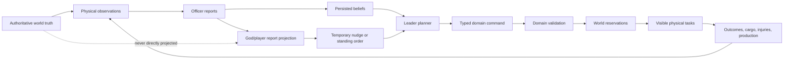
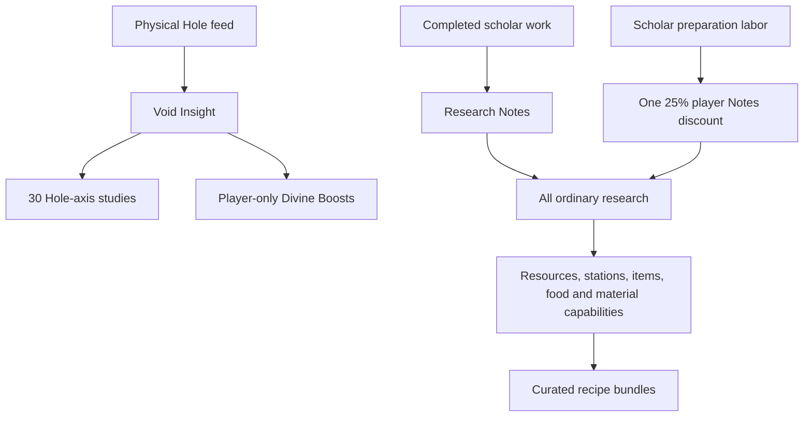
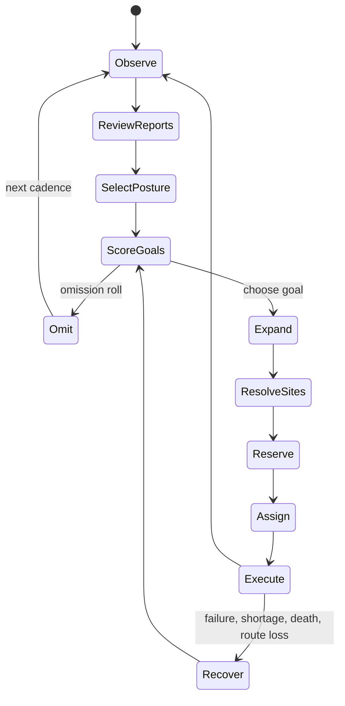
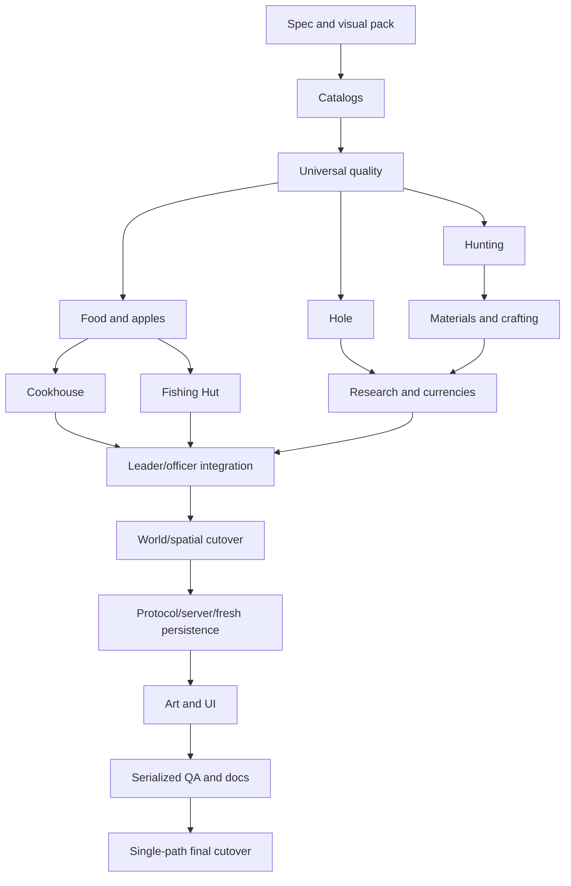

# Final Leader-AI, Hole, Hunting, Food, Quality, and Visual-System Plan

## 1. Summary and locked direction

Integrate the design, domain work, and assets from `the-shrine-upgrade` into the completed report-limited Leader AI. The old branch is a source of ideas, leaf rules, tests, and art—not a root-level merge authority.

This is pre-production:

- Completely remove Shrine, Favor, Blessings, scholar Insight, generic stored Food/Fish/Preserves, temporary Leader adapters, compatibility aliases, and semantic save migrations.
- Rename the feature internally and externally to `BlackHole` / **The Hole**.
- Recreate development databases and browser fixtures from empty state.
- Keep the new Leader/officer planner as the only strategic AI.
- Move all existing and new items, foods, resources, materials, creatures, recipes, augmentations, fixtures, and visuals into validated stable-ID catalogs.
- Treat every design explanation as an implementation requirement with code, documentation, visualization, and acceptance evidence.
- Use one dedicated board: additive cards LAI.35–LAI.52.
- Editing may be delegated through visible Orca tasks, but only one heavy build/test/browser process may run at once.

Existing baseline to audit before continuing:

- The source Hole and Hunting domains passed 31 focused tests in their original branch.
- The imported Hole and Hunting leaf domains currently pass 21 focused tests in this worktree.
- The drafted integration document and board must be updated with the final decisions below before further implementation.

## 2. Complete visual specification

### System architecture



The God sees the same report projection available to leadership. UI, errors, accessibility labels, logs, and protocol snapshots may not contain hidden executor truth.

### Visibility ladder

| Effective report level | Stock precision | Production/consumption | Regeneration/ecology |
|---|---:|---|---|
| 1 | ±40% | Hidden | Hidden |
| 2 | ±25% | Direction/trend | Hidden |
| 3 | ±12% | Coarse observed range | Hidden |
| 4 | ±5% | Numeric observed rate | ±25% estimate |
| 5 | ±2% | High-confidence rate | ±10% estimate |

Exact regeneration, fish replenishment, apple regrowth, and lair respawn remain server-only. The player never receives exact values merely for the client to hide.

### Currency and progression



There is no Favor, Blessings, generic research-point currency, or scholar Insight.

### Hole footprint

```text
R R R R R
R H H H R
R H H H R
R H H H R
R R R R R
```

- `H`: central 3×3 Hole work, upgrade, and delivery objective.
- `R`: permanent sixteen-tile paved road ring.
- The full landmark is always 5×5.
- Width, Depth, and Darkness never resize it.
- Hole tasks visualize the complete central 3×3 and the pinned delivery edge.
- Rendering uses the supplied 80×80 base plus cumulative Width, Depth, and Darkness layers.

### Workshop and Cookhouse tasks

```text
W W W       C C C
W W W       C C C
W W W       C C C
```

Every Workshop and Cookhouse task projects all nine ordered cells. A center-only marker is invalid.

### Fishing Hut and fishing source

Example east-facing placement:

```text
land footprint       water
H H H                 ~
H H D  d              ~
H H H                 ~
```

- `H`: complete 3×3 Fishing Hut footprint.
- `D`: dock-facing land cell.
- `d`: reserved oriented water attachment.
- Fishing work remains at the actual shoreline/water habitat, not at an arbitrary Hut tile.
- Construction visualizes the Hut footprint and dock attachment.
- Operation visualizes the real shoreline task, assigned fisher, rod, route, and cargo.

### Lair visualization

- Ten world sprites: levels 1–10, 11–20, …, 91–100.
- The sprite reveals only its ten-level band.
- Exact level requires a suitable scouting/Captain report.
- Selecting a revealed lair opens its encounter panel.
- Monsters exist visually inside that panel as twenty unique portraits; they do not roam the map.
- Exact stats, replenishment, and respawn remain report-limited.
- Creature drops each receive a unique icon.
- `EnemyLair` and Quarry `CaveEntrance` use visibly different sprites and task markers.

### Item visualization

Use layered inventory icons:

```text
item silhouette + material palette/texture
```

For the first implementation:

- Material visibly changes the icon.
- Quality and augmentation appear in the details panel as text, badges, effects, and provenance.
- Do not yet add quality frames or augmentation overlays to the icon.
- Preserve compositor extension points so item-specific quality/augmentation art can be added later.

### Required visual-spec package

Create a maintained `visual-spec` package containing:

- architecture and AI decision diagrams;
- report-visibility ladder;
- currencies/research/capability map;
- Hole feed and upgrade state machines;
- Hunting encounter and respawn timeline;
- food/quality/cooking flow;
- every task footprint and role map;
- panel wireframes;
- asset/state sheets;
- interaction and stale-action flows;
- implementation DAG;
- screenshot checklist and accessibility equivalents.

Every source diagram must have a rendered SVG/PNG version and descriptive text.

## 3. Unified content, inventory, and quality model

### Public types

Introduce strict stable IDs matching `[a-z][a-z0-9_]{0,63}`:

- `ContentId`
- `ResourceId`
- `FoodId`
- `ItemDefinitionId`
- `MaterialId`
- `CreatureId`
- `RecipeId`
- `CapabilityId`
- `ArtKey`
- `PhysicalLotId`
- `MaterialInstanceId`

Introduce:

```text
QualityBand = Crude(0) | Common(1) | Fine(2) | Superior(3) | Masterwork(4)
BulkLotKey = content_id + quality
```

The validated embedded content manifest owns:

- resources and acquisition/processing capabilities;
- foods, nutrition, spoilage, hydration, value, recipe bundles, and art;
- item shapes, behavior classes, slots, materials, functions, and art layers;
- creatures, levels, stats, loot, portraits, and lair bands;
- rare materials, uses, research, Hole gates, and values;
- stations, recipes, complexity, tools, fixtures, and outputs;
- augmentations and compatible item/fixture slots;
- research capability payloads.

Small Rust enums remain only for closed behavior classes such as equipment slot, item class, task category, station behavior, authority domain, and effect operation.

### Inventory representation

- All bulk physical stock is keyed by content ID and quality.
- Location remains physical: stockpile, station input/output, cargo, source, cache, or Hole.
- Exact equipment, furniture, tools, microscopes, augmentations, fixtures, and rare named drops retain stable instance IDs.
- `ItemInstance` references definition, material, quality, durability, location, reservation, equipment slot, and optional one augmentation.
- Each eligible item has one typed augmentation slot.
- Each eligible station/building has one typed fixture slot.
- Reserved, equipped, carried, broken, or incompatible items cannot be augmented.
- Cancellation, death, route loss, and restart conserve every input and output.

### Universal quality

Quality applies from initial gathering onward:

- Water, Apples, Fish, Meat, Bone, Hide, Logs, Stone, Grain, materials, intermediates, meals, tools, furniture, equipment, and creature drops all carry quality.
- Source richness, worker skill, tools, fixtures, station tier, ingredient quality, and deterministic keyed variation affect results.
- Quality is preserved through hauling, trade, reservations, Hole feeds, and persistence.

Quality multipliers:

| Quality | Food hunger/nutrition | Trade/Hole value | Item effect/durability |
|---|---:|---:|---:|
| Crude | 80% | 75% | 80% |
| Common | 100% | 100% | 100% |
| Fine | 120% | 130% | 115% |
| Superior | 145% | 170% | 135% |
| Masterwork | 175% | 225% | 160% |

Item-specific handlers decide which functional statistic quality affects. The detail panel must state the actual effect.

Production quality score:

```text
weighted input quality: quality × 1000
skill bonus:
  skill 0–19   = -500
  skill 20–39  = 0
  skill 40–59  = +250
  skill 60–79  = +500
  skill 80–94  = +750
  skill 95–100 = +1000
tool bonus:    (quality + 1) × 100, or 0 without a tool
fixture bonus: (quality + 1) × 100, or 0 without a fixture
station bonus: (tier - 1) × 125
complexity penalty:
  raw/simple = 0
  prepared   = 250
  complex    = 500
  feast      = 750
keyed variation: -250 through +250
```

Output thresholds:

- `<750`: Crude
- `750–1749`: Common
- `1750–2749`: Fine
- `2750–3749`: Superior
- `>=3750`: Masterwork

Gathering uses source quality instead of weighted input quality and omits the complexity penalty.

All calculations use fixed-point integers and deterministic RNG keys.

## 4. Resources, research, and recipe bundles

### Capability rules

- Raw Logs and raw Stone require no research.
- Water collection, Apple gathering, hand-fishing, and basic food handling are founding-owned capabilities.
- Every other resource, processed material, food source, item class, rare material, station, tool, fixture, and augmentation has one canonical capability study.
- Plank Processing is global: once owned, all compatible stations and construction projects can use the same Planks.
- Locked content may be discovered, looted, traded, or stored but cannot be processed, installed, augmented, crafted with, or fed to the Hole.
- The research-manifest count is derived and asserted from the canonical content catalog; the old 531/556 totals become historical.
- Ordinary studies cost Research Notes.
- Hole-axis studies and Divine Boosts cost Void Insight.

### Recipe unlock formula

Resources/materials own curated recipe bundles.

A recipe is available only when:

1. its station exists and its required station tier is owned;
2. all ingredient capabilities are owned;
3. its bundle-owning resource/material is owned;
4. suitable physical ingredients, tools, capacity, and workers exist.

There are no separate per-recipe research nodes.

### Complexity progression

| Tier | Ingredients | Hunger multiplier | Value multiplier |
|---|---:|---:|---:|
| Raw | 1 | 100% | 100% |
| Simple | 1–2 | 125% | 125% |
| Prepared | 2–3 | 150% | 160% |
| Complex | 3–5 | 180% | 210% |
| Feast | 5+ | 220% | 280% |

Quality multiplies these values afterward.

### Initial Cookhouse catalog

The Mill only converts Grain into Flour. Cooking, baking, preserving, and food brewing move to the 3×3 Cookhouse.

- Simple:

  - Baked Apples: 2 Apples + fuel → 2
  - Grilled Fish: 1 raw Fish + fuel → 1
  - Roasted Meat: 1 raw Meat + fuel → 1
  - Flatbread: 2 Flour + 1 Water + fuel → 2

- Prepared:

  - Apple Porridge: 2 Apples + 1 Grain + 1 Water → 3
  - Fish Stew: 2 Fish + 1 Water + 1 Herbs → 3
  - Meat Stew: 2 Meat + 1 Water + 1 Herbs → 3
  - Apple Preserves: 3 Apples + 1 Water + 1 Clay container → 3
  - Smoked Fish: 2 Fish + fuel + 1 Herbs → 2
  - Dried Meat: 2 Meat + fuel → 2

- Complex:

  - Apple Tart: 3 Apples + 2 Flour + 1 Water → 4
  - Herb-crusted Fish: 2 Fish + 1 Flour + 1 Herbs + 1 Water → 3
  - Meat Pie: 2 Meat + 2 Flour + 1 Herbs + 1 Water → 4
  - Surf and Turf: 2 Fish + 2 Meat + 1 Herbs + 1 Water → 4
  - Travel Rations: Dried Meat + Smoked Fish + Flatbread → 3

- Feast:

  - Festival Cake: 3 Apples + 3 Flour + Water + Brew + Catnip → 6
  - Hunter’s Feast: 3 Meat + 2 Fish + 2 Apples + 2 Herbs + Water → 8
  - Grand Lair Feast: 4 Meat + 4 Fish + 3 Apples + 3 Flour + 2 Herbs + Brew → 12

Manifest definitions own exact base nutrition, hydration, spoilage, weight, and value. Validation enforces that raw food is least effective and progression remains monotonic.

## 5. Apples, fishing, and founding guarantees

Every new colony generation must guarantee within its revealed founding area:

- at least one reachable Water source and valid bank;
- at least one Apple tree;
- at least one reachable fish habitat and shoreline work tile.

No starter food reserve replaces these sources.

### Apples

- Apple tasks exist only on exact Apple-tree tiles.
- Trees render empty, low, medium, and full states.
- Harvest lowers the visible state and creates physical quality-graded Apples.
- Regrowth is slow, deterministic, persisted, and processed once per world tick.
- Exact regrowth is report-limited.
- Apples support raw eating, Cookhouse recipes, trade, and Hole feeds.

### Fishing

- Hand-fishing is available at founding but deliberately slow and unreliable.
- An exact Fishing Rod independently improves catch/cycle performance and wears during fishing.
- A staffed Fishing Hut independently improves coordination, storage, and cycle performance.
- Hut plus rod grants the full combined improvement.
- The Hut never fabricates fish or replace the finite fish ecology.
- Fishing tasks remain on the valid shoreline/water source.
- Invalid nonshore Fishing Hut placement is rejected.

## 6. The Hole

Replace `BuildingType::Shrine` completely with `BuildingType::BlackHole`.

Domain invariants:

- Width, Depth, Darkness range 0–10.
- Width intake units per opening: `1 + width`.
- Depth maximum feed order: `10 × (1 + depth)`.
- Darkness gates resources, foods, items, rare materials, and item quality.
- Intake cadence: forty game minutes.
- One active feed pipeline and one active physical axis-upgrade project.
- Research spends Void Insight; construction spends only its physical recipe.
- Tools required from level 2, Metal from level 7, Gems at level 10.
- Rewards use integer micro-Void-Insight.
- Raw content gives the least reward; processing, recipe complexity, quality, item value, augmentation, and condition raise reward.

The Leader submits only believed candidates and ordered fallbacks. The Hole validates authoritative ownership, identity, quality, capability, Darkness, route, reservation, and amount.

A poor Leader may choose scarce food. The domain must not silently veto a real accepted feed because hidden survival stock is low. The resulting shortage must cause later visible recovery work.

## 7. Hunting Lairs

### Roster and loot

| Species | Levels | Meat | Hide | Bone | Named material | Hole gate/value |
|---|---:|---:|---:|---:|---|---|
| Cave Bat | 1–8 | 1 | 0 | 1 | Bat Wing | D1 / 0.25 |
| Red Fox | 5–18 | 12 | 2 | 1 | Fox Pelt | D2 / 0.5 |
| Badger | 10–24 | 18 | 3 | 2 | Badger Pelt | D3 / 1 |
| Wild Boar | 16–30 | 24 | 3 | 4 | Boar Tusk | D3 / 0.8 |
| Gray Wolf | 22–36 | 22 | 3 | 3 | Wolf Pelt | D4 / 1.2 |
| Lynx | 28–42 | 20 | 3 | 3 | Lynx Pelt | D4 / 1.5 |
| Great Stag | 32–46 | 35 | 4 | 5 | Stag Antler | D4 / 1.2 |
| Giant Serpent | 36–50 | 18 | 4 | 2 | Serpent Scale | D5 / 1.5 |
| Brown Bear | 40–54 | 30 | 6 | 4 | Bear Pelt | D5 / 2 |
| Great Eagle | 44–60 | 16 | 3 | 1 | Eagle Feather | D5 / 1.8 |
| Moon Stag | 40–60 | 40 | 5 | 5 | Moon Antler | D6 / 2.5 |
| Warg | 46–66 | 35 | 5 | 5 | Warg Fang | D6 / 2.8 |
| Cockatrice | 50–70 | 24 | 5 | 2 | Cockatrice Eye | D6 / 3 |
| Forest Troll | 56–76 | 50 | 10 | 8 | Troll Hide | D7 / 3.5 |
| Griffin | 62–82 | 45 | 7 | 6 | Griffin Plume | D7 / 4 |
| Basilisk | 68–88 | 35 | 8 | 5 | Basilisk Scale | D8 / 4.5 |
| Manticore | 74–92 | 55 | 9 | 8 | Manticore Barb | D8 / 5 |
| Chimera | 80–96 | 70 | 12 | 10 | Beast Core | D8 / 5 |
| Wyvern | 86–99 | 80 | 14 | 12 | Wyvern Membrane | D9 / 7.5 |
| Elder Dragon | 95–100 | 120 | 30 | 20 | Dragon Heart | D10 / 10 |

The Elder Dragon therefore yields dramatically more Meat and Bone than a Cave Bat.

### Encounter rules

- Levels 1–39: normal creatures only.
- Levels 40–60: normal/mystic mixtures.
- Levels 61–100: at least one mystic creature; normal supporters remain possible.
- Roster size:

  - 1 at levels 1–19
  - 1–2 at 20–39
  - 2 at 40–59
  - 2–3 at 60–79
  - 3 at 80–94
  - boss plus two supporters at 95–100

- Autonomous Leader: predicted success ≥70%; every hunter health ≥70%.
- Player nudge: predicted success ≥45%; every hunter health ≥80%.
- Player nudges still require the normal planner review and cannot force combat.
- `hunting_bulk` keeps its stable study meaning as **Hunting Parties**, party cap three.
- Exact equipped items supply combat bonuses and receive durability wear.
- Hunts award Hunting and Fight XP.
- Failure may injure or kill.
- Overflow creates a visible one-tile lair cache.
- Respawn stores one absolute game-time deadline.

### Rare-drop quality

- Levels 1–24: quality 0
- 25–49: quality 0–1
- 50–69: quality 1–2
- 70–84: quality 2–3
- 85–94: quality 3–4
- 95–100: quality 4

The roll key includes world seed, lair ID, generation, creature ID, and clear index. First clear guarantees the strongest creature’s primary drop at the band floor if ordinary rolls produced none.

## 8. Material processing, equipment, furniture, and research tools

Every named creature drop receives:

- a processing capability study;
- a raw and processed physical state;
- exact quality and provenance;
- at least one curated use;
- a Hole Darkness/value definition;
- icon and detail visualization.

Initial curated line:

- Tannery: pelts, hides, membranes, scales, eyes, hearts/cores, wings, feathers, antlers, tusks, fangs, and barbs.
- Clothier: treated-pelt/membrane clothing.
- Woodworking: pelt, antler, tusk, bone, feather, and scale furniture/fixtures.
- Smithy/Workshop: weapon, armor, and tool augmentations.
- Workshop/Research Hut/School: lenses, microscopes, and advanced instruments.
- No duplicate cloth workshop.
- Cookhouse and Fishing Hut are the only new stations introduced by this integration.

## 9. Leader and officer behavior



Ownership:

- Loremaster: Hole, Void Insight, Research Notes, research.
- Captain: Hunting Lairs, dangerous parties, defense.
- Farmer: Apples, fishing, food-days, Cookhouse supply.
- Craft officers: processing, tools, fixtures, augmentations.
- Founding Leader covers vacancies with reduced accuracy and increased omission.

Required behavior scenarios:

- Strong leadership chooses low replacement-cost Hole cargo.
- Weak leadership may choose scarce Apples, Fish, Meat, or meals from stale reports.
- Leaders/officers can forget a Hole feed for one or more reviews.
- The Hole remains endlessly eligible.
- Food depletion triggers physically located Apple, Fish, Hunt, farm, or Cookhouse recovery.
- Immediate defense/self-preservation may preempt before pickup.
- Picked-up cargo follows explicit delivery or salvage rules.
- Gods and planners use identical report-safe information.

## 10. Protocol, persistence, server, and UI

### Protocol

- Protocol version 3.
- Leader-AI snapshot schema version 2.
- Remove Shrine/Favor/generic-food variants.
- Add strict Hole, Void Insight, Notes, content-manifest, quality-lot, food, Hunting, rare-material, augmentation, fixture, Cookhouse, Fishing Hut, and visual-state snapshots.
- Add actions for:

  - `NudgeBlackHole`
  - `NudgeHuntingSite`
  - ordinary research purchase
  - labor-only preparation
  - Void-Insight boost
  - process material
  - queue Cookhouse recipe
  - augment exact item
  - install/remove fixture
  - place/configure Fishing Hut

Every mutation uses bounded idempotency and exact domain version lanes.

### Persistence

Because there is no production deployment:

- Remove semantic migration code.
- Remove compatibility IDs and aliases.
- Recreate the entire application database on the known incompatible schema, including local identities and fixture accounts.
- Initialize only the new schema.
- Unknown future or malformed new schemas fail closed.
- Regenerate the authoritative browser SQLite fixture, accounts, checksum, seed, protocol, and schema metadata.
- Domain state remains outside the Leader fingerprint.

### UI wireframes

Hole:

```text
┌ The Hole ───────────────────────────────┐
│ Width 4   Depth 3   Darkness 5          │
│ Void Insight: 12.500                    │
│ Report: Loremaster L3, 3h old           │
│ Believed next feed: Common Apples ×20   │
│ Reason: lowest reported replacement cost│
│ [Nudge priority] [View physical task]   │
│ Feed stage: hauling → center 3×3        │
└─────────────────────────────────────────┘
```

Lair:

```text
┌ Hunting Lair — Level band 51–60 ───────┐
│ Exact level: unknown / Captain report   │
│ [portrait] Moon Stag  [portrait] Bear   │
│ Predicted success: 72–84%               │
│ Party health gate: ready                │
│ Expected: Meat, Hide, Bone, rare drops  │
│ [Nudge hunt] [View party equipment]     │
└─────────────────────────────────────────┘
```

Food/Cookhouse:

```text
┌ Food and Cookhouse ─────────────────────┐
│ Food-days estimate: 3.2–4.1             │
│ Apples  Q0:12 Q1:18   slow regrowth     │
│ Fish    Q0:4  Q1:7    difficult by hand │
│ Meals sorted by spoilage and quality    │
│ Queue: Fish Stew — waiting for Herbs    │
│ Hut bonus: active   Rod: Fine, 61% wear │
└─────────────────────────────────────────┘
```

Item details:

```text
┌ Fine Metal Fishing Rod ─────────────────┐
│ Material icon layer: Metal              │
│ Quality: Fine                           │
│ Durability: 61%                         │
│ Augmentation: Warg Fang grip            │
│ Effect: +catch rate, +cycle speed        │
│ Provenance and current reservation      │
└─────────────────────────────────────────┘
```

The current Leader-AI UI remains the root. The deleted old research screen is not restored.

## 11. Art and asset deliverables

Create and validate:

- Hole base plus thirty cumulative axis layers;
- ten lair level-band world sprites;
- twenty creature portraits;
- twenty named material icons;
- Cookhouse 3×3 sprite/state sheet;
- Fishing Hut, four orientations, land/water dock, boat, idle/working states;
- Apple tree empty/low/mid/full states;
- existing farm stage variants;
- food icons for every raw and prepared food;
- item silhouettes and material palette layers;
- Fishing Rod, microscope, fixture, augmentation-detail icons;
- quality badges for detail panels;
- lair/quarry/task-marker differentiation;
- rail-cart/transport integration.

All visuals require:

- correct native pixel dimensions;
- transparency/bounds tests;
- deterministic art-key lookup;
- screenshot examples at gameplay zoom;
- accessibility label and textual fallback;
- asset-state matrix documenting the triggering authoritative field.

## 12. Documentation and “add anything” guidance

Expand the maintained documentation with:

1. Generic content decision tree: data-only addition versus new behavior handler.
2. Add a food source: ecology, regeneration, quality, task location, reports, recipes, AI, art, persistence, tests.
3. Add a resource/material: capability, quality, storage, recipes, Hole rules, trade, UI.
4. Add a recipe: bundle owner, ingredients, station tier, complexity, output quality, cancellation.
5. Add an item/tool/equipment/furniture definition.
6. Add an augmentation or fixture.
7. Add a creature/lair band/drop/portrait.
8. Add a workshop/station: 3×3 footprint, work slots, inputs/outputs, research, officers, UI, sprites.
9. Add a new Leader-AI topic: authority, observations, reports, beliefs, goal scoring, dependencies, command boundary, task, outcome, omission, diagnostics.
10. Add a report/hidden field without leaking truth.
11. Add a protocol action/version lane.
12. Add persisted state under the fresh-schema policy.
13. Add a panel or world visualization.
14. Add Playwright and visible-browser checkpoints.
15. Add board cards and evidence.

Every guide includes:

- stable IDs and manifests;
- deterministic ordering/RNG;
- authority and report redaction;
- physical identity/conservation;
- spatial objective/work/endpoint/route;
- capability/research dependencies;
- version and persistence behavior;
- diagnostics;
- focused, restart, campaign, and browser tests;
- visual assets and accessibility;
- rollback/removal procedure.

## 13. Implementation board

Use the additive LAI.35–LAI.52 board:

1. LAI.35 — finalize branch inventory, written/visual specification, explanation audit.
2. LAI.36 — unified catalogs and validators.
3. LAI.37 — universal quality and physical bulk-lot ledger.
4. LAI.38 — typed food, Apples, founding sources, hunger, spoilage.
5. LAI.39 — Cookhouse, recipe bundles, and cooking.
6. LAI.40 — Fishing Hut, rods, shoreline work, finite ecology.
7. LAI.41 — renamed Hole domain, footprint, feeds, axes, Void Insight.
8. LAI.42 — twenty-species Hunting domain and visuals.
9. LAI.43 — materials, crafting, augmentations, fixtures, microscopes.
10. LAI.44 — Research Notes, capabilities, manifest, boosts.
11. LAI.45 — Leader/officer integration and believable mistakes.
12. LAI.46 — spatial/world-tick/reservation integration.
13. LAI.47 — protocol v3 and schema v2.
14. LAI.48 — fresh database schema, fixture, server actions.
15. LAI.49 — layered world renderer and complete asset pack.
16. LAI.50 — Hole/Hunting/Food/Crafting UI and accessibility.
17. LAI.51 — diagnostics, serialized Rust/campaign/browser QA, contributor guides.
18. LAI.52 — delete all legacy paths and prove one authoritative system.



Orchestration requirements:

- Restore the Orca runtime before dispatching tracked workers.
- Every worker receives a visible task/dispatch ID and reports status/heartbeat/completion.
- Maximum three disjoint editing workers plus the coordinator.
- Only the coordinator grants the one heavy test/browser slot.
- Never describe untracked generic workers as Orca-orchestrated.
- If Orca remains unavailable, work proceeds sequentially and status is reported honestly.

## 14. Test and acceptance plan

All heavy commands are serialized with:

```text
CARGO_BUILD_JOBS=1
taskset -c 0-3
--test-threads=1
Playwright workers=1
```

Required groups:

- Catalog validation: IDs, references, cycles, handlers, art, order twins, strict decode.
- Universal quality: gathering, weighted recipes, tools/fixtures, partition/restart twins, no quality laundering.
- Hole: tables, exact cargo, rewards, upgrades, interruption, omission, scarce-food choice, restart.
- Hunting: all twenty species, mixing bands, sprite bands, portraits, loot scaling, quality, equipment wear, injury/death, respawn.
- Food: concrete foods only, nutrition, spoilage, quality, deterministic consumption, cooking tiers.
- Apples: correct tree tile, depletion, slow regeneration, secrecy.
- Fishing: founding hand-fishing, Hut-only, rod-only, combined bonus, real shoreline, finite habitat.
- Crafting: global Plank capability, full curated rare-material line, augmentation/fixture conservation.
- AI: hidden-truth twins, God/Leader report parity, good/bad choices, omission, recovery, officer vacancy/succession.
- Spatial: Hole 3×3/5×5, every station 3×3, Fishing dock, Apple, Fish, Lair, Quarry, Water, farm.
- Protocol/server: strict v3, old-client rejection, authorization, idempotency, version conflicts, no hidden leakage.
- Persistence: fresh initialization, full obsolete-schema reset, restart, multi-colony isolation, regenerated fixture.
- Visuals: art keys, dimensions, transparency, cumulative layers, ten lair bands, state transitions.
- UI/accessibility: keyboard, AccessKit, stale refresh, detail panels, task markers.
- Diagnostics: bounded phase timing, planner candidates/omissions, Hole stages, Hunt gates, food/cooking/ecology, progress heartbeat.
- Browser: Portless, real server/SQLite, one Playwright worker, screenshots and console/network evidence, then an independent visible-browser pass.

The 120-tick liveness probe must emit bounded periodic progress, current phase, task/reservation counts, and terminal cause so slow execution cannot look like a deadlock.

## 15. Final assumptions

- No production deployment or save compatibility exists.
- Full database and local fixture identities may be reset.
- The old Shrine identity does not survive.
- Generic Food is not stored; concrete food kinds are.
- Quality applies to every physical stock type.
- Material appearance is visible on item icons; quality and augmentation remain detail-only initially.
- Creature portraits appear only in the selected lair panel.
- World lairs use ten sprites based on ten-level bands.
- Exact lair level requires reports; the band is always visible.
- Apples and Fish are guaranteed renewable founding sources.
- Cookhouse and Fishing Hut are new 3×3 stations.
- Recipes are unlocked through ingredient bundles plus station tier, never separate recipe studies.
- All explanations, documentation topics, extension guides, diagrams, art, and browser evidence are required implementation work.
