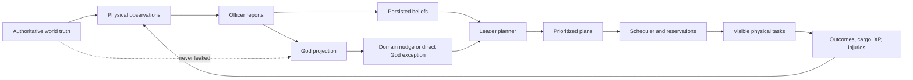
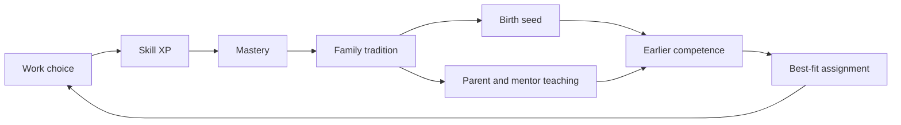
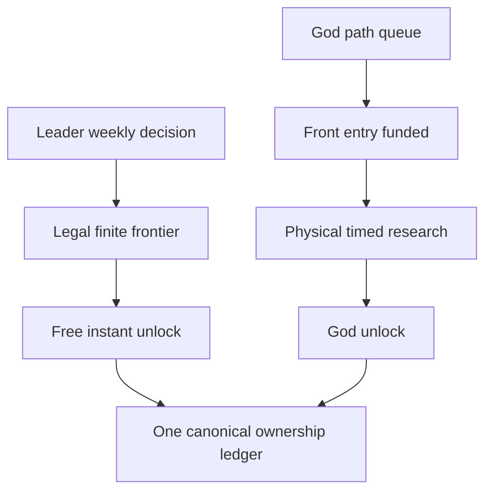

# Complete Leader-AI and `bug-gui-design` Integration Plan

## 1. Authoritative planning package

Before implementation, publish an additive, self-contained documentation set:

- Preserve [the first integration plan](/home/beasty/orca/workspaces/cat_idler/feature-new-leader-ai/docs/leader-ai-overhaul/final-hole-hunting-content-plan.md) unchanged as historical authority.
- Create `docs/leader-ai-overhaul/final-integrated-overhaul-plan.md` containing the complete combined design—not merely links or selected decisions.
- Expand [the branch-merge board](/home/beasty/orca/workspaces/cat_idler/feature-new-leader-ai/docs/branch-plan-merge/BOARD.md) with the real `bug-gui-design` branch inventory, dirty-file manifest, conflict matrix, requirement register, visual inventory, and implementation mapping.
- Create a dedicated `bug-gui-design` implementation board mapped additively to LAI.53–LAI.70. Never delete or compress LAI.35–LAI.52.
- Add a note-traceability register. Every user explanation records:
  - the complete intent and example;
  - why it matters;
  - affected simulation behavior;
  - UI/world visualization;
  - protocol/persistence consequences;
  - implementation card;
  - acceptance test or screenshot.
- Mark conflicts as keep, combine, replace, or supersede-with-reason. Never silently prefer newer code or shorten an earlier plan.
- Treat the three source commits and the branch’s uncommitted files as read-only design input. Integrate semantically; do not merge or cherry-pick hot roots wholesale.

### Intent guardrails

The integrated game must preserve these experiential goals:

- The Leader AI should resemble a strategy-game AI: it has many possible actions but must understand when, why, where, and how to use them.
- The Leader and officers act from observations, reports, beliefs, memory, priorities, personality, skills, and mistakes—not hidden executor truth.
- The Hole is the endless strategic pressure and primary score engine after village survival and growth.
- Good Leaders protect scarce resources and choose efficient plans. Poor Leaders may forget the Hole, reserve the wrong food, select a bad trade, repeat God research accidentally, or create real recovery work.
- Gods feel influential without directly controlling routine village placement or work.
- Over generations, professional families and institutions make the village resilient to the death of one expert.
- Every physical task has a truthful world location and complete footprint.
- Everything important is visible through the world, a screen, an inspector, a diagram, or an explicit report-safe explanation.

## 2. Unified authority and information model

- Retain the report ladder: stock uncertainty of approximately ±40/25/12/5/2%, flow information by level, and regeneration hidden until effective report level 4.
- Gods receive the same authorized report projection as leadership. Client hiding is insufficient; hidden regeneration and exact unavailable truth must not cross the protocol.
- Routine construction, placement, roads, zones, crops, storage, production, food permissions, worker assignment, and building upgrades remain Leader/officer decisions.
- Direct God actions are limited to:
  - God research queue and preparation;
  - Inspiration, Divine Boosts, construction miracles, and emergency aid;
  - one +10 election vote block;
  - personal-village diplomacy stance;
  - personal-village expulsion;
  - broad domain nudges;
  - development-only world reset.
- The Leader appoints and removes officers. The God cannot appoint them.
- Player nudges name a domain or building type, never an exact tile, zone rectangle, route, worker, storage pile, or construction site.

## 3. Cats, skills, professions, families, and governance

### Cat capability model

Expand the inherited 1–20 attributes to:

- Attack, Defense, Hunting, Medicine, Cleaning, Building, Leadership, Vision;
- Charisma;
- Intelligence.

Charisma has an inherited base plus learned social influence. Intelligence remains inherited but contributes to learning, technical judgment, research selection, appointments, and planning.

Use a data-owned learned-skill registry covering:

- gathering: Hunting, Fishing, Foraging, Farming, Waterwork, Woodcutting, Quarrying, Scouting;
- construction/logistics: Construction, Roadwork, Hauling;
- food: Milling, Cooking, Preservation, Brewing;
- industry: Woodworking, Crafting, Textiles, Tanning, Metalworking, Gemwork;
- care/service: Medicine, Cleaning, Teaching, Influence;
- martial/spiritual: Fighting, Training, Ritual;
- civic: Research, Trade, Diplomacy, Governance;
- seven office-associated proficiencies for Steward, Accountant, Forester, Farmer, Captain, Loremaster, and Cloth Leader work.

Every successful productive activity declares primary, secondary, office, and supervised-learning XP in the catalog. Blocked work, waiting, invalid routes, and failed fabrication grant nothing.

- One normalized productive work-hour or equivalent completed atomic cycle grants 1 primary XP.
- Secondary cross-training grants 25%.
- Supervised subordinate cross-training grants 10%.
- Physical haul legs retain their smaller trip-based gain.
- Skill level is `min(100, floor(sqrt(total_xp)))`.
- Total XP continues beyond 10,000.
- Direct output/speed effects clamp at level 100; post-100 Mastery XP affects legacy, teaching, and civic reputation only.
- Actual completed office duty remains the sole authority for report levels. Office knowledge, regeneration precision, and security clearance cannot be inherited.

### Officer and succession cross-training

- Leader work grants Governance primarily and domain-specific Diplomacy, Trade, Research, Command, or Influence secondarily.
- Every officer earns its office proficiency and 25% Governance XP.
- Steward duty cross-trains Construction, Roadwork, and Hauling.
- Accountant duty cross-trains Trade and administration.
- Forester duty cross-trains Woodcutting, Quarrying, and Foraging.
- Farmer duty cross-trains Farming, Cooking, and Preservation.
- Captain duty cross-trains Fighting and Training; supervised fighters gain some Command knowledge.
- Loremaster duty cross-trains Research, Teaching, and Ritual.
- Cloth Leader duty cross-trains Textiles, Tanning, and Crafting.
- Workers supervised by an officer gain related professional knowledge but not report clearance.
- This creates viable successors before the current Leader or officer dies.

### Labor priorities and refusal

Assignment is lexicographic:

1. Emergency;
2. Leader priorities 1–5;
3. Background;
4. within the selected tier: Family Enterprise → Loved → Preferred → Neutral → Disliked;
5. skill, attributes, continuity, route length, and stable IDs break remaining ties.

Each cat has a visible Loved/Preferred/Neutral/Disliked/Refused labor profile derived mainly from personality, with family tradition, experience, injuries, and acquired traits contributing.

- Refused labor is always ineligible, including emergencies.
- Missing or unusable body parts independently block incompatible work.
- Prosthetics may restore sufficient eligibility.
- A cat may still flee, eat, or drink for personal self-preservation; that does not authorize forced village labor.

Ambient cleaning:

- is invisible background movement;
- never appears as a job, task, marker, or log event;
- yields immediately to real work;
- grants 0.01 Cleaning XP per completed ten game-minutes;
- has a keyed 5% chance to grant 0.05 XP to one trait-compatible, non-refused skill;
- can therefore very slowly expose an unexpected Governance or professional aptitude.

### Family knowledge and professional dynasties

At birth, a keyed lineage roll selects:

- 30% first parent’s professional seed;
- 30% second parent’s seed;
- 12.5% blended seed;
- 12.5% both seeds;
- 15% no professional seed.

A single-parent seed transfers 5% of relevant parent XP. A blend transfers 2.5% from each. Both-seed children receive the applicable 5% from each tradition. Starting XP is capped at 625 per skill, equivalent to level 25.

- Innate aptitude is inherited separately through the attribute system.
- Personality remains individually generated except for the explicitly inherited Relational ↔ Analytical axis.
- Acquired life traits are not genetic.
- Family tradition grants a 10% learning bonus in its profession.
- Apprentices working beside a parent or assigned mentor receive a 25% mentoring addition to ordinary XP.
- Formal teaching grants XP based on mentor level and bounded post-100 Mastery; it never subtracts XP from the teacher.
- The teacher gains Teaching XP.

A family tradition becomes mature after two genetically linked generations each reach level 50 in the same professional family and jointly complete at least 200 successful work units in that domain. A station profession also requires sustained work at one physical enterprise.

A mature tradition may create a localized occupational surname and named enterprise:

- Miller/Müller, Smith, Baker, Weaver, Fisher, Hunter, Carpenter, Scholar, and equivalent catalog entries;
- English is displayed now, but all names use localization keys;
- both parental lineages remain distinct when cats partner;
- adults retain their surname and tradition;
- ancestry always records both;
- a child may carry either surname independently of whether it follows that profession;
- descendants who leave the trade remain part of the family but may eventually found a new professional branch.

Named family enterprises do not privately own colony goods. They establish worker preference, mentoring, history, signage, and UI identity.

### Partnerships, mentoring, and housing

Cats form persistent partnerships autonomously using:

- non-kin eligibility;
- inherited attributes;
- skills and profession;
- personality compatibility;
- Relational ↔ Analytical values;
- family traditions;
- housing availability;
- deterministic preference.

Close ancestors/descendants and close siblings are excluded. The God cannot arrange marriages.

Housing progression:

- Den: five single/flexible early-game beds;
- Family Home: two partnered adults plus up to four dependent Kitten/Young cats;
- Elder Lodge: eight elder beds;
- Nursery: childcare and early teaching, not permanent beds.

Family Homes unlock near the end of the early game. Elder Lodges unlock later.

- Pregnant/parenting households receive Family Home priority.
- Empty-nest households may return to flexible Dens when pressure requires it.
- Elders move to a Lodge when eligible capacity exists, freeing Family Homes.
- Elders continue working until death.
- Elder Lodge residents receive social recovery, improved mentoring, and reduced old-age death hazard.
- Building level/research raises protection but never grants immortality.

Teaching cadence:

- A parent with a living dependent child receives one persisted teaching obligation after every three completed real work tasks.
- Emergency work may defer but not erase it.
- Assigned non-parent mentors teach before falling back to ambient cleaning.
- Teaching is a visible physical task at a Family Home, Nursery, School, office, or enterprise.

### Elections and officers

Add the ninth inherited personality axis: Relational ↔ Analytical.

Election candidates are the top five eligible Adults/Elders by civic merit:

- 25% Governance skill;
- 20% inherited Leadership;
- 15% effective Charisma;
- 15% Intelligence;
- 10% office breadth;
- 10% leadership/service record;
- 5% leadership-relevant traits.

Every Adult/Elder resident casts one cat ballot.

- Relational voters strongly emphasize Charisma, care, trust, social conduct, and compatible traits.
- Analytical voters strongly emphasize Governance, Intelligence, office experience, skill, and results.
- Intermediate personality values interpolate in fixed-point arithmetic.
- Deterministic keyed variation prevents every voter from producing an identical ranking.
- Ties use civic merit, then Governance, then stable cat ID.

God influence:

- each eligible authenticated global player may add exactly +10 votes to one candidate per election;
- the personal-village owner may add +10 in that village;
- the latest selection from the same player replaces their earlier selection;
- the God does not directly appoint the winner.

Keep scheduled and snap elections. Leader death or expulsion opens a snap election.

The Leader appoints officers using report-safe candidate information and may make poor appointments. Candidate Intelligence, profession, office skill, traits, experience, and believed merit affect selection.

Personal-village expulsion supports:

- selected adult only;
- whole household.

Dependent kittens may leave only with a guardian. Expulsion resolves jobs, office, election consequences, residence, family enterprise role, carried cargo, reservations, and owned/equipped items before physical departure.

## 4. Construction, storage, spatial work, and village automation

### Three-stage construction

Apply this pipeline to:

- every new building;
- physical building upgrades;
- Hole upgrades.

Roads, walls, farms, zones, and containers retain their own physical work sequences.

Rules:

- Basic scaffolds accept raw Wood; developed buildings/upgrades require Lumber or Planks.
- Every stage owns persisted required/delivered/in-transit/consumed state.
- A later stage cannot begin before its own physical cargo arrives.
- Every building has catalog-defined structural and fit-out materials.
- Basic homes still need bedding/cloth/woodwork.
- Advanced buildings introduce tools, fixtures, refined materials, metal, and gems.
- Building upgrades retain total duration `8 game-hours × (target_level − 1)^1.25`, divided 20/60/20.
- Death, refusal, route loss, cancellation, restart, and replacement builders conserve cargo and progress.
- Scaffold and partial-structure stages require dedicated custom sprites. Fit-out requires a visible overlay/state.
- The inspector shows stage, full footprint, workers, original/current duration, delivered/in-transit/missing inputs, click aid, and bounded blocker.
- Research is only a permit. The Leader chooses the exact building and timing.

### Truthful tasks and footprints

- Hunting tasks use the specific Hunting Lair.
- Water tasks use a valid water source/bank.
- Apple work uses the complete Apple-tree footprint.
- Fishing uses valid shoreline/water habitat and dock orientation.
- Quarrying uses its quarry/cave site.
- Farm work uses the plot.
- Construction highlights the complete building footprint.
- Workshop work and inspection cover the entire 3×3 area.
- No generic/fallback task marker is permitted.
- Only open physical tasks receive markers.
- Selecting a Council task focuses and highlights its exact site/route/footprint.

### Storage and containers

- Storage is a world zone.
- Each ordinary storage tile has four visible loose-stack slots.
- A container occupies one visible slot and preserves physical internal lots, quality, provenance, reservations, and stable item IDs.
- Initial catalog:
  - Basket: food/herbs/fibre, four internal lots;
  - Barrel: one compatible liquid/food kind, eight internal lots;
  - Crate: one compatible bulk material kind, eight internal lots;
  - Chest: up to sixteen compatible unique/small items;
  - Rack: up to eight tools, weapons, or long items.
- Fullness has visible states and truthful inspection.
- Containers never become aggregate invisible capacity.
- The Leader/Steward designates an adjacent stockpile zone for workshop inputs. It is not an invisible station buffer and is not placed inside the Workshop footprint.
- Haulers and production use the exact linked zone and containers.
- Missing/blocked inputs create physical hauling work with exact endpoints.

### Farms, roads, walls, and automation

- Farms are world plots with visible crop stages and Leader-assigned crops.
- Roads are authored routes with reserved material, visible route previews, physical labor, and completed street tiles.
- Walls occupy tiles and are impassable; gates are the only crossing.
- The Leader autonomously chooses zones, crops, containers, road routes, walls, production queues, workshop-input zones, and maintenance.
- God controls only broad priorities/nudges.
- Village demand outranks Hole work. Once survival, defense, and active village plans are adequately staffed, free labor returns to useful Hole dependencies rather than generic ritual work.

## 5. Research and progression

Use the GUI branch’s full-screen graph, durable queue, timed study work, repeatables, and physical building-level permits as the base. Integrate every current Leader-AI capability and Hole requirement into that system.

### Canonical graph

- Preserve every meaningful source technology/effect.
- Remove Shrine/Favor/generic-food/coin/duplicate-authority technologies.
- Add typed food, Hunting Lairs, quality, materials, family institutions, housing, construction phases, containers, barter, and Hole capabilities.
- Recompute raw-node, track, projected-node, and junction totals from the canonical catalog. Historical 495/88/228 and 531 totals remain documentation evidence, not asserted final totals.
- Maintain at least 24 visible multi-input AND junctions.
- Keep the eight curated convergence junctions.
- Keep all 14 global modifier tracks:
  - explicit levels 1–10;
  - separate infinite level-11 terminal;
  - repeatable cost doubles from the final finite cost.
- No zoom; fixed-scale graph with drag panning and region-owned scrolling.

### Two independent research lanes

Leader lane:

- free and instant;
- no Notes, Void Insight, scholars, building, queue slot, or timer;
- one guaranteed unlock per rolling seven game-days without a Loremaster;
- effective Loremaster levels 1–5 allow 1/2/2/3/4 total free unlocks per rolling seven game-days;
- always prerequisite-ready;
- must finish all finite research before selecting any repeatable;
- selection remains report-, need-, Intelligence-, personality-, and skill-aware.

The Leader normally excludes the God lane’s funded/in-progress target and down-ranks queued targets according to estimated queue time.

It may duplicate only when:

- reports indicate the village urgently needs the capability before God research will finish; or
- an expertise/Intelligence error roll causes an “oopsie,” using 25/12/5/1/0% error bands.

An intentional override and accidental duplicate have distinct events/UI explanations.

God lane:

- direct path selection queues all missing prerequisites topologically;
- maximum 64 entries;
- spends and freezes cost only at the front;
- ordinary studies cost Research Notes;
- Hole-axis studies cost Void Insight;
- requires physical staffed research infrastructure and elapsed study work;
- funded progress persists across reorder, disconnect, restart, and offline catch-up;
- reordering cannot cross prerequisites;
- removing a node removes dependent queued descendants and refunds funded removed currency;
- partial labor is lost on cancellation;
- if the Leader instantly unlocks its funded target, refund the frozen currency only; research and preparation time are lost.

Preparation:

- physical scholar work equal to 25% of the study’s frozen duration;
- no third currency;
- never stacks or expires;
- only a player-started purchase consumes its 25% discount;
- AI/free Leader research never consumes it.

Physical building levels remain 1–10. The Leader, not the God, initiates the phased upgrade after its research permit exists.

## 6. Hole, divine control, food policy, and rescue

Preserve the complete Hole/Hunting/Food/Quality plan, including:

- 5×5 Hole landmark;
- central 3×3 work area;
- Width/Depth/Darkness 0–10;
- forty-game-minute intake cadence;
- physical feeds and one feed pipeline;
- replacement-cost-aware good choices and believable poor choices;
- twenty Hunting Lair creatures;
- typed food, Apples, Fish, Meat, Cookhouse, quality, materials, fixtures, and augmentations;
- exact regeneration hidden until officer report capability permits it.

### Leader food permission list

Every edible definition has a Leader-controlled state:

- Allowed: routine eating;
- Reserve: used only when ordinary nutrition is insufficient;
- Forbidden: protected until no permitted edible alternative remains.

The God may nudge overall conservation but cannot directly edit individual entries.

The Leader reasons from reports and can reserve the wrong item or update late. Divine Rations default to Reserve. Lethal starvation permits cats to consume physically available forbidden food rather than die beside it.

### Ordinary divine clicks

- Base Log unit requires 100 accepted clicks.
- Another eligible unit requires  
  `ceil(100 × canonical_value(unit) / canonical_value(Log))`.
- Rare creature materials, completed equipment, fixtures, and augmentations are ineligible.
- Generated cargo is physical, provenance-tagged, bound to its construction/emergency purpose, and cannot be traded or fed to the Hole.
- Every accepted construction click removes one second from the active labor stage and advances the selected bound-resource meter.
- Input methods are discrete mouse, touch, or keyboard presses.
- Client batches counts every 100 ms.
- Server accepts 20 clicks/second/player with a bounded short burst.
- Global players contribute to one shared target meter.

### Inspiration

Each player has an independent free Inspiration action:

- +10% effective cat stats;
- 15 real minutes;
- 60 real-minute per-player cooldown;
- no same-player stacking;
- global players’ active stacks add together without a shared cap;
- no permanent mutation of genes, age, traits, skill XP, office expertise, or report access.

### Void Insight miracles

Construction miracle:

- costs exactly 1 Void Insight per press;
- may be pressed repeatedly;
- creates exact missing bound construction input value equal to twice the canonical Hole feed value needed to earn one Void Insight;
- removes 10% of the construction project’s original total duration;
- fills the earliest incomplete stage first;
- cannot overfill, return to stock, trade, or feed the Hole.

Emergency supplies:

- ordinary emergency click meter creates one Divine Ration or Divine Water;
- each unit restores one cat’s relevant need to 100%;
- neither expires;
- both appear physically on the Hole delivery apron;
- emergency hauling has very high priority;
- no stock cap;
- Divine Rations are normally Reserved by the Leader.

Spending 1 Void Insight on emergency food creates `2 × current living resident count` Divine Rations. The water action creates the same number of Divine Water units. Repeated presses are allowed. This population bundle supersedes the general double-feed-value calculation for food/water rescue only.

Rescue controls appear only from report-safe evidence that residents are dying from hunger or thirst.

## 7. Diplomacy and barter trade

Personal-village Diplomacy is a village list with radio choices:

- Alliance;
- Neutral;
- Enemy.

Current behavior is trade-only:

- Alliance and Neutral are functionally identical for now;
- Enemy excludes that village from outbound destination selection;
- a destination that marks the sender Enemy rejects before dispatch;
- no caravan, escrow, or exchange is created on rejection;
- Alliance remains stored for future systems but must be labeled honestly as currently equivalent to Neutral;
- the global village is locked Neutral toward everyone.

Remove money completely from all player, village, NPC, and caravan trade.

- No coins, purses, monetary prices, or currency settlement.
- All trade is physical material/resource/food/item barter.
- Canonical value exists only for comparison, fairness, Hole value, construction aid, and AI scoring.

The Leader decides whether the village needs:

- a possible trade now: favor close, fast, safe fulfillment;
- a better trade: tolerate distance and time for stronger barter value or unique goods.

Route scoring uses report-safe:

- source needs;
- destination offerings;
- quality and item utility;
- expected exchange value;
- distance market premium;
- travel time;
- route risk;
- carrying cost;
- opportunity cost.

Contracts retain physical reservation, escrow, haulers, routes, delivery, return, stranding, death/refusal recovery, and restart conservation.

## 8. GUI, world visualization, and responsive design

### Navigation

Exactly one routed primary screen is visible:

- Log;
- Stores;
- Village;
- Research;
- Council.

Top bar also contains Center Village and connection/session state.

Council tabs:

- Plans;
- Tasks;
- Cats;
- Hole;
- Diplomacy;
- Trade.

No Map, Help, Dispatches, moving ticker, or letter-key screen openers. Escape returns to the world according to centralized surface priority.

### Screen responsibilities

- Log: complete authoritative event history and filters.
- Stores: report-safe zones, filters, linked workshop input zones, containers, internal lots, capacity, food permissions, hauling, and blockers.
- Village: demographics, employment, households, housing pressure, partnerships, family traditions, enterprises, elections, officers, and succession.
- Research: left catalog/queue, central graph, right inspector; separate visible Leader and God lanes.
- Council/Plans: top plans, dependencies, priority, beliefs, omissions, officer requests, and rationale.
- Council/Tasks: open/assigned physical tasks linked to exact world geometry.
- Council/Cats: full DF-style cat record with attributes, skills, Mastery XP, affinities/refusals, anatomy, equipment, stress, office history, family tree, mentors, tradition, enterprise, residence, elections, and personal history.
- Council/Hole: feed pipeline, axes, Void Insight, Inspiration, boosts, rescue, miracles, and report-safe rationale.
- Council/Diplomacy: village radio list and bounded rejection state.
- Council/Trade: barter proposals, offerings, posture, escrow, route, caravan, cargo, stages, and recovery.

### Start screen

Retain the source branch’s aspirational off-map showcase, updated for the integrated design:

- roughly two-year mature village;
- one central 5×5 Hole, never duplicate Shrines;
- 42+ lots, 18+ building types, farms, storage yards, roads, walls, family homes, Elder Lodge, Cookhouse, Fishing Hut, enterprises, and defenses;
- 60 independently phased cats;
- no snapshot, server action, simulation tick, save, or selection mutation;
- global and personal destination cards;
- no automatic entry;
- English copy with localization-ready keys;
- wide charter beside the showcase and compact centered charter;
- complete focus, scroll, disabled, connection, and error states.

### Visual package

The stored implementation plan must include Mermaid diagrams, annotated wireframes, state matrices, and asset sheets for:

- authority/report flow;
- AI planning and task execution;
- family/mentorship/profession loop;
- work-priority matching;
- housing transitions;
- elections;
- both research lanes;
- research graph overview/focus;
- three construction stages;
- storage/container internals;
- food permission and divine rescue flow;
- Hole feed/miracle flow;
- diplomacy/trade routing;
- all five primary screens and six Council tabs at wide/compact sizes;
- task markers and complete footprints;
- every sprite state, icon, portrait, quality badge, container fullness, crop stage, construction phase, and family-enterprise sign.

Supported layouts:

- 1024×768;
- 1280×800;
- 1920×1080;
- 2560×1440;
- 3840×2160;
- UI scales 100%, 115%, and 130%;
- native and WASM;
- phones remain out of scope.

Use the existing parchment, wood, dark-forest worktable, solid-panel, semantic pixel-icon visual language. No glassmorphism, generic dashboard tiles, excessive pills, glow, or decorative gradients.

## 9. Public interfaces, persistence, and cutover

Add canonical public types for:

- expanded attributes and learned-skill XP;
- labor affinities/refusals;
- office duty and report expertise;
- partnerships, households, residence assignments, mentors, family traditions, surnames, and enterprises;
- construction stage and per-stage cargo;
- containers and internal lots;
- dual research lanes;
- Leader research decisions and duplicate reasons;
- food permission state;
- Divine Ration/Water provenance;
- Inspiration and miracles;
- election cat ballots and God vote blocks;
- village stance and barter posture.

Add authenticated/versioned actions for:

- God research queue, reorder, removal, and preparation;
- Inspiration and specialized Divine Boosts;
- batched divine clicks;
- construction and emergency Void miracles;
- candidate backing;
- personal-village stance;
- individual/household expulsion;
- broad domain nudges;
- test-only reset.

Do not expose direct actions for exact construction, placement, road routes, crop plots, storage zones, production queues, worker assignment, food lists, or officer appointments.

- Regenerate the protocol/schema version.
- Use strict bounds, expected versions, idempotency IDs, and typed errors.
- This is pre-production: create a fresh schema and fixtures rather than semantic migrations.
- Production builds hide/disable reset and server-side reject it.
- Test builds use signed reset with two-step confirmation.
- Remove Shrine, Favor, Blessings, generic Food/Fish/Preserves, scholar Insight, coins, player ballots, direct building upgrades, exact-regeneration snapshots, and obsolete UI routes.
- End with exactly one authority for each planner, currency, research lane, inventory, food, trade, construction, task marker, protocol field, and UI screen.

## 10. Additive implementation board

Append these cards without removing LAI.35–LAI.52:

1. LAI.53 — Archive `bug-gui-design`, complete requirement/intent/conflict/visual registers.
2. LAI.54 — Unified UI shell, router, start showcase, responsive/layout primitives.
3. LAI.55 — Expanded attributes, skills, XP catalog, affinities, refusals, and anatomy eligibility.
4. LAI.56 — Partnerships, households, family housing, Elder Lodge, lineage, mentorship, traditions, surnames, and enterprises.
5. LAI.57 — Cat ballots, God +10 blocks, Leader officer appointments, succession, and expulsion.
6. LAI.58 — Unified research graph, God queue, free Leader lane, preparation, repeatables, and building permits.
7. LAI.59 — Three-stage construction, per-stage cargo, upgrades, clicks, and sprites.
8. LAI.60 — Storage zones, containers, linked workshop stores, farms, roads, walls, and exact spatial markers.
9. LAI.61 — Leader food permissions, Divine Rations/Water, Inspiration, boosts, and miracles.
10. LAI.62 — Neutral/Alliance/Enemy UI, material barter, route posture, contracts, and coin removal.
11. LAI.63 — Leader/officer integration for skills, families, housing, research, construction, food, and trade.
12. LAI.64 — Protocol/schema/action/redaction cutover.
13. LAI.65 — Fresh SQLite persistence, fixtures, reset, and restart.
14. LAI.66 — Log/Stores/Village primary screens.
15. LAI.67 — Research and Council primary screens/tabs.
16. LAI.68 — World rendering, task geometry, construction/family/storage assets, accessibility.
17. LAI.69 — Diagnostics, extension guides, synchronized design docs, and serialized browser matrix.
18. LAI.70 — Legacy deletion, full traceability audit, single-path cutover, and final acceptance.

Hot roots receive one integration owner at a time. Editing may be delegated only after valid Orca orchestration returns, but all builds, tests, and browser sessions remain serialized.

## 11. Extension documentation

Provide copyable contributor procedures for adding:

- a skill, XP source, secondary cross-training rule, or refusal mapping;
- an inherited attribute or personality axis;
- an officer or authority domain;
- a family tradition, occupational surname, enterprise, housing type, or mentorship site;
- a building/workshop with footprint, phase recipes, work slots, linked storage, production, research track, UI, and sprites;
- a container or storage compatibility class;
- a food, permission behavior, recipe, spoilage rule, or divine restriction;
- a technology family, convergence junction, repeatable track, or live effect;
- a Hole resource/food/item gate;
- a creature, Hunting Lair band, drop, portrait, or injury rule;
- a report-safe field and expertise gate;
- a task with exact site, footprint, route, cargo, marker, and inspector;
- a protocol action, persisted state, panel, icon, sprite state, test, diagnostic, and board card.

Every guide covers stable IDs, deterministic ordering/RNG, authority, report secrecy, physical identity, conservation, persistence, diagnostics, focused tests, restart/campaign/browser evidence, accessibility, and removal.

## 12. Verification and acceptance

Testing is intentionally serialized.

- Add bounded diagnostic logging before long campaigns:
  - phase entry/exit;
  - planner candidates and omissions;
  - priority/matching decisions;
  - skill/teaching/family transitions;
  - election scores and ballots;
  - research lane selection/collision/refund;
  - construction stage/cargo;
  - divine click/miracle accounting;
  - trade route/posture/contract;
  - UI action envelope and rejection.
- Run one focused command at a time with one Rust test thread and constrained Cargo jobs.
- Do not run parallel workspace tests or parallel browsers.
- No live AI provider calls.

Required simulation tests include:

- every activity grants only catalog-declared XP;
- blocked work grants none;
- level-100 effect cap and post-cap Mastery;
- cross-training without inherited report clearance;
- keyed 30/30/12.5/12.5/15 family seed distribution;
- parent teaching after three tasks;
- mentor-before-cleaning;
- family tradition and surname formation;
- urgency-first and personal-priority matching;
- Refused/injury/anatomy exclusion;
- housing allocation and Elder Lodge longevity;
- autonomous partnerships and kin exclusion;
- candidate slate, Relational/Analytical ballots, +10 vote blocks, snap succession;
- poor/good officer appointments;
- three construction stages, restart, cancellation, and cargo conservation;
- full-footprint markers for Workshop and construction;
- container internal-lot conservation;
- linked workshop input hauling;
- physical farms, roads, walls, and gates;
- free Leader research cadence and finite-first rule;
- God queue funding, preparation, cancellation, duplicate refund, and repeatables;
- report-safe food permissions and mistakes;
- click ratios, rate limits, bound cargo, Inspiration stacking, miracles, and 2× population rescue bundles;
- material-only barter, Enemy rejection, close-vs-profitable posture, escrow, route failure, and restart;
- no exact regeneration leakage at report levels 1–3;
- no generic food, coins, Shrine, Favor, Blessings, or duplicate authority remaining.

Browser acceptance uses the real client/server/fresh SQLite fixture through Portless and shipped controls:

- one Playwright worker;
- then one independently visible browser audit;
- start screen, world, five primary screens, six Council tabs;
- research overview/focus/queue/two lanes;
- construction phase sprites and whole footprints;
- Stores containers and workshop zones;
- Village families/housing/elections;
- Cat family tree/mastery/refusal/anatomy;
- Hole clicks, Inspiration, miracles, and rescue;
- diplomacy radio list and barter routes;
- 1024×768 through 4K at 100/115/130%;
- native and WASM;
- keyboard, mouse, trackpad, scroll ownership, Escape behavior, accessibility labels, console, and network checks.

Final acceptance requires every requirement-register row to map to implemented behavior, documentation, a visual artifact, and evidence. No card closes from a type or unit test alone.
