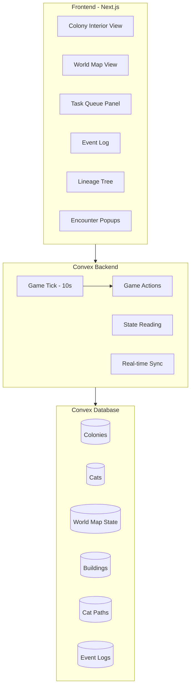

# Cat Colony Idle Game - Complete Design Document

## Overview

A real-time idle game where a cat colony runs autonomously. Users can help by providing food, defending against intruders, voting on leaders, and building upgrades. The colony can thrive or die based on management - but it runs completely on its own when no one is watching.

**Key Principles:**
- Colony runs 24/7 automatically via server-side game tick
- Users can help but aren't required
- Real consequences: cats can die, colony can collapse
- New colony starts when old one dies

---

## Architecture



---

## Core Data Models

### Colony

```typescript
interface Colony {
  _id: Id<"colonies">;
  name: string;                    // Set by first user after death
  leaderId: Id<"cats"> | null;     // Current leader
  status: "starting" | "thriving" | "struggling" | "dead";
  
  resources: {
    food: number;        // Consumed by cats
    water: number;       // Consumed by cats
    herbs: number;       // For healing
    materials: number;   // For building
    blessings: number;   // Premium currency (earned via sacrifices)
  };
  
  gridSize: number;      // 3, 5, or 8 (colony interior size)
  
  createdAt: number;     // Timestamp
  lastTick: number;      // Last game tick timestamp
  lastAttack: number;    // Last major attack timestamp
}
```

### Cat

```typescript
interface Cat {
  _id: Id<"cats">;
  colonyId: Id<"colonies">;
  name: string;
  
  // Lineage
  parentIds: [Id<"cats"> | null, Id<"cats"> | null];
  
  // Timing
  birthTime: number;     // Timestamp
  deathTime: number | null;
  
  // Stats (0-100 each, can grow via learning)
  stats: {
    attack: number;      // Combat offense
    defense: number;     // Combat defense
    hunting: number;     // Food gathering efficiency
    medicine: number;    // Healing ability
    cleaning: number;    // Camp maintenance
    building: number;    // Construction speed
    leadership: number;  // Task assignment quality
    vision: number;      // Spot dangers on world map
  };
  
  // Needs (0-100, decay over time)
  needs: {
    hunger: number;      // Eat food to restore
    thirst: number;      // Drink water to restore
    rest: number;        // Sleep to restore
    health: number;      // Only decreases from injury/illness
  };
  
  // State
  currentTask: TaskType | null;
  position: {
    map: "colony" | "world";
    x: number;
    y: number;
  };
  
  isPregnant: boolean;
  pregnancyDueTime: number | null;
  
  // For sprite rendering
  spriteParams: object | null;
}
```

### Building

```typescript
interface Building {
  _id: Id<"buildings">;
  colonyId: Id<"colonies">;
  
  type: BuildingType;
  level: number;         // 0-3
  position: { x: number; y: number };
  
  constructionProgress: number;  // 0-100, 100 = complete
}

type BuildingType = 
  | "den"           // Starting building, sleeping
  | "food_storage"  // Increases max food
  | "water_bowl"    // Reduces water trips
  | "beds"          // Faster rest recovery
  | "herb_garden"   // Passive herb generation
  | "nursery"       // Kitten survival bonus
  | "elder_corner"  // Teaching effectiveness
  | "walls"         // Defense bonus
  | "mouse_farm";   // Passive food generation
```

### WorldTile

```typescript
interface WorldTile {
  _id: Id<"worldTiles">;
  colonyId: Id<"colonies">;
  
  x: number;
  y: number;
  type: TileType;
  
  resources: {
    food: number;    // Depletable
    herbs: number;   // Depletable
    water: number;   // Infinite at rivers
  };
  
  maxResources: {
    food: number;
    herbs: number;
  };
  
  dangerLevel: number;   // 0-100
  pathWear: number;      // 0-100, higher = safer road
  
  lastDepleted: number;  // For regeneration timing
}

type TileType = 
  | "field"          // Open, fast travel, low resources
  | "forest"         // Good hunting, medium danger
  | "dense_woods"    // Herbs, slow, high ambush risk
  | "river"          // Water source
  | "enemy_territory"; // Very dangerous
```

### Encounter

```typescript
interface Encounter {
  _id: Id<"encounters">;
  colonyId: Id<"colonies">;
  catId: Id<"cats">;
  
  type: "predator" | "rival" | "injury" | "discovery";
  enemyType: "fox" | "hawk" | "badger" | "bear" | "rival_cat" | null;
  
  position: { x: number; y: number };
  
  clicksNeeded: number;    // Total clicks to win
  clicksReceived: number;  // Current progress
  
  createdAt: number;
  expiresAt: number;       // Auto-resolve timer
  
  resolved: boolean;
  outcome: "pending" | "user_win" | "cat_win" | "cat_lose" | null;
}
```

### Task

```typescript
interface Task {
  _id: Id<"tasks">;
  colonyId: Id<"colonies">;
  
  type: TaskType;
  priority: number;        // Higher = more urgent
  
  assignedCatId: Id<"cats"> | null;
  assignmentCountdown: number;  // Seconds until auto-assign
  isOptimalAssignment: boolean; // Was the right cat chosen?
  
  progress: number;        // 0-100
  createdAt: number;
}

type TaskType =
  | "hunt"           // Get food from world
  | "gather_herbs"   // Get herbs from world
  | "fetch_water"    // Get water from river
  | "clean"          // Maintain colony health
  | "build"          // Construct/upgrade buildings
  | "guard"          // Watch for intruders
  | "heal"           // Treat injured cats
  | "kitsit"         // Care for kittens
  | "explore"        // Discover new areas
  | "patrol"         // Deter threats
  | "teach"          // Train young cats
  | "rest";          // Recover energy
```

### EventLog

```typescript
interface EventLog {
  _id: Id<"events">;
  colonyId: Id<"colonies">;
  
  timestamp: number;
  type: EventType;
  message: string;
  
  involvedCatIds: Id<"cats">[];
  metadata: object;  // Extra data for specific events
}

type EventType =
  | "birth"
  | "death"
  | "intruder_attack"
  | "intruder_defeated"
  | "breeding"
  | "leader_change"
  | "task_complete"
  | "building_complete"
  | "user_fed"
  | "user_healed"
  | "cat_joined"
  | "cat_left"
  | "discovery";
```

---

## Dual Map System

### Colony Interior (Dynamic Grid)

The colony starts small and can be expanded:

```
Starting (3x3):        Expanded (5x5):           Full (8x8):
┌───────────┐          ┌─────────────────┐       ┌─────────────────────────┐
│  Central  │          │ Wall  Wall Wall │       │ Wall with guard posts   │
│   Den     │    →     │ Food  Den  Beds │   →   │ Mouse farm, nursery,    │
│           │          │ Water Herb Elder│       │ multiple dens, storage  │
└───────────┘          └─────────────────┘       └─────────────────────────┘
```

**Building Unlock Progression:**

| Building | Cost | Effect |
|----------|------|--------|
| Central Den | Free | Starting point, basic sleeping |
| Food Storage | 5 materials | +50 max food capacity |
| Water Bowl | 3 materials | -50% water fetch trips needed |
| Beds | 8 materials | +50% rest recovery speed |
| Herb Garden | 10 materials | +1 herb per hour passively |
| Nursery | 12 materials | +30% kitten survival rate |
| Elder's Corner | 10 materials | +50% teaching effectiveness |
| Walls (per level) | 15 materials | +20% colony defense |
| Mouse Farm | 25 materials | +2 food per hour passively |
| Colony Expansion | 30 materials | Unlock next grid size |

### World Map (16x16, Fog of War)

**Tile Types:**

| Type | Resources | Travel Speed | Danger | Notes |
|------|-----------|--------------|--------|-------|
| Open Field | Low food | Fast | 10% encounter | Good for travel |
| Forest | High food | Medium | 25% encounter | Depletes, regenerates in 6h |
| Dense Woods | Herbs | Slow | 50% ambush | Low visibility |
| River | Infinite water | - | 5% | Must visit for water |
| Enemy Territory | None | Slow | 80% | Bear den, fox lair |

**Path System:**

Cats traveling repeatedly on the same tiles creates paths:

| Path Wear | Visual | Speed Bonus | Danger Reduction |
|-----------|--------|-------------|------------------|
| 0-29 | Nothing | 0% | 0% |
| 30-59 | Faint trail | +10% | -25% encounters |
| 60-89 | Visible road | +25% | -60% encounters |
| 90-100 | Safe route | +40% | No random encounters |

Paths decay -1 wear per hour if unused.

---

## Cat AI System (Sims-style)

### Needs System

Each cat has 4 needs that decay over time:

| Need | Decay Rate | Critical Level | Restore Method |
|------|------------|----------------|----------------|
| Hunger | -5 per tick | < 20 | Eat food (+30) |
| Thirst | -3 per tick | < 20 | Drink water (+40) |
| Rest | -2 per tick | < 15 | Sleep in den/beds (+20/+30) |
| Health | 0 (injury only) | < 30 | Heal action (+10-30) |

**Consequences:**
- Hunger = 0: Cat takes -5 health per tick
- Thirst = 0: Cat takes -3 health per tick
- Rest = 0: Cat moves at 50% speed, -50% task efficiency
- Health = 0: Cat dies

### Autonomous Behaviors

Cats automatically:
1. **Eat** when hunger < 30 (if food available in colony)
2. **Drink** when thirst < 40 (if water available)
3. **Sleep** when rest < 20 (return to den/beds)
4. **Return** to colony if any need < 15 while on world map
5. **Flee** from danger if vision stat spots threat early

### Skill Learning

When a cat performs a task, they gain XP in the related skill:

```
skill_gain = base_xp * (1 + success_bonus) * age_modifier

where:
  base_xp = 1-3 depending on task difficulty
  success_bonus = 0.5 if task succeeds well
  age_modifier = 1.5 for young cats, 1.0 for adults, 0.5 for elders
```

Skills cap at 100. Cats naturally specialize based on what they do most.

### Age-Appropriate Tasks

| Age | Hours | Recommended Tasks | Restricted Tasks |
|-----|-------|-------------------|------------------|
| Kitten | 0-6h | Stay in nursery | Everything outside |
| Young | 6-24h | Learn, light indoor tasks | Solo hunting, guard duty |
| Adult | 24-48h | All tasks | None |
| Elder | 48h+ | Teaching, healing, advising | Hunting (50% efficiency) |

---

## Task Queue System

### Visual Representation

```
┌─────────────────────────────────────────────────────┐
│ TASK QUEUE                              [Auto-Assign]│
├─────────────────────────────────────────────────────┤
│ ⚠️ Hunt Food         [▓▓▓▓▓▓░░░░] 12s  → Whiskers   │
│    Click 5x to assign better cat!                   │
├─────────────────────────────────────────────────────┤
│ 🌿 Gather Herbs      [▓▓░░░░░░░░] 28s  → Pending... │
│                                                      │
├─────────────────────────────────────────────────────┤
│ 💧 Fetch Water       [▓▓▓▓▓▓▓▓░░] 5s   → Shadow     │
│    ✓ Good assignment                                │
└─────────────────────────────────────────────────────┘
```

### Leader Quality Effects

The colony leader's `leadership` stat affects task assignment:

| Leadership | Assignment Time | Assignment Quality |
|------------|-----------------|-------------------|
| 0-10 (bad) | 30 seconds | 40% chance of wrong cat |
| 11-20 (okay) | 20 seconds | 20% chance of wrong cat |
| 21-30 (good) | 10 seconds | 5% chance of wrong cat |
| 31+ (great) | 5 seconds | Always optimal |

### User Intervention

- **Click task**: Instantly complete assignment countdown
- **Wrong cat warning (⚠️)**: Click 5-10x to reassign to optimal cat
- **Dangerous assignment**: Warning when kitten/elder assigned to risky task

---

## User Interactions

### Free Actions (No Cooldown Limits)

| Action | Cooldown | Effect |
|--------|----------|--------|
| Give Food | 10 seconds | +1 food to colony |
| Give Water | 10 seconds | +1 water to colony |
| Click to Heal | 5 seconds per cat | +10 health to specific cat |
| Speed Task Assignment | Instant | Skip countdown timer |
| Fix Bad Assignment | 5-10 clicks | Reassign to optimal cat |
| Help in Encounter | Click popup | Progress toward cat winning |

### Blessing System

**Earning Blessings:**
- Sacrifice at shrine: 10 food + 5 herbs = 1 Blessing
- Rare events grant 1-3 blessings
- Colony milestones (first 10 cats, etc.)

**Spending Blessings:**

| Blessing | Cost | Effect |
|----------|------|--------|
| Upgrade Wall | 3 | +1 wall level |
| Expand Colony | 5 | +1 grid size |
| Summon Cat | 10 | New adult cat joins immediately |
| Fertility Blessing | 2 | +50% breeding chance for 1 hour |
| Healing Wave | 3 | All cats +30 health |
| Speed Construction | 1 | +25% construction progress |

---

## Encounter System

### Random Encounters

When a cat is on the world map, each tick there's a chance of encounter based on:

```
encounter_chance = tile_danger * (1 - path_safety) * (1 - cat_vision/200)
```

### Encounter Types

| Enemy | Base Clicks | Target Priority | Loot on Win |
|-------|-------------|-----------------|-------------|
| Fox | 15-25 | Kittens | 5 food |
| Hawk | 10-20 | Kittens, injured | 2 food |
| Badger | 30-50 | Any | 10 food |
| Bear | 50-100 | Pregnant, kittens | 25 food |
| Rival Cats | Variable | Leader, territory | 5 materials |

### Encounter Resolution

```
┌─────────────────────────┐
│     ⚠️ DANGER! ⚠️        │
│                         │
│   🐻 Bear spotted!      │
│   Whiskers needs help!  │
│                         │
│   Click 15x to scare    │
│   [▓▓▓▓▓░░░░░░░░░░]    │
│                         │
│   Auto-resolve in: 30s  │
└─────────────────────────┘
```

**Resolution:**
1. User clicks enough → Cat wins, possible food from kill
2. Timer expires → Cat rolls combat (attack + defense vs enemy)
3. Cat loses → Injury (health -30 to -70) or death

### Major Attacks

Every 4-8 hours, a major attack hits the colony:
- Scales with colony size
- Multiple enemies
- Requires more clicks
- Can cause multiple injuries/deaths if undefended

---

## Game Timing

| Event | Frequency |
|-------|-----------|
| Game tick (main loop) | Every 10 seconds |
| Need decay | Every tick |
| Task progress | Every tick |
| Cat aging check | Every tick |
| Resource regeneration (world) | Every 10 minutes |
| Path wear decay | Every hour |
| Major attack | Every 4-8 hours |

---

## Cat Lifespan

| Life Stage | Age (Hours) | Characteristics |
|------------|-------------|-----------------|
| Kitten | 0-6 | Cannot leave colony, vulnerable |
| Young Adult | 6-24 | Learning phase, skill gains +50% |
| Adult | 24-48 | Full capabilities |
| Elder | 48-72+ | Teaching bonus, hunting -50% |

**Death:**
- Death chance starts at 48 hours: 1% per tick
- Increases by 0.5% per hour after 48h
- Leaders and healers get +20% lifespan (about 58-86 hours)
- Maximum observed age: ~100 hours (rare)

---

## Leader System

### Leader Selection

When colony starts (or leader dies):
1. 5 random cats generated with visible stats
2. First user picks one to be leader
3. Or: Highest leadership cat auto-selected after 1 hour

### Leader Abilities

- Determines task assignment speed and quality
- Can order buildings to be constructed
- Affects colony morale (future feature)

### Overthrow Methods

1. **User Vote**: 3 unique users vote → leader removed, new election
2. **Cat Challenge**: Cat with higher (attack + leadership) can challenge
   - Challenger roll: attack + leadership + d20
   - Leader roll: attack + leadership + d20 + 5 (defender bonus)
   - Winner becomes/stays leader
3. **Death**: Natural succession to highest leadership cat

---

## Colony Death and Rebirth

When the last cat dies:
1. Colony status → "dead"
2. Event log preserved
3. Next user to visit sees "Name the new colony" prompt
4. 5 new cats generated
5. User picks leader
6. New colony begins

---

## Sprite System

### Primary: Renderer Service

If the external renderer service is available:
- Call `/render` with sprite params
- Display generated cat sprite
- Cache for performance

### Fallback: CSS Sprites

If renderer unavailable:
- Simple CSS-based cat silhouettes
- Color variations based on cat params
- Animated with CSS transforms

### Animation

Since sprites are static images:
- CSS `transform` for movement (translate, bounce)
- `animation-delay` for staggered movements
- Idle animations (breathing, tail swish via CSS)
- Walk cycle via position interpolation

---

## Future Features (Not in MVP)

- [ ] Multiple colonies competing
- [ ] Trading between colonies
- [ ] Seasonal events
- [ ] Achievements system
- [ ] Cat customization (names, accessories)
- [ ] Sound effects and music
- [ ] Mobile app


